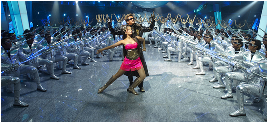
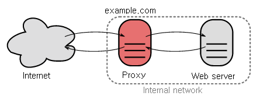

.. _intro:

STON 소개
******************

STON은 인터넷 서비스를 쉽게 확장하기(Easy Scale Out) 위해 개발된 Edge서버이다. 
이전에는 개발과 운영을 따로 규정지었지만 바야흐로 `DevOps <http://en.wikipedia.org/wiki/DevOps>`_ 의 시대이다.
운영없이는 서비스 또한 없다.
하지만 그 동안 운영의 주체인 관리자들의 편안한 주말을 보장해주는 솔루션이 없었다.

STON은 상용솔루션이다.
"상용"의 가장 큰 의미는 장애대처와 재발방지이다.
분명 관리자/개발자들이 책임져야하는 Open Source와는 그 궤를 달리한다.
STON의 개발목표는 국내외 수 많은 서비스를 통해 검증된 신뢰를 모든 고객에게 전파하는 것이다.

.. toctree::
   :maxdepth: 2

Service & Risk
====================================

서비스는 시작되는 순간부터 수많은 위험에 노출된다. 
장애는 언제든 발생할 수 있다. 
점점 많은 사용자와 콘텐츠를 확보할수록 위험과 비용은 예측할 수 없을 만큼 커진다. 
특히나 요즘엔 서비스가 전파되는 시간이 점차 짧아지고 있다. 
이제 누구도 섣불리 미래를 예측할 수 없다.

우리 앞에 놓인 Risk가 무엇인지 정확하게 알아보자.

물리적 한계
---------------------

서비스를 구성하는 S/W는 매우 유연하며 탄력적인 자원이다. 
하지만 H/W 한계를 넘어서는 동작할 수 없다. 
종종 개발자들이 개발 과정에서 S/W에 집중하다 보면 H/W 한계나 운영성을 등한시하는 경우를 본다.
어쩌면 막연히 "좋은 H/W를 구매하면 돼" 또는 "메모리 더 꽂으면 돼" 라는 안일한 생각을 할지도 모른다.

S/W의 범위와 영향력이 넓어지고 서비스 중심으로 시장이 흘러가는 요즘은 더욱 그렇다. 
하지만 서비스는 필연적으로 H/W의 한계에 다다른다.

      
   결국 서버를 사야돼
   
아무리 거대한 서비스라도 결국 물리적인 서버의 집합 위에서 동작한다. 
서버를 구성하는 모든 자원은 한계성을 가지며 서비스는 이런 한계성을 넘어설 수 있도록 설계되어야 한다.

운영할 수 없는 서비스는 마치 달리지 못하는 자동차와 같다. 
서비스 개발 단계에서 Scale-Up 할 자원과 Scale-Out 할 자원을 명확히 구분해야 한다. 
Scale-Out할 수 없다면 절벽을 향해 떠내려가는 땟목과 마찬가지다.

관리자는 어디에?
---------------------

단순계산으로 서버 10대 관리비용이 10이라면 100대의 비용은 100이라고 생각하기 쉽다. 
하지만 대부분 관리자는 최소 1000이상이며 대부분의 경우 추정할 수 없다고 말한다. 
관리기술이 모자란 서비스 관리는 서비스를 헤어나올 수 없는 늪에 빠트린다. 
서버가 "저 아파요~" 라고 말하면 얼마나 좋을까. 
하지만 H/W는 문제가 발생하기 전까지 문제삼지 않는다.
관리자에겐 끊임없는 점검만이 있을 뿐이다. 

신규 서버는 배치하고, 고장 나거나 수명이 다한 서버는 교체해야 한다. 
관리자에 의한 최적화가 이루어지지 않는다면 H/W 가동률은 떨어진다. 
성능을 100% 내지 못한다니 아마도 추가 H/W를 더 구매해야 할지도 모르겠다.

      
   사람은 돈이다
   
기업은 서비스를 더 안정적으로 관리할 수 있는 인력이 필요하다. 
하지만 언제까지 사람으로 메꿔야 할지... 끝이 보이지 않네요. 
그나마 실력이 뛰어난 관리자를 구할 수 있다면 여러분은 행운아입니다.

예고된 장애
---------------------

사람은 언제나 실수하는 동물이니 인재는 제외하자. 
인재의 확률을 줄이고 싶다면 좋은 관리자를 찾아야 한다. 
실수가 없을 것 같은 기계는 어떨까? 확실한 건 기계는 고장난다는 사실뿐이다. 
전력수급 장비에 문제가 생기는 일도 분명히 존재한다. 
이런 경우 UPS(Uninterruptible Power Supply)등의 장애대비용 장비가 있지만, 
절대적인 장애확률을 낮추기 위해 다른 공간(Server Farm)을 선택하는 경우도 흔하다. 
장애 상황까지 고려해 2중/3중 화를 한다면 이제 서버는 곱하기로 늘어난다.

      
   복제는 축제!
   
서버 속을 들여다보자. 
벼락이라도 맞지 않는 이상 서버의 모든 부품이 동시에 망가지는 경우는 거의 없다. 
서버를 구성하는 부품(CPU, Memory, NIC, Disk) 중 가장 빨리 그리고 빈번히 고장나는 것은 디스크이다.
오죽하면 디스크 이야기에는 "수명"이라는 단어가 빠지지 않다. 

디스크 장애의 가장 치명적인 점은 소중한 콘텐츠가 모두 사라진다는 점이다.
RAID를 사용할 수도 있지만 역시 성능과 돈 사이에서 균형점을 찾아야 한다. 
디스크를 교체했다해도 텅 빈 디스크로는 아무것도 할 수 없다. 
어딘가에서 복사해와야 한다. 
실제 서비스에는 복사할 때 며칠씩 소요되는 경우도 허다하다. 
물론 이 순간에도 콘텐츠는 업로드와 삭제를 반복하고 있다. 
단언컨대 이런 일이 2번 반복되면 그 누구도 모든 서버의 디스크에 같은 데이터가 
존재한다고 말할 수 없다. 
이런 서비스를 고객이 신뢰할 수 있을까?

Storage & Single Point of Pain
---------------------

디스크 동기화는 정말 어려운 문제다. 
NAS(Network Attached Storage)나 SAN(Storage Area Network) 또는 
DAS(Direct Attached Storage)가 흔한 솔루션이다. 
서비스 규모에 맞는 Storage를 구성해 동기화 문제를 해결해도 또 다른 문제가 있다. 

이 "단 하나의" Storage가 죽으면 어떻게 될까? 
눈을 감고 10초만 상상해보자.
달걀을 절대 한 바구니에 담지 말자. 데이터는 이중화도 부족하다.

      
   Storage가 바구니 가격이었다면...
   
초기 Storage 도입만으로도 동기화 문제가 해결되고 서비스도 안정적일 수 있다. 
하지만 서비스 규모가 커지면 Storage로 부하가 집중되기 시작한다. 
초당 10개의 요청을 처리하던 Storage가 100개를 처리하는 순간 아무도 응답을 받지 못하는 상황이 발생할 것이다. 
그리고 처리되지 못한 요청은 계속 쌓이게 될 것이다. 
클릭하고 라면 끓여먹고 와야할지도 모른다.

      
   이런 그래프는 주식에만 있는 것이 아니다
   
Storage는 대부분 고가이다. 
좋은 걸 사자면 한도 끝도 없다. 
따라서 `만수르 <https://mirror.enha.kr/wiki/%EC%85%B0%EC%9D%B4%ED%81%AC%20%EB%A7%8C%EC%88%98%EB%A5%B4%20%EB%B9%88%20%EC%9E%90%EC%98%88%EB%93%9C%20%EC%95%8C%20%EB%82%98%EC%96%80>`_ 가 아니라면 누구나 경제적인 선택을 할 수밖에 없다. 
분명 Storage는 한계에 다다른다. 

이런 경우 대부분 새로 사야 한다. 
확장성이 뛰어나면서도 안정적이고 속도도 빠른 Storage를 살 수도 있지만, 
가격을 보시면 그런 마음이 사라질 것이다.

Burst와 연쇄부도
---------------------

Burst는 예측할 수 없이 온다. 
가령 유명인이 TV에 나와서 여러분의 서비스를 언급하는 순간 평소 사용자의 10배가 넘는 사용자를 만나게 될 것이다. 

평소 1만 명을 10대의 서버로 처리하는 서비스가 10만 명을 맞이하는 상황을 생각해보자.
이제 서버마다 10배를 처리해야 한다. 
이때 정신력이 약한 1번 서버가 부하를 버티지 못하고 전사했다. 
이제 나머지 9대가 부하를 나누어서 처리해야 한다. 
또 한대가 버티지 못하고 전사했다. 
남은 대수에 상관없이 결국, 모든 서버가 연쇄적으로 무너지게 될 것이다.

      
   다음은 너다
   
Burst는 눈덩이와 같다. 
버티지 못하면 점점 커져서 공격한다. 

그렇다고 서버를 100대로 늘려야 할까? 
그러면 평소 현재 처리량의 10분의 1만을 처리하며 펑펑 놀게 될 것이다. 
아 도대체 어쩌라고...

진료는 의사에게, 약은 약사에게
---------------------

**"개발은 개발자에게, 운영은 관리자에게"** 
산업이 성장하면서 전문화, 고도화는 당연한 수순이다. 
그래서 개발자는 개발에 집중하고 관리자는 운영에 집중한다. 

하지만 "서비스는 개발자가 낳아서 관리자가 키운다." 라는 말이 무색하게 
개발팀과 운영팀은 대부분 사이가 안좋다. 
출산의 고통은 크지만, 관리자들에겐 끝이 없는 육아가 시작된다. 

문제는 도대체가 이 개~~~~~~~~~발자 분들이 관리자들의 마음을 몰라주며 
독불장군처럼 행동하는 경우가 많다는 것이다.

      
   그만 좀 싸우세요 ㅜ.ㅜ
   
DevOps는 그냥 말뿐인걸까?

Open Source는 누가 책임지나?
----------------------------

여기 길거리에 먹기 좋고 보기 좋은 음식이 있다. 
게다가 공짜다. 
하지만 세균이 가득한 음식일 수도 있다. 
주변 사람들에게 물어보니 배탈이 난 사람도 있고 아닌 사람도 있다고 한다. 
배탈이 안나면 정말 좋겠다. 
나는 괜찮을 수 있지만 다른 사람들도 그럴지 보장할 수 없다. 

Open Source도 비슷하다. 
가져다 쓰는 것은 마음대로지만 아무도 책임지지 않는다. 
빠르게 패치된다고? 그런 기약없는 말 말고 당장 화장실로 휴지를 가져다 줄 사람이 필요하단 말이다!
 

      
   아 몰라~ 몰라~

비극은 개발자가 Open Source웹 사이트를 클릭하면서 시작된다.
그들의 주관심사는 기능이지 운영이나 안정성이 아다. 
그렇게 만들어진 서비스가 1주일마다 어떠한 로그도 없이 죽어버리면 어떨지 상상해보자. 

책임을 Open Source를 선택한 개발자에게 물어봤자 돌아오는 대답은 뻔하다. 
"포럼을 뒤져보았지만, 우리 같은 경우를 찾을 수 없었다." 
이제 뭘 해야 할까?

검증되었다
----------------------------

A사가 서비스를 시작하면서 무수히 많은 시행착오를 겪는다. 
B사도 같은 시행착오를 겪는다. 
A, B사의 사람들이 C사에 가지 않는 이상 C사 역시 마찬가지다. 
이 얼마나 소모적인 반복안가. 
제품이란 이런 낭비적인 기회비용을 줄여줌으로써 가치를 가진다. 
이른바 기회비용을 줄여주는 것이다. 

A사가 사용하는 제품이 큰 장애상황을 견뎠다면 C사 역시 그 제품을 선뜻 선택할 수 있다. 
특히나 엔터프라이즈 서비스에서 "검증되었다." 란 말은 "사귀어 줄께" 와 동급이다.
나랑 안사귀면 아무 의미 없다.

      
   책임지지 못할 짓은 하지 말자
   
여러 서비스를 두루 거치면서 "검증된" 제품이야말로 가장 든든한 동지다. 
먼 길을 떠나는데 "검증되지 않은" 사람들과 같이 가는 것은 언젠가 화를 부른다.

결론
----------------------------

이상의 내용을 쩌는 라임으로 요약하자. :: 

    서버를 사면 돈이 들고, 
    이중화를 하면 곱하기로 돈이 들고, 
    관리자를 교육하려면 돈이 들고, 
    검증되고 고성능 제품을 사려면 돈이 많이 들고
    
    돈, 돈, 돈...
    show me the money
    
그렇다. 결국 돈이다. 
모두가 싸고 좋은 구성을 꿈꾸지만, Risk 앞에서 합리적인 선택을 해야 한다.

Edge서버의 정의와 역할
==============================

.. note::
   
   Reverse-Proxy라는 개념에 익숙치 않다면 제이펍에서 출간된  
   `24시간 365일 서버/인프라를 지탱하는 기술 <http://www.yes24.com/24/Goods/3377489>`_ 의 2장을 읽어보자.
   
Cache는 컴퓨터의 탄생부터 존재해온 개념이다.
CPU내부에도 여러 단계의 Cache가 존재하고 OS도 디스크에 저장된 데이터를 메모리에 Caching한다.
단언컨데 Cache는 가장 효율적이며 검증된 방법이다.

인터넷의 도래와 함께 네트워크 상에서 동작하는 Cache가 필요해졌다.
이를 구현한 것을 Topology에 따라 Proxy, Reverse-Proxy로 구분한다.
대표적인 Open Source로 `Squid <http://www.squid-cache.org/>`_ 나 `ATS(Apache Traffic Server) <http://trafficserver.apache.org/>`_ 가 존재한다.
인터넷 환경의 발달과 함께 Proxy는 거의 유명무실해졌다.
주로 Reverse-Proxy를 사용하며 흔히 Web Cache라고 부른다.

      
   Reverse-Proxy의 개념

`CDN <http://en.wikipedia.org/wiki/Content_delivery_network>`_ 의 보편화와 
모바일시대의 도래는 새로운 운영환경을 요구했다.
특히나 빠른 서비스형태의 변화와 다양한 클라이언트 환경을 기업이 저마다 Follow-up하는 것은 매우 부담스럽다.

Edge서버의 가장 큰 특징은 다음과 같다.

-  원본을 대신하여 서비스를 대중에게 전달한다.
-  대중으로부터 서비스를 보호한다.
-  서비스가 핵심적인 역할만 수행할 수 있도록 보조한다.

가수에게 마이크가 있다면 서비스엔 이제 Edge가 필요하다.
**효과적으로 전달** 하려면 서비스 설계와 확장에 Edge의 개념이 필수다.
적용사례를 중심으로 Edge서버의 적용범위에 대해 알아보자.

Game
----------------------------

전통적으로 게임 서비스는 엄청나게 많은 대역폭을 필요로 한다. 
"대작" 게임부터 간단한 캐주얼 게임까지 범주도 매우 다양하다. 
특히 스마트폰 게임의 폭발적 성장과 전파속도는 서비스의 형태를 더욱 다양하게 만들었다.

- **높은 대역폭 출력**
  
  단일 서버로 높은 대역폭을 얻는 전통적인 방법은 1Gbps NIC를 본딩(Bonding)하는 것이다. 
  이를 통해 4Gbps 대역폭까지 얻을 수 있다. 
  최근 10Gbps NIC도 시장에 많이 보급되는 추세이다.

  ``STON`` 4Gbps NIC Bonding과 10Gbps NIC에서도 최대 대역폭을 보장한다.
  
- 사용자 대역폭 보장

  모든 사용자는 게임을 빨리 다운로드 받고 싶어한다. 
  광랜 사용자는 100Mbps의 속도가 얻어지지 않는다면 항의 전화를 걸 것이다. 
  모두들 빨리 게임을 시작하고 싶어한다. 
  서버는 물리적으로 대역폭이 꽉 차지 않는 이상 사용자마다의 최대 속도를 균일하게 보장해야 한다. 
  
  ``STON`` 모든 사용자에게 최대의 속도로 전송하는 것을 보장한다.
  
- 대용량 파일 처리

  설치파일이 4GB정도 하는 게임은 이제 대형게임으로도 분류되지도 않는다. 
  수십 GB는 되어야 "대작"이라는 단어를 달 수 있는 세상이다. 
  파일이 너무 크면 서버 메모리에 모두 Caching 할 수 없다. 
  최악의 상황은 파일의 크기가 너무 커서 사용자마다 다운로드 받는 위치가 제각각인 상황이다.
  
  ``STON`` Caching 파일크기 제한이 없다. 
  Memory와 Disk의 적절한 Swap을 통해 언제나 고성능을 보장한다.
    
- Range 요청처리

  전송 파일이 대형화되는 추세에 따라 Grid Delivery기법의 P2P솔루션도 많이 사용되고 있다. 
  이런 솔루션의 특징은 파일을 잘게 조각 내어 주고 받기 때문에 서버에 엄청나게 많은 
  HTTP Range요청을 보낸다. 
  10GB파일을 만 명의 클라이언트가 서로 다른 Range로 요청하는 상황도 가능하다. 
  어느 부분을 요청하더라도 서비스는 즉시 가능해야한다. 
  하지만 원본서버에서는 반드시 원래 파일의 크기만큼만 데이터가 전송되어야 한다.
  
  ``STON`` Range요청에 최적화된 파일 시스템이 탑재되었다. 
  또한 멀티 다운로드를 통해 빠른 응답성과 원본서버에서 1Bytes라도 불필요한 다운로드는 없다.

쇼핑몰
----------------------------

쇼핑몰은 사이트 접근이 고객의 매출과 직결된다. 
이제 전통적인 PC환경 뿐만 아니라 모바일쇼핑이 당연해졌다. 
쇼핑환경이 다양해 지는 것 뿐만 아니라 무한히 늘어나는 
파일을 관리하지 못한다면 서비스는 곤경에 처한다.

- 무한대의 작은 파일
  "억! 단위를 넘어서는~", "셀 수 없이 많은~", "언제나 늘어나기만 하는~" 파일을 
  저장하기 위해서는 고가의 Storage가 필요하다. 
  하지만 경제성이 중요한 Edge서버에서는 그럴 수 없다. 
  크기가 1KB인 파일이 10억 개 존재하는 서비스도 있을 수 있다. 
  결론적으로 모든 파일을 Caching할 수 없다. 
  원본서버의 부하를 최소화하면서도 접근 빈도가 높은 파일을 항상 유지하는 방법이 필요하다.

  ``STON`` 메모리와 Disk 자원의 최대용량만큼 Caching한다. 
  모든 파일의 접근 빈도는 실시간으로 관리되며 LRU(Least Recently Used) 에 의해 
  오래된 파일 순으로 삭제된다.
  
- 많은 사용자

  쇼핑몰은 많은 사용자를 동시에 처리할 수 있어야 한다. 
  급작스러운 이벤트에 의해 사용자 접속이 폭발적으로 증가(=Burst)하기도 한다. 
  Burst 시 서버는 스스로를 보호해야 하며 Burst 후에도 안정성을 유지해야 한다.
  
  ``STON`` CPU 조정성(Scalability. 자원의 증설에 따라 솔루션의 성능이 높아지는 것)을 보장한다. 
  탄력적인 HTTP Keep-Alive 처리와 소켓관리를 통해 Burst시에도 안정성을 보장한다.
  
- 반응성

  쾌적한 쇼핑환경이란 페이지가 빠르게 로딩되는 것을 의미한다. 
  사용자는 기다리지 않는다. 
  3초 안에 로딩되지 않으면 다른 사이트로 떠난다. 
  일반적으로 메인 페이지는 100개 내외의 파일로 이루어지며 물리적 환경을 고려하더라도 통상 1초 대에 페이지는 완벽하게 로딩되어야 한다.
  
  ``STON`` 실시간 파일 인덱싱을 통한 즉시 응답을 보장한다. 
  부드러운 파일교체를 통해 원본 종속성 없이 반응성을 극대화할 수 있다. 
  모든 HTTP 응답(First byte 응답, 트랜잭션 완료)에 대해 로그와 통계수치를 제공하여 
  성능저하 여부를 실시간으로 검출할 수 있다.
  
- 페이지 TTL

  대다수의 사용자의 이동 경로는 메인 페이지 -> 대형 카테고리 페이지 -> 소형 카테고리 -> 상세 페이지 순이다. 
  페이지마다 노출 빈도가 다를 뿐만 아니라 갱신 주기도 달라야 한다. 
  스마트한 페이지 Caching & 갱신 방법이 필요하다.
  
  ``STON`` URL마다 별도의 TTL을 부여할 수 있다. 
  또한 Purge, Expire, ExpireAfter, HardPurge 등 상황에 맞는 다양한 방식의 갱신 방법을 제공한다.
  
  

미디어
----------------------------

미디어 전용 프로토콜은 점차 설 자리를 잃어가고 있다. 
HTTP, MP4의 간단하지만 강력한 조합은 점차 세력을 넓혀가고 있다. 
모바일의 가변적인 연결상태를 고려 한다면 HTTP 기반의 Streaming방식이 전송 표준이 될 것이다.

- 미디어 인식

  더 이상 파일을 Chunk로 인식해서는 안된다. 
  미디어 파일을 정확히 인식할 수 있어야만 대역폭 절감과 함께 다양한 부가기능을 연동할 수 있다. 
  서버가 파일 해석을 위해서 파일의 모든 부분을 필요로 한다면 사용자는 영상재생을 포기할 것이다.
  
  ``STON`` MP4, MP3, M4A, FLV 포맷을 지원한다. 
  다운로드와 동시에 HTTP Pseudo Streaming을 위해 필요한 영역을 우선적으로 Caching한다.
  
- 미디어 헤더 재배치

  헤더가 뒤에 있는 파일의 경우 HTTP Pseudo Streaming이 불가능하다. 
  이를 위해서는 전용 플레이어가 필요하지만 이는 사용자에게 짜증을 +10한다.
  
  ``STON`` MP4파일 인코딩 후 헤더가 뒤에 붙는다면 헤더를 앞으로 옮겨주는 작업을 
  추가적으로 수행해야 한다. STON은 자연스럽게 헤더를 앞으로 옮겨 서비스 한다.
  
- 대역폭 조절

  대부분의 영상을 끝까지 보는 사용자는 드물다. 
  그러므로 재생에 무리가 없도록 필요한 만큼만 대역폭을 사용하는 것이 효율적인 전송방법이다. 
  같은 영상이더라도 360p, 480p, 720p, 1080p처럼 Bitrate를 다양하게 서비스 한다.
  
  ``STON`` Bandwidth-Throttling을 통하여 미디어 파일의 전송 대역폭을 최적화할 수 있다.

- 구간추출

  미리보기/하이라이트/공유하기 등 파일 전체가 아닌 특정 구간만을 서비스하는 경우도 많다. 
  서비스하는 모든 파일에 대해 구간을 추출하는 것은 시간과 저장공간을 지나치게 낭비한다. 
  심지어 사용자마다 추출 구간이 다른 경우도 있다. 
  또한 Skip기능을 구간 재생으로 구현하는 플레이어도 존재한다.
  
  ``STON`` Trimming기능을 통해 구간을 추출하여 완전한 형태의 미디어 파일로 서비스한다.
  
  
뉴스 / 커뮤니티
----------------------------

아주 높은 충성도의 사용자층을 확보한 사이트는 흥미로운 점이 많다. 
같은 관심사를 가지는 사용자들이 모이기 때문에 교류가 활발하며 페이지에 
머무르는 시간도 매우 길다. 
서비스 패턴이 정형화되어 있아 서비스하기 꽤 까다롭다.

- 304 Not Modified
  
  사이트 충성도가 매우 높기 때문에 이미 대부분의 파일을 사용자 로컬에 저장하고 있다. 
  때문에 실제로 전송되는 파일보다 "변경확인" 비율이 압도적이다.
  
  ``STON`` 자주 접근되는 파일은 항상 메모리에 상주하도록 보장한다. 
  "변경확인" 작업은 기다림 없이 즉시 처리되도록 구현되었다.
  
- Bypass

  사용자에 특화된 페이지나 새로운 글, 리플 등 페이지는 항상 Caching할 수 없는 영역을 포함한다. 
  하지만 Domain을 별도로 나누지 않고 단일 도메인을 Reverse-Proxy에 위임하는 경우가 많다.

  ``STON`` 다양한 조건을 기반으로 바이패스 대상을 정교하게 분류한다. 
  또한 Origin Affinity, Private 기능을 이용해 로그인 세션을 유지할 수 있다.
  
- 불안한 원본

  중, 소형 기업 또는 개인이 운영하는 사이트들은 고가의 장비나 인프라, 인력을 운영하기 어렵다. 
  원본서버 장애 빈도가 상대적으로 높으며 이를 극복하기 위한 경제성은 매우 나쁘다.
  
  ``STON`` 원본서버 과부하 또는 장애를 판단하여 자동으로 배제/복구가 이루어진다. 
  원본서버 장애 시  TTL을 자동으로 연장시켜 원본서버 의존성을 최소화한다.
  
- 이미지 가공

  같은 이미지를 사용자 환경에 따라 다양하게 보여줄 필요가 있다. 
  검색 결과에서는 Thumbnail 이미지를, 뉴스 사이트에서는 "XX 뉴스" 같은 글씨를 워터마크로 표시해야한다. 
  같은 이미지를 보여지는 형태에 따라 매번 가공하는 것은 저장공간과 시간, 인력의 낭비다.
  
  ``STON`` DIMS기능을 사용하면 원본서버에 단 하나의 이미지 만으로 원하시는 형태를 
  URL 호출만으로 생성할 수 있다.
  
  
파일기반 서버
----------------------------

Edge는 Reverse-Proxy구조에 기반한다. 
Reverse-Proxy의 핵심 개념은 원격서버에 있는 파일을 로컬에 복제/갱신/관리하는 것이다.
이미 검증된 Caching모듈을 서비스 서버와 연동할 수 있다면 
Storage중앙 집중화 및 동기화 이슈를 제거할 수 있다. 
뿐만 아니라 개발시간은 단축되며 서비스의 신뢰도는 높아진다.

- File I/O 지원

  전용 프로토콜이 필요하다면 해당 모듈에 종속적인 서버가 되어 버린다. 
  힘들게 연동했다 하더라도 성능이 떨어지면 무용지물이다. 
  모듈과 서버 사이의 중간 단계는 최소화되어야 한다.
  
  ``STON`` 표준 File I/O로 Caching모듈이 연동된다. 
  전용서버와 STON사이에는 Linux Kernel(VFS)만이 존재하여 고성능을 보장한다.
  
- Web Server 연동
  
  표준 Web 서버(Apache, Lighttpd, NginX)에 특화된 확장모듈이 설치된 경우 
  표준 Reverse-Proxy를 도입하기 힘들 수 있다. 
  DB/WAS와 연동되는 파일 서비스 또는 과금/결제 서비스 같은 경우 쉽게 서비스를 
  확장하기 어렵다.
  
  ``STON`` Apache의 DocumentRoot를 STON으로 지정하면 Apache는 STON을 물리적 디스크로 인식한다. 
  더 설정할 것은 없다.

- Wowza 연동

  미디어서비스에서는 Wowza가 사실상의 표준이다. 
  하지만 Wowza의 HTTP Caching기능은 사용하기 번거로울 뿐만 아니라 빈약하다. 
  또한 점차 HTTP 이외의 "전용" 프로토콜은 사라지는 추세이다.

  ``STON`` Disk로 Mount할 수 있을 뿐만 아니라 MP4헤더 변환, Trimming등 
  모든 기능을 사용할 수 있다.

- 리소스 제약

  Back-end에 존재하는 파일을 Front-End의 사용자에게 전달하는 서버라면 항상 
  파일 동기화가 문제가 된다. 
  게임서버, SNS서버 등 전용서버의 개발 이슈는 항상 존재한다. 
  이런 서버의 경우 중단 없이 장기간 운영 되야 하므로 
  메모리, 디스크 사용이 엄격하게 제한되어야 한다.

  ``STON`` 최대 메모리, 디스크 사용량을 제한할 수 있다. 
  또한 디스크로 Mount하여도 다른 모든 기능은 동일하게 동작하여 복합적인 서비스를 
  최소한의 솔루션으로 구성할 수 있다.

STON 특성과 철학
==============================