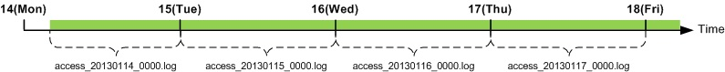

.. admin-log:

로그
******************

로그는 전역과 가상호스트로 구분된다. 
모든 로그는 기록여부를 설정할 수 있으며, 공통된 속성을 가지고 있다. ::

    <XXX Type="time" Unit="1440" Retention="10">ON</XXX>

-  ``Type (기본: time)`` , ``Unit (기본: 1440분)`` 로그 롤링조건을 설정한다.

   - ``time`` 설정된 ``unit`` 시간(단위: 분)마다 로그 파일을 롤링한다.
   - ``size`` 설정된 ``unit`` 크기(단위: MB)마다 로그 파일을 롤링한다.
   - ``both`` 콤마(,)로 구분하여 시간과 크기를 동시에 설정한다.
     예를 들어 Unit="1440, 100"인 경우 시간이 24시간(1440분) 또는 100MB 인 경우 로그 파일을 롤링한다.
     
-  ``Retention (기본: 10개)`` 단위 로그파일을 최대 n개 유지한다.

``Type`` 이 "time" , ``Unit`` 이 10이면 로그는 매 10분에 롤링된다.
예를 들어 서비스를 2:18분에 시작해도 로그는 매 10분인 2:20, 2:30, 2:40에 롤링된다. 
마찬가지로 하루에 한번 매일 0시 0분에 롤링하려면 1440(60분 X 24시)으로 ``Unit`` 값으로 설정한다. 
``time`` 설정에서 로그는 하루에 한번 무조건 롤링되므로 ``Unit`` 의 최대값은 1440을 넘을 수 없다.

.. figure:: img/log_rolling1.jpg
   :align: center
   
최대 값인 24시간(Unit=1440)시간마다 로그가 롤링되도록 설정했다면 다음 그림과 같이 로그가 기록된다.

.. toctree::
   :maxdepth: 2

.. admin-log-install:

설치로그
******************

STON의 설치/업그레이드 시 모든 내용이 install.log에 기록된다. 
이 로그는 별도의 설정이 없다. ::

    #DownloadURL: http://foobar.com/ston/ston.2.0.0.rhel.2.6.32.x64.tar.gz
    #DownloadTime: 13 sec
    #Target: STON 2.0.0
    #Date: 2014.03.03 16:48:35
    Prepare for STON 2.0.0 install process
        Stopping STON...
        STON stopped
    [Copying files]
        `./fuse.conf' -> `/etc/fuse.conf'
        `./libfuse.so.2' -> `/usr/local/ston/libfuse.so.2'
        `./libtbbmalloc_proxy.so' -> `/usr/local/ston/libtbbmalloc_proxy.so'
        `./start-stop-daemon' -> `/usr/sbin/start-stop-daemon'
        `./libtbbmalloc_proxy.so.2' -> `/usr/local/ston/libtbbmalloc_proxy.so.2'
        `./libtbbmalloc.so' -> `/usr/local/ston/libtbbmalloc.so'
        `./libtbbmalloc.so.2' -> `/usr/local/ston/libtbbmalloc.so.2'
        `./libtbb.so' -> `/usr/local/ston/libtbb.so'
        `./libtbb.so.2' -> `/usr/local/ston/libtbb.so.2'
        `./stond' -> `/usr/local/ston/stond'
        `./stonx' -> `/usr/local/ston/stonx'
        `./stonr' -> `/usr/local/ston/stonr'
        `./stonu' -> `/usr/local/ston/stonu'
        `./stonapi' -> `/usr/local/ston/stonapi'
        `./server.xml.default' -> `/usr/local/ston/server.xml.default'
        `./vhosts.xml.default' -> `/usr/local/ston/vhosts.xml.default'
        `./ston_format.sh' -> `/usr/local/ston/ston_format.sh'
        `./ston_diskinfo.sh' -> `/usr/local/ston/ston_diskinfo.sh'
        `./wm.sh' -> `/usr/local/ston/wm.sh'
    [Exporting config files]
        #Export so directory
        /usr/local/ston/ to ld.so.conf
        #Export sysctl to /etc/sysctl.conf
        vm.swappiness=0
        vm.min_free_kbytes=524288
        #Export sudoers for WM
        Defaults    !requiretty
        winesoft ALL=NOPASSWD: /etc/init.d/ston stop, /etc/init.d/ston start, /bin/ps -ef
    [Configuring STON daemon script]
        STON deamon activate in run-level 2345.
    [Installing sub-packages]
        curl installed.
        libjpeg installed.
        libgomp installed.
        rrdtool installed.
    [Installing WM]
        Stopping WM...
        WM stopped
        `./wm.server_default.xml' -> `/usr/local/ston/wm/tmp/conf/server_default.xml'
        `./wm.vhost_default.xml' -> `/usr/local/ston/wm/tmp/conf/vhost_default.xml'
        WM configuration found. Current WM port : 8500
        PHP module for Legacy(CentOS 5.5) installed
        `./libphp5.so.5.5' -> `/usr/local/ston/wm/modules/libphp5.so'
        WM installation almost complete. Changing WM privileges.
    Installation successfully complete

전역로그
====================================

전역로그는 전역설정(server.xml)에 설정한다. ::

    <Cache>
        <InfoLog Type="size" Unit="1" Retention="5" SysLog="OFF">ON</InfoLog>
        <DenyLog Type="size" Unit="1" Retention="5" SysLog="OFF">ON</DenyLog>
        <OriginErrorLog Type="size" Unit="5" Retention="5" Warning="OFF" SysLog="OFF">ON</OriginErrorLog>      
    </Cache>

install.log
---------------------

    

.. admin-log-install:

install.log
---------------------

STON의 설치/업그레이드 시 모든 내용이 install.log에 기록된다. ::
