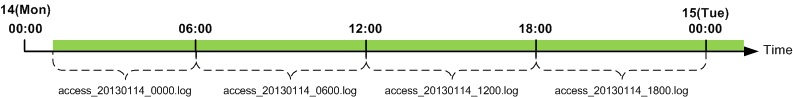

.. admin-log:

로그
******************

로그는 전역과 가상호스트로 구분된다. 
모든 로그는 기록여부를 설정할 수 있으며, 공통된 속성을 가지고 있다. ::

    <XXX Type="time" Unit="1440" Retention="10">ON</XXX>

-  ``Type (기본: time)`` , ``Unit (기본: 1440분)`` 로그 롤링조건을 설정한다.

   - ``time`` 설정된 ``unit`` 시간(단위: 분)마다 로그 파일을 롤링한다.
   - ``size`` 설정된 ``unit`` 크기(단위: MB)마다 로그 파일을 롤링한다.
   - ``both`` 콤마(,)로 구분하여 시간과 크기를 동시에 설정한다.
     예를 들어 Unit="1440, 100"인 경우 시간이 24시간(1440분) 또는 100MB 인 경우 로그 파일을 롤링한다.
     
-  ``Retention (기본: 10개)`` 단위 로그파일을 최대 n개 유지한다.

``Type`` 이 "time" , ``Unit`` 이 10이면 로그는 매 10분에 롤링된다.
예를 들어 서비스를 2:18분에 시작해도 로그는 매 10분인 2:20, 2:30, 2:40에 롤링된다. 
마찬가지로 하루에 한번 매일 0시 0분에 롤링하려면 1440(60분 X 24시)으로 ``Unit`` 값으로 설정한다. 
``time`` 설정에서 로그는 하루에 한번 무조건 롤링되므로 ``Unit`` 의 최대값은 1440을 넘을 수 없다.

   
최대 값인 24시간(Unit=1440)시간마다 로그가 롤링되도록 설정했다면 다음 그림과 같이 로그가 기록된다.

.. figure:: img/log_rolling2.jpg
   :align: center

.. toctree::
   :maxdepth: 2

.. admin-log-install:

설치로그
====================================

STON의 설치/업그레이드 시 모든 내용이 install.log에 기록된다. 
이 로그는 별도의 설정이 없다. ::

    #DownloadURL: http://foobar.com/ston/ston.2.0.0.rhel.2.6.32.x64.tar.gz
    #DownloadTime: 13 sec
    #Target: STON 2.0.0
    #Date: 2014.03.03 16:48:35
    Prepare for STON 2.0.0 install process
        Stopping STON...
        STON stopped
    [Copying files]
        `./fuse.conf' -> `/etc/fuse.conf'
        `./libfuse.so.2' -> `/usr/local/ston/libfuse.so.2'
        `./libtbbmalloc_proxy.so' -> `/usr/local/ston/libtbbmalloc_proxy.so'
        `./start-stop-daemon' -> `/usr/sbin/start-stop-daemon'
        `./libtbbmalloc_proxy.so.2' -> `/usr/local/ston/libtbbmalloc_proxy.so.2'
        `./libtbbmalloc.so' -> `/usr/local/ston/libtbbmalloc.so'
        `./libtbbmalloc.so.2' -> `/usr/local/ston/libtbbmalloc.so.2'
        `./libtbb.so' -> `/usr/local/ston/libtbb.so'
        `./libtbb.so.2' -> `/usr/local/ston/libtbb.so.2'
        `./stond' -> `/usr/local/ston/stond'
        `./stonx' -> `/usr/local/ston/stonx'
        `./stonr' -> `/usr/local/ston/stonr'
        `./stonu' -> `/usr/local/ston/stonu'
        `./stonapi' -> `/usr/local/ston/stonapi'
        `./server.xml.default' -> `/usr/local/ston/server.xml.default'
        `./vhosts.xml.default' -> `/usr/local/ston/vhosts.xml.default'
        `./ston_format.sh' -> `/usr/local/ston/ston_format.sh'
        `./ston_diskinfo.sh' -> `/usr/local/ston/ston_diskinfo.sh'
        `./wm.sh' -> `/usr/local/ston/wm.sh'
    [Exporting config files]
        #Export so directory
        /usr/local/ston/ to ld.so.conf
        #Export sysctl to /etc/sysctl.conf
        vm.swappiness=0
        vm.min_free_kbytes=524288
        #Export sudoers for WM
        Defaults    !requiretty
        winesoft ALL=NOPASSWD: /etc/init.d/ston stop, /etc/init.d/ston start, /bin/ps -ef
    [Configuring STON daemon script]
        STON deamon activate in run-level 2345.
    [Installing sub-packages]
        curl installed.
        libjpeg installed.
        libgomp installed.
        rrdtool installed.
    [Installing WM]
        Stopping WM...
        WM stopped
        `./wm.server_default.xml' -> `/usr/local/ston/wm/tmp/conf/server_default.xml'
        `./wm.vhost_default.xml' -> `/usr/local/ston/wm/tmp/conf/vhost_default.xml'
        WM configuration found. Current WM port : 8500
        PHP module for Legacy(CentOS 5.5) installed
        `./libphp5.so.5.5' -> `/usr/local/ston/wm/modules/libphp5.so'
        WM installation almost complete. Changing WM privileges.
    Installation successfully complete

.. admin-log-global:

전역로그
====================================

전역로그는 전역설정(server.xml)에 설정한다. ::

    <Cache>
        <InfoLog Type="size" Unit="1" Retention="5">ON</InfoLog>
        <DenyLog Type="size" Unit="1" Retention="5">ON</DenyLog>
        <OriginErrorLog Type="size" Unit="5" Retention="5" Warning="OFF">ON</OriginErrorLog>      
    </Cache>

-  ``<InfoLog> (기본: ON, Type: size, Unit: 1)``
   
   STON의 동작과 설정변경에 대해 기록한다.

-  ``<DenyLog> (기본: ON, Type: size, Unit: 1)``

   :ref:`access-control-serviceaccess` 에 의해 접근차단된 IP를 기록한다. ::
   
      #Fields: date time c-ip deny
      2012.11.15 07:06:10 1.1.1.1 AP
      2012.11.15 07:06:26 2.2.2.2 GIN
      2012.11.15 07:06:30 3.3.3.3 3.3.3.1-255
      
   모든 필드는 공백으로 구분되며 각 필드의 의미는 다음과 같다.
   
   - ``date`` 날짜
   - ``time`` 시간
   - ``c-ip`` 클라이언트 IP
   - ``deny`` 차단조건
   

-  ``<OriginErrorLog> (기본: OFF, Type: size, Unit: 5, Warning: OFF)``

   모든 가상호스트의 원본서버에서 발생한 장애만을 기록한다. 
   장애는 접속장애와 전송장애를 의미하며 원본서버 배제/복구 결과가 기록된다. ::
   
      #Fields: date time vhostname level s-domain s-ip cs-method cs-uri time-taken sc-error sc-resinfo
      2012.11.15 07:06:10 [example.com] [ERROR] 192.168.0.13 192.168.0.13 GET /Upload/ProductImage/stock/1716439_SM.jpg 20110 Connect-Timeout -
      2012.11.15 07:06:26 [example.com] [ERROR] 192.168.0.13 192.168.0.13 GET /Upload/ProductImage/stock/1716439_SM.jpg 20110 Connect-Timeout -
      2012.11.15 07:06:30 [example.com] [ERROR] 192.168.0.13 192.168.0.13 GET /Upload/ProductImage/stock/1716439_SM.jpg 20110 Connect-Timeout -
      #2012.11.15 07:06:30 [example.com] 192.168.0.13 excluded from service
      #2012.11.15 07:06:31 [example.com] Origin server list: 192.168.0.14
      #2012.11.15 07:11:11 [example.com] 192.168.0.13 recovered back in service
      #2012.11.15 07:11:12 [example.com] Origin server list: 192.168.0.13
   
   모든 필드는 공백으로 구분되며 각 필드의 의미는 다음과 같다.
   
   - ``date`` 장애발생 날짜
   - ``time`` 장애발생 시간
   - ``vhostname`` [가상호스트]
   - ``level`` [장애레벨(Error 또는 Warning)]
   - ``s-domain`` 원본서버 도메인
   - ``s-ip`` 원본서버 IP
   - ``cs-method`` STON이 원본서버에게 보낸 HTTP Method
   - ``cs-uri`` STON이 원본서버에게 보낸 URI
   - ``time-taken`` 장애가 발생 할때 까지 소요된 시간
   - ``sc-error`` 장애의 종류
   - ``sc-resinfo`` 장애발생시 서버 응답 정보(","문자로 구분)
   
   ``Warning`` 속성이 ``ON`` 이라면 다음과 잘못된 HTTP통신이 발생한 경우에 기록한다. ::
   
      2012.11.15 07:09:03 [example.com] [WARNING] 10.10.10.10 121.189.63.219 GET /716439_SM.jpg 20110 PartialResponseOnNormalRequest Res=206,Len=2635
      2012.11.15 07:09:03 [example.com] [WARNING] 10.10.10.10 121.189.63.219 GET /716439_SM.jpg 20110 ClosedWithoutResponse -
      
   잘못된 HTTP통신의 경우는 다음과 같다.
   
   - ``ClosedWithoutResponse`` 원본서버에 의한 연결종료. HTTP 응답을 받지 못했다.
   - ``ClosedWhenDownloading`` 원본서버에 의한 연결종료. Content-Length 만큼 다운로드하지 못했다.
   - ``NotPartialResponseOnRangeRequest`` Range요청을 했으나 응답코드가 206이 아니다.
   - ``DifferentContentLengthOnRangeRequest`` 요청한 Range와 Content-Length가 다르다.
   - ``PartialResponseOnNormalRequest`` Range요청이 아닌데 응답코드가 206이다.

.. admin-log-syslog:

SysLog 전송
---------------------

`syslog <http://en.wikipedia.org/wiki/Syslog>`_ 프로토콜을 사용하여 로그를 UDP로 실시간 포워딩한다. 
모든 로그에 대하여 syslog로 전송되도록 설정할 수 있다. ::

    <Cache>
        <InfoLog SysLog="OFF">ON</InfoLog>
        <DenyLog SysLog="OFF">ON</DenyLog>
        <OriginErrorLog SysLog="OFF">ON</OriginErrorLog>
    </Cache>
    
-  ``SysLog``

   - ``OFF (기본)`` syslog를 사용하지 않는다.
   
   - ``ON`` 이 태그 하위에 설정된 ``<SysLog>`` 로 로그를 전송한다.
   
다음은 ``<OriginErrorLog>`` 가 기록될 때 syslog를 설정하는 예제이다. ::

    <OriginErrorLog SysLog="ON">
        <SysLog Priority="local3.info" Dest="192.168.0.1:514" />
        <SysLog Priority="user.alert" Dest="192.168.0.2" />
        <SysLog Priority="mail.debug" Dest="log.example.com" />
    </OriginErrorLog>
    
1. ``<OriginErrorLog>`` 의 ``SysLog`` 속성을 ``ON`` 으로 설정한다.
#. ``<OriginErrorLog>`` 의 하위에 ``<SysLog>`` 태그를 생성한다. n대의 서버로 동시에 전송가능하다.
#. ``<SysLog>`` 의 ``Priority`` 속성을 설정한다. 
   이 표현은 syslog의 `Facility Levels <http://en.wikipedia.org/wiki/Syslog#Facility_levels>`_ 과 
   `Severity levels <http://en.wikipedia.org/wiki/Syslog#Severity_levels>`_ 의 조합으로 구성한다.
#. ``<SysLog>`` 의 ``Dest`` 속성을 설정한다. syslog수신서버를 의미하며 수신포트가 514인 경우 생략가능하다.

위 설정으로 기록된 sys로그 예제는 다음과 같다. 
syslog의 tag는 STON/{로그명}으로 기록된다. ::

    Mar 12 11:24:24 192.168.0.1 STON/ORIGINERROR: 2013-03-12 14:09:20 [ERROR] [example.com] - 192.168.0.14 GET /1.gifd 1996 Connect-Timeout -
    Mar 12 11:24:24 192.168.0.1 STON/ORIGINERROR: 2013-03-12 14:09:22 [ERROR] [example.com] - 192.168.0.14 GET /favicon.ico 1995 Connect-Timeout -
    Mar 12 11:24:24 192.168.0.1 STON/ORIGINERROR: 2013-03-12 14:09:24 [ERROR] [example.com] - 192.168.0.14 GET /1.gifd22 2020 Connect-Timeout -
    Mar 12 11:24:24 192.168.0.1 STON/ORIGINERROR: #2013 .03.12 14:09:24 [example.com] 192.168.0.14:102 excluded from service
    Mar 12 11:24:24 192.168.0.1 STON/ORIGINERROR: #2013 .03.12 14:09:24 [example.com] Origin server list:
    

가상호스트 로그
====================================

가상호스트별로 로그는 별도로 기록된다. 
로그가 ``OFF`` 로 설정되어 있어도 로컬파일에만 써지지 않을 뿐이므로 
:ref:`api-monitoring-logtrace` 는 정상동작한다. ::

    <VHostDefault>
        <Log Dir="/cache_log">
            ... (생략) ...
        </Log>
    </VHostDefault>

-  ``<Log>`` ``Dir`` 속성으로 로그가 기록될 디렉토리를 설정한다. 
   로그는 설정한 디렉토리 하위의 가상호스트 디렉토리에 생성된다.
   

.. admin-log-recorddns:

RecordDNS 로그
---------------------

Domain Resolving결과가 변경될 때마다 Info로그에 기록한다. ::

    <Log>
        <RecordDNS>ON</RecordDNS>
    </Log>
   
-  ``<RecordDNS>``

   - ``ON (기본)`` 로그를 기록한다.
   
   - ``OFF`` 로그를 기록하지 않는다.
   
::

    2013-02-21 21:37:08 [INFO] [example.com] DNS "foobar.com" updated (OLD[0]: , NEW[2]: 202.131.30.12, 220.95.233.172)
    2013-02-21 21:47:18 [INFO] [example.com] DNS "foobar.com" updated (OLD[2]: 202.131.30.12, 220.95.233.172, NEW[3]: 202.131.30.12, 220.95.233.172, 220.95.233.173)

.. admin-log-access:

Access 로그
---------------------

모든 클라이언트의 HTTP 트랜잭션을 기록한다. 
로그 기록 시점은 HTTP 트랜잭션이 완료되는 시점이며 전송완료 또는 전송중단 시점을 의미한다. ::

    <Log>
        <Access Type="time" Unit="1440" Retention="10" XFF="on" Form="ston" Local="Off">ON</Access>
    </Log>
    
-  ``XFF``

   - ``OFF (기본)`` 클라이언트 IP를 기록한다.
   - ``ON`` 클라이언트가 보낸 X-Forwarded-For헤더 값을 기록한다. 없다면 ``OFF`` 와 같다.

-  ``Form``
   
   - ``ston (기본)`` W3C표준 + 확장필드
   - ``apache`` Apache 형식
   - ``iis`` IIS 형식
   - ``custom`` `admin-log-access-custom`

-  ``Local``

   - ``OFF (기본)`` 로컬통신(Loopback)은 기록하지 않는다.
   - ``ON`` 로컬통신(Loopback)도 기록한다.
  
::

    #Fields: date time s-ip cs-method cs-uri-stem cs-uri-query s-port cs-username c-ip cs(User-Agent) sc-status sc-bytes time-taken cs-referer sc-resinfo cs-range sc-cachehit cs-acceptencoding session-id
    2012.06.27 16:52:24 220.134.10.5 GET /web/h.gif - 80 - 61.50.7.9 Chrome/19.0.1084.56 200 98141 5 - Bypass+gzip+SSL3 - TCP_HIT gzip+deflate 7
    2012.06.27 16:52:26 220.134.10.5 GET /favicon.ico - 80 - 61.50.7.9 Chrome/19.0.1084.56 200 949 2 - - - TCP_HIT gzip+deflate 35
    2012.06.27 17:00:06 220.168.0.13 GET /setup.Eexe - 80 - 61.168.0.102  Mozilla/5.0+(Windows+NT+6.1;+WOW64)+AppleWebKit/536.11+(KHTML,+like+Gecko)+Chrome/20.0.1132.57+Safari/536.11 206 20971800 7008 - - 398458880-419430399 TCP_HIT - 41

모든 필드는 공백으로 구분되며 각 필드의 의미는 다음과 같다.

-  ``date`` HTTP 트랜잭션이 완료된 날짜
-  ``time`` HTTP 트랜잭션이 완료된 시간
-  ``s-ip`` 서버 IP
-  ``cs-method`` 클라이언트가 보낸 HTTP Method
-  ``cs-uri-stem`` 클라이언트가 보낸 URL중 QueryString을 제외한 부분
-  ``cs-uri-query`` 클라이언트가 보낸 URL중 QueryString
-  ``s-port`` 서버 포트
-  ``cs-username`` 클라이언트 username
-  ``c-ip`` 클라이언트 IP`` XFF설정이 "ON"이라면 X-Forwarded-For헤더 값을 기록합니다.
-  ``cs(User-Agent)`` 클라이언트가 보낸 HTTP User-Agent
-  ``sc-status`` 서버 응답코드.
-  ``sc-bytes`` 서버가 보낸 Bytes (헤더 + 컨텐츠)
-  ``time-taken`` HTTP트랜잭션이 완료될 때까지 소요된 전체시간(밀리세컨드)
-  ``cs-referer`` 클라이언트가 보낸 HTTP Referer
-  ``sc-resinfo`` 부가 정보. "+"문자로 구분된다. 
   인코딩된 컨텐츠를 서비스했다면 인코딩 옵션(gzip 또는 defalte)이 명시된다. 
   보안 통신이라면 보안방식(SSL3 또는 TLS1)이 명시된다. 
   바이패스한 통신이라면 "Bypass"가 명시된다.
   
-  ``cs-range`` 클라이언트가 보낸 Range 헤더를 기록한다.
-  ``sc-cachehit`` 캐시 HIT결과.
-  ``cs-acceptencoding`` 클라이언트가 보낸 Accept-Encoding헤더.
-  ``session-id`` HTTP 클라이언트 세션 ID (unsigned int64)

Access로그는 전송 성공/실패 여부에 상관없이 모든 HTTP 트랜잭션을 기록한다. 
HTTP 트랜잭션은 클라이언트가 HTTP요청을 보낼 때 시작된다. 
STON이 클라이언트에게 응답을 보내기 전에 HTTP연결이 종료된다면 HTTP 트랜잭션 역시 
종료된 것으로 간주한다. 
로그에는 ``sc-status`` 와 ``sc-bytes`` 가 0으로 기록된다. 
주로 STON이 원본서버로부터 응답을 받기 전에 클라이언트가 연결을 종료하는 경우 이런 
로그가 기록된다.

.. _admin-log-access-custom:

Access 로그 (사용자정의)
---------------------

Access 로그형식을 사용자정의 로그로 설정한다. ::

    <Log>
        <Access Form="custom">ON</Access>
        <AccessFormat>%a %A %b id=%{userid}C %f %h %H "%{user-agent}i" %m %P "%r" %s %t %T %X %I %O %R %e %S %K</AccessFormat>
    </Log>
  
-  ``<Access>`` 의 ``Form`` 속성을 ``custom`` 으로 설정한다.

-  ``<AccessFormat>`` 사용자정의 로그 형식.

위 예제의 경우 다음과 같이 Access로그가 기록된다. (#Fields는 기록하지 않는다.) ::

    192.168.0.88 192.168.0.12 163276 id=winesoft; image.jpg ston.winesoft.co.kr HTTP "STON" GET 80 "GET /ston/image.jpg?type=png HTTP/1.1" 200 2014-04-03 21:21:54 1 C 204 163276 1 2571978 TCP_MISS HTTP/1.1
    192.168.0.88 192.168.0.12 63276 id=winesoft; vod.mp4 ston.winesoft.co.kr HTTP "STON" POST 80 "GET /ston/vod.mp4?start=10 HTTP/1.1" 200 2014-04-03 21:21:54 12 C 304 363276 2 2571979 TCP_REFRESH_HIT HTTP/1.1
    192.168.0.88 192.168.0.12 3634276 id=ston; news.html ston.winesoft.co.kr HTTPS "STON" GET 443 "GET /news.html HTTP/1.1" 200 2014-04-03 21:21:54 30 X 156 2632576 1 2571980 TCP_MISS HTTP/1.1
    192.168.0.88 192.168.0.12 6332476 id=winesoft; style.css ston.winesoft.co.kr HTTP "STON" HEAD 80 "GET /style.css HTTP/1.1" 200 2014-04-03 21:21:54 10 X 234 653276 2 2571981 TCP_REFRESH_HIT HTTP/1.1
    192.168.0.88 192.168.0.12 6276 id=ston; ui.js ston.winesoft.co.kr HTTP "STON" GET 80 "GET /ui.js HTTP/1.1" 200 2014-04-03 21:21:54 1 X 233 63276 1 2571982 TCP_MISS HTTP/1.1
    192.168.0.88 192.168.0.12 626 id=winesoft; hls.m4u8 ston.winesoft.co.kr HTTP "STON" GET 80 "GET /hls.m4u8 HTTP/1.1" 200 2014-04-03 21:21:54 2 X 124 6312333276 2 2571983 TCP_REFRESH_HIT HTTP/1.1
  
`Apache로그 형식 <https://httpd.apache.org/docs/2.2/ko/mod/mod_log_config.html>`_ 을 
기반으로 개발되었으며 일부 확장필드가 있다. 
각 필드의 구분자에는 제한이 없지만 Space를 사용할 경우, User-Agent처럼 Space가 포함될 
수 있는 필드는 따옴표("...")로 묶어서 설정한다.

-  ``%...a`` 클라이언트 IP ::

      192.168.0.66
      
-  ``%...A`` 서버IP 주소 :: 

      192.168.0.14
      
-  ``%...b`` HTTP헤더를 제외한 전송 바이트수 ::

      1024
      
-  ``%...{foobar}C`` 서버가 수신한 요청의 Foobar 쿠키의 내용  ::

      %{id=}c 로 입력하면 Cookie 에서 id=에 해당하는 값을 기록
      
-  ``%...D`` 요청을 처리하는데 걸린 시간(MS) ::

      3000
      
-  ``%...f`` 파일명 ::

      /mp4/iu.mp4 라면 iu.mp4를 기록
      
-  ``%...h`` HostName ::

      example.com
      
-  ``%...H`` 요청 프로토콜 ::

      http 또는 https
      
-  ``%...{foobar}i`` 서버가 수신한 요청에서 foobar: 헤더의 내용 ::

      %{User-Agent}i 로 입력 할 경우 User-Agent의 값을 기록
      
-  ``%...m`` 요청 Method ::

      GET 또는 POST 또는 HEAD
      
-  ``%...P`` Server PORT ::

      80
      
-  ``%...q`` QueryString ::

      Id=10&value=20
      
-  ``%...r`` 요청의 첫번째 줄(Request Line) ::

      GET /img.jpg HTTP/1.1
      
-  ``%...s`` 응답코드 ::

      200
      
-  ``%...t`` STON 기본 시간형식	::

      2014-01-01 15:27:02

-  ``%...{format}t`` Format에 정의된 날짜 형식 ::

      %{%Y-$m-%d %H:%M:%S}T 로 입력하면 06:12:23으로 기록.

-  ``%...T`` TimeTaken(초단위) ::

      10

-  ``%...U`` ShortURI ::

      /img/img.jpg

-  ``%...X`` 트랜잭션이 완료되었을 때의 상태
   
   - ``X`` 응답이 완료되기 전에 종료
   - ``C`` 응답이 완료 되었음
   
   ::
   
      C
    
-  ``%...I`` 요청헤더를 포함한 수신바이트 ::
    
      2048
    
-  ``%...O`` 응답헤더를 포함한 송신바이트 ::
      
      2048
      
-  ``%...R`` 응답시간(MS) ::

      2
      
-  ``%...e`` Session-ID ::

      1
      
-  ``%...S`` 캐싱 HIT 결과 ::

      TCP_HIT
      
-  ``%...K`` 요청 HTTP 버전	::

      HTTP/1.1
  
설정한 필드의 값이 존재하지 않으면 - 로 표기한다. 
형식이 잘못되었다면 STON 기본 포맷(Form="ston")으로 동작한다.
  
위 표에서 각 필드의 ...에는 (e.g. “%h %U %r %b) 아무것도 명시하지 않거나, 
기록 조건을 명시할 수 있다(조건을 만족하지 않으면 - 로 기록). 
조건은 HTTP 상태코드 목록으로 설정하거나 !로 NOT 조건을 설정할 수 있다. 

- "%400,501{User-agent}i" 
  
  400(Bad Request) 오류 또는 501(Not Implemented) 오류 일 때만 User-agent를 기록
  
- "%!200,304,302{Referer}i"

  정상적인 상태가 아닌 모든 요청에 대해 Referer를 로그에 남긴다.

::

  <Origin Type="time" Unit="1440" Retention="10" Local="Off">ON</Origin>
  <Monitoring Type="size" Unit="10" Retention="10" Form="json">ON</Monitoring>
  <FileSystem Type="time" Unit="1440" Retention="10">ON</FileSystem>