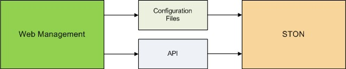
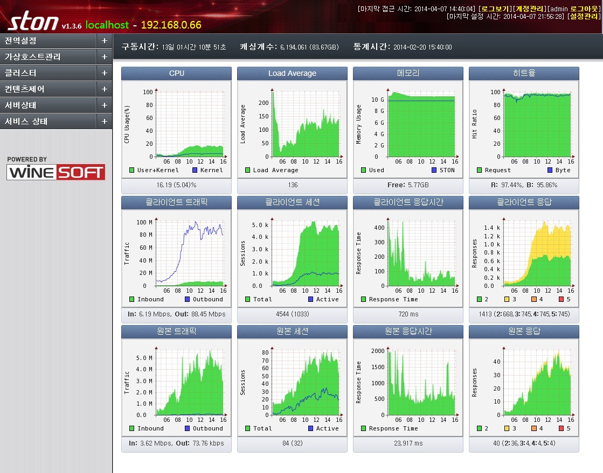
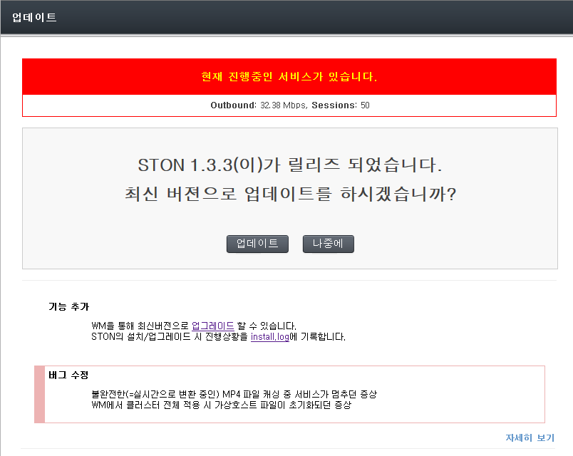

.. _wm:

Web Management
******************

Web Management(이하 WM)는 STON API를 사용하는 Web기반 관리 툴이다. 
WM을 통하여 직관적으로 서비스를 구성할 수 있을 뿐만 아니라 클러스터를 구성하여 
많은 수의 STON을 통합관리 할 수 있다.

.. toctree::
   :maxdepth: 2

구성과 연결
====================================

STON을 설치하면 /usr/local/ston/wm 경로에 WM이 설치된다. 
WM은 Apache 2.2.24 + PHP 5.3.24으로 구현되었다. 
Apache를 사용하므로 /usr/local/ston/wm/conf/httpd.conf 파일을 편집하여 원하시는 
구성(예를 들어 HTTPS)으로 변경이 가능하다.
WM과 STON은 밀접한 연관을 가지지 않는다. 
다음 그림처럼 WM은 STON의 설정파일과 API만을 사용하여 STON의 동작을 구성한다.

   
   WM은 STON의 설정파일과 API를 사용한다.
   
저희는 이와 유사한 방식으로 WM을 능가하는 더 나은 관리기법이 존재할 것이라 생각합니다.

접속 방법
---------------------

WM은 기본적으로 8500번 포트를 사용한다. 설치된 STON의 IP가 192.168.0.100이라면 
WM접근 주소는 http://192.168.0.100:8500이 된다. 
앞서 언급한 대로 httpd.conf 파일을 변경하면 고객사에 맞추어 커스터마이징이 가능하다.

.. figure:: img/wm_login.jpg
   :align: center
   
   WM 접속초기화면
   

로그인과 계정
---------------------

기본 계정은 [아이디: **admin** , 비밀번호: **ston** ] 이다. 
로그인에 성공하면 STON의 전반적인상태를 확인할 수 있는 대쉬보드 페이지가 보여진다.

   
   WM 대쉬보드
   

최신버전 업데이트
---------------------

최신버전이 릴리스되면 다음과 같이 "새로운 업데이트가 있습니다" 메시지가 표시된다.

   
   새로운 업데이트가 있습니다.
   
메시지를 클릭하시면 최신버전으로 업데이트할 수 있는 페이지가 표시된다. 
현재 서비스 상태에 따라 업데이트 안전도 여부가 표시된다.

   
   WM 업데이트하면 위험합니다.
   
업데이트가 완료되면 모든 서비스가 자동으로 재시작 된다.