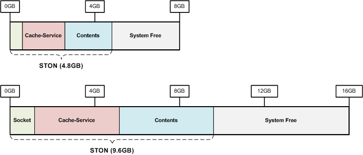
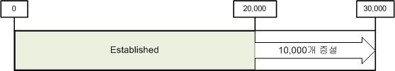
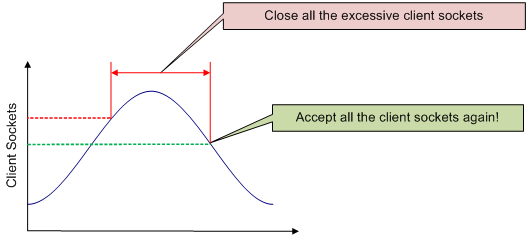
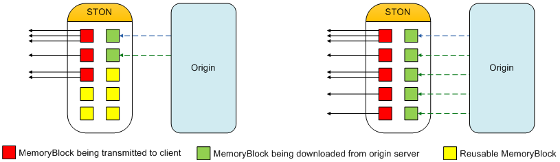

.. _adv_topics:

14장. 고급주제
******************

이 장에서는 고급스럽지만 잡다한 주제에 관해 다룬다.
일부 내용은 내부구조와 밀접한 관련이 있는 내용으로 고급 사용자들을 대상으로 한다.

.. toctree::
   :maxdepth: 2

.. _adv_topics_mem:

메모리 최적화/성능 튜닝
====================================

캐시서버와 범용 웹서버의 동작방식은 유사하나 목적은 매우 다르다. 
STON의 구조와 동작방식을 상세히 이해하면 보다 최적화된 서비스가 가능하다.
최적화의 목적은 아래와 같다.

**높은 처리량**. 성능저하 없이 수 만개의 세션을 동시에 처리할 수 있다.

**빠른 반응성**. 클라이언트에게 지연없는 서비스를 제공한다.

**원본서버 부하절감**. 원본서버 부하는 자칫 전체장애로 이어진다.

다음 그림은 STON을 8GB와 16GB메모리 장비에서 구동시켰을 때의 메모리 구성이다.

메모리는 크게 STON이 사용하는 메모리와 사용하지 않는 메모리(Free)로 나눈다. 
STON이 사용하는 메모리는 파일, 소켓같이 서비스 규모에 따라 달라지는 자원 개수와 관련이 있다. 
STON메모리는 내부적으로 Core, Sockets, Contents 3가지로 분류된다. 
더 자세히 이야기하도록 하겠지만 결국 캐시서버에서 가장 비싸고 증설하기 어려운 자원은 Disk이다.

.. note::

   당신이 알아야하는 것! "얼마나 많은 Contents를 Caching해야 Disk I/O를 줄일 수 있는가?"
   

System Free 메모리
------------------------------------

이전 그림에서 쉽게 알 수 있는 부분은 생각보다 사용하지 않는(이하 Free) 메모리 공간이 크다는 점이다. 
Contents메모리가 핵심이라고 해놓고 사용하지 않는 영역이 크다니 다소 이상해 보인다. 
아무리 많은 Contents메모리를 사용한다고 하더라도 OS가 느리면 성능을 극대화할 수 없음을 알아야 한다. 
OS는 꽤 영리하다.

Free영역은 Linux시스템의 원활한 구동을 위해 STON이 의도적으로 사용하지 않는 영역이다. 
Free영역을 확보하는 이유는 다음과 같다.

* OS가 사용할 수 있는 메모리가 충분해야 OS 위에서 구동되는 STON도 성능이 저하되지 않는다.
* Disk I/O는 1차적으로 OS에서 Caching된다. 충분한 메모리가 있어야 OS의 Disk I/O Hit율이 향상된다. 실서비스에서 이 Hit율은 꽤 힘이 된다.
* 통계나 로그분석을 위한 다른 어플리케이션이 순간적으로 메모리를 많이 사용할 수 있다. System memory swap 발생은 성능에 치명적이다.

OS 성능저하가 발생하는 상황에서 고성능의 STON을 기대하기는 어렵다. 
다음은 물리 메모리 크기별로 STON이 사용하지 않는 Free영역 크기이다.

============== ===============
물리 메모리    Free메모리
============== ===============
1GB            500MB
2GB            500MB
4GB            1GB
8GB            3GB
16GB           5GB
32GB           8GB
64GB           16GB
128GB 이상     시가 문의
============== ===============

Core 메모리
------------------------------------

파일과 소켓을 사용하지 않는 상태에서 Core의 최소 크기는 약 140MB이다. 
Core크기를 결정하는 가장 중요한 요소는 파일 유지개수이다. 
STON은 빠른 반응속도를 위해 모든 파일을 Memory에 Indexing한다. 
1만개를 Indexing하는데 소모되는 메모리 크기는 8.6MB이다.
다음은 시스템 메모리 크기에 따라 기본으로 설정되는 컨텐츠 Indexing개수와 최대 Core메모리 크기이다.

=============== ==================== =================
물리 메모리     최대 파일개수        Core메모리
=============== ==================== =================
1GB             2.7만                160MB
2GB             10만                 230MB
4GB             40만                 510MB
8GB             170만                1.62GB
16GB            700만                5.92GB
32GB 이상.      1200만개(이후 고정   10.2GB (이후 고정)
=============== ==================== =================

특별히 최대 파일개수를 지정하지 않는다면 표만큼 파일개수를 유지하며 메모리를 사용한다.
이 설정은 쇼핑몰과 같이 작은 이미지(평균 파일크기가 4KB이하)가 매우 많은 서비스에 적합하다.

표에서 알 수 있듯이 파일개수가 많아지면 Core가 사용하는 메모리가 커진다.
하지만 서비스할 파일 개수가 몇 만개 수준이라면 많은 메모리가 Contents Caching에 투입되지 못하여 낭비가 발생한다.
Contents Caching이 클수록 Disk I/O가 줄어들어 성능이 향상된다는 점을 명심하자.
쇼핑몰과 같이 파일이 많은 서비스가 아니라면 최대 파일개수를 보다 적게 설정하는 것이 Disk I/O 성능향상에 도움이 된다.
최대 파일 개수를 설정하면 STON은 Core에 사용될 메모리를 Contents Caching에 사용한다. 

.. note::
   
   다시 한번 말하지만 Contents메모리 영역이 커질수록 Disk I/O는 줄어든다.                                                                                                                         

Socket 메모리
------------------------------------

Core메모리가 빠른 응답속도를 위한 메모리라면 Sockets는 높은 전송속도를 보장하기 위한 메모리다.
4GB이상의 장비에서 STON은 2만개의 소켓을 기본으로 생성한다. 
소켓 1개=10KB, 1만개당 97.6MB의 메모리를 사용하므로 약 195MB의 메모리가 기본으로 소켓에 할당된다.

=============== ================= ======================
물리 메모리     최초 Socket 개수  Socket 최대 메모리
=============== ================= ======================
1GB             5천               97.6MB
2GB             1만               195MB
4GB 이상        2만               390MB
=============== ================= ======================

다음 그림처럼 소켓을 모두 사용하면 자동으로 소켓이 늘어난다.
                     

    
위 그림과 같이 증설되어 3만개의 소켓을 사용한다면 총 240MB의 메모리가 소켓에 할당된다. 
필요한 소켓을 필요한만큼만 사용하는 것은 아무 문제가 없어 보인다. 
하지만 사용하지 않는 소켓을 지나치게 많이 설정해놓는 것은 메모리 낭비다.
예를 들어 10Gbps장비에서 사용자마다 10Mbps의 전송속도를 보장한다고 가정했을 때 다음 공식에 의하여 최대 동시 사용자는 1,000명이다. ::

   10,000Mbps / 10Mbps = 1,000 Sessions
   
이 경우 STON이 최초 생성하는 2만개 중 19,000개에 해당하는 약 148MB는 낭비가 되는 셈이다.
이 148MB를 Contents에 투자한다면 효율을 더 높일 수 있다. 
최소 소켓수를 설정하면 메모리를 보다 효율적으로 사용할 수 있다.

**최소 소켓수**. 최초에 할당되는 소켓수를 의미한다.

**증설 소켓수**. 소켓이 모두 사용 중(Established)일 때 설정한 개수만큼 소켓을 증설한다.

또 하나의 중요한 변수는 클라이언트 Keep-Alive시간 설정이다. (:ref:`handling_http_requests_session_man` 참조)

.. figure:: img/perf_keepalive.png
   :align: center

연결된 모든 소켓이 데이터 전송 중에 있는 것은 아니다.
IE, Chrome과 같은 브라우저들은 다음에 발생할 HTTP전송을 위해 소켓을 서버에 접속해 놓은 상태로 유지한다.
실제로 쇼핑몰의 경우 연결되어 있는 세션 중 아무런 데이터 전송이 발생하지 않고 그저 붙어 있는 세션의 비율은 적게는 50%에서 많게는 80%에 이른다.

.. figure:: img/perf_keepalive2.png
   :align: center

Keep-Alive시간을 길게 줄수록 소켓의 재사용성은 좋아지지만 유지되는 Idle소켓의 개수가 증가하므로 메모리 낭비가 심해진다.
그러므로 서비스에 맞는 적절한 클라이언트 Keep-Alive시간을 설정하는 것이 중요하다.

Contents 메모리
------------------------------------

클라이언트에게 전송할 컨텐츠를 Caching하는 메모리이다. 
한번 Disk에서 메모리로 적재된 컨텐츠는 메모리 부족현상이 발생하지 않는다면 계속 메모리에 존재한다. 
문제는 메모리 부족현상은 항상 발생한다는 점이다.

.. figure:: img/perf_inmemory.png
   :align: center

위 그림처럼 전송해야할 컨텐츠는 Disk에 가득한데 실제 메모리에 적재할 수 있는 용량은 아주 제한적이다. 
32GB의 물리 메모리를 장착한다해도 고화질 동영상이나 게임 클라이언트의 크기를 감안한다면 그리 넉넉한 편은 아니다. 
아무리 효율적으로 메모리를 관리해도 물리적인 Disk I/O속도에 수렴할 수 밖에 없다. 

가장 효과적인 방법은 Contents메모리 공간을 최대한 확보하여 Disk I/O를 줄이는 것이다. 
다음은 물리 메모리 기준으로 STON이 기본으로 설정하는 최대 Contents메모리 크기이다.

=============== =================
물리 메모리     Contents 메모리
=============== =================
1GB             260MB
2GB             1GB
4GB             2.1GB
8GB             2.8GB
16GB            4.5GB
32GB            13.2GB
64GB            37.2GB
=============== =================

결론
------------------------------------

Contents메모리 영역을 최대한 확보하기 위해 조절할 수 있는 변수는 다음과 같다.

**최대 유지파일 개수**. 파일 1개당 900Bytes

**최대 소켓 개수**. 소켓 1개당 10KB 

::

   물리 메모리 - Free - (900Bytes * 최대 유지파일 개수) - (10KB * 최대 소켓개수) = STON Contents

정리하면 STON의 기본설정은 아래와 같다.

============= ============== =============== ======= ================= =============
물리 메모리   System Free    최대 파일       Core    최초 Socket개수   Contents
============= ============== =============== ======= ================= =============
1GB           500MB          2.7만           160MB   5천               260MB
2GB           500MB          10만            230MB   1만               1GB
4GB           1GB            40만            510MB   2만               2.1GB
8GB           3GB            170만           1.62GB  2만               2.8GB
16GB          5GB            700만           5.92GB  2만               4.5GB
32GB          8GB            1,200만         10.2GB  2만               13.2GB
64GB          16GB           1,200만         10.2GB  2만               37.2GB
============= ============== =============== ======= ================= =============

클라이언트 접속 제한
====================================

제한없이 클라이언트 요청을 모두 허용하면 시스템에 지나친 부하가 발생할 수 있다. 
시스템 과부하는 사실상 장애이다.
적절한 수치에서 클라이언트 요청을 거부하여 시스템을 보호한다. ::

   # server.xml - <Server><Cache>
   
   <MaxSockets Reopen="75">80000</MaxSockets>

-  ``<MaxSockets> (기본: 80000, 최대: 100000)`` 연결을 허용할 최대 클라이언트 소켓 수. 
   이 수치를 넘으면 신규 클라이언트 접속을 즉시 닫는다.
   ``<MaxSockets>`` 의 ``Reopen (기본: 75%)`` 비율만큼 소켓 수가 감소하면 다시 접속을 허용한다.

(기본 설정에서) 전체 클라이언트 소켓 수가 8만을 넘으면 신규 클라이언트 접속은 즉시 종료된다.
전체 클라이언트 소켓 수가 6만(8만의 75%)이 되면 다시 접근을 허용한다.

예를 들어 3만개의 클라이언트 세션을 처리할 때 원본 서버들이 모두 한계에 도달하면  
이 수치를 3~4만 정도로 설정하는 것이 좋다. 
이로 인해 얻을 수 있는 효과는 다음과 같다.

-  별다른 Network 구성(i.e. L4 세션조절 등)이 필요 없다.
-  불필요한(원본 부하로 처리될 수 없는) 클라이언트 요청을 방지한다.
-  서비스의 신뢰성을 높인다. 서비스 Burst 이후 재시작 등 점검 작업이 필요 없다.

HTTP 클라이언트 세션 수
====================================

HTTP 클라이언트 연결을 처리하기 위한 초기/증설 세션 수를 설정한다. ::

    # server.xml - <Server><Cache>
   
    <HttpClientSession>
       <Init>20000</Init>
       <TopUp>6000</TopUp>
    </HttpClientSession>
    
-  ``<Init>`` STON 시작시 미리 생성해놓는 소켓 수

-  ``<TopUp>`` 생성해놓은 소켓 수를 초과했을 때 추가로 생성할 소켓 수

별도로 설정하지 않을 경우 물리 메모리 크기에 따라 자동으로 설정된다.

=============== =========================
물리메모리	    <Init>, <TopUp>
=============== =========================
1GB             5천, 1천
2GB             1만, 2천
4GB             2만, 4천
8GB 이상        2만, 6천
=============== =========================
제한적인 환경에서 적은 수의 소켓만으로도 서비스가 가능할 때 소켓 수를 줄이면 메모리를 절약할 수 있다.

Request hit ratio
====================================

먼저 클라언트의 HTTP요청이 어떻게 처리되는지 이해해야 한다.
캐시처리 결과는 Squid와 동일하게 TCP_*로 명명되며 각 표현마다 캐시서버가 처리한 방식을 의미한다.

-  ``TCP_HIT`` 요청된 리소스(만료되지 않음)가 캐싱되어 있어 즉시 응답함.
-  ``TCP_IMS_HIT`` IMS(If-Modified-Since)헤더와 함께 요청된 리소스가 만료되지 않은 상태로 캐싱되어 있어 304 NOT MODIFIED로 응답함. TTLExtensionBy4xx, TTLExtensionBy5xx설정에 해당하는 경우에도 이에 해당함.
-  ``TCP_REFRESH_HIT`` 요청된 리소스가 만료되어 원본서버 확인(원본 미변경, 304 NOT MODIFIED) 후 응답함. 리소스 만료시간 연장됨.
-  ``TCP_REF_FAIL_HIT`` TCP_REFRESH_HIT과정 중 원본서버에서 확인이 실패(접속실패, 전송지연)한 경우 만료된 컨텐츠로 응답함.
-  ``TCP_NEGATIVE_HIT`` 요청된 리소스가 비정상적인 상태(원본서버 접속/전송 실패, 4xx응답, 5xx응답)로 캐싱되어 있고 해당상태를 응답함.
-  ``TCP_REDIRECT_HIT`` 서비스 허용/거부/Redirect 조건에 의해 Redirect를 응답함.
-  ``TCP_MISS`` 요청된 리소스가 캐싱되어 있지 않음(=최초 요청). 원본서버에서 가져온 결과를 응답함.
-  ``TCP_REF_MISS`` 요청된 리소스가 만료되어 원본서버 확인(원본 변경, 200 OK) 후 응답함. 새로운 리소스가 캐싱됨.
-  ``TCP_CLIENT_REFRESH_MISS`` 요청을 원본서버로 바이패스.
-  ``TCP_ERROR`` 요청된 리소스가 캐싱되어 있지 않음(=최초 요청). 원본서버 장애(접속실패, 전송지연, 원본배제)로 인해 리소스를 캐싱하지 못함. 클라이언트에게 500 Internal Error로 응답함.
-  ``TCP_DENIED`` 요청이 거부되었음.

이상을 종합하여 Request hit ratio계산 공식은 다음과 같다. ::

   TCP_HIT + TCP_IMS_HIT + TCP_REFRESH_HIT + TCP_REF_FAIL_HIT + TCP_NEGATIVE_HIT + TCP_REDIRECT_HIT
   ------------------------------------------------------------------------------------------------
                                            SUM(TCP_*)
                                            

Byte hit ratio
====================================

클라이언트에게 전송한 트래픽(Client Outbound)대비 원본서버로부터 전송받은 트래픽(Origin Inbound)의 비율을 나타낸다.
원본서버 트래픽이 클라이언트 트래픽보다 높은 경우 음수가 나올 수 있다. ::

   Client Outbound - Origin Inbound
   --------------------------------
           Client Outbound
           

원본서버 장애상황 정책
====================================

고객이 언제든지 원본서버를 점검 할 수 있도록 하는 것이 개발팀의 목표다.
원본서버의 장애가 감지되면 해당 서버는 자동으로 배제되어 복구모드로 전환된다. 
장애서버가 재가동되었더라도 정상 서비스 상태를 확인해야만 다시 투입한다.

만약 모든 원본서버의 장애를 감지한 경우 현재 캐싱된 컨텐츠로 서비스를 진행한다. 
TTL이 만료된 컨텐츠는 원본서버가 복구될 때까지 자동으로 연장된다. 
심지어 Purge된 컨텐츠의 경우에도 원본서버에서 캐싱할 수 없다면 복구시켜 서비스에 문제가 없도록 동작한다. 
최대한 클라이언트에게 장애상황을 노출해선 안된다는 정책이다.
완전 장애상황에서 신규 컨텐츠 요청이 들어오면 다음과 같은 에러 페이지와 이유가 명시된다.

.. figure:: img/faq_stonerror.jpg
   :align: center
      
   왠만하면 이런 화면은 보여주기 싫다.
   
   
시간단위 표현과 범위
====================================

기준 시간이 "초"인 항목에 대하여 문자열로 시간표현이 가능하다. 
다음은 지원되는 시간표현 목록과 환산된 초(sec) 다.

=========================== =========================
표현	                      환산
=========================== =========================
year(s)                     31536000 초 (=365 days)
month(s)                    2592000 초 (=30 days)
week(s)                     604800 초 (=7 days)
day(s)                      86400 초 (=24 hours)
hour(s)	                    3600 초 (=60 mins)
minute(s), min(s)	          60 초
second(s), sec(s), (생략)	  1 초
=========================== =========================

다음과 같이 조합된 시간표현이 가능하다. ::

    1year 3months 2weeks 4days 7hours 10mins 36secs
    
현재 지원대상은 다음과 같다.

- Custom TTL의 시간표현
- TTL의 Ratio를 제외한 모두
- ClientKeepAliveSec
- ConnectTimeout
- ReceiveTimeout
- BypassConnectTimeout
- BypassReceiveTimeout
- ReuseTimeout
- Recovery의 Cycle속성
- Bandwidth Throttling

원본서버 분산
====================================

서비스되는 컨텐츠가 수 천만개 이상 되면 모든 컨텐츠를 캐싱하는 것은 거의 불가능할 뿐더러 효율적이지도 못하다. 
캐시서버를 고도화하여 보다 많은 캐싱이 가능하게 할 수도 있겠지만, 경제적이지 못한 방법이다. 
가장 효과적인 방법은 개발단계에서 콘텐츠 도메인을 분리하여 별도의 서버로 구성하는 것이다.

      
   멀티 도메인이 서비스 확장에 좋다.
   
(A)와 같이 하나의 도메인으로 서비스를 구성하게 된다면 물리적으로 트래픽을 분산할 방법이 없다. 
이런 경우 (B)처럼 도메인을 나누고 각 도메인마다 별도로 캐시서버를 구성하여 트래픽을 분산할 수 있는 구조를 가지는 것이 바람직하다.
하지만 도메인 분리가 부적합한 상황도 있다. 

예를 들어 컨텐츠 대비 트래픽이 낮거나 서비스 변경 비용이 너무 높은 경우이다. 
이런 경우 분산캐시가 적절한 대안이 될 수 있다. 
분산캐시는 원본에는 변경을 가하지 않고 캐시서버에서 컨텐츠를 나누어 가지는 방법이다.

      
   나름 유명한 캐시 분산

(C)는 L7 로드밸런서가 사용자 요청을 분석하여 각각의 캐시서버에 약속된 룰로 요청을 분배해주는 방법이다. 
하지만 이 방법의 경우 서비스가 L7장비에 종속되어 추후 증설에 문제가 있다. 
뿐만 아니라 한 HTTP세션으로 여러개의 리소스를 요청할 때 캐싱되지 않은 컨텐츠를 요청받을 확률이 높다. 

(D)는 캐시서버들끼리 서로 인식하여 컨텐츠를 나누어 가지는 방식이다. 
가령 #1이 가지지 못한 컨텐츠는 #2에게서 가져와서 서비스하는 방식이다. 
언뜻 효율적인 방법처럼 보이지만 허점이 있다. 
근본적으로 Topology가 매우 복잡해지므로 서버를 증설할 때마다 내부 트래픽이 매우 높게 발생한다. 
또한 사용자들은 연결된 캐시서버에서 즉각적으로 서비스받지 못하고 다른 캐시서버로부터 
데이터를 가져올 때까지 기다려야 하므로 서비스품질이 저하된다.

우리가 제안하는 분산캐시는 3 Tier구조의 분산캐시이다. 

우선 클라이언트와 직접 연결되는 Child(=Edge)서버부터 이야기를 시작해 보자. 
HTTP는 한번 연결을 맺은 서버와 여러번의 HTTP 트랜잭션을 수행하는 특성을 가진다. 
웹 페이지의 경우 데이터 전송보다 DNS Query와 소켓 연결에 더 많은 시간이 소요된다. 
클라이언트는 자신이 연결된 서버로부터 모든 데이터를 제공받을 때 가장 빠르다. 
결국 Child는 항상 가장 Hot한(=많이 접근되는) 컨텐츠를 캐싱하고 있어야 한다. 
이것이 빠른 반응성을 보장하는 방법이다. 

사용자들이 가장 많이 접근하는 페이지들은 대부분 Child에 캐싱되어 있을 것이며, 
어느 캐시서버에 접속하더라도 해당 페이지를 빠르게 서비스받을 수 있다.
우선 Child는 Hot한 컨텐츠를 항상 캐싱하고 있어야 한다는데는 이견이 없다. 

예를 들어 원본서버의 전체 컨텐츠가 2,000만개이고 한대의 캐시서버가 1,000만개의 컨텐츠를 
캐싱할 수 있다고 가정해보자. 
2 Tier구성일 경우 Child서버는 캐싱하지 못한 1,000만개를 캐싱하기 위해 
항상 원본서버로 요청을 보낸다. 
서비스가 커질수록 원본서버가 많은 부하를 받게 된다. 

이런 단점을 극복하기 위해 Child와 원본서버 사이에 캐시서버를 두면 효과적이다. 
언뜻 큰 의미가 없어 보이기도 한다.
하지만 클라이언트가 요청을 분산해서 보내면 이야기가 달라진다. 

Child와 원본서버 사이에 Parent를 2대 투입한다. 
Parent한대당 1,000만개를 캐싱할 수 있다. 
모든 Chlid들은 해쉬 알고리즘에 의해서 홀수 컨텐츠는 왼쪽 서버에, 
짝수 컨텐츠는 오른쪽 서버로 요청할 수 있다. 
이렇게 설정하면 Parent캐시서버의 집중도가 매우 높아지는 효과가 발생한다. 
결국 원본서버의 부하없이 모든 컨텐츠를 캐시서버팜 안에 캐싱할 수 있을 뿐만 아니라 
간단히 Child서버를 증설하여 부담없는 Topology를 구성할 수 있다.

      
   콘텐츠 분산캐시

분산캐시는 Child서버의 가상호스트에 설정한다. ::

    # server.xml - <Server><VHostDefault><OriginOptions>
    # vhosts.xml - <Vhosts><Vhost><OriginOptions>

    <Distribution>OFF</Distribution>
    
-  ``<Distribution>`` 원본서버 분산모드를 설정한다.

   - ``OFF (기본)`` ``<BalanceMode>`` 에 따라 동작한다.
   
   - ``ON`` 콘텐츠를 분산하여 요청한다. ``<BalanceMode>`` 는 무시된다. 

원본 컨텐츠가 더 늘어나면 Parent서버를 한대 더 투입만 하면된다. 
여전히 Child는 Hot 컨텐츠 위주로 캐싱하며 가장 빠르고 신뢰할 수 있는 경로로 
Long-Tail컨텐츠를 캐싱할 수 있다. 
Parent서버에 장애가 발생하면 Child들은 장애서버를 배제하고 컨텐츠를 다시 분산한다. 
Standby서버가 있다면 장애서버 위치에 Standby서버를 위치시켜 다른 Parent서버가 
영향받지 않게 한다.

Emergency 모드
====================================

내부적으로 모든 가상호스트가 MemoryBlock을 공유하면서 데이터를 관리하도록 설계되어 있다. 
신규 메모리가 필요한 경우 참조되지 않는 오래된 MemoryBlock을 재사용하여 신규 메모리를 확보한다. 
이 과정을 Memory-Swap이라고 부른다. 
이런 구조를 통해 장기간 운영하여도 안정성을 확보할 수 있다.

      
   콘텐츠 데이터는 MemoryBlock에 담겨 서비스된다.

위 그림의 우측 상황처럼 모든 MemoryBlock이 사용 중이어서 재사용할 수 있는 MemoryBlock이 
존재하지 않는 상황이 발생할 수 있다. 
이때는 Memory-Swap이 불가능해진다. 
예를 들어 모든 클라이언트가 서로 다른 데이터 영역을 아주 조금씩 다운로드 받거나 
원본서버에서 서로 다른 데이터를 아주 조금씩 전송하는 상황이 동시에 발생하는 경우가 최악이다. 
이런 경우 시스템으로부터 새로운 메모리를 할당받아 사용하는 것도 방법이다. 
하지만 이런 상황이 지속될 경우 메모리 사용량이 높아진다. 
메모리 사용량이 과도하게 높아질 경우 시스템 메모리스왑을 발생시키거나 최악의 경우 
OS가 STON을 종료시키는 상황이 발생할 수 있다.

.. note::

   Emergency 모드란 메모리 부족상황이 발생할 경우 임시적으로 신규 MemoryBlock의 할당을 금지시키는 상황을 의미한다.

이는 과다 메모리 사용으로부터 스스로를 보호하기 위한 방법이며, 
재사용가능한 MemoryBlock이 충분히 확보되면 자동 해지된다. ::

    # server.xml - <Server><Cache>
   
    <EmergencyMode>OFF</EmergencyMode>    
    
-  ``<EmergencyMode>``

   - ``OFF (기본)`` 사용하지 않는다.
   
   - ``ON`` 사용한다.

Emergency모드일 때 STON은 다음과 같이 동작합니다.

- 이미 로딩되어 있는 컨텐츠는 정상적으로 서비스된다.
- 바이패스는 정상적으로 이루어진다.
- 로딩되어 있지 않은 컨텐츠에 대해서는 503 service temporarily unavailable로 응답한다. TCP_ERROR상태가 증가한다.
- Idle 클라이언트 소켓을 빠르게 정리한다.
- 신규 컨텐츠를 캐싱할 수 없다.
- TTL이 만료된 컨텐츠를 갱신하지 않는다.
- SNMP의 cache.vhost.status와 XML/JSON통계의 Host.State 값이 "Emergency"로 제공된다.
- Info로그에 Emergency모드로 전환/해제를 다음과 같이 기록한다. ::

    2013-08-07 21:10:42 [WARNING] Emergency mode activated. (Memory overused: +100.23MB)
    ...(생략)...
    2013-08-07 21:10:43 [NOTICE] Emergency mode inactivated.
    
    
디스크 Hot-Swap
====================================

서비스 중단없이 디스크를 교체한다. 
파라미터는 반드시 ``<Disk>`` 설정과 같아야 한다. ::

   http://127.0.0.1:10040/command/unmount?disk=...
   http://127.0.0.1:10040/command/umount?disk=...

배제된 디스크는 즉시 사용되지 않으며 해당 디스크에 저장되었던 모든 컨텐츠는 무효화된다. 
관리자에 의해 배제된 디스크의 상태는 "Unmounted"로 설정된다.

디스크를 서비스에 재투입하려면 다음과 같이 호출한다. ::

   http://127.0.0.1:10040/command/mount?disk=...

재투입된 디스크의 모든 콘텐츠는 무효화된다.
