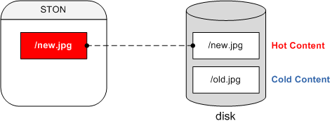
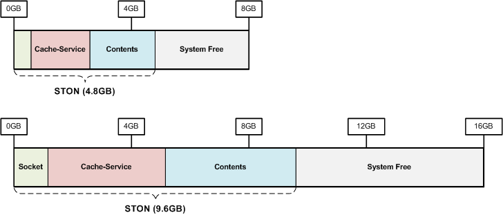
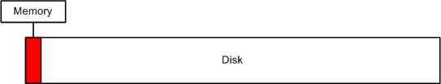
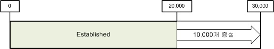
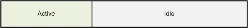
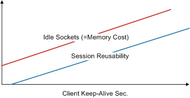
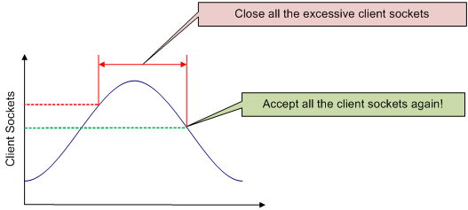
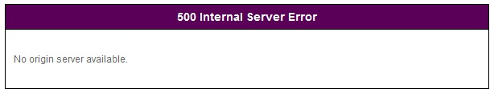
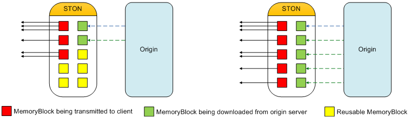

.. _adv_topics:

19장. 최적화와 그 밖의 것들
****************************

이 장에서는 최적화와 그 밖의 잡다하지만 깊이 있는 주제에 대해 다룬다.
최적화는 고성능(High Performance)을 위한 방법이며 이는 우리가 추구하는 가장 큰 가치다.
엔터프라이즈 환경에서의 고성능은 주어진 하드웨어 자원을 최대한 활용하는 것을 의미하기도 한다.

그 중 메모리는 모든 설계 및 정책을 결정하는 가장 중요한 자원이다.
특히 인덱싱(요청된 URL을 빠르게 찾는 것)에 대해서는 반드시 이해해야 한다.
왜냐하면 서비스 품질을 결정짓는 것은 인덱싱이기 때문이다.
앞으로 설명할 모든 내용은 다음 표 "물리 메모리 크기에 따른 기본설정"와 관련이 있다.

============= ============== =============== ============= ========
Physical RAM  System Free    Contents        Caching Count Sockets
============= ============== =============== ============= ========
1GB           409.60MB       188.37MB        219,469       5,000
2GB           819.20MB       446.74MB        520,494       10,000
4GB           1.60GB         963.49MB        1,122,544     20,000
8GB           3.20GB         2.05GB          2,440,422     20,000
16GB          6.40GB         4.45GB          5,303,733     20,000
32GB          12.80GB        9.25GB          11,030,356    20,000
64GB          25.60GB        18.85GB         22,483,603    20,000
128GB         51.20GB        38.05GB         45,390,095    20,000
============= ============== =============== ============= ========

.. toctree::
   :maxdepth: 2

.. _adv_topics_indexing:

인덱싱
====================================

인덱싱 모드를 설명하기에 앞서 Hot콘텐츠와 Cold콘텐츠의 개념을 이해해야 한다.

원본으로부터 캐싱한 콘텐츠는 로컬 디스크에 저장된다.
해당 콘텐츠가 접근될 때마다 매번 디스크에서 읽어 전송하면 당연히 성능이 저하된다.
따라서 자주 접근되는 콘텐츠를 메모리에 적재해 놓으면 고성능을 얻을 수 있다.
이렇게 메모리에 적재된 콘텐츠를 Hot, 디스크에만 위치한 콘텐츠를 Cold라고 부른다.

인덱싱은 Hot과 Cold콘텐츠를 찾는 방식을 의미하며 이는 성능과 직결된다.
기본은 메모리 인덱싱이다. ::

   # server.xml - <Server><Cache>

   <Indexing>Memory</Indexing>

메모리 인덱싱에서는 Cold가 존재하지 않는다.
모든 파일에 대한 정보는 메모리에 적재되기 때문에 메모리에서 찾을 수 없다면 원본서버에서 신규로 다운로드 한다.
검색시간이 매우 짧기 때문에 그 만큼 고성능과 빠른 서비스 품질을 얻을 수 있다.
하지만 메모리 저장공간의 한계로 인해 캐싱 개수에 한계가 있다.
그 한계는 앞선 표의 Caching Count를 참고한다.

디스크 인덱싱은 Hot에 없는 경우 원본으로 가기 전에 Cold에서 콘텐츠를 찾는다. ::

   # server.xml - <Server><Cache>

   <Indexing>Disk</Indexing>

이 방식은 메모리 제한을 받지 않기 때문에 Caching Count에 제한이 없다.
Hot 콘텐츠의 경우 빠른 품질을 보장하지만, Cold의 경우 디스크를 사용하기 때문에 상대적으로 느리다.
간단히 정리하면 Hot은 메모리 속도, Cold는 디스크 속도에 수렴한다.

디스크 인덱싱을 사용할 경우 SSD를 사용할 것을 강력히 권장한다.
인덱싱은 STON이 설치된 디스크에서만 수행된다.
STON은 일반적으로 OS와 같은 디스크에 설치되기 때문에 OS디스크만 SSD로 사용해도 고성능을 기대할 수 있다.

.. note::

   SSD의 수명은 접근 빈도보다 Write되는 양에 의해 결정된다.
   Intel이나 Samsung등에서 공급하는 SSD의 경우 최소 600TB의 Write수명을 보장한다.
   이를 단순히 계산해보면 하루에 20GB씩 Write할 경우 10년 정도의 수명을 예측할 수 있다.
   STON에서의 Write의 99%는 Log다.
   이런 관점에서 Log를 SSD가 아닌 다른 디스크(SAS나 SATA등)에 기록하도록 하면 내구성을 보장할 수 있다.

.. warning::

   인덱싱은 동적으로 변경할 수 없을 뿐만 아니라 변경하여도 안정성이 보장되지 않는다.
   그러므로 모드를 변경한 뒤 :ref:`getting-started-reset` 를 진행해야 안전하게 서비스할 수 있다.

.. _adv_topics_mem:

메모리 구조
====================================

캐시서버와 범용 웹서버의 동작방식은 유사하나 목적은 매우 다르다.
STON의 구조와 동작방식을 상세히 이해하면 보다 최적화된 서비스가 가능하다.
최적화의 목적은 아래와 같다.

**높은 처리량**. 성능저하 없이 수 만개의 세션을 동시에 처리할 수 있다.

**빠른 반응성**. 클라이언트에게 지연없는 서비스를 제공한다.

**원본서버 부하절감**. 원본서버 부하는 자칫 전체장애로 이어진다.

다음 그림은 STON을 8GB와 16GB메모리 장비에서 구동시켰을 때의 메모리 구성이다.

메모리는 STON이 사용하는 메모리와 사용하지 않는 메모리(Free)로 나눈다.
STON이 사용하는 메모리는 파일, 소켓같이 서비스 규모에 따라 달라지는 자원 개수와 관련이 있다.

.. note::

   시스템 부하의 근본은 디스크 I/O 때문이다.
   당신은 "얼마나 많은 Contents를 Caching해야 디스크 I/O를 줄일 수 있는가?" 에 대해 고민해야 한다.

.. _adv_topics_mem_control:

메모리 조절
====================================

`메모리 구조`_ 는 구동될 때 물리 메모리 크기에 기반하여 계산된다. ::

   # server.xml - <Server><Cache>

   <SystemMemoryRatio>100</SystemMemoryRatio>

-  ``<SystemMemoryRatio> (기본: 100)`` 물리메모리를 기준으로 사용할 메모리 비율을 설정한다.

예를 들어 8GB장비에서 ``<SystemMemoryRatio>`` 를 50으로 설정하면 물리 메모리가 4GB인 것처럼 동작한다.
이는 메모리를 점유하는 다른 프로세스와 같이 구동될 때 유용하게 사용될 수 있다.

좀 더 구체적으로 서비스 형식에 따라 메모리에 적재되는 데이터 비율을 조절하면 효과적이다. ::

   # server.xml - <Server><Cache>

   <ContentMemoryRatio>50</ContentMemoryRatio>

-  ``<ContentMemoryRatio> (기본: 50)`` STON이 사용하는 전체 메모리 중 서비스 데이터 메모리 적재비율을 설정한다.

예를 들어 게임 포탈처럼 파일개수는 적지만 컨텐츠 크기가 클 경우엔 이 수치를 늘리면 파일 I/O가 감소된다.
반대로 아주 작은 파일이 많은 경우는 반대로 줄이는 설정이 유용할 수 있다.

.. _adv_topics_sys_free_mem:

시스템 Free 메모리
====================================

OS(Operating System)가 느리면 어떠한 프로그램도 제 성능을 내지 못한다.
STON은 OS를 위해 일부 메모리를 사용하지 않는다.
OS의 성능을 극대화하기 위해서며 이를 시스템 Free메모리라 부른다.

.. note::

   이에 대해 권위있는 설명을 제시하고 싶으나 아쉽게도 찾지 못하였다.
   구글링을 통해 가장 많이 `인용된 글 <http://www.sysxperts.com/home/announce/vmdirtyratioandvmdirtybackgroundratio>`_ 을 제시한다.

============== ===============
Physical RAM   System Free
============== ===============
1GB	           409.6MB
2GB	           819.2MB
4GB            1.6GB
8GB	           3.2GB
16GB	         6.4GB
32GB	         12.8GB
64GB	         25.6GB
128GB	         51.2GB
============== ===============

고급 사용자의 경우 서비스 형태에 맞추어 Free메모리 비율을 줄일 수 있다. Free메모리가 줄어들면 더 많은 Contents를 메모리에 적재할 수 있다. ::

   # server.xml - <Server><Cache>

   <SystemFreeMemoryRatio>40</SystemFreeMemoryRatio>

-  ``<SystemFreeMemoryRatio> (기본: 40, 최대: 40)`` 물리 메모리를 기준으로 설정된 비율만큼을 Free메모리로 남겨둔다.

Caching 서비스 메모리
====================================

클라이언트에게 전송할 컨텐츠를 Caching하는 메모리이다.
한번 디스크에서 메모리로 적재된 컨텐츠는 메모리 부족현상이 발생하지 않는다면 계속 메모리에 존재한다.
문제는 메모리 부족현상은 항상 발생한다는 점이다.

위 그림처럼 전송해야할 컨텐츠는 디스크에 가득한데 실제 메모리에 적재할 수 있는 용량은 아주 제한적이다.
32GB의 물리 메모리를 장착한다해도 고화질 동영상이나 게임 클라이언트의 크기를 감안한다면 그리 넉넉한 편은 아니다.
아무리 효율적으로 메모리를 관리해도 물리적인 디스크 I/O속도에 수렴할 수 밖에 없다.

가장 효과적인 방법은 Contents메모리 공간을 최대한 확보하여 디스크 I/O를 줄이는 것이다.
다음은 물리 메모리 기준으로 STON이 기본으로 설정하는 최대 Contents메모리 크기이다.

=============== ================= ====================
Physical RAM    Contents          Caching Count
=============== ================= ====================
1GB             188.37MB          219,469
2GB             446.74MB          520,494
4GB             963.49MB          1,122,544
8GB             2.05GB            2,440,422
16GB            4.45GB            5,303,733
32GB            9.25GB            11,030,356
64GB            18.85GB           22,483,603
128GB           38.05GB           45,390,095
=============== ================= ====================

Socket 메모리
====================================

소켓도 메모리를 사용한다.
4GB이상의 장비에서 STON은 2만개의 소켓을 기본으로 생성한다.
소켓 1개=10KB, 1만개당 97.6MB의 메모리를 사용하므로 약 195MB의 메모리가 기본으로 소켓에 할당된다.

=============== ================= ======================
Physical RAM    Socket Count      Socket Memory
=============== ================= ======================
1GB             5천               97.6MB
2GB             1만               195MB
4GB 이상        2만               390MB
=============== ================= ======================

다음 그림처럼 소켓을 모두 사용하면 자동으로 소켓이 늘어난다.

위 그림과 같이 증설되어 3만개의 소켓을 사용한다면 총 240MB의 메모리가 소켓에 할당된다.
필요한 소켓을 필요한만큼만 사용하는 것은 아무 문제가 없어 보인다.
하지만 사용하지 않는 소켓을 지나치게 많이 설정해놓는 것은 메모리 낭비다.
예를 들어 10Gbps장비에서 사용자마다 10Mbps의 전송속도를 보장한다고 가정했을 때 다음 공식에 의하여 최대 동시 사용자는 1,000명이다. ::

   10,000Mbps / 10Mbps = 1,000 Sessions

이 경우 STON이 최초 생성하는 2만개 중 19,000개에 해당하는 약 148MB는 낭비가 되는 셈이다.
이 148MB를 Contents에 투자한다면 효율을 더 높일 수 있다.
최소 소켓수를 설정하면 메모리를 보다 효율적으로 사용할 수 있다.

**최소 소켓수**. 최초에 할당되는 소켓수를 의미한다.

**증설 소켓수**. 소켓이 모두 사용 중(Established)일 때 설정한 개수만큼 소켓을 증설한다.

또 하나의 중요한 변수는 클라이언트 Keep-Alive시간 설정이다. (:ref:`handling_http_requests_session_man` 참조)

연결된 모든 소켓이 데이터 전송 중에 있는 것은 아니다.
IE, Chrome과 같은 브라우저들은 다음에 발생할 HTTP전송을 위해 소켓을 서버에 접속해 놓은 상태로 유지한다.
실제로 쇼핑몰의 경우 연결되어 있는 세션 중 아무런 데이터 전송이 발생하지 않고 그저 붙어 있는 세션의 비율은 적게는 50%에서 많게는 80%에 이른다.

Keep-Alive시간을 길게 줄수록 소켓의 재사용성은 좋아지지만 유지되는 Idle소켓의 개수가 증가하므로 메모리 낭비가 심해진다.
그러므로 서비스에 맞는 적절한 클라이언트 Keep-Alive시간을 설정하는 것이 중요하다.

.. _adv_topics_tso:

TCP Segmentation Offload
====================================

.. important::

   10G NIC를 사용한다면 TSO(TCP Segmentation Offload)를 OFF로 설정하길 권장한다.

TCP는 전송시 패킷을 분할(Segmentation)하는데, 이 작업을 CPU가 아닌 NIC가 수행하도록 설정하는 것이 TSO이다.
(기본 값은 ON이다.)
하지만 10G NIC 서비스 환경에서 우리는 이와 관련된 많은 장애를 겪었다.

-  TCP 패킷 유실 및 지연
-  TCP 연결 종료
-  Load Average의 비정상적인 증가

결론적으로 TSO는 모두의 기대만큼 높은 성능을 내지 못하는 것으로 추정된다.
(NIC만 1G로 바꿔도 이런 문제는 발생하지 않았다.)
결론적으로 TSO를 OFF로 설정함으로써 서비스는 정상화되었다.
이에 따른 CPU 사용량은 우려할 수준이 아니며 서비스 규모와 비례하는 정직한 지표를 보여 준다.

TSO 설정은 다음과 같이 설정/확인할 수 있다. (K의 대/소문자에 유의한다.) ::

   # ethtool -K ethX tso off        // TSO OFF 설정
   # ethtool -k ethX                // 설정 열람
   ...
   tcp segmentation offload: on
   ...

.. tip::

   더 자세한 정보는 다음 링크를 참조한다.

   -  `http://sandilands.info/sgordon/segmentation-offloading-with-wireshark-and-ethtool <http://sandilands.info/sgordon/segmentation-offloading-with-wireshark-and-ethtool>`_
   -  `http://www.linuxfoundation.org/collaborate/workgroups/networking/tso <http://www.linuxfoundation.org/collaborate/workgroups/networking/tso>`_
   -  `http://www.packetinside.com/2013/02/mtu-1500.html <http://www.packetinside.com/2013/02/mtu-1500.html>`_

클라이언트 접속 제한
====================================

제한없이 클라이언트 요청을 모두 허용하면 시스템에 지나친 부하가 발생할 수 있다.
시스템 과부하는 사실상 장애이다.
적절한 수치에서 클라이언트 요청을 거부하여 시스템을 보호한다. ::

   # server.xml - <Server><Cache>

   <MaxSockets Reopen="75">80000</MaxSockets>

-  ``<MaxSockets> (기본: 80000, 최대: 100000)`` 연결을 허용할 최대 클라이언트 소켓 수.
   이 수치를 넘으면 신규 클라이언트 접속을 즉시 닫는다.
   ``<MaxSockets>`` 의 ``Reopen (기본: 75%)`` 비율만큼 소켓 수가 감소하면 다시 접속을 허용한다.

(기본 설정에서) 전체 클라이언트 소켓 수가 8만을 넘으면 신규 클라이언트 접속은 즉시 종료된다.
전체 클라이언트 소켓 수가 6만(8만의 75%)이 되면 다시 접근을 허용한다.

예를 들어 3만개의 클라이언트 세션을 처리할 때 원본 서버들이 모두 한계에 도달하면
이 수치를 3~4만 정도로 설정하는 것이 좋다.
이로 인해 얻을 수 있는 효과는 다음과 같다.

-  별다른 Network 구성(e.g. L4 세션조절 등)이 필요 없다.
-  불필요한(원본 부하로 처리될 수 없는) 클라이언트 요청을 방지한다.
-  서비스의 신뢰성을 높인다. 서비스 Burst 이후 재시작 등 점검 작업이 필요 없다.

HTTP 클라이언트 세션 수
====================================

HTTP 클라이언트 연결을 처리하기 위한 초기/증설 세션 수를 설정한다. ::

    # server.xml - <Server><Cache>

    <HttpClientSession>
       <Init>20000</Init>
       <TopUp>6000</TopUp>
    </HttpClientSession>

-  ``<Init>`` STON 시작시 미리 생성해놓는 소켓 수

-  ``<TopUp>`` 생성해놓은 소켓 수를 초과했을 때 추가로 생성할 소켓 수

별도로 설정하지 않을 경우 물리 메모리 크기에 따라 자동으로 설정된다.

=============== =========================
물리메모리	    <Init>, <TopUp>
=============== =========================
1GB             5천, 1천
2GB             1만, 2천
4GB             2만, 4천
8GB 이상        2만, 6천
=============== =========================
제한적인 환경에서 적은 수의 소켓만으로도 서비스가 가능할 때 소켓 수를 줄이면 메모리를 절약할 수 있다.

.. _adv_topics_req_hit_ratio:

Request hit ratio
====================================

먼저 클라이언트의 HTTP요청이 어떻게 처리되는지 이해해야 한다.
캐시처리 결과는 Squid와 동일하게 TCP_*로 명명되며 각 표현마다 캐시서버가 처리한 방식을 의미한다.

-  ``TCP_HIT`` 요청된 리소스(만료되지 않음)가 캐싱되어 있어 즉시 응답함.
-  ``TCP_IMS_HIT`` IMS(If-Modified-Since)헤더와 함께 요청된 리소스가 만료되지 않은 상태로 캐싱되어 있어 304 NOT MODIFIED로 응답함. TTLExtensionBy4xx, TTLExtensionBy5xx설정에 해당하는 경우에도 이에 해당함.
-  ``TCP_REFRESH_HIT`` 요청된 리소스가 만료되어 원본서버 확인(원본 미변경, 304 NOT MODIFIED) 후 응답함. 리소스 만료시간 연장됨.
-  ``TCP_REF_FAIL_HIT`` TCP_REFRESH_HIT과정 중 원본서버에서 확인이 실패(접속실패, 전송지연)한 경우 만료된 컨텐츠로 응답함.
-  ``TCP_NEGATIVE_HIT`` 요청된 리소스가 비정상적인 상태(원본서버 접속/전송 실패, 4xx응답, 5xx응답)로 캐싱되어 있고 해당상태를 응답함.
-  ``TCP_REDIRECT_HIT`` 서비스 허용/거부/Redirect 조건에 의해 Redirect를 응답함.
-  ``TCP_MISS`` 요청된 리소스가 캐싱되어 있지 않음(=최초 요청). 원본서버에서 가져온 결과를 응답함.
-  ``TCP_REF_MISS`` 요청된 리소스가 만료되어 원본서버 확인(원본 변경, 200 OK) 후 응답함. 새로운 리소스가 캐싱됨.
-  ``TCP_CLIENT_REFRESH_MISS`` 요청을 원본서버로 바이패스.
-  ``TCP_ERROR`` 요청된 리소스가 캐싱되어 있지 않음(=최초 요청). 원본서버 장애(접속실패, 전송지연, 원본배제)로 인해 리소스를 캐싱하지 못함. 클라이언트에게 500 Internal Error로 응답함.
-  ``TCP_DENIED`` 요청이 거부되었음.

이상을 종합하여 Request hit ratio계산 공식은 다음과 같다. ::

   TCP_HIT + TCP_IMS_HIT + TCP_REFRESH_HIT + TCP_REF_FAIL_HIT + TCP_NEGATIVE_HIT + TCP_REDIRECT_HIT
   ------------------------------------------------------------------------------------------------
                                            SUM(TCP_*)

Byte hit ratio
====================================

클라이언트에게 전송한 트래픽(Client Outbound)대비 원본서버로부터 전송받은 트래픽(Origin Inbound)의 비율을 나타낸다.
원본서버 트래픽이 클라이언트 트래픽보다 높은 경우 음수가 나올 수 있다. ::

   Client Outbound - Origin Inbound
   --------------------------------
           Client Outbound

원본서버 장애상황 정책
====================================

고객이 언제든지 원본서버를 점검 할 수 있도록 하는 것이 개발팀의 목표다.
원본서버의 장애가 감지되면 해당 서버는 자동으로 배제되어 복구모드로 전환된다.
장애서버가 재가동되었더라도 정상 서비스 상태를 확인해야만 다시 투입한다.

만약 모든 원본서버의 장애를 감지한 경우 현재 캐싱된 컨텐츠로 서비스를 진행한다.
TTL이 만료된 컨텐츠는 원본서버가 복구될 때까지 자동으로 연장된다.
심지어 Purge된 컨텐츠의 경우에도 원본서버에서 캐싱할 수 없다면 복구시켜 서비스에 문제가 없도록 동작한다.
최대한 클라이언트에게 장애상황을 노출해선 안된다는 정책이다.
완전 장애상황에서 신규 컨텐츠 요청이 들어오면 다음과 같은 에러 페이지와 이유가 명시된다.

   왠만하면 이런 화면은 보여주기 싫다.

시간단위 표현과 범위
====================================

기준 시간이 "초"인 항목에 대하여 문자열로 시간표현이 가능하다.
다음은 지원되는 시간표현 목록과 환산된 초(sec) 다.

=========================== =========================
표현	                      환산
=========================== =========================
year(s)                     31536000 초 (=365 days)
month(s)                    2592000 초 (=30 days)
week(s)                     604800 초 (=7 days)
day(s)                      86400 초 (=24 hours)
hour(s)	                    3600 초 (=60 mins)
minute(s), min(s)	          60 초
second(s), sec(s), (생략)	  1 초
=========================== =========================

다음과 같이 조합된 시간표현이 가능하다. ::

    1year 3months 2weeks 4days 7hours 10mins 36secs

현재 지원대상은 다음과 같다.

- Custom TTL의 시간표현
- TTL의 Ratio를 제외한 모두
- ClientKeepAliveSec
- ConnectTimeout
- ReceiveTimeout
- BypassConnectTimeout
- BypassReceiveTimeout
- ReuseTimeout
- Recovery의 Cycle속성
- Bandwidth Throttling

Emergency 모드
====================================

내부적으로 모든 가상호스트가 MemoryBlock을 공유하면서 데이터를 관리하도록 설계되어 있다.
신규 메모리가 필요한 경우 참조되지 않는 오래된 MemoryBlock을 재사용하여 신규 메모리를 확보한다.
이 과정을 Memory-Swap이라고 부른다.
이런 구조를 통해 장기간 운영하여도 안정성을 확보할 수 있다.

   콘텐츠 데이터는 MemoryBlock에 담겨 서비스된다.

위 그림의 우측 상황처럼 모든 MemoryBlock이 사용 중이어서 재사용할 수 있는 MemoryBlock이
존재하지 않는 상황이 발생할 수 있다.
이때는 Memory-Swap이 불가능해진다.
예를 들어 모든 클라이언트가 서로 다른 데이터 영역을 아주 조금씩 다운로드 받거나
원본서버에서 서로 다른 데이터를 아주 조금씩 전송하는 상황이 동시에 발생하는 경우가 최악이다.
이런 경우 시스템으로부터 새로운 메모리를 할당받아 사용하는 것도 방법이다.
하지만 이런 상황이 지속될 경우 메모리 사용량이 높아진다.
메모리 사용량이 과도하게 높아질 경우 시스템 메모리스왑을 발생시키거나 최악의 경우
OS가 STON을 종료시키는 상황이 발생할 수 있다.

.. note::

   Emergency 모드란 메모리 부족상황이 발생할 경우 임시적으로 신규 MemoryBlock의 할당을 금지시키는 상황을 의미한다.

이는 과다 메모리 사용으로부터 스스로를 보호하기 위한 방법이며,
재사용가능한 MemoryBlock이 충분히 확보되면 자동 해지된다. ::

    # server.xml - <Server><Cache>

    <EmergencyMode>OFF</EmergencyMode>

-  ``<EmergencyMode>``

   - ``OFF (기본)`` 사용하지 않는다.

   - ``ON`` 사용한다.

Emergency모드일 때 STON은 다음과 같이 동작합니다.

- 이미 로딩되어 있는 컨텐츠는 정상적으로 서비스된다.
- 바이패스는 정상적으로 이루어진다.
- 로딩되어 있지 않은 컨텐츠에 대해서는 503 service temporarily unavailable로 응답한다. TCP_ERROR상태가 증가한다.
- Idle 클라이언트 소켓을 빠르게 정리한다.
- 신규 컨텐츠를 캐싱할 수 없다.
- TTL이 만료된 컨텐츠를 갱신하지 않는다.
- SNMP의 cache.vhost.status와 XML/JSON통계의 Host.State 값이 "Emergency"로 제공된다.
- Info로그에 Emergency모드로 전환/해제를 다음과 같이 기록한다. ::

    2013-08-07 21:10:42 [WARNING] Emergency mode activated. (Memory overused: +100.23MB)
    ...(생략)...
    2013-08-07 21:10:43 [NOTICE] Emergency mode inactivated.

디스크 Hot-Swap
====================================

서비스 중단없이 디스크를 교체한다.
파라미터는 반드시 ``<Disk>`` 설정과 같아야 한다. ::

   http://127.0.0.1:10040/command/unmount?disk=...
   http://127.0.0.1:10040/command/umount?disk=...

배제된 디스크는 즉시 사용되지 않으며 해당 디스크에 저장되었던 모든 컨텐츠는 무효화된다.
관리자에 의해 배제된 디스크의 상태는 "Unmounted"로 설정된다.

디스크를 서비스에 재투입하려면 다음과 같이 호출한다. ::

   http://127.0.0.1:10040/command/mount?disk=...

재투입된 디스크의 모든 콘텐츠는 무효화된다.

.. _adv_topics_syncstale:

SyncStale
====================================

(인덱싱시점과 성능상의 이유로) 비정상 서비스 종료시 관리자가 :ref:`api-cmd-purge` , :ref:`api-cmd-expire` , :ref:`api-cmd-hardpurge` 한 컨텐츠가 인덱싱에서 누락될 수 있다.
이를 보완하기 위해 API호출을 로그로 기록하여 서비스 재가동시 반영한다. ::

    # server.xml - <Server><Cache>

    <SyncStale>ON</SyncStale>

-  ``<SyncStale>``

   - ``ON  (기본)`` 구동될 때 동기화한다.

   - ``OFF`` 무시한다.

로그는 ./stale.log에 기록되며 정상종료 또는 정기 인덱싱 시점에 초기화된다.
