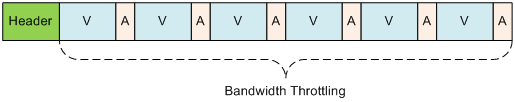
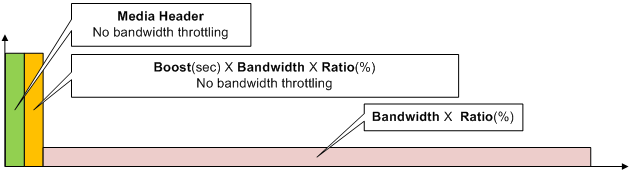

.. _bandwidth_control:

16장. Bandwidth
******************

이 장에서는 가상호스트별로 다양한 방식의 Bandwidth 제한(조절)방법에 대해 설명한다.
예전에는 Bandwidth가 일정수준을 넘지 못하도록 제한하는 것이 목적이었다.
이제는 효과적으로 Bandwidth를 조절하는 것으로 그 개념이 옮겨갔다.
나아가 콘텐츠를 실시간으로 분석해 각각에 최적화된 Bandwidth를 사용하도록 설정할 수 있다.

.. toctree::
   :maxdepth: 2

가상호스트 Bandwidth 제한
====================================

가상호스트의 최대 Bandwidth을 제한한다.
이는 가장 우선하는 물리적인 방법이다. ::

   # server.xml - <Server><VHostDefault><Options>
   # vhosts.xml - <Vhosts><Vhost><Options>

   <TrafficCap Session="0">0</TrafficCap>

-  ``<TrafficCap> (기본: 0 Mbps)``
   가상호스트의 최대 Bandwidth를 Mbps단위로 설정한다.
   0으로 설정하면 Bandwidth을 제한하지 않는다.
   ``Session (기본: 0 Kbps)`` 속성은 클라이언트 세션별로 전송할 수 있는 최대 Bandwidth을 설정한다.

예를 들어 ``<TrafficCap>`` 을 50 (Mbps)로 설정했다면 50Mbps NIC를 설치한 것과 같은 효과를 낸다.
해당 가상호스트에 접근하는 모든 클라이언트 Bandwidth의 합은 50Mbps를 넘을 수 없다.

``Session`` 은 다음과 같이 동작한다.

1. ``Session`` 이 설정되어 있더라도 모든 클라이언트 Bandwidth의 합은 ``<TrafficCap>`` 을 넘을 수 없다.
2. `Bandwidth Throttling`_ 를 설정해도 클라이언트 세션별 최대 속도는 ``Session`` 을 넘을 수 없다.

.. _bandwidth-control-bt:

Bandwidth Throttling
====================================

BT(Bandwidth Throttling)이란 (각 세션마다)클라이언트 전송 대역폭을 동적으로 조절하는 기능이다.
일반적인 미디어 파일의 내부는 다음과 같이 헤더, V(Video), A(Audio)로 구성되어 있다.

   헤더는 BT의 대상이 아니다.

헤더는 재생시간이 길거나 Key Frame주기가 짧을수록 커진다.
그러므로 인식할 수 있는 미디어 파일이라면 원활한 재생을 위해 헤더는 대역폭 제한없이 전송한다.
다음 그림처럼 헤더가 완전히 전송된 뒤 BT가 시작된다.

   동작 시나리오

::

   # server.xml - <Server><VHostDefault><Options>
   # vhosts.xml - <Vhosts><Vhost><Options>

   <BandwidthThrottling>
      <Settings>
         <Bandwidth Unit="kbps">1000</Bandwidth>
         <Ratio>100</Ratio>
         <Boost>5</Boost>
      </Settings>
      <Throttling>OFF</Throttling>
   </BandwidthThrottling>

``<BandwidthThrottling>`` 태그 하위에 기본동작을 설정한다.

-  ``<Settings>``

   기본 동작을 설정한다.

   -  ``<Bandwidth> (기본: 1000 Kbps)``
      클라이언트 전송 대역폭을 설정한다.
      ``Unit`` 속성을 통해 기본 단위( ``kbps`` , ``mbps`` , ``bytes`` , ``kb`` , ``mb`` )를 설정한다.

   -  ``<Ratio> (기본: 100 %)``
      ``<Bandwidth>`` 설정에 비율을 반영하여 대역폭을 설정한다.

   -  ``<Boost> (기본: 5 초)``
      일정 시간만큼의 데이터를 속도제한 없이 클라이언트에게 전송한다.
      데이터의 양은 ``<Boost>`` X ``<Bandwidth>`` X ``<Ratio>`` 공식으로 계산한다.

-  ``<Throttling>``

   -  ``OFF (기본)`` BT를 적용하지 않는다.
   -  ``ON`` 조건목록과 일치하면 BT를 적용한다.

Bandwidth Throttling 조건목록
--------------------------

BT 조건목록을 설정한다.
조건목록과 일치해야 BT가 적용된다.
설정된 순서대로 조건과 일치하는지 검사한다.
전송 정책은 /svc/{가상호스트 이름}/throttling.txt 에 설정한다. ::

   # /svc/www.example.com/throttling.txt
   # 구분자는 콤마(,)이며 {조건},{Bandwidth},{Ratio},{Boost} 순서로 표기한다.
   # {조건}을 제외한 모든 필드는  생략가능하다.
   # 생략된 필드는 ``<Settings>`` 에 설정된 기본 값을 사용한다.
   # 모든 조건표현은 acl.txt설정과 동일하다.
   # {Bandwidth} 단위는 ``<Settings>`` ``<Bandwidth>`` 의 ``Unit`` 속성을 사용한다.

   # 3초의 데이터를 속도 제한없이 전송한 후 3Mbps(3000Kbps = 2000Kbps X 150%)로 클라이언트에게 전송한다.
   $IP[192.168.1.1], 2000, 150, 3

   # bandwidth만 정의. 5(기본)초의 데이터를 속도 제한없이 전송한 후 800 Kbps로 클라이언트에게 전송한다.
   !HEADER[referer], 800

   # boost만 정의. 10초의 데이터를 속도 제한없이 전송한 후 1000 Kbps로 클라이언트에게 전송한다.
   HEADER[cookie], , , 10

   # 확장자가 m4a인 경우 BT를 적용하지 않는다.
   $URL[*.m4a], no

미디어 파일(MP4, M4A, MP3)을 분석하면 Encoding Rate로부터 Bandwidth를 얻을 수 있다.
접근되는 콘텐츠의 확장자는 반드시 .mp4, .m4a, .mp3 중 하나여야 한다.
동적으로 Bandwidth를 추출하려면 다음과 같이 Bandwidth뒤에 **x** 를 붙인다. ::

   # /vod/*.mp4 파일에 대한 접근이라면 bandwidth를 구한다. 구할 수 없다면 1000을 bandwidth로 사용한다.
   $URL[/vod/*.mp4], 1000x, 120, 5

   # user-agent헤더가 없다면 bandwidth를 구한다. 구할 수 없다면 500을 bandwidth로 사용한다.
   !HEADER[user-agent], 500x

   # /low_quality/* 파일에 대한 접근이라면 bandwidth를 구한다. 구할 수 없다면 기본 값을 bandwidth로 사용한다.
   $URL[/low_quality/*], x, 200

QueryString 우선조건
--------------------------

약속된 QueryString을 사용하여 ``<Bandwidth>`` , ``<Ratio>`` , ``<Boost>`` 를 동적으로 설정한다.
이 설정은 BT조건보다 우선한다.

::

   # server.xml - <Server><VHostDefault><Options>
   # vhosts.xml - <Vhosts><Vhost><Options>

   <BandwidthThrottling>
      <Settings>
         <Bandwidth Param="mybandwidth" Unit="mbps">2</Bandwidth>
         <Ratio Param="myratio">100</Ratio>
         <Boost Param="myboost">3</Boost>
      </Settings>
      <Throttling QueryString="ON">ON</Throttling>
   </BandwidthThrottling>

-  ``<Bandwidth>`` , ``<Ratio>`` , ``<Boost>`` 의 ``Param``

    각각의 의미에 맞게 QueryString 키를 설정한다.

-  ``<Throttling>`` 의 ``QueryString``

   - ``OFF (기본)`` QueryString으로 조건을 재정의하지 않는다.

   - ``ON`` QueryString으로 조건을 재정의한다.

위와 같이 설정되어 있다면 다음과 같이 클라이언트가 요청한 URL에 따라 BT가 동적으로 설정된다. ::

    # 10초의 데이터를 속도 제한없이 전송한 후 1.3Mbps(1mbps X 130%)로 클라이언트에게 전송한다.
    http://www.winesoft.co.kr/video/sample.wmv?myboost=10&mybandwidth=1&myratio=130

반드시 모든 파라미터를 명시할 필요는 없다. ::

    http://www.winesoft.co.kr/video/sample.wmv?myratio=150

위와 같이 일부 조건이 생략된 경우 나머지 조건(여기서는 bandwidth, boost)을 결정하기 위해 조건목록을 검색한다.
여기서도 적합한 조건을 찾지 못하는 경우 ``<Settings>`` 에 설정된 기본 값을 사용한다.
QueryString이 일부 존재하더라도 조건목록에서 미적용옵션(no)이 설정되어 있다면
BT는 적용되지 않는다.

QueryString을 사용하므로 자칫 :ref:`caching-policy-applyquerystring` 과 혼동을 일으킬 소지가 있다.
:ref:`caching-policy-applyquerystring` 이 ``ON`` 인 경우 클라이언트가 요청한 URL의 QueryString이
모두 인식되지만 ``BoostParam`` , ``BandwidthParam`` , ``RatioParam`` 은 제외된다. ::

   GET /video.mp4?mybandwidth=2000&myratio=130&myboost=10
   GET /video.mp4?tag=3277&myboost=10&date=20130726

예를 들어 위같은 입력은 BT를 결정하는데 쓰일 뿐 Caching-Key를 생성하거나 원본서버로 요청을 보낼 때는 제거된다.
즉 각각 다음과 같이 인식된다. ::

    GET /video.mp4
    GET /video.mp4?tag=3277&date=20130726
