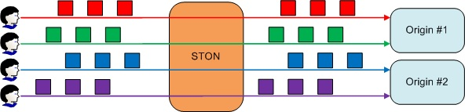

.. _bypass:

8장. 바이패스
******************

이 장에서는 클라이언트 요청처리를 원본서버에게 위임하는 바이패스에 대해 설명한다.
바이패스는 조건과 동작으로 구분된다.

바이패스는 Caching정책보다 우선한다.
설계단계에서 Edge도입이 고려되지 않은 서비스라면 정적리소스와 동적리소스를 정교하게 구분해낼 수 없는 경우가 많다.
이런 경우 모든 클라이언트 요청을 바이패스하도록 구성한 뒤 로그에 기반하여 요청이 많은 콘텐츠만 Caching하도록 설정한다.
대개의 경우 몇 시간의 로그만으로 원본부하를 극적으로 낮출 수 있다.
:ref:`monitoring_stats` 에서 실시간 정보를 제공하는 이유도 서비스를 실시간 튜닝할 수 있도록 하기 위함이다.

바이패스는 아주 빠를뿐만 아니라 HTTP트랜잭션 단위로 동작한다.
아무리 개인화된 사이트라고 해도 대부분은 메인 페이지(.html)만 동적으로 변경될 뿐 나머지 99%는 정적인 리소스로 구성된다.
원본서버 동작에 맞출 수 있도록 :ref:`origin-httprequest` 의 바이패스 버전이 별도로 존재한다.

.. toctree::
   :maxdepth: 2

No-Cache 요청 바이패스
====================================

클라이언트가 no-cache요청을 보냈다면 바이패스한다. ::

   GET / HTTP/1.1
   cache-control: no-cache 또는 cache-control:max-age=0
   pragma: no-cache

::

   # server.xml - <Server><VHostDefault><Options>
   # vhosts.xml - <Vhosts><Vhost><Options>

   <BypassNoCacheRequest>OFF</BypassNoCacheRequest>

-  ``<BypassNoCacheRequest>``

   - ``OFF (기본)`` Cache모듈이 처리한다.

   - ``ON`` 원본서버로 바이패스한다.

.. note::

    이 설정은 클라이언트 동작(아마도 ``ctrl`` + ``F5`` )에 의해 판단된다.
    그러므로 대량의 바이패스가 원본에 부담을 줄 가능성이 있다.

.. _bypass-getpost:

GET/POST 바이패스
====================================

바이패스가 GET/POST요청의 기본동작이 되도록 설정할 수 있다.
GET과 POST의 용도가 다른만큼 기본동작이 다름에 유의한다. ::

   # server.xml - <Server><VHostDefault><Options>
   # vhosts.xml - <Vhosts><Vhost><Options>

   <BypassPostRequest>ON</BypassPostRequest>
   <BypassGetRequest>OFF</BypassGetRequest>

-  ``<BypassPostRequest>``

   - ``ON (기본)`` POST요청을 원본서버로 바이패스한다.

   - ``OFF`` POST요청을 STON이 처리한다.

-  ``<BypassGetRequest>``

   - ``OFF (기본)`` GET요청을 STON이 처리한다.

   - ``ON`` GET요청을 원본서버로 바이패스한다.

:ref:`access-control-vhost_acl` 과 동일한 조건을 모두 지원한다.
바이패스 예외조건은 /svc/{가상호스트 이름}/bypass.txt 에 설정한다. ::

   # /svc/www.example.com/bypass.txt
   $IP[192.168.2.1-255]
   /index.html

cache나 bypass조건을 명확하게 명시하지 않은 경우 기본설정과 반대로 동작한다.
예를 들어 ``<BypassGetRequest>`` 이 ``ON`` 이라면 예외조건은 Caching목록이 된다.
헷갈릴 여지가 많다면 2번째 파라미터를 사용하여 보다 분명하게 조건을 설정할 수 있다. ::

   # /svc/www.winesoft.co.kr/bypass.txt

   $HEADER[cookie: *ILLEGAL*], cache               // 항상 Caching처리
   !HEADER[referer:]                               // 기본 설정에 따라 다름
   !HEADER[referer] & !HEADER[user-agent], bypass  // 항상 바이패스
   $URL[/source/public.zip]                        // 기본 설정에 따라 다름

정리하면 우선순위는 다음과 같다.

1. No-Cache 바이패스
2. bypass.txt에 bypass라고 명시된 경우
3. bypass.txt의 기본 설정

원본서버 고정
====================================

로그인 상태처럼 원본서버와 클라이언트가 반드시 1:1로 통신해야 하는 경우가 있다.
`GET/POST 바이패스`_ 의 속성으로 원본서버를 고정시킬 수 있다. ::

   # server.xml - <Server><VHostDefault><Options>
   # vhosts.xml - <Vhosts><Vhost><Options>

   <BypassPostRequest OriginAffinity="ON">...</BypassPostRequest>
   <BypassGetRequest OriginAffinity="ON">...</BypassGetRequest>

-  ``OriginAffinity``

   - ``ON (기본)`` 클라이언트 요청이 항상 같은 서버로 바이패스되는 것을 보장한다.
     단, 같은 소켓임을 보장하지는 않는다.

     바이패스해야 하는 원본서버와 연결된 모든 소켓이 끊어지는 상황이 발생할 수도 있다.
     하지만 이런 경우에도 해당 서버로 새로운 소켓연결을 요청한다.

     .. figure:: img/private_bypass3.jpg
        :align: center

        항상 같은서버로 바이패스된다.

     바이패스하던 원본서버가 장애로 배제되거나 DNS에서 빠질 경우 새로운 서버로 바이패스된다.

   - ``OFF`` 클라이언트의 요청이 어느 서버로 바이패스되는지 보장할 수 없다.

     .. figure:: img/private_bypass1.jpg
        :align: center

        :ref:`origin-balancemode` 에 의해 따른다.

원본세션 고정
====================================

클라이언트 소켓마다 원본서버와 1:1로 바이패스 세션을 사용한다.

   클라이언트가 원본세션을 소유한다.

`GET/POST 바이패스`_ 의 속성으로 원본세션을 고정시킬 수 있다. ::

   # server.xml - <Server><VHostDefault><Options>
   # vhosts.xml - <Vhosts><Vhost><Options>

   <BypassPostRequest Private="OFF">...</BypassPostRequest>
   <BypassGetRequest Private="OFF">...</BypassGetRequest>

-  ``Private``

   - ``ON`` 클라이언트 세션이 원본서버 전용세션을 사용하도록 동작한다.
     항상 같은 서버로 요청이 바이패스 된다.
     클라이언트와 원본서버 중 어느 한쪽의 세션이 종료되는 순간 상대방 세션 또한 종료된다.

   - ``OFF (기본)`` 전용세션을 사용하지 않는다.

원본서버가 사용자의 로그인 정보를 세션에 기반하여 유지하는 경우처럼 클라이언트의 요청이 반드시 같은 소켓으로 처리되야 하는 경우 유용하다.

.. note::

   자칫 너무 많은 요청을 ``Private`` 으로 바이패스하는 경우 클라이언트 수 만큼 원본서버에 연결되어 엄청난 부하를 줄 수 있다.
   또한 이렇게 연결된 원본세션은 클라이언트가 소유하게 되므로 악의적인 공격상황에서 위험을 초래할 수도 있다.

Timeout
-----------------------

바이패스는 원본서버에서 동적으로 처리한 결과를 응답하는 경우가 많다.
이로 인해 처리 속도가 정적인 콘텐츠보다 느린 경우가 많다.
바이패스 전용 Timeout을 설정하여 섣부른 장애판단이 되지 않도록 한다. ::

   # server.xml - <Server><VHostDefault><OriginOptions>
   # vhosts.xml - <Vhosts><Vhost><OriginOptions>

   <BypassConnectTimeout>5</BypassConnectTimeout>
   <BypassReceiveTimeout>300</BypassReceiveTimeout>

-  ``<BypassConnectTimeout> (기본: 5초)``
   바이패스를 위해 n초 이내에 원본서버와 접속이 이루어지지 않는 경우 접속실패로 처리한다.

-  ``<BypassReceiveTimeout> (기본: 5초)``
   바이패스 중 원본서버의 응답이 n초 없을 경우 전송실패로 처리한다.

바이패스 헤더
====================================

:ref:`origin-httprequest` 설정의 바이패스 적용여부를 설정한다. ::

   # server.xml - <Server><VHostDefault><OriginOptions>
   # vhosts.xml - <Vhosts><Vhost><OriginOptions>

   <UserAgent Bypass="OFF">...</UserAgent>
   <Host Bypass="ON"/>
   <XFFClientIPOnly Bypass="ON">...</XFFClientIPOnly>

-  ``Bypass`` 속성

   - ``ON`` 설정된 헤더를 명시한다.

   - ``OFF`` 클라이언트가 보낸 관련헤더를 명시한다.

.. _bypass-port:

Port 바이패스
====================================

특정 TCP포트의 모든 패킷을 원본서버로 바이패스한다.
가상호스트 전용설정이다. ::

   # vhosts.xml - <Vhosts>

   <Vhost Name="www.example">
      <PortBypass>443</PortBypass>
      <PortBypass Dest=”1935”>1935</PortBypass>
   </Vhost>

-  ``<PortBypass>``
   지정된 포트로 입력된 모든 패킷을 원본서버의 같은 포트로 바이패스한다.
   ``Dest`` 속성으로 원본서버 포트를 설정한다.

예를 들어 443포트를 바이패스 한다면 클라이언트는 원본서버와 직접 SSL통신을 하는 효과를 가진다.
바이패스되는 포트는 절대 중복설정할 수 없다.

.. note::

   구조적으로 Port 바이패스는 HTTP보다 하위 Layer인 TCP에서 이루어진다.
   특정 가상호스트 하위에 Port 바이패스를 설정하는 이유는 통계를 수집할 주체가 필요하기 때문이다.
