.. _cluster:

19장. 클러스터 분산
******************

이 장에서는 서비스가 커질수록 기하급수적으로 늘어나는 부하의 근본적인 원인과 최적화된 운영 방법에 대해 설명한다. 
서비스 특성에 알맞은 클러스터 분산을 사용하면 서비스 품질 향상과 비용 절감 효과를 동시에 얻을 수 있다.

.. _dist_scaleup:

Scale-Up
====================================

Scale-up은 개별 서버의 성능을 높이는 것을 말하며, 수직적 확장이라고도 한다. 
마법같은 성능튜닝보다는 더 좋은(=비싼) 장비를 구매하는 것이 현실이다.
이렇게 각박한 환경에 놓인 이유는 다음과 같다.

-   OS는 충분히 성숙하다.
-   자잘한 튜닝은 언 발에 오줌 누기와 같다.
-   H/W의 한계를 뛰어넘는 S/W는 없다.
-   가상화라는 훌륭한 대안이 있다.
-   움직이는 고양이(서비스) 목에 방울을 달 수 있는 쥐(엔지니어)를 구할 수 없다.

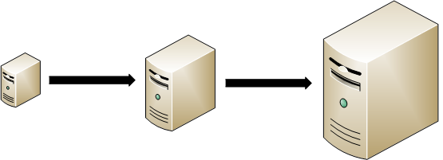
   
   show me the money!
   
Scale-Up의 단점은 명확하다.

-  가격대비 성능비가 점점 떨어진다.
-  무한히 확장할 수 없다.
-  장애에 취약하다. 아무리 좋은 서버라도 장애가 발생하면 서비스는 멈춘다.

대다수의 Vendor(HP, Dell 등)들은 소위 "표준 장비"라고 부르는 높은 가성비의 서버를 공급하고 있다. 
따라서 서버 사양을 고민하기보다는 경제성 있는 서버들에 어떻게 서비스를 입힐지 고민해야 한다.

.. _dist_scaleout:

Scale-Out
====================================

Scale-Out은 동일한 역할을 수행하는 (물리적으로 독립된) 서버를 추가하여 처리량을 높이는 것을 의미한다. 
수평적 확장이라고도 한다. 
여럿이 힘을 합쳐 문제를 해결하는 장점이 있을 뿐만 아니라 물리적인 고장에도 피해가 제한된다는 장점이 있다.

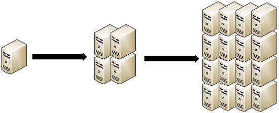
   
   양으로 승부한다.
   
부하를 균등하게 나누는 방법은 전통적으로 어려운 주제다. 
솔루션과 네트워크 2개의 관점이 존재하며 각각의 관점에 따라 부하의 형태도 달라진다. 

솔루션 관점에서의 부하는 목적이나 동작 방식에 매우 특화되어 있다.
따라서 분산방식도 공식적으로 제안/검증된 방식으로 운영되는 경우가 대부분이다.
데이터 베이스의 Sharding/Replication, Google의 Map & Reduce, Hadoop등이 대표적인 솔루션 분산이다.

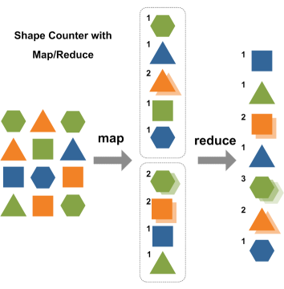
   
   `Google - Map & Reduce <http://www.eecs.berkeley.edu/~ballard/cs267.sp11/hw0/results/htmls/Muzaffar.html>`_
   
반면 네트워크 관점에서는 통신하는 대상(End-Point)이 부하(Load)다. 
DNS(Domain Name Service), L4/L7 Switch, GSLB(Global Service Load Balancer) 등 형태와 기능은 다르지만 통신하려는 대상을 물리적으로 적절히 분배(Balancing)해주는 목적은 같다고 볼 수 있다.

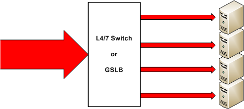
   
   End-Point를 나눈다.

.. _dist_network:

네트워크 캐시 분산
====================================
네트워크 관점에서는 부하를 대상(End-Point = 클라이언트)으로 정의한다. 
따라서 부하(=클라이언트)가 한 서버에 집중되지 않도록 클라이언트를 균등하게 캐시 서버로 분산시켜야 한다. 
L4/L7 Switch와 GSLB(Global Service Load Balancer)는 이런 역할에 적합한 Network Device이다. 
두 방식 모두 안정적일 뿐만 아니라 간단히 구성할 수 있어 엔터프라이즈 서비스에 널리 사용된다.

L4/L7 Switch 방식은 특정 네트워크 구간으로 유입되는 클라이언트들을 균등하게 캐시 서버들로 분산한다. 
캐시 서버에 장애가 발생해도 L4/L7 Switch가 장애 서버를 배제하기 때문에 안정적이다. 
간단한 RR(Round Robin) 방식만으로도 매우 효과적이다. 
`HA-Proxy <http://www.haproxy.org/>`_ 같은 오픈 소스 제품도 동일한 역할을 한다.

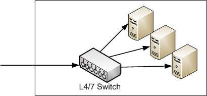
   
   LxSwitch는 세션을 골고루 분배한다.

GSLB 방식은 DNS(Domain Name Service)에 기반한다. 
이 방식은 Domain을 질의하는 클라이언트에게 GSLB가 캐시 서버 IP를 분산하여 제공(Resolving)한다. 
GSLB에는 전용 Health-Checker가 있어 장애 서버를 검출/배제하기 때문에 안정적이다. 
대표적인 제품은 F5사의 `BIG-IP <https://f5.com/products/big-ip>`_ 가 있다.

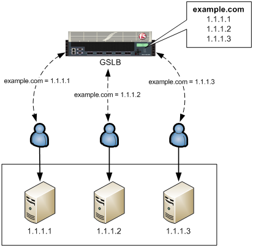
   
   GSLB는 IP를 골고루 분배한다.
   
이 2가지 방식은 절대적인 클라이언트 수를 서버로 골고루 분산 시킨다. 
결과적으로 모든 캐시 서버가 거의 유사한 컨텐츠를 저장하게 되는데 이는 Hit율이 높은 서비스에 매우 효과적이다. 
하지만 Hit율이 낮은 Long-tail 서비스의 경우에는 취약하다. 

.. note::

   캐시는 MISS상태의 컨텐츠에 대해 원본서버로 요청한다.
   서비스가 커지면서 MISS가 많아질수록 원본부하는 점점 상승한다.

.. _dist_cascade:

Cascade 캐시 분산
====================================
Cascade 방식(또는 2 Tier 구조)은 캐시의 특성을 이용해 원본부하를 낮춘다.
이 방식은 Edge 캐시 서버(2차 캐시)와 원본 사이에 Parent 캐시(1차 캐시) 서버를 추가로 둔다.
Edge캐시는 Parent로부터 캐싱하는데 이 때 Consistent Hashing 알고리즘으로 컨텐츠를 분산한다. ( :ref:`origin-balancemode` 참조)

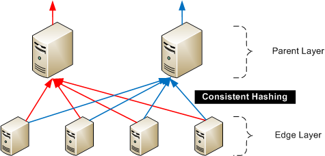
   
   알고리즘에 의해 Parent는 컨텐츠를 나누어 저장한다.
   
Parent 서버에 장애가 발생하면 다른 Parent로 부하가 몰릴 수 있다.
이런 경우 "보조 주소"를 사용하면 "보조 주소"가 장애난 Parent를 대체한다. ( :ref:`env-vhost-activeorigin` 참조)
하지만 보조 서버를 별도로 운영하는 것은 매우 번거롭기 때문에 원본 서버를 "보조 주소"로 설정하면 효과적이다. 
Parent가 다시 정상화되면 보조 주소는 사용하지 않는다. 

이 방식의 단점은 다음과 같다.

- Parent 서버가 추가 투입된다.
- Parent 서버의 역할이 컨텐츠 저장용으로 제한된다.

이상의 전통적인 분산 방식들은 캐시 외부 환경을 통해 분산 효과를 얻는 것이지 솔루션 차원의 분산은 아니다. 
따라서 명확한 한계가 존재하며 대형 서비스나 Long-tail 서비스를 구성하기엔 다소 아쉬움이 있다.

.. _dist_cache_cluster:

캐시 클러스터
====================================
클러스터는 같은 목적을 가지는 여러 개체를 묶어 하나의 단위로 만드는 것을 의미한다. 
캐시 클러스터(Cache Cluster)는 여러 캐시 서버들을 묶어 동일한 서비스를 제공하는 단위를 의미한다. 
("묶는다"의 의미는 대개 Domain에 대한 A 레코드로 등록함을 의미한다.) 
캐시 팜(Cache-Farm)과 유사하지만 캐시 팜은 관리 편의성을 위해 한데 모아 놓은 것임에 반해 캐시 클러스터는 여러 대로 동일한 서비스를 제공한다는 점에서 좀 더 전문화되어 있다.

   
   단순한 캐시 클러스터는 모두 같아지게 만든다.
   
"동일한 서비스"란 기술적으로 캐시 서버 설정이 같은 상태를 의미한다. 
즉, 캐시 클러스터는 같은 설정을 공유하는 캐시 서버들의 집합으로 볼 수 있으며 클러스터 분산은 이를 기반으로 동작한다. 
클러스터 분산의 장점은 캐시의 근본적인 부하를 나누어 처리하여 자원의 효율성을 극대화하는 것이다.

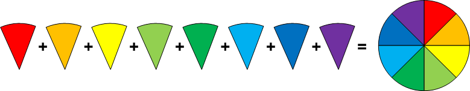
   
   스마트한 캐시 클러스터는 부하를 나눈다.
   
-  ``저장 공간`` 로컬 디스크 크기는 원본 컨텐츠를 모두 담기에 너무 부족하다.
-  ``원본 트래픽`` 캐시들끼리 컨텐츠를 나누어 저장하면 원본으로 요청할 필요가 없다.
-  ``이미지 변환 부하`` 같은 이미지는 캐시 클러스터 내에서 단 한번만 변환된다.
-  ``인증 정보`` 한 서버에서 인증되었다면 다른 서버에서도 인증 정보를 공유한다.

네트워크/Cascade 분산 방식은 캐시 외부 환경을 통해 분산 효과를 얻는 것이지 솔루션 차원의 분산은 아니다. 
따라서 명확한 한계가 존재하며 대형 서비스나 Long-tail 서비스를 구성하기엔 다소 아쉬움이 있다.

STON의 캐시 클러스터 분산은 앞서 언급한 부하들을 영리하게 분산한다. 
결과적으로 자원의 가용성은 높아지고 원본의 부하는 최소화된다.

.. _dist_conf_cluster:

클러스터 구성하기
====================================
클러스터는 IP기반으로 구성한다. 한 서버는 하나의 클러스터에만 참여할 수 있다. ::

   # server.xml - <Server>
   
   <Cluster Name="enterprise">
     <Participants>
       <IP Weight="10" Status="Active">1.1.1.1</IP>
       <IP>1.1.1.2</IP>
       <IP>1.1.1.3</IP>
     </Participants>
   </Cluster>
   
-  ``<Cluster>``

   ``Name`` 속성으로 클러스터를 정의한다. 
   같은 클러스터에 참여하는 서버들끼리는 ``Name`` 을 통해 같은 클러스터임을 확인한다. 
   하위에 단 하나의 ``<Participants>`` 를 가진다.
   
-  ``<Participants>``

   클러스터에 참여할 ``<IP>`` 주소를 명시한다. 
   ``<IP>`` 는 ``Weight (기본: 10)`` 와 ``Status (기본: Active)`` 속성을 가진다. 
   ``Weight`` 는 1~100까지 값을 가지며 상대적 분산 정도를 의미한다. 
   예를 들어 ``Weight`` 100인 서버는 ``Weight`` 10인 서버에 비해 10배 정도 부하를 더 받는다. 
   ``Status``가 Inactive인 경우 해당 IP는 분산에서 배제된다.
   
서버를 추가/삭제하여 클러스터를 확장/감축하려면 ``<Participants>`` 의 ``<IP>`` 목록을 다시 설정한다.

.. _dist_conf_vhost:

서비스 분산하기
====================================
클러스터는 서버 영역을 추상화할 뿐 분산은 가상 호스트를 기반으로 동작한다. ::

   # vhosts.xml - <Vhosts>
   
   <Vhost Name="example.com">
     <Clustering Method="none" />
   </Vhost>
   
-  ``<Clustering>`` 

   ``Method (기본: none)`` 속성을 통해 기본 분산 정책을 설정한다. 
   Bypass, Redirect, Cache 3가지 방식 중 하나를 지정할 수 있다.
   
``Method`` 속성이 Bypass라면 다른 캐시 서버로 바이패스 한다. 
A서버는 중간 Hop이외에 아무런 역할을 하지 않는다.

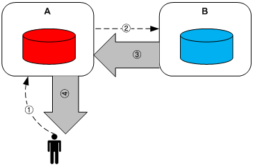
   
   Bypass 분산

``Method`` 속성이 Redirect라면 다른 서버로 Redirect(응답코드 = 302 Moved Temporary) 시킨다. 
클라이언트가 HTTP Redirect를 지원해야 한다.

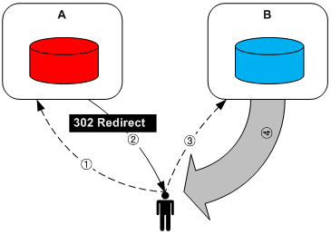
   
   Redirect 분산

``Method`` 속성이 Cache라면 다른 서버를 원본 서버로 사용한다. 
A서버는 B서버로부터 컨텐츠를 캐싱하고 TTL이 만료되기 전까지 해당 컨텐츠를 서비스한다. 
이 때 해당 컨텐츠에 대한 캐싱 정보가 같이 승계되어 캐시 클러스터 내에서 컨텐츠 유효성을 동일하게 만든다.

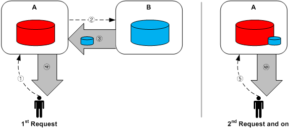
   
   Cache 분산
   
``Method`` 속성은 컨텐츠 전체에 대해 일괄적으로 분산 정책을 적용한다. 
하지만 좀 더 정교한 정책이 필요한 경우가 있다.

-  ``Method="Bypass"`` 특정 컨텐츠의 접근 빈도가 월등히 올라가면 해당 서버만 부하가 상승한다. 
   해당 컨텐츠에 대해서만 모든 서버가 캐싱하여 서비스하고 싶다.
   
-  ``Method="Cache"`` 빠른 응답 속도의 이미지 서비스를 구성했는데 일부 접근 빈도가 낮은 비디오가 저장 공간을 너무 많이 차지한다. 
   해당 비디오를 가진 서버로 클라이언트를 Redirect하고 싶다.
   
이런 경우에는 명시적인 분산 컨텐츠 목록을 설정한다. ::

   # vhosts.xml - <Vhosts>
   
   <Vhost Name="example.com">
     <Clustering ContentDistribution="OFF"/>
   </Vhost>

-  ``ContentDistribution (기본: OFF)``
   ``ON`` 이라면 /svc/{가상호스트 이름}/distribution.txt 를 참조하여 컨텐츠별 분산 정책을 적용한다.
   이 속성은 ``Method`` 보다 우선한다.

::

   # /svc/www.example.com/distribution.txt
   # 구분자는 콤마(,)이며 {조건},{키워드 = redirect | bypass | cache} 순서로 표기한다.

   /hotvideo/*, cache
   /vod/archive.mp4, redirect
   /query.jsp?type=1, bypass

   # 조건이 명시되지 않으면 해당 서버가 분산하지 않고 기존 캐싱처럼 처리한다.
   /*.css
   
정리하면 분산은 명시적으로 분산 컨텐츠 목록을 설정하거나 기본 ``Method`` 를 설정하면 활성화된다.

.. _dist_conf_fail_recover:

장애와 복구
====================================
클러스터 내 장애와 복구는 서비스 레벨이 아닌 클러스터 레벨에서 이루어진다. 
즉, 분산 기능 활성화 여부와 상관없이 ``<Cluster>`` 가 구성되면 자동으로 모든 ``<Participants>`` 들에 대해 Health-Checking을 수행한다. ::

   # server.xml - <Server>
   
   <Cluster Name="enterprise">
     <Participants> ... </Participants>
     <HealthChecker Timeout="3" Cycle="3" Exclusion="3" Recovery="5" Log="ON" />
     <Log Dir="/ston_log/cluster" Type="time" Unit="1440" Retention="10" Local="Off">ON</Log>
   </Cluster>

-  ``<HealthChecker>`` :ref:`origin-health-checker` 와 동일하다. 단, ``ResCode`` , ``URI`` 속성은 별도로 지정할 수 없다.
-  ``<Log>`` :ref:`admin-log-origin` 와 동일하다. 클러스터는 Origin로그가 없기 때문에 별도의 로그가 필요하다.

기본 Health-Checker의 장애 판단 조건 외에 다음 조건이 추가된다.

-  가상호스트의 서비스 포트에 접근되지 않는다. 
   서비스 포트가 80과 90이라면 이 중 한 포트만 접근이 실패도 해당 서버는 장애로 판단한다.
   
-  해당 포트를 서비스하는 가상호스트 목록이 일치하지 않는다. 
   A서버에 존재하는 가상호스트가 B서버에 없다면 장애로 판단한다.
   
-  ``<Cluster>`` ``Name`` 이 일치하지 않는다.

