.. _enterprise:

21장. 2-Tier 구조
****************************

이 장에서는 대규모 서비스에 적합한 **2-Tier** 구조에 대해 자세히 설명한다. 
대규모 서비스를 이해하기 위해서는  **HOT** & **COLD** 콘텐츠를 이해해야 한다.

-  **HOT** - 자주 서비스되며 Peak 시점 트래픽의 대부분을 차지한다.
-  **COLD** - 간헐적으로 서비스되지만 저장공간 대부분을 차지한다. (흔히 Long-tail이라고 부른다.)

대규모 E-Commerce나 동영상 서비스의 막대한 데이터 트래픽에는 **HOT** 과 **COLD** 가 혼재되어 있으며 이를 스토리지만으로 처리하는 것은 매우 어려운 문제이다.

-  스토리지 I/O 성능의 병목
-  스토리지 및 백엔드 증설비용
-  SPOP (Single Point Of Pain)
-  관리

캐시는 이런 문제에 아주 적합하다.
원본 스토리지 파일분포가 다음과 같다고 예를 들어 보자.

흔히 단순 캐싱만으로 아래와 같이 파일을 N등분으로 나누어 서비스하는 모습을 상상한다.

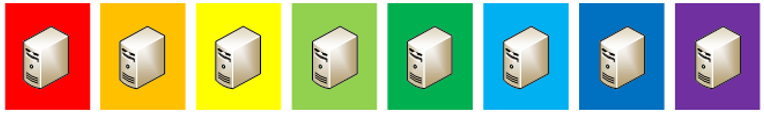

하지만 현실은 로드 밸런서의 균등분산(Round Robin)을 통해 모두 같은 콘텐츠를 서비스하게 된다.

이 경우 캐시효과는 매우 저하되어 스토리지 부하는 줄어들지 않는다.

.. note:

   Layer-7 로드 밸런서로 URL 라우팅을 구성하여도 특정 서버에 **HOT** 콘텐츠가 집중될 경우 트래픽 눌림 현상이 개선되지 않는다.

.. toctree::
   :maxdepth: 2

.. _enterprise-conf:

구성
====================================

대규모 서비스에서는 캐시를 2-Tier 구조로 두는 것이 효과적이다.

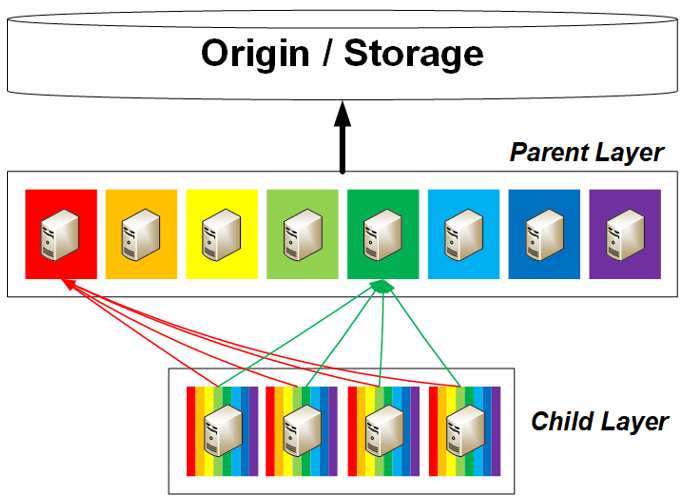

=================== ======================================= =================================
구분                 Parent Layer                             Child Layer
=================== ======================================= =================================
캐싱대상             COLD 콘텐츠                              HOT 콘텐츠
역할                 콘텐츠 분산저장, 스토리지 부하 절감                    콘텐츠 분산
증설시점             원본 콘텐츠 증가시점                      트래픽 증가시점
=================== ======================================= =================================

STON은 중앙집중 서버없이 구조와 설정만으로 문제를 해결한다. 

**Parent Layer** 는 단순하게 원본서버에서 캐싱하면 된다. ::

   # vhosts.xml - <Vhosts>

   <Vhost Name="parent-1.example.com">
      <Origin>
         <Address>storage.example.com</Address>
      </Origin>
      <Options>
         <IfRange Purge="ON">ON</IfRange>
      </Options>
   </Vhost>

-  :ref:`env-vhost-activeorigin`
-  :ref:`handling_http_requests_header_if_range`

**Child Layer** 에서는 **Parent Layer** 의 주소로 콘텐츠를 분산하도록 설정한다. ::

   # vhosts.xml - <Vhosts>

   <Vhost Name="www.example.com">
      <Origin>
         <Address>parent-1.example.com</Address>
         <Address>parent-2.example.com</Address>
         <Address>parent-3.example.com</Address>
         <Address>parent-4.example.com</Address>
      </Origin>
      <OriginOptions>
         <BalanceMode>Hash</BalanceMode>
      </OriginOptions>
   </Vhost>
   
-  :ref:`env-vhost-activeorigin`
-  :ref:`origin-balancemode`

설정은 간단하지만 매우 효과적으로 동작한다.
``<IfRange>`` 설정에 대해서는 `블럭캐싱과 데이터 무결성`_ 에서 자세히 다룬다.

.. _enterprise-block:

블럭캐싱과 데이터 무결성
====================================

웹과 같은 분산 시스템에서 완벽한 **무결성/정합성** 을 보장하는 것은 매우 어려운 일이다.
특히 HTTP 프로토콜만으로는 문제해결이 불가능하기 때문에 다양한 관점의 접근이 함께 이루어져야 한다.

HTTP 프로토콜은 ``Range`` 헤더를 통한 블럭 다운로드와 캐싱 메커니즘을 지원한다.  
따라서 ``Range`` 요청을 사용하는 시스템이라면 반드시 다음 3가지 사항을 준수해야 무결성/정합성을 보장할 수 있다.

-  **Client** - 최종 클라이언트 어플리케이션에서의 무결성 처리 메커니즘
-  **Caching Layer** - 계층 캐시에서의 무결성 보장 메커니즘 및 구성
-  **관리** - 컨텐츠 중심부터 바깥(Edge)쪽으로의 Purge 플로우

블럭캐싱이 필요한 이유
------------------------------------

게임 설치파일처럼 GB급의 대용량 파일을 전송하는 경우 한번의 다운로드로 파일을 완성하기는 쉽지 않다. 
이런 경우 클라이언트는 이어받기, 나누어 받기 등 다양한 방식으로 파일을 완성시키기 위해 노력한다.

만약 캐시서버가 블럭캐싱을 지원하지 않는다면, 아래 그림처럼 마지막 부분을 다운로드하려는 클라이언트는 오랫동안 대기하게 된다.

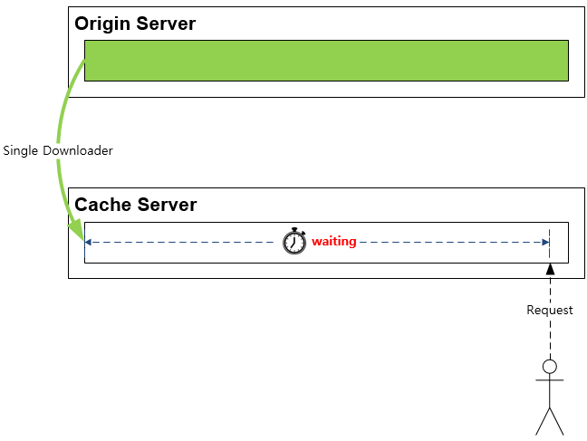

블럭캐싱은 이런 문제를 근본적으로 해결하여 빠른 반응성을 제공한다.

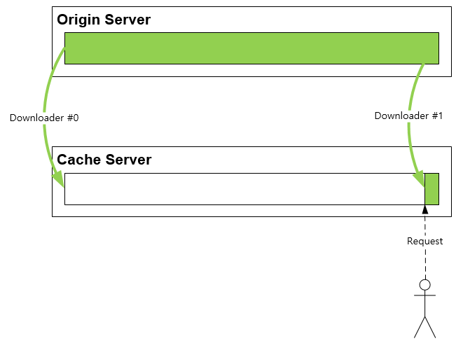

.. note:

   STON 캐싱엔진은 블럭캐싱 기반이다.

이어받기와 무결성
------------------------------------

단순한 웹서버와 HTTP 클라이언트의 1:1 관계에서도 무결성이 깨질 수 있다. 
다음은 클라이언트에서 다운로드를 잠시 멈춘 상황을 가정한다.

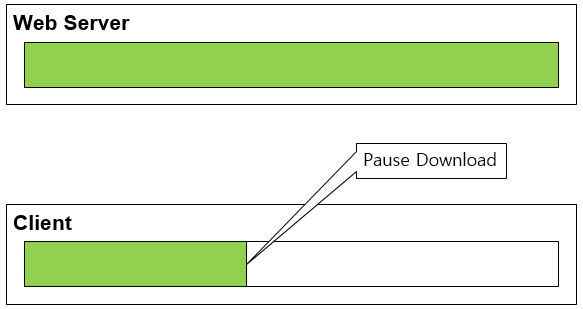

이 상태에서 웹서버의 파일이 변경되고 이어받기가 진행되면 무결성이 깨진다.

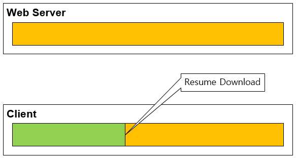

2대로 구성된 단순 분산 네트워크 환경일지도 피할 수 없는 문제로 프로토콜/어플리케이션 레벨에서 다루는 것이 일반적이다.

If-Range 헤더와 무결성
------------------------------------

HTTP에서는 `If-Range <https://developer.mozilla.org/ko/docs/Web/HTTP/Headers/If-Range>`_ 헤더를 통해 무결성 문제를 다루도록 권고하고 있다. 
앞서 다룬 이어 받기 시나리오에서 클라이언트는 ``If-Range`` 헤더를 명시하면 좀 더 유연한 대처가 가능하다. 

**1. Client** - ``Range`` 요청에 ``If-Range`` 헤더를 명시한다.

**2. Server** - ``If-Range`` 헤더를 통해 무결성 문제가 의심되면 ``206 Partial Content`` 응답 대신 ``200 OK`` 로 전체 파일을 전송한다.

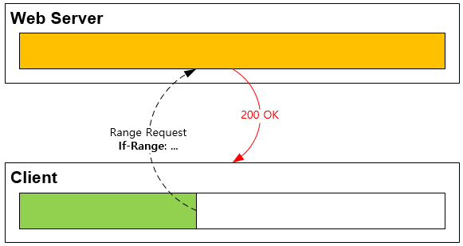

**3. Client** - 클라이언트는 이전 파일을 폐기한다. 웹서버의 ``200 OK`` 응답 세션으로 신규 다운로드를 진행한다.

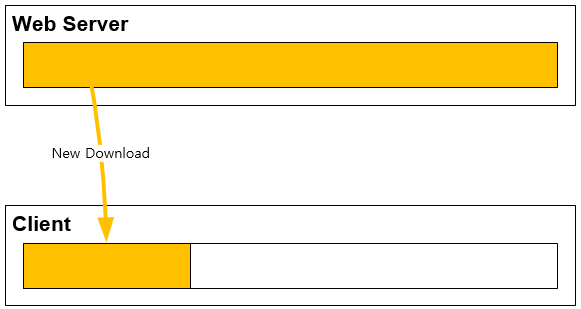

표준 브라우저에서는 ``If-Range`` 헤더 지원 상태는 다음과 같다. (2020년 4월 16일 기준)

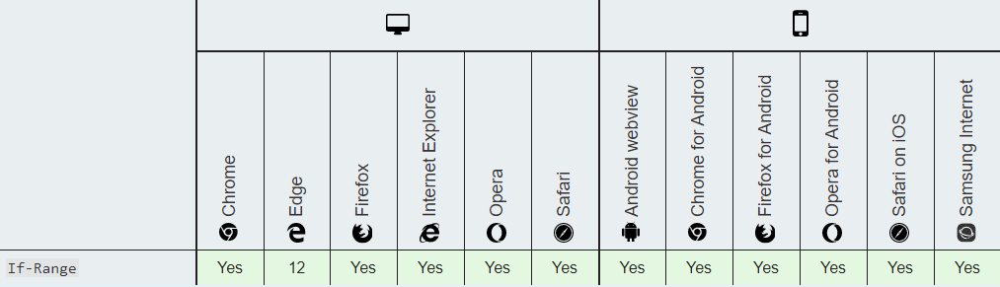

이어받기, 분할다운로드를 지원하는 전용 클라이언트라면 반드시 ``If-Range`` 스펙을 지원해야 무결성 문제를 해결해야 한다.

.. note:

   STON은 v2.5.14 (2018.4.26) 부터 ``If-Range`` 스펙을 지원한다.

계층 캐시구조의 문제
------------------------------------

엔터프라이즈 규모에서는 계층 캐시구조를 통해 스케일링 문제를 해결한다. 
각 계층은 서로 다른 목적을 가진다.

-  **1차/부모 캐시** - 컨텐츠를 분산하여 저장한다. 더 큰 저장공간을 가진다.

-  **2차/자식 캐시** - 클라이언트 요청을 처리한다. 더 빠른 성능을 가진다.

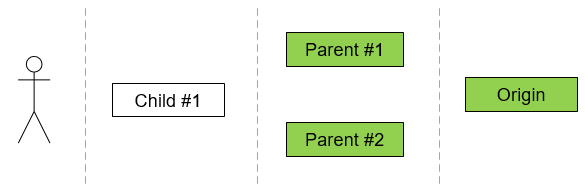

캐시는 상호독립적이므로 1차/부모 캐시에서 일시적인 컨텐츠 불일치가 발생할 수 있다.

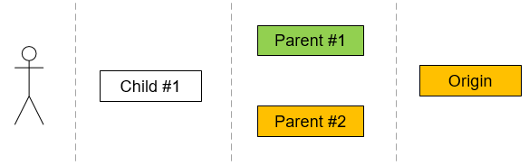

이 상태에서 2차/자식 캐시에서 컨텐츠 갱신이 발생할 경우 무결성 문제가 발생할 수 있다.

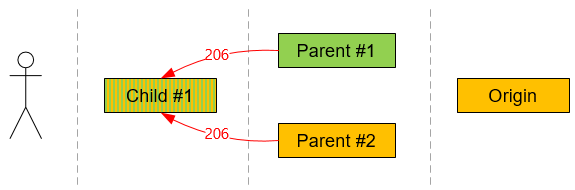

계층 캐시와 If-Range의 한계
------------------------------------

``If-Range`` 헤더는 컨텐츠 소비자인 엔드유저에서만 완벽히 동작한다. 
아래 그림은 2차/자식 캐시에서 이어받기를 진행하는 상황이다.

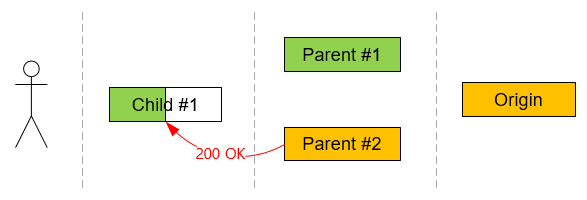

이 때 Child #1은 해당 컨텐츠를 폐기한다.

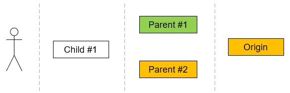

폐기가 이루어지더라도 다시 재개되는 상황에서 1차/부모 캐시의 컨텐츠 불일치 문제로 상황은 해결되지 않는다.

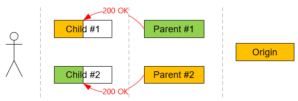

운좋게 컨텐츠가 완성될 수도 있지만 무한 루프에 빠질 수도 있다.

Zero TTL (Time To Live)
------------------------------------

근본적인 원인은 1차/부모 캐시의 컨텐츠 불일치 때문이다. 
이 상태가 유지되는 이유는 1차/부모 캐시가 TTL(Time To Live) 동안 원본서버의 갱신을 확인하지 않기 때문이다. 
다소 극단적인 것처럼 들릴지도 모르지만 1차/부모 캐시의 TTL을 0초로 설정하면 응답 전 원본서버의 변경여부를 확인할 수 있다.

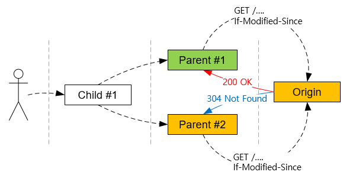

TTL이 0인 경우 1차/부모 캐시와 원본서버간에 1 트랜잭션 동안만 컨텐츠가 유효하다. 
즉 트랜잭션이 끝남과 동시에 컨텐츠는 즉시 만료된다. 
이후 다시 요청을 처리하기 위해서는 반드시 원본 갱신여부를 확인해야 한다. 
이 방식의 최대 단점은 원본 요청이 매우 많아진다는 점이다.

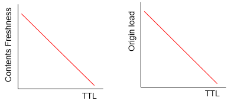

적절히 짧은 TTL은 무결성 문제의 빈도를 낮추며 원본 부하를 줄인다. 
관리자는 컨텐츠 신선도(Freshness)와 TTL 사이의 Trade-off 관계를 정확히 이해하고 설정해야 한다.

분산 계층과 STON의 Eventual Consistency
------------------------------------

앞서 논의된 모든 문제들은 비단 분산 캐시에만 국한된 문제는 아니다. 
계층 캐시는 분산 시스템의 한 종류이므로 분산 시스템의 정합성/무결성 처리 모델을 참조하는 것이 바람직하다. 
STON은 ``If-Range`` 헤더를 통해 최종 정합성(Eventual Consistency) 모델을 구현하여 문제를 해결한다. 
문제 상황은 다음 2가지이다.

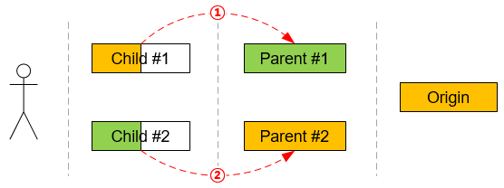

위 그림의 빨간색 요청이 발생하는 순간 무결성이 깨진다. 2가지 상황을 나누어 이해해야 한다.

먼저 ①번 상황에 대해 알아보자. 2차/자식 캐시가 1차/부모 캐시에 Range 요청을 보낼 때 If-Range 를 명시한다.

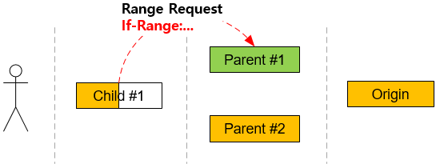

1차/부모 캐시는 2차/자식 캐시가 보내는 ``If-Range`` 를 검사해 자신보다 최신의 컨텐츠를 소유하고 있다면 스스로를 폐기한다. 
이는 2차/자식 캐시를 신뢰할 수 있다고 판단될 때만 할 수 있는 설정이다.

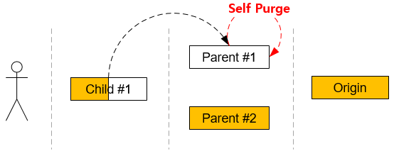

1차/부모 캐시는 원본 서버로부터 최신 컨텐츠로 갱신한다.

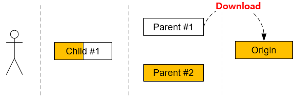

2차/자식 캐시는 1차/부모 캐시로부터 올바른 응답을 받게 된다.

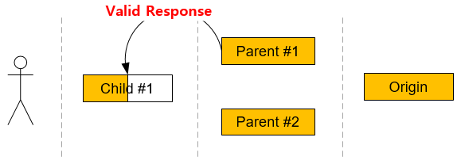

②번 상황은 보다 직관적이다. 
2차/자식 캐시가 1차/부모 캐시에 ``Range`` 요청을 보낼 때 ``If-Range`` 헤더를 명시한다.

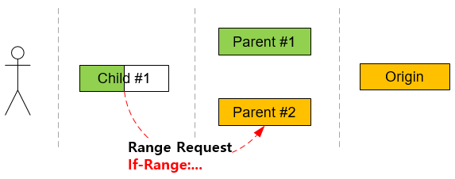

1차/부모 캐시는 2차/자식 캐시가 보내는 ``If-Range`` 를 검사해 자신이 최신의 컨텐츠를 소유하고 있다면 ``200 OK`` 로 응답한다.

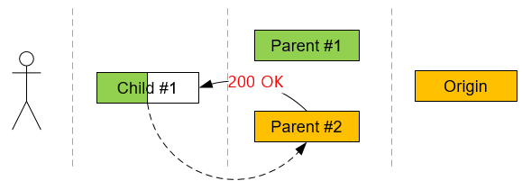

2차/자식 캐시는 ``If-Range`` 무결성 문제가 확인된 객체를 폐기하고 클라이언트 다운로드를 실패 시킨다. 
1차/부모 캐시가 보낸 ``200 OK`` 응답 세션을 통해 새로운 컨텐츠 캐싱을 시작한다.

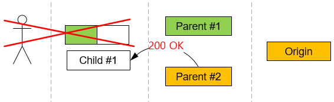

2차/자식 캐시는 최신 컨텐츠를 캐싱하게 된다. 이후 모든 클라이언트는 최신 컨텐츠를 제공 받는다.

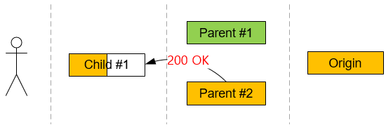

.. note:

   STON은 v2.7.3 (2020.3.25) 부터 관련 동작을 지원한다.

Purge 정책
------------------------------------

이상의 문제와는 별도로 원본 컨텐츠 변경 시점에 가장 명확한 관리방법은 Purge이다. 
단 계층 Purge에서는 주의할 점이 있다. 
반드시 1차/부모 캐시서버부터 Purge를 진행해 주어야 한다.

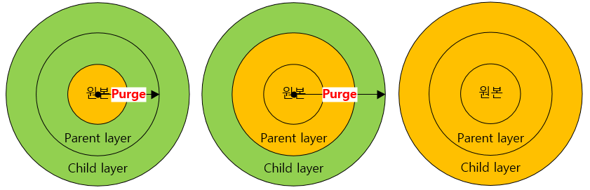

만약 2차/자식 캐시부터 Purge할 경우 2차/자식 컨텐츠를 갱신 시점에 1차/부모 캐시의 컨텐츠 갱신을 보장할 수 없어 무결성 문제가 발생할 수 있다.

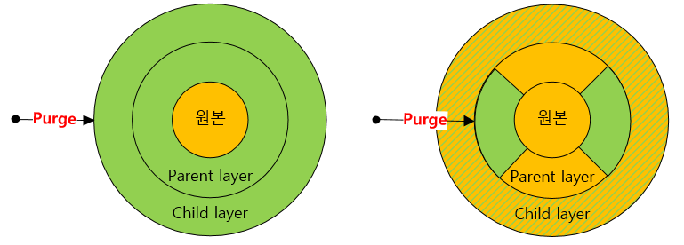
