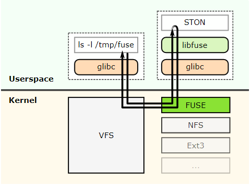
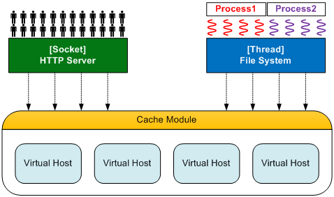
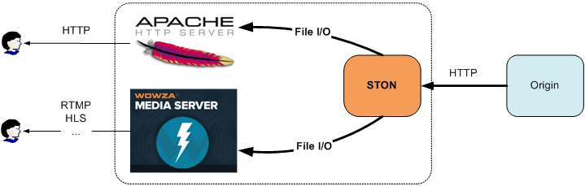
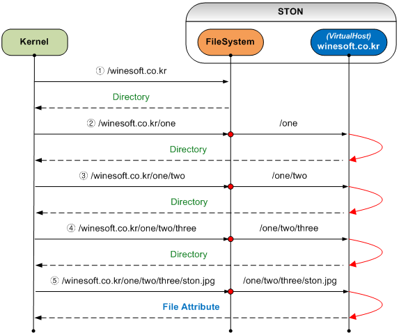
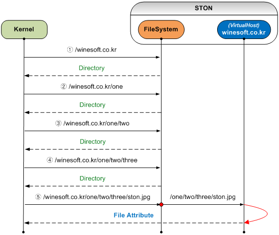
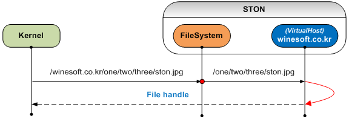
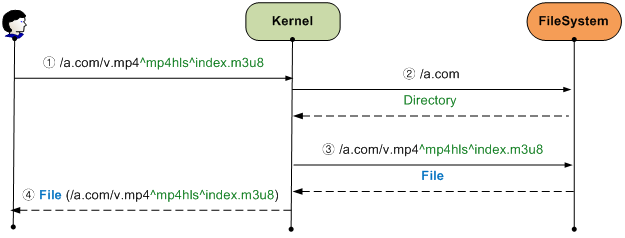

.. _filesystem:

18장. File System
******************

이 장에서는 STON을 로컬 디스크처럼 사용하는 방법에 대해 설명한다.
STON은 `FUSE <http://fuse.sourceforge.net/>`_ 를 기반으로 Linux VFS(Virtual File System)에 Mount된다.
Mount된 경로의 모든 파일은 접근되는 순간 Caching되지만 다른 프로세스는 이 사실을 알지 못한다.
**Caching기능이 탑재된 ReadOnly 디스크** 로 이해해도 좋다.

   `Fuse <http://upload.wikimedia.org/wikipedia/commons/0/08/FUSE_structure.svg>`_ 구조

구조상 File I/O 함수 호출을 Linux Kernel이 STON에게 직접 전달하는 과정에 어떠한 요소(물리적 파일 I/O 또는 Socket통신 등)도 개입하지 않는다.
이런 구조는 아주 높은 성능을 가능케 한다.
STON의 메모리 Caching을 통해 물리적 디스크 접근보다 뛰어난 성능을 기대할 수 있다.

.. toctree::
   :maxdepth: 2

Mount하기
====================================

전역설정(server.xml)에 설정한다. ::

   # server.xml - <Server><Cache>

   <FileSystem Mount="/cachefs" DotDir="OFF" Separator="^">OFF</FileSystem>

-  ``<FileSystem>``

   -  ``OFF (기본)`` 아무 것도 하지 않는다.

   -  ``ON`` STON을 ``Mount`` 속성의 경로에 Mount한다.

기존 HTTP 구조를 그대로 유지한 채 Cache 모듈에 접근하는 방식(File System)이 추가된 구조로 개발되었다.
그러므로 어느 쪽으로부터의 접근이든 Caching은 처음 한번만 이루어지며 HTTP 또는 File I/O로 서비스된다.
FileSystem은 Cache모듈에 접근하는 새로운 다리를 하나 더 놓은 것다.

   HTTP와 File I/O가 Cache모듈을 공유한다.

원본서버의 콘텐츠를 HTTP 뿐만 아니라 File I/O로 양쪽에서 접근할 수 있다.
이를 활용하면 로컬파일에 기반한 솔루션들의 가용성을 더 높일 수 있다.

   어떤 서버라도 OK

현재 STON File System이 지원하는 함수 목록은 다음과 같다.

========= =============== ===========
FUSE	  C	              LINUX
========= =============== ===========
open	  fopen	          open
release	  fclose	      close
read	  fseek, fread	  seek, read
getattr	  fstat	          stat
unlink	  remove	      unlink
========= =============== ===========

File I/O는 내부적으로 여러 단계를 거친다.
각 단계에 대한 이해가 바탕이 되어야 최고의 성능을 얻을 수 있다.

가상호스트 찾기
====================================

첫 번째 과정은 접근하려는 가상호스트를 찾는 것이다.
HTTP 요청에는 다음과 같이 Host헤더가 명시되어 있어 가상호스트를 쉽게 찾을 수 있다. ::

    GET /ston.jpg HTTP/1.1
    host: example.com

File System에서는 첫 번째 경로로 이 문제를 해결한다.
예를 들어 STON이 /cachefs 라는 경로에 Mount되어 있다면 로컬파일에 접근하기 위해서는
다음 경로를 사용해야 한다. ::

    /cachefs/example.com/ston.jpg

:ref:`env-vhost-find` 도 동일하게 동작한다.
example.com의 ``<Alias>`` 로 *.example.com이 지정되어 있다면 다음 접근은 모두 같은 파일을 가리킨다. ::

    /cachefs/example.com/ston.jpg
    /cachefs/img.example.com/ston.jpg
    /cachefs/example.example.com/ston.jpg

예를들어 Apache에서 example.com을 연동하기 위해서는 DocumentRoot를 /cachefs/example.com/로 설정해야 한다.

파일/디렉토리
====================================

가상호스트 별로 File System을 설정한다.
또는 기본 가상호스트를 통해 모든 가상호스트에 일괄설정 할 수 있다. ::

   # server.xml - <Server><VHostDefault><Options>
   # vhosts.xml - <Vhosts><Vhost><Options>

   <FileSystem Status="Active" DotDir="OFF">
      <FileTime>origin</FileTime>
      <FileStatus>200</FileStatus>
      <DirStatus>301, 302, 400, 401, 403</DirStatus>
      <Unlink>Purge</Unlink>
   </FileSystem>

-  ``<FileTime> (기본: Origin)``
   파일시간을 제공할 때 ``Origin`` 인 경우 원본에서 응답한 Last-Modified시간, ``Local`` 인 경우 로컬에 캐싱된 시간을 서비스한다.
   ( ``Origin`` 인 경우) 원본서버에서 Last-Modified시간을 주지 않은 경우 다음과 같이 Unix 초기시간으로 제공된다.

   .. figure:: img/fs_filetime.png
      :align: center

-  ``<FileSystem>``
   ``Status`` 속성이 ``Inactive`` 라면 File System에서 접근할 수 없다.
   `Active` 로 설정해야 한다.

-  ``<FileStatus> (기본: 200)``
   파일로 인식할 원본서버 HTTP 응답코드를 설정한다.
   일반적으로는 200만을 설정하지만 특별한 제약은 없다.

-  ``<DirStatus> (기본: 301, 302, 400, 401, 403)``
    디렉토리로 인식할 원본서버 HTTP 응답코드를 설정한다.
    기본 값으로 302, 400, 401, 403등이 설정된다.

-  ``<Unlink> (기본: Purge)``
   파일삭제 요청이 들어온 경우 동작방식 ``Purge`` , ``Expire`` , ``HardPurge`` 을 설정한다.

원본서버마다 HTTP 응답코드가 다양하게 해석될 수 있다.
그러므로 각각의 HTTP 응답코드 해석방식을 설정해야 한다.

대부분의 경우 원본서버에 존재하는 파일의 경우 **200 OK** 로 응답한다.
디렉토리 접근인 경우 **403 Forbidden** 응답이나 **302 Found** 로 다른 페이지로 Redirect시키기도 한다.
응답코드명을 comma(,)로 구분하여 설정하면 해당 HTTP 응답코드의 Body를 파일 또는 디렉토리로 인식한다.
설정되지 않은 응답코드에 대해서는 존재하지 않는 것으로 판단, File I/O가 실패한다.

파일속성
====================================

대부분 File I/O의 첫 번째 단계는 파일속성을 얻는 것이다.
파일을 open하기 전에 파일정보를 얻는 것은 당연한 순서다.
Kernel이 파일속성을 서비스하는 과정을 STON관점에서 보면 다음과 같다.
(/cachefs는 Mount경로이므로 Kernel이 생략한다.)

   파일속성을 얻는 과정

Linux의 경우 파일과 디렉토리를 별도로 구분하지 않는다.
그러므로 특정 파일속성을 얻는 과정이 생각보다 복잡하다.
위 그림에서도 알 수 있듯이 디렉토리가 깊으면 깊을수록 중간 과정의(=필요 없는) 가상호스트 검색과 파일 접근이 발생하여 성능이 저하된다.
특히 /one 또는 /one/two처럼 웹 서비스라면 접근되지도 않을 경로의 요청이 발생하여 원본서버 부하를 발생시킨다.
물론 Caching되면 TTL(Time To Live) 시간 동안 접근은 발생하지 않지만 아름답지 않은 것만은 분명한다.

이런 구조적 부하를 휴리스틱(Heuristic)하게 해결하기 위해 ``DotDir`` 속성을 추가하였다.
``DotDir`` 은 dot(.)이 요청된 경로에 없으면 디렉토리(Dir)로 인식하는 기능이다.
앞서 설명한 그림은 ``DotDir`` 이 ``OFF`` 인 상태이다.
``DotDir`` 이 ``ON`` 인 경우는 다음과 같이 동작한다.

   전역 ``DotDir`` 활성화( ``ON`` )

Kernel에서 호출되는 과정이나 회수에는 변함이 없다.
하지만 요청된 경로에 dot(.)이 없으면 가상호스트까지 가지 않고 즉시 디렉토리로 응답하기 때문에 꼭 필요한 부분에서만 가상호스트와 파일이 참조된다.
이 기능은 대부분의 프로그래머들이 파일에만 확장자를 부여하고 디렉토리에는 그렇지 않다는 것에 착안한 기능이다.
그러므로 사용하기 전에 디렉토리 구조에 대해 반드시 확인이 필요하다.

``<FileSystem>`` 은 ``DotDir`` 속성은 전역이다.
쉽게 말해 모든 가상호스트가 디렉토리에 dot(.)을 사용하지 않는다면 전역 ``DotDir`` 을 ``ON`` 으로 설정하시는 것이 아주 효과적이다.
물론 전역 ``DotDir`` 을 ``OFF`` 로 설정하고 가상호스트마다 별도로 설정할 수도 있다.
이 경우 다음 그림처럼 약간의 성능부하가 발생한다.

   가상호스트 ``DotDir`` 활성화( ``ON`` )

가상호스트 검색은 발생하지만 파일참조는 dot(.)이 있는 상태에서만 발생한다.
매우 빈번하게 호출되는 만큼 성능과 관련하여 반드시 이해할 것을 권장한다.

파일읽기
====================================

파일속성을 얻는 과정은 복잡하지만 정작 파일 읽기는 간단하다.
먼저 파일을 Open한다.
모든 파일은 당연히 ReadOnly이다.
Write권한의 파일 접근은 실패한다.
최초 파일이 접근되는 경우 HTTP와 마찬가지로 원본서버에서 파일을 Caching한다.
파일을 요청한 프로세스가 기다리지 않도록 다운로드를 진행하면서 동시에 File I/O 서비스가 이루어진다.

   파일 Open

이후 동작은 HTTP 서비스와 동일하다.
다만 HTTP의 경우 처음 결정된 Range에서 순차적(Sequential)인 파일접근이 발생하기 때문에 파일 전송에 유리한 면이 있다.
반면 File I/O의 경우 파일 크기와 상관없이 아주 작은 1KB단위의 read접근이 매우 많이 발생할 수 있다.
성능의 극대화를 위해 STON은 Cache모듈에 `Readahead <http://en.wikipedia.org/wiki/Readahead>`_ 를 구현했으며, 이를 통해 File I/O 성능을 극대화시켰다.

파일닫기(fclose등) 함수가 호출되거나 프로세스가 종료되는 경우 파일 handle은 Kernel에 의해 반납된다.
이는 HTTP 트랜잭션이 종료되는 것과 같다.

파일삭제
====================================
Caching된 파일은 STON에 의해 관리되지만 프로세스가 삭제요청을 보낼 수 있다.
STON은 다양한 :ref:`api-cmd-purge` 방법을 제공하고 있으므로 이런 요청에 쉽게 대응할 수 있다.

예를 들어 ``<Unlink>`` 가 ``expire`` 로 설정되어 있는 경우 파일삭제 요청에 대해 해당 파일을 expire하도록 동작한다.
Kernel에서 다시 해당 파일에 접근한다면 expire된 상태이므로 원본서버에서 변경여부를 확인한 뒤 변경되지 않았다면 해당 파일을 다시 서비스한다.

파일확장
====================================
HTTP의 경우 다음과 같이 URL을 이용하여 원본 파일을 동적으로 가공할 수 있다. ::

    # HTTP를 통해 /video.mp4의 0~60초 구간을 Trimming한다.
    http://www.example.com/video.mp4?start=0&end=60

이와 같은 QueryString방식은 HTTP와 File System 모두 호출규격을 동일하게 사용할 수 있다. ::

    # "/video.mp4의 0~60초 구간을 Trimming한" 로컬파일에 접근한다.
    /cachefs/www.example.com/video.mp4?start=0&end=60

하지만 MP4HLS나 DIMS처럼 원본 URL뒤에 가공옵션을 디렉토리 형식으로 명시하는 방식은 File I/O에 문제가 있다. ::

    /cachefs/image.winesoft.com/img.jpg/12AB/resize/500x500/
    /cachefs/www.winesoft.com/video.mp4/mp4hls/index.m3u8

"파일속성 얻기" 에서 설명한 바와 같이 LINUX는 경로 각 부분의 속성을 매번 물어본다.
STON관점에서는 현재 물어보는 경로 뒤에 추가 경로가 있는지 알 수 없기 때문에 가공되지 않은 파일을 서비스하게 된다.

이 문제를 극복하기 위해서 STON은 별도의 구분자로 ``<FileSystem>`` 의 ``Separator (기본: ^)`` 속성을 사용한다. ::

    /cachefs/image.winesoft.com/img.jpg^12AB^resize^500x500^
    /cachefs/www.winesoft.com/video.mp4^mp4hls^index.m3u8

   MP4HLS 접근

STON 내부에서는 ``Separator`` 를 slash(/)로 변경하여 HTTP와 동일한 호출규격을 사용한다.
이를 적극적으로 활용할 경우 다음과 같이 불필요 File I/O접근을 완전히 제거할 수 있다.

   극도로 최적화된 접근

Wowza 연동
====================================

File System을 이용해 손쉽게 Wowza를 연동할 수 있다.
STON이 Mount된 경로를 Wowza의 파일경로로 설정하는 것으로 모든 설정이 완료된다.

**1. [STON - 전역설정] 파일시스템 설정 ON**

  전역설정(server.xml)에 다음과 같이 ``<FileSystem>`` 을 ``ON`` 으로 설정한다.
  (예제에서는 Mount경로를 "/cachefs"로 설정한다.) ::

     # server.xml - <Server><Cache>

     <FileSystem Mount="/cachefs" DotDir="OFF" Separator="^">ON</FileSystem>

  또는 WM의 전역설정 - 파일시스템에서 다음과 같이 파일 시스템을 "사용한다"로 설정한다.

  .. figure:: img/faq_wowza1.png
     :align: center

     설정 후 반드시 STON을 재시작해야 Mount된다.

**2. [STON - 가상호스트] 파일시스템 접근허가 & 응답코드 설정**

  가상호스트의 파일시스템 접근을 Active시킨다.
  원본서버 응답코드에 따른 파일/디렉토리 판단정책도 설정한다.
  여기서는 가상호스트 기본 설정(server.xml)을 예로 설명하지만
  각각의 가상호스트(vhosts.xml)에서 개별적으로 설정할 수 있다. ::

     # server.xml - <Server><VHostDefault><Options>
     # vhosts.xml - <Vhosts><Vhost><Options>

     <FileSystem Status="Active" DotDir="OFF">
        <FileStatus>200</FileStatus>
        <DirStatus>301, 302, 400, 401, 403</DirStatus>
     </FileSystem>

  또는 WM의 가상호스트 - 파일시스템에서 다음과 같이 접근을 "허가한다"로 설정한다.

  .. figure:: img/faq_wowza2.png
     :align: center

     응답코드를 설정한다.

**3. [Wowza] Storage 경로 설정**

  Wowza설치경로 /Conf/Application.xml 파일을 다음과 같이 STON이 Mount된 경로를 바라보도록 편집한다. ::

     <Streams>
       <StreamType>default</StreamType>
       <StorageDir>/cachefs/example.com</StorageDir>
       <KeyDir>${com.wowza.wms.context.VHostConfigHome}/keys</KeyDir>
     </Streams>

**4. [Wowza] VOD 경로설정**

  Wowza설치경로 /Conf/vod/Application.xml 파일을 다음과 같이 STON이 Mount된 경로를 바라보도록 편집한다. ::

     <Streams>
       <StreamType>default</StreamType>
       <StorageDir>/cachefs/example.com</StorageDir>
       <KeyDir>${com.wowza.wms.context.VHostConfigHome}/keys</KeyDir>
     </Streams>

**5. 플레이어 테스트**

  Wowza 테스트 플레이어로 로컬에 존재하지 않는(=STON이 캐싱해야 하는) 영상을 RTMP로 재생한다.

  .. figure:: img/faq_wowza3.png
     :align: center

     테스트엔 적절한 영상이 필요합니다.
