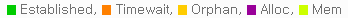
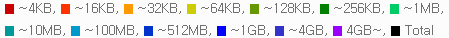
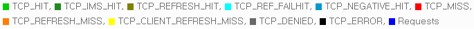

.. _api-graph:

Appendix A: Graph
******************

모든 MRTG통계는 PNG포맷 그래프로 제공된다. 
호출 규칙은 자원 뒤에 단위가 붙는 형식이다. ::

    # 5가지의 CPU 그래프 (dash, day, week, month, year)
    http://127.0.0.1:10040/graph/cpu_dash.png
    http://127.0.0.1:10040/graph/cpu_day.png
    http://127.0.0.1:10040/graph/cpu_week.png
    http://127.0.0.1:10040/graph/cpu_month.png
    http://127.0.0.1:10040/graph/cpu_year.png
    
모든 그래프는 5가지 타입으로 제공된다.

======= =========== =========== =============
타입    크기       시간단위     기간
======= =========== =========== =============
dash    205 X 175   5분         12시간
day     580 X 203   5분         2일 (48시간)
week    580 X 203   30분        2주 (14일)
month   580 X 203   2시간       7주
year    580 X 203   1일         18개월
======= =========== =========== =============

한 그래프에는 최소 1개에서 최대 3개의 선이 그려진다. 
Main 라인은 녹색, Sub 라인은 파란색으로 그려진다. 
또한 "Week" 그래프 이상부터는 Peak 라인이 제공된다. 
Peak 라인은 이전 단위에서 가장 큰 수치를 핑크색으로 그린다.

.. note:
   
   너무 많은 그래프를 동시에 그릴 경우 CPU사용량이 과도하게 높아져 서비스 품질저하가 발생할 수 있다. 
   이를 방지하기 위해 항상 한번에 하나의 그래프만 그리도록 관리한다.

.. toctree::
   :maxdepth: 2

.. _api-graph-global:

전역자원
====================================

전역자원 그래프는 시스템 상태 또는 STON과 관련된 자원들에 대해 서비스한다. 
아래 표에서 *는 타입(dash, day, week, month, year) 중 한 가지를 의미한다.

      
      
CPU 
---------------------
::

    /graph/cpu_*.png
    
-  ``Main`` Kernel + User
-  ``Sub`` Kernel

STON CPU
---------------------
::

    /graph/stoncpu_*.png
    
-  ``Main`` Kernel + User
-  ``Sub`` Kernel

메모리
---------------------
::

    /graph/mem_*.png
    
-  ``Main`` 전체 사용량
-  ``Sub`` STON 사용량

IO Wait 
---------------------
::

    /graph/iowait_*.png
    
-  ``Main`` IO Wait

Load Average 
---------------------
::

    /graph/loadavg_*.png
    
-  ``Main`` Load Average

서버소켓 이벤트 (클라이언트 -> STON)
---------------------
::

    /graph/ssockevent_*.png
    
-  ``Main`` Accepted
-  ``Sub`` Closed

서버소켓 사용량 (클라이언트 -> STON)
---------------------
::

    /graph/ssockusage_*.png
    
-  ``Main`` 전체
-  ``Sub`` Established

클라이언트소켓 이벤트 (STON -> 원본서버)
---------------------
::

    /graph/csockevent_*.png
    
-  ``Main`` Connected
-  ``Sub`` Closed

클라이언트소켓 사용량 (STON -> 원본서버)
---------------------
::

    /graph/csockusage_*.png
    
-  ``Main`` 전체
-  ``Sub`` Established

차단된 IP접근
---------------------
::

    /graph/acldenied_*.png
    
-  ``Main`` 차단된 클라이언트

이벤트 큐
---------------------
::

    /graph/eq_*.png
    
-  ``Main`` 이벤트 큐 길이

쓰기대기
---------------------
::

    /graph/wf2w_*.png
    
-  ``Main`` 쓰기 대기중인 파일개수

.. _api-graph-urlrewrite:

URL 전처리 성공
---------------------
::

    /graph/urlrewrite_*.png
    
-  ``Main`` 전처리된 URL 회수

TCP소켓
---------------------
::

    /graph/tcpsocket_*.png
    

      
.. _api-graph-vhost:

가상호스트
====================================

가상호스트 그래프는 전체 또는 개별 가상호스트의 상태에 대해 서비스한다. 
vhost파라미터를 이용하여 특정 가상호스트를 지정할 수 있으며, 
생략된 경우 전체 가상호스트의 합을 제공한다. ::

    http://127.0.0.1:10040/graph/vhost/mem_day.png?vhost=example.com
    
아래 표에서 *는 타입(dash, day, week, month, year) 중 한 가지를 의미한다.

히트율
---------------------
::

    /graph/vhost/hitratio_*.png
    
-  ``Main`` Request Hit Ratio
-  ``Sub`` Byte Hit Ratio

컨텐츠개수
---------------------
::

    /graph/vhost/filecount_*.png
    

콘텐츠 메모리
---------------------
::

    /graph/vhost/mem_*.png
    
-  ``Main`` 메모리에 적재된 콘텐츠 데이터량

삭제대기
---------------------
::

    /graph/vhost/wf2d_*.png
    
-  ``Main`` 삭제 대기중인 파일개수

클라이언트 바이패스
---------------------
::

    /graph/vhost/client_httpreq_bypass_*.png
    
-  ``Main`` 바이패스된 클라이언트 HTTP요청

클라이언트 요청차단
---------------------
::

    /graph/vhost/client_httpreq_denied_*.png
    
-  ``Main`` 차단된 클라이언트 요청

클라이언트 세션
---------------------
::

    /graph/vhost/client_http_session_*.png
    
-  ``Main`` 전체 클라이언트 세션
-  ``Sub`` 전송 진행 중인 클라이언트 세션

클라이언트 트래픽
---------------------
::

    /graph/vhost/client_traffic_*.png
    
-  ``Main`` Inbound
-  ``Sub`` Outbound

클라이언트 응답
---------------------
::

    /graph/vhost/client_http_res_*.png
    
-  ``Main`` 클라이언트 HTTP 응답회수
-  ``Sub`` 클라이언트 HTTP 요청회수

클라이언트 상세응답
---------------------
::

    /graph/vhost/client_http_res_detail_*.png
    

클라이언트 트랜잭션 완료
---------------------
::

    /graph/vhost/client_http_res_complete_*.png
    
-  ``Main`` 완료된 클라이언트 HTTP응답회수
-  ``Sub`` 클라이언트 HTTP 요청회수

클라이언트 응답시간
---------------------
::

    /graph/vhost/client_http_res_time1_*.png
    
-  ``Main`` 클라이언트 요청에 대한 HTTP 응답시간

클라이언트 완료시간
---------------------
::

    /graph/vhost/client_http_res_time2_*.png
    
-  ``Main`` 클라이언트 요청에 대한 HTTP 트랜잭션 완료시간

클라이언트 캐싱응답
---------------------
::

    /graph/vhost/client_http_res_hit_*.png
    

클라이언트 SSL트래픽
---------------------
::

    /graph/vhost/client_traffic_ssl_*.png
    
-  ``Main`` Inbound
-  ``Sub`` Outbound

원본서버 세션
---------------------
::

    /graph/vhost/origin_http_session_*.png
    
-  ``Main`` 전체 원본 세션
-  ``Sub`` 전송 진행 중인 원본 세션

원본서버 트래픽
---------------------
::

    /graph/vhost/origin_traffic_*.png
    
-  ``Main`` Inbound
-  ``Sub`` Outbound

원본서버 응답
---------------------
::

    /graph/vhost/origin_http_res_*.png
    
-  ``Main`` 원본 HTTP 응답회수
-  ``Sub`` 원본 HTTP 요청회수

원본서버 상세응답
---------------------
::

    /graph/vhost/origin_http_res_detail_*.png
    

원본서버 트랜잭션 완료
---------------------
::

    /graph/vhost/origin_http_res_complete_*.png
    
-  ``Main`` 완료된 원본서버 HTTP응답회수
-  ``Sub`` 원본서버 HTTP 요청회수

원본서버 응답시간
---------------------
::

    /graph/vhost/origin_http_res_time1_*.png
    
-  ``Main`` 원본서버에 보낸 요청에 대한  HTTP 응답시간

원본서버 완료시간
---------------------
::

    /graph/vhost/origin_http_res_time2_*.png
    
-  ``Main`` 원본서버에 보낸 요청에 대한 HTTP 트랜잭션 완료시간
