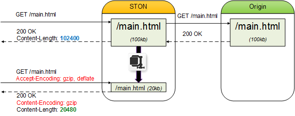

.. _handling_http_requests:

6장. HTTP 요청/응답
******************

이 장에서는 HTTP 클라이언트 세션과 요청을 처리하는 방식에 대해 설명한다.
서비스의 핵심기능으로 보기엔 어려운 내용들이 많으니 머리아파하지 않아도 된다.
일부 HTTP에 대한 이해가 없다면 어려울 수 있는 부분이 있는데 이럴 때는 기본설정을 사용하길 바란다.
전체적으로 기본 설정을 그대로 사용해도 서비스에는 전혀 지장이 없는 내용들이다.

.. note::

   - `[동영상 강좌] 해보자! STON Edge Server - Chapter 6. 압축 <https://youtu.be/GZ_NaK2yqk0?list=PLqvIfHb2IlKeZ-Eym_UPsp6hbpeF-a2gE>`_

.. toctree::
   :maxdepth: 2

.. _handling_http_requests_session_man:

세션관리
====================================

HTTP 클라이언트가 서버(STON)에 접속하면 HTTP 세션이 생성된다.
클라이언트는 HTTP 세션을 통해 서버에 저장된 여러 콘텐츠를 서비스 받는다.
요청부터 응답까지를 하나의 **HTTP 트랜잭션** 이라고 부른다.
HTTP 세션은 여러 HTTP 트랜잭션을 순차적으로 처리한다. ::

   # server.xml - <Server><VHostDefault><Options>
   # vhosts.xml - <Vhosts><Vhost><Options>

   <ConnectionHeader>keep-alive</ConnectionHeader>
   <ClientKeepAliveSec>10</ClientKeepAliveSec>
   <KeepAliveHeader Max="0">ON</KeepAliveHeader>

-  ``<ConnectionHeader> (기본: keep-alive)``
   클라이언트에게 보내는 HTTP응답의 Connection헤더( ``keep-alive`` 또는 ``close`` )를 설정한다.

-  ``<ClientKeepAliveSec> (기본: 10초)``
   클라이언트 세션과 아무런 통신이 없는 상태로 설정된 시간이 경과하면 세션을 종료한다.
   시간을 너무 길게 설정하면 통신을 하지 않는 세션이 지나치게 많아진다.
   너무 많은 세션을 유지하는 것만으로도 시스템엔 부하가 된다.

-  ``<KeepAliveHeader>``

   - ``ON (기본)`` HTTP응답에 Keep-Alive헤더를 명시한다.
     ``Max (기본: 0)`` 를 0보다 크게 설정하면 Keep-Alive헤더의 값으로 ``Max`` 값이 명시된다.
     이후 HTTP 트랜잭션이 발생할때마다 1씩 차감된다.

   - ``OFF`` HTTP응답에 Keep-Alive헤더를 생략한다.

HTTP 세션 유지정책
---------------------

STON은 가급적 Apache의 정책을 따른다.
특히 세션유지 정책은 HTTP헤더 값에 따른 변수가 많다.
HTTP 세션 유지정책에 영향을 주는 요소는 다음과 같다.

- 클라이언트 HTTP요청에 명시된 Connection헤더 ("Keep-Alive" 또는 "Close")
- 가상호스트 ``<Connection>`` 설정
- 가상호스트 세션 Keep-Alive시간 설정
- 가상호스트 ``<Keep-Alive>`` 설정

1. 클라이언트 HTTP요청에 "Connection: Close"로 명시되어 있는 경우 ::

      GET / HTTP/1.1
      ...(생략)...
      Connection: Close

   이같은 HTTP요청에 대해서는 가상호스트 설정여부와 상관없이
   "Connection: Close"로 응답한다. Keep-Alive헤더는 명시되지 않는다. ::

      HTTP/1.1 200 OK
      ...(생략)...
      Connection: Close

   이 HTTP 트랜잭션이 완료되면 HTTP 연결을 종료한다.

2. ``<ConnectionHeader>`` 가 ``Close`` 로 설정된 경우 ::

      # server.xml - <Server><VHostDefault><Options>
      # vhosts.xml - <Vhosts><Vhost><Options>

      <ConnectionHeader>Close</ConnectionHeader>

   클라이언트 HTTP요청과 상관없이 "Connection: Close"로 응답한다.
   Keep-Alive헤더는 명시되지 않는다. ::

      HTTP/1.1 200 OK
      ...(생략)...
      Connection: Close

3. ``<KeepAliveHeader>`` 가 ``OFF`` 로 설정된 경우 ::

      # server.xml - <Server><VHostDefault><Options>
      # vhosts.xml - <Vhosts><Vhost><Options>

      <ConnectionHeader>Keep-Alive</ConnectionHeader>
      <KeepAliveHeader>OFF</KeepAliveHeader>

   Keep-Alive헤더가 명시되지 않는다. HTTP 세션은 지속적으로 재사용가능하다. ::

      HTTP/1.1 200 OK
      ...(생략)...
      Connection: Keep-Alive

4. ``<KeepAliveHeader>`` 가 ``ON`` 으로 설정된 경우 ::

      # server.xml - <Server><VHostDefault><Options>
      # vhosts.xml - <Vhosts><Vhost><Options>

      <ConnectionHeader>Keep-Alive</ConnectionHeader>
      <ClientKeepAliveSec>10</ClientKeepAliveSec>
      <KeepAliveHeader>ON</KeepAliveHeader>

   Keep-Alive헤더가 명시된다.
   timeout값은 세션 Keep-Alive시간 설정을 사용한다. ::

      HTTP/1.1 200 OK
      ...(생략)...
      Connection: Keep-Alive
      Keep-Alive: timeout=10

   .. note::

      < ``<Keep-Alive>`` 와 ``<ClientKeepAliveSec>`` 의 관계 >

      ``<Keep-Alive>`` 설정시 ``<ClientKeepAliveSec>`` 를 참고하지만 ``<ClientKeepAliveSec>`` 는 보다 근본적인 문제와 관련이 있다.
      성능이나 자원적으로 가장 중요한 이슈는 Idle세션(=HTTP 트랜잭션이 발생되지 않는 세션)의 정리시점을 잡는 것이다.
      HTTP 헤더 설정은 동적으로 변경되거나 때로 생략될 수 있지만 Idle세션 정리는 훨씬 민감한 문제이다.
      이런 이유 때문에 ``<ClientKeepAliveSec>`` 는 ``<KeepAliveHeader>`` 에 통합되지 않고 별도로 존재한다.

5. ``<KeepAliveHeader>`` 의 ``Max`` 속성이 설정된 경우 ::

      # server.xml - <Server><VHostDefault><Options>
      # vhosts.xml - <Vhosts><Vhost><Options>

      <ConnectionHeader>Keep-Alive</ConnectionHeader>
      <ClientKeepAliveSec>10</ClientKeepAliveSec>
      <KeepAliveHeader Max="50">ON</KeepAliveHeader>

   Keep-Alive헤더에 max값을 명시한다.
   이 세션은 max회만큼 사용이 가능하며 HTTP 트랜잭션이 진행될때마다 1씩 감소된다. ::

      HTTP/1.1 200 OK
      ...(생략)...
      Connection: Keep-Alive
      Keep-Alive: timeout=10, max=50

6. Keep-Alive의 max가 만료된 경우 ::

   위의 설정대로 max가 설정되었다면 max는 점차 줄어 다음처럼 1까지 도달하게 된다. ::

      HTTP/1.1 200 OK
      ...(생략)...
      Connection: Keep-Alive
      Keep-Alive: timeout=10, max=1

   이 응답은 현재 세션으로 앞으로 1번 HTTP 트랜잭션진행이 가능하다는 의미이다.
   이 세션으로 HTTP 요청이 한번 더 진행될 경우 다음과 같이 "Connection: Close"로 응답한다. ::

      HTTP/1.1 200 OK
      ...(생략)...
      Connection: Close

클라이언트 Cache-Control
====================================

클라이언트 Cache-Control과 관련된 설정을 다룬다.

Age 헤더
---------------------

Age헤더는 캐싱된 순간부터 경과시간(초)을 의미하며
`RFC2616 - 13.2.3 Age Calculations <http://www.w3.org/Protocols/rfc2616/rfc2616-sec13.html#sec13.2.3>`_ 에 의하여 계산된다. ::

   # server.xml - <Server><VHostDefault><Options>
   # vhosts.xml - <Vhosts><Vhost><Options>

   <AgeHeader>OFF</AgeHeader>

-  ``<AgeHeader>``

   -  ``OFF (기본)`` Age헤더를 생략한다.

   -  ``ON`` Age헤더를 명시한다.

.. _handling_http_requests_cache_control_expires:

Expires 헤더
---------------------

Expires헤더를 재설정한다. ::

   # server.xml - <Server><VHostDefault><Options>
   # vhosts.xml - <Vhosts><Vhost><Options>

   <RefreshExpiresHeader Base="Access">OFF</RefreshExpiresHeader>

-  ``<RefreshExpiresHeader>``

   -  ``OFF (기본)`` 원본서버에서 응답한 Expires헤더를 클라이언트에게 명시한다.
      원본서버에서 Expires헤더가 생략되었다면 클라이언트 응답에도 Expires헤더가 생략된다.

   -  ``ON``  Expires조건을 반영하여 Expires헤더를 명시한다.
      조건에 해당하지 않는 콘텐츠는 ``OFF`` 설정과 동일하게 동작한다.

Expires조건은 Apache의 `mod_expires <http://httpd.apache.org/docs/2.2/mod/mod_expires.html>`_ 와 동일하게 동작한다.
특정 조건(URL이나 MIME Type)에 해당하는 콘텐츠의 Expires헤더와 Cache-Control 값을 설정할 수 있다.
Cache-Control의 max-age값은 설정된 Expires시간에서 요청한 시간을 뺀 값이 된다.

Expires조건은 /svc/{가상호스트 이름}/expires.txt에 설정한다. ::

   # /svc/www.exmaple.com/expires.txt
   # 구분자는 콤마(,)이며 {조건},{시간},{기준} 순서로 표기한다.

   $URL[/test.jpg], 86400
   /test.jpg, 86400
   *, 86400, access
   /test/1.gif, 60 sec
   /test/*.dat, 30 min, modification
   $MIME[application/shockwave], 1 years
   $MIME[application/octet-stream], 7 weeks, modification
   $MIME[image/gif], 3600, modification

-  **조건**

   URL과 MIME Type 2가지로 설정이 가능하다.
   URL일 경우 $URL[...]로, MIME Type일 경우 $MIME[...]로 표기한다.
   패턴표현이 가능하며 $표현이 생략된 경우 URL로 인식한다.

-  **시간**

   Expires만료시간을 설정한다.
   시간단위 표현을 지원하며 단위를 명시하지 않을 경우 초로 계산된다.

-  **기준**

   Expires만료시간의 기준시점을 설정한다.
   별도로 기준시점을 명시하지 않으면 Access가 기준시점으로 명시된다.
   Access는 현재 시간을 기준으로 한다.
   다음은 MIME Type이 image/gif인 파일에 대하여 접근시간으로부터
   1일 12시간 후로 Expires헤더 값을 설정하는 예제이다. ::

      $MIME[image/gif], 1 day 12 hours, access

   Modification은 원본서버에서 보낸 Last-Modified를 기준으로 한다.
   다음은 모든 jpg파일에 대하여 Last-Modified로부터 30분 뒤를
   Expires값으로 설정하는 예제이다. ::

      *.jpg, 30min, modification

   Modification의 경우 계산된 Expires값이 현재시간보다 과거의 시간일 경우 현재시간을 명시한다.
   만약 원본서버에서 Last-Modified헤더를 제공하지 않는다면 Expires헤더를 보내지 않는다.

.. note::

   ``#ORG_MAXAGE`` 키워드를 통해 원본서버가 응답한 Max-Age 값을 Expire 시간으로 사용할 수 있다. ::

      /stat.jpg, #ORG_MAXAGE
      /pds/*.dat, #ORG_MAXAGE, modification
      $MIME[application/shockwave], #ORG_MAXAGE
      $MIME[application/octet-stream], #ORG_MAXAGE, modification
      $MIME[image/gif], #ORG_MAXAGE, modification

   원본서버가 보낸 Max-Age가 없거나, 값이 0인 경우 Expire헤더를 붙이지 않는다.

   ``#TTL_LEFT`` 키워드를 통해 콘텐츠가 만료되는 시간을 Expires 헤더의 값으로 명시한다. 
   기준 설정이 ``access`` 인 경우에만 동작한다. ::

      /*, #TTL_LEFT, access

   원본서버가 보낸 Max-Age가 없거나, 값이 0인 경우 Expire헤더를 붙이지 않는다.

ETag 헤더
---------------------

클라이언트에게 보내는 HTTP응답에 ETag 헤더 명시여부를 설정한다. ::

   # server.xml - <Server><VHostDefault><Options>
   # vhosts.xml - <Vhosts><Vhost><Options>

   <ETagHeader>ON</ETagHeader>

-  ``<ETagHeader>``

   -  ``ON (기본)`` ETag헤더를 명시한다.

   -  ``OFF``  ETag헤더를 생략한다.

기본응답 헤더
====================================

.. _handling_http_requests_headers_originalheader:

헤더 캐싱
---------------------

성능과 보안상의 이유로 원본서버가 보내는 헤더 중 캐싱과 관련된 표준 헤더만을 선별적으로 인식한다. 

.. note::

   어떠한 경우라도 다음 헤더는 캐싱할 수 없다.
   
   -  ``cookie``
   -  ``set-cookie``
   -  ``set-cookie2``

원본이 응답하는 헤더를 캐싱하기 위해서는 추가 설정이 필요하다. ::

   # server.xml - <Server><VHostDefault><Options>
   # vhosts.xml - <Vhosts><Vhost><Options>

   <OriginalHeader Standard="OFF">OFF</OriginalHeader>

-  ``<OriginalHeader>``

   -  ``OFF (기본)`` 다음 헤더만을 캐싱한다.

      -  ``Cache-Control``
      -  ``Content-Disposition``
      -  ``Content-Encoding``
      -  ``Content-Length``
      -  ``Content-Type``
      -  ``Expire``
      -  ``Transfer-Encoding``
      -  ``Server``

   -  ``ON`` 위 목록 이외의 헤더를 캐싱한다. 
      
      -  ``Standard="OFF" (기본)`` 비표준 헤더만을 캐싱한다.

      -  ``Standard="ON"`` 비표준 헤더와 다음 목록의 헤더를 추가로 캐싱한다.

         -  ``Content-Language``
         -  ``Content-Location``
         -  ``Content-MD5``
         -  ``Proxy-Authenticate``
         -  ``Retry-After``
         -  ``TE``
         -  ``Trailer``
         -  ``Warning``
         -  ``WWW-Authenticate``

.. _handling_http_requests_basic_via:

Via 헤더
---------------------

클라이언트에게 보내는 HTTP응답에 Via 헤더 명시여부를 설정한다. ::

   # server.xml - <Server><VHostDefault><Options>
   # vhosts.xml - <Vhosts><Vhost><Options>

   <ViaHeader>ON</ViaHeader>

-  ``<ViaHeader>``

   - ``ON (기본)`` Via헤더를 다음과 같이 명시한다.
     ::

        Via: STON/2.0.0

   - ``OFF``  Via헤더를 생략한다.

Server 헤더
---------------------

클라이언트에게 보내는 HTTP응답에 Server 헤더 명시여부를 설정한다. ::

   # server.xml - <Server><VHostDefault><Options>
   # vhosts.xml - <Vhosts><Vhost><Options>

   <ServerHeader>ON</ServerHeader>

-  ``<ServerHeader>``

   -  ``ON (기본)`` 원본서버의 Server헤더를 명시한다.

   -  ``OFF``  Server헤더를 생략한다.

.. _handling_http_requests_header_if_range:

If-Range 헤더
---------------------

클라이언트가 보내는 Range요청의 If-Range헤더를 인식하여 처리한다. ::

   # server.xml - <Server><VHostDefault><Options>
   # vhosts.xml - <Vhosts><Vhost><Options>

   <IfRange Purge="OFF">OFF</IfRange>

-  ``<IfRange>``

   -  ``OFF (기본)`` If-Range헤더를 무시한다.

   -  ``ON`` If-Range헤더를 인식하여 Range 요청을 처리한다. 값이 유효하다면 ``206 Partial Content`` 로 응답한다. 아니라면 ``200 OK`` 로 응답한다.

``Purge (기본: OFF)`` 속성이 ``ON`` 인 경우 클라이언트가 보낸 Last-Modified 시간이 더 최근일 경우 캐싱된 컨텐츠를 Purge 한다.

.. note:

   2 Tier구성이라면 Parent Layer에서 반드시 활성화해주어야 무결성이 보장된다.

.. _handling_http_requests_header_lastmodifiedcheck:

If-Modified-Since 헤더 처리
------------------------------

클라이언트가 보내는 요청의 If-Modified-Since 헤더 처리정책을 설정한다. ::

   # server.xml - <Server><VHostDefault><Options>
   # vhosts.xml - <Vhosts><Vhost><Options>

   <LastModifiedCheck>exact</LastModifiedCheck>

-  ``<LastModifiedCheck>``

   -  ``exact (기본)`` 요청 대상의 Last-Modified 시간과 일치하는 경우에만 ``304 Not Modified`` 로 응답한다. 

   -  ``orlater`` 요청 대상의 Last-Modified 시간보다 일치하거나 큰 경우 ``304 Not Modified`` 응답한다.

.. _handling_http_requests_header_contentfreshness:

Content Freshness 판단정책
------------------------------

클라이언트 요청에 대해 ``304 Not Modified`` 응답 판단정책을 설정한다. ::

   # server.xml - <Server><VHostDefault><Options>
   # vhosts.xml - <Vhosts><Vhost><Options>

   <ContentFreshnessCheck>BOTH</ContentFreshnessCheck>

-  ``<ContentFreshnessCheck>``

   -  ``BOTH (기본)`` If-Modified-Since 또는 ETag 헤더 중 하나라도 같다면 동일 콘텐츠로 판단한다.

   -  ``LMT`` If-Modified-Since 만으로 동일 콘텐츠로 판단한다.

   -  ``ETAG`` ETag 만으로 동일 콘텐츠로 판단한다.

.. _handling_http_requests_modify_client:

클라이언트 요청/응답 헤더 변경
====================================

클라이언트 HTTP요청과 응답을 특정 조건에 따라 변경한다. ::

   # server.xml - <Server><VHostDefault><Options>
   # vhosts.xml - <Vhosts><Vhost><Options>

   <ModifyHeader FirstOnly="OFF">OFF</ModifyHeader>

-  ``<ModifyHeader>``

   -  ``OFF (기본)`` 변경하지 않는다.

   -  ``ON`` 헤더 변경조건에 따라 헤더를 변경한다.

헤더 변경시점을 정확히 이해하자.

-  **HTTP 요청헤더 변경시점**

   클라이언트 HTTP 요청을 최초로 인식하는 시점에 헤더를 변경한다.
   헤더가 변경되었다면 변경된 상태로 Cache 모듈에서 처리된다.
   단, Host헤더와 URI는 변경할 수 없다.

-  **HTTP 응답헤더 변경시점**

   클라이언트 응답 직전에 헤더를 변경한다.
   단, Content-Length는 변경할 수 없다.

헤더 변경조건은 /svc/{가상호스트 이름}/headers.txt에 설정한다.
헤더는 멀티로 설정이 가능하므로 조건과 일치한다면 모든 변경설정이 순차적으로 모두 적용된다.

최초 조건에만 변경을 원할 경우 ``FirstOnly`` 속성을 ``ON`` 으로 설정한다.
서로 다른 조건이 같은 헤더를 변경하는 경우 ``set`` 에 의해 Last-Win이 되거나 명시적으로 ``put`` ``append`` 할 수 있다. ::

   # /svc/www.example.com/headers.txt
   # 구분자는 콤마(,)이다.

   # 요청변경
   # {Match}, {$REQ}, {Action(set|put|append|unset)} 순서로 표기한다.
   $IP[192.168.1.1], $REQ[SOAPAction], unset
   $IP[192.168.2.1-255], $REQ[accept-encoding: gzip], set
   $IP[192.168.3.0/24], $REQ[cache-control: no-cache], append
   $IP[192.168.4.0/255.255.255.0], $REQ[x-custom-header], unset
   $IP[AP], $REQ[X-Forwarded-For], unset
   $HEADER[user-agent: *IE6*], $REQ[accept-encoding], unset
   $HEADER[via], $REQ[via], unset
   $URL[/source/*.zip], $REQ[accept-encoding: deflate], set
   $METHOD[POST], $REQ[host: sub.example.com], set

   # 응답변경
   # {Match}, {$RES}, {Action(set|put|append|unset)}, {condition} 순서로 표기한다.
   # {condition}은 특정 응답코드에 한하여 헤더를 변경할 수 있지만 필수는 아니다.
   $IP[192.168.1.1], $RES[via: STON for CDN], set
   $IP[192.168.2.1-255], $RES[X-Cache], unset, 200
   $IP[192.168.3.0/24], $RES[cache-control: no-cache, private], append, 3xx
   $IP[192.168.4.0/255.255.255.0], $RES[x-custom-header], unset
   $HEADER[user-agent: *IE6*], $RES[vary], unset
   $HEADER[x-custom-header], $RES[cache-control: no-cache, private], append, 5xx
   $URL[/source/*], $RES[cache-control: no-cache], set, 404
   /secure/*.dat, $RES[x-custom], unset, 200
   /*.mp4, $RES[Access-Control-Allow-Origin: example1.com], set
   /*.mp4, $RES[Access-Control-Allow-Origin: example2.com], put

{Match}는 IP, GeoIP, Header, URL 4가지로 설정이 가능하다.

-  **IP**

   $IP[...]로 표기하며 IP, IP Range, Bitmask, Subnet 네 가지 형식을 지원한다.

-  **GeoIP**

   $IP[...]로 표기하며 반드시 :ref:`access-control-geoip` 가 설정되어 있어야 한다.
   국가코드는 `ISO 3166-1 alpha-2 <http://en.wikipedia.org/wiki/ISO_3166-1_alpha-2>`_ 와 `ISO 3166-1 alpha-3 <http://en.wikipedia.org/wiki/ISO_3166-1_alpha-3>`_ 를 지원한다.

-  **Header**

   $HEADER[Key : Value]로 표기한다.
   Value는 명확한 표현과 패턴을 지원한다.
   Value가 생략된 경우에는 Key에 해당하는 헤더의 존재유무를 조건으로 판단한다.

-  **URL**

   $URL[...]로 표기하며 생략이 가능하다. 명확한 표현과 패턴을 인식한다.

-  **METHOD**

   $METHOD[...]로 표기하며 GET, POST, HEAD, OPTIONS 중 하나만 명시적으로 지정한다.

{$REQ}와 {$RES}는 헤더변경 방법을 설정한다.
``set`` ``put`` ``append`` 의 경우 {Key: Value}로 설정하며,
Value가 입력되지 않은 경우 빈 값("")이 입력된다.
``unset`` 의 경우 {Key}만 입력한다.

{Action}은 ``set`` , ``put`` , ``append`` , ``unset``  4가지로 설정이 가능하다.

-  ``set``  요청/응답 헤더에 설정되어 있는 Key와 Value를 헤더에 추가한다.
   이미 같은 Key가 존재한다면 이전 값을 덮어쓴다.

-  ``put``  ( ``set`` 과 유사하나) 같은 Key가 존재하면, 덮어쓰지 않고 새로운 라인으로 붙여 넣는다.

-  ``append`` ( ``set`` 과 유사하나) 같은 Key가 존재하면, 기존의 Value와 설정된 Value사이에 Comma(,)로 구분하여 값을 결합한다.

-  ``unset`` 요청/응답 헤더에 설정되어 있는 Key에 해당하는 헤더를 삭제한다.

{Condition}은 200이나 304같은 구체적인 응답 코드외에 2xx, 3xx, 4xx, 5xx처럼 응답코드 계열조건으로 설정한다.
{Match}와 일치하더라도 {Condition}과 일치하지 않는다면 변경이 반영되지 않는다.
{Condition}이 생략된 경우 응답코드를 검사하지 않는다.

클라이언트가 보낸 헤더의 값은 $REQ. ``header-name`` 로 참조한다. 
이를 이용해 클라이언트가 보낸 헤더 값을 응답 헤더와 원본 요청 헤더에 명시할 수 있다. ::

   # 응답변경 - 클라이언트 헤더 참조
   # 클라이언트가 보낸 요청의 Origin헤더 값을 응답의 Access-Allow-Control-Origin 헤더 값으로 설정한다.
   $URL[*.html], $RES[Access-Allow-Control-Origin: $REQ.Origin], Set

   # 클라이언트가 보낸 요청의 여러 헤더 값을 응답의 X-Cookie 헤더 값으로 설정한다.
   $URL[*.json], $RES[X-Cookie: $REQ.[User-Agent, Host]], Set

특수 목적의 예약어를 지원한다.

========================== =============================================================
예약어                     설명
========================== =============================================================
``#PROTOCOL``              클라이언트가 요청한 프로토콜. ``http`` 또는 ``https``
``#PORT``                  클라이언트가 접속한 포트. ``80`` , ``443`` 등
``#CACHEHIT``              :ref:`adv_topics_req_hit_ratio` 의 상세코드
``#SESSIONID``             :ref:`admin-log-access` 의 ``session-id``
``#HOSTNAME``              호스트 이름
========================== =============================================================
   
::

   $URL[*], $REQ[X-Forwarded-Proto: #PROTOCOL], set
   $URL[*], $REQ[X-Forwarded-Port: #PORT], set
   $URL[*], $ORGREQ[X-Client-Forwarded-Port: #PORT], set
   $URL[*], $RES[X-Cache-Result: #CACHEHIT], set
   $URL[*], $RES[X-Cache-Sessionid: #SESSIONID], set
   $URL[*], $RES[X-Cache-Hostname: #HOSTNAME], set

.. _handling_http_requests_compression:

압축
====================================
원본의 결과를 콘텐츠를 압축하여 전송한다.
:ref:`caching-policy-accept-encoding` 에 따라 콘텐츠를 구분하도록 설정되어 있어야 한다. ::

   Accept-Encoding: gzip, deflate

   비압축 파일을 실시간으로 압축하여 전송한다.

::

   # server.xml - <Server><VHostDefault><Options>
   # vhosts.xml - <Vhosts><Vhost><Options>

   <Compression GzipLevel="6" BrotliQuality="11" BrotliWindow="22" SourceSize="2-2048">OFF</Compression>

-  ``<Compression>``

   -  ``OFF (기본)`` 압축 기능을 사용하지 않는다.

   -  ``ON`` 압축 기능을 사용한다. 다음 속성을 지원한다.

      -  ``GzipLevel (기본: 6)`` gzip 알고리즘 압축 단계를 1~9 범위에서 지정한다. 숫자가 작을수록 빠르지만 압축률이 나쁘고, 클수록 느리지만 압축률이 좋다.
      -  ``BrotliQuality (기본: 11)`` brotli 알고리즘 압축 단계를 0~11 범위에서 지정한다. `BrotliEncoderParameter 참고 <https://brotli.org/encode.html#a9a8>`_ 
      -  ``BrotliWindow (기본: 22)`` brotli 슬라이딩 LZ77 윈도우 크기를 10~24 범위에서 지정한다. `BrotliEncoderParameter 참고 <https://brotli.org/encode.html#a9a8>`_ 
      -  ``SourceSize (기본: 2-2048, 단위: KB)`` 원본 크기를 범위로 지정한다. 너무 작은 파일은 압축률이 떨어진다. 반대로 너무 큰 파일은 과도하게 CPU를 점유할 수 있다.

압축된 콘텐츠는 원본과 다른 콘텐츠로 인식/캐싱되며, 동일한 요청에 대해 다시 압축되지 않는다.

압축 대상은 /svc/{vhost}/compression.txt 에 지정한다. 정의된 순서대로 적용된다. ::

   # /svc/www.example.com/compression.txt
   # 압축대상 파일 또는 * 패턴을 지정한다.

   /sample.css
   /svc/packages/*.xml

압축은 CPU자원을 많이 소모하는 기능이다.
다음은 파일 크기별 GZIP(Level: 9) 성능 테스트 결과이다.

-  ``OS`` CentOS 6.3 (Linux version 2.6.32-279.el6.x86_64 (mockbuild@c6b9.bsys.dev.centos.org) (gcc version 4.4.6 20120305(Red Hat 4.4.6-4) (GCC) ) #1 SMP Fri Jun 22 12:19:21 UTC 2012)
-  ``CPU`` `Intel(R) Xeon(R) CPU E5-2603 0 @ 1.80GHz (8 processors) <http://www.cpubenchmark.net/cpu.php?cpu=Intel%20Xeon%20E5-2603%20@%201.80GHz>`_
-  ``RAM`` 8GB
-  ``HDD`` SAS 275GB X 5EA

======================= ========== ======== ============== ========================= ==================
크기                    압축률(%)  처리량   응답속도(ms)   클라이언트 트래픽(Mbps)   원본 트래픽(Mbps)
======================= ========== ======== ============== ========================= ==================
1KB                     26.25      5288     6.72           40.58                     55.02
2KB                     57.45      5238     7.20           41.52                     97.58
4KB                     76.94      5236     7.18           42.44                     184.04
8KB                     87.61      5021     7.53           41.87                     337.80
16KB                    93.32      4608     8.30           41.19                     616.83
32KB                    96.26      3495     13.55          34.53                     924.22
64KB                    97.79      1783     24.50          20.71                     938.83
bootstrap.css(20KB)     86.87      3944     9.67           83.79                     638.25
bootstrap.min.js(36KB)  73.00      1791     51.50          139.00                    514.86
======================= ========== ======== ============== ========================= ==================

``<Compression>`` 이 활성화되어 있다면 원본 서버로 비압축 콘텐츠만을 요청한다.
비압축 콘텐츠란 원본 서버에 Accept-Encoding헤더를 명시하지 않고 보냈을 때의 응답을 의미한다.
만약 원본 서버가 비압축 콘텐츠 요청에 대해 Content-Encoding 헤더를 명시했다면 이미 압축된 것으로 간주하여 다시 압축하지 않는다.

.. _handling_http_requests_custom_error_page:

커스텀 에러페이지
====================================

원본통신 장애등으로 인해 정상적인 서비스가 불가능한 경우 미리 정의된 에러페이지를 제공한다. ::

   # server.xml - <Server><VHostDefault><Options>
   # vhosts.xml - <Vhosts><Vhost><Options>

   <ErrorPage ResCode="0">/usr/local/ston/error.html</ErrorPage>

-  ``<ErrorPage>`` 원본장애 발생시 설정된 파일을 에러페이지로 제공한다. 

   -  ``ResCode (기본: 0)`` 에러페이지의 HTTP 응답코드. 0인 경우 STON의 에러코드가 제공된다.

.. _handling_http_requests_http2:

HTTP/2
====================================

전역설정으로 HTTP/2를 활성화할 수 있다. ::

   $ server.xml - <Server><Cache>

   <Http2 Status="Inactive">
      <MaxConcurrentStream>10</MaxConcurrentStream>
      <ClientKeepAlive>10</ClientKeepAlive>
   </Http2>

-  ``MaxConcurrentStream`` 단일 HTTP2 세션으로 진행가능한 HTTP Stream의 최대 개수
-  ``ClientKeepAlive`` HTTP 세션의 Keep-Alive 시간

HTTP/2는 동적 리로딩이 지원되지 않는다. 설정 변경 후 반드시 재가동 해주어야 한다.

.. note::

   HTTP/2가 활성화되면 통계 수집시점이 Payload가 송/수신 되는 어플리케이션으로 변경된다.
   따라서 아래의 이유로 통계 집계 시 약간의 오차가 발생할 수 있다.

   -  ``HTTP/2`` HPACK과 멀티 Stream 처리 방식
   -  ``TLS`` 에서의 멀티 프로토콜 ``HTTP/1.1``, ``HTTP/2`` 수용

