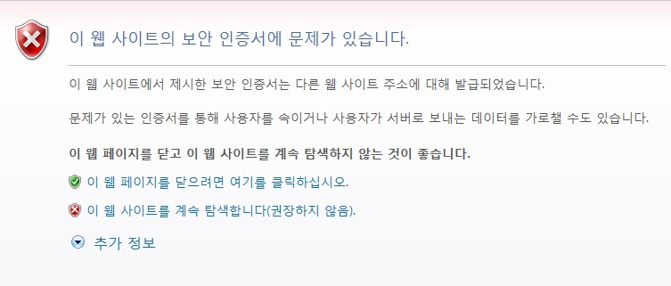
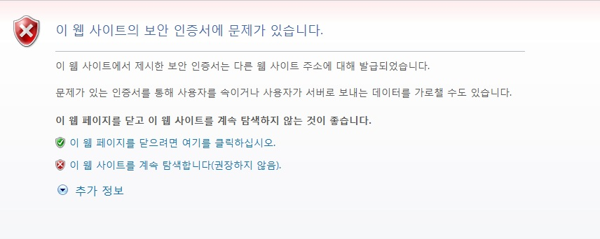
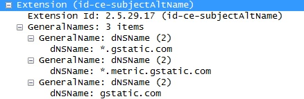
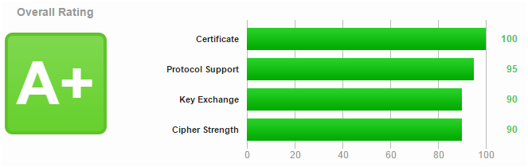

.. _https:

9장. HTTPS
******************

이 장에서는 HTTPS 구성에 대해 설명한다.
TLS 1.2까지 지원하며 SSL 2.0은 보안상의 이유로 업그레이드만 허용한다.
HTTPS는 클라이언트와 STON구간에서만 사용된다.
STON은 원본서버와 HTTPS로 통신하지 않는다.
왜냐하면 보안적으로나 성능적으로 STON이 HTTPS를 중계하는 것은 적절하지 않기 때문이다.
만약 원본서버와 반드시 HTTPS로 통신해야 한다면 :ref:`bypass-port` 를 권장한다.

.. toctree::
   :maxdepth: 2

서비스 구성
====================================

별도의 IP 또는 포트를 지정하지 않는 경우 기본으로 바인딩되는 서비스 주소는 "*:443" 이다.
전역설정(server.xml)에 설정한다. ::

   # server.xml - <Server>

   <Https>
      <Cert>/usr/ssl/cert.pem</Cert>
      <Key>/usr/ssl/certkey.pem</Key>
      <CA>/usr/ssl/CA.pem</CA>
   </Https>

   <Https Listen="1.1.1.1:443">
      <Cert>/usr/ssl_ip_port/cert.pem</Cert>
      <Key>/usr/ssl_ip_port/certkey.pem</Key>
      <CA>/usr/ssl_ip_port/CA.pem</CA>
   </Https>

   <Https Listen="*:886">
      <Cert>/usr/ssl_port/cert.pem</Cert>
      <Key>/usr/ssl_port/certkey.pem</Key>
      <CA>/usr/ssl_port/CA.pem</CA>
   </Https>

-  ``<Https>`` HTTPS를 구성한다.

   -  ``<Cert>`` 서버 인증서

   -  ``<Key>`` 서버 인증서의 개인키. 암호화된 형식은 지원하지 않는다.

   -  ``<CA>`` CA(Certificate Authority) 체인 인증서

같은 Port를 서비스하더라도 보다 명확한 표현이 우선한다.

예를 들어 위 예제처럼 NIC가 여러 개인 경우 1.1.1.1:443으로 들어온 클라이언트는
명시적 표현인 2번째(1.1.1.1:443) 인증서로 서비스되며 1.1.1.4:443으로 들어온
클라이언트는 일반적 표현인 1번째(생략 또는 *:443) 인증서로 서비스된다.
인증서파일을 같은 이름으로 덮어쓰기 하여도 Reload할 때 반영된다.

.. note::

   인증서 포맷은 PEM(Privacy Enhanced Mail), 비대칭키 알고리즘은 RSA만 지원한다.

.. _https-aes-ni:

SSL/TLS 가속
====================================

CPU(AES-NI)를 통해 SSL/TLS를 가속한다.
AES-NI를 지원하는 CPU인 경우 SSL/TLS에서 AES알고리즘을 우선적으로 사용하도록 동작한다.
AES-NI가 인식된 경우 다음과 같이 Info.log에 기록된다. ::

   AES-NI : ON (SSL/TLS accelerated)

관리자가 AES-NI 사용여부를 선택할 수 있다. ::

   # server.xml - <Server><Cache>

   <AES-NI>ON</AES-NI>

-  ``<AES-NI> (기본: ON)`` AES-NI 사용여부를 선택한다.

.. _https-ciphersuite:

CipherSuite 선택
====================================

지원하는 CipherSuites는 다음과 같다.

================================================ ======== =========== =======
Cipher Suite                                     TLS1.2   TLS1.1/1.0  SSL3.0
================================================ ======== =========== =======
TLS_ECDHE_RSA_WITH_AES_128_GCM_SHA256	(0xc02F)   O
TLS_ECDHE_RSA_WITH_AES_128_CBC_SHA256	(0xC027)   O
TLS_ECDHE_RSA_WITH_AES_256_CBC_SHA (0xC014)      O        O
TLS_ECDHE_RSA_WITH_AES_128_CBC_SHA (0xC013)      O        O
TLS_RSA_WITH_AES_128_GCM_SHA256	(0x009C)         O
TLS_RSA_WITH_AES_256_CBC_SHA256	(0x003D)         O
TLS_RSA_WITH_AES_128_CBC_SHA256	(0x003C)         O
TLS_RSA_WITH_AES_256_CBC_SHA (0x0035)            O        O
TLS_RSA_WITH_AES_128_CBC_SHA (0x002F)            O        O
TLS_RSA_WITH_3DES_EDE_CBC_SHA (0x000A)           O        O
TLS_RSA_WITH_RC4_128_SHA (0x0005)                                     O
TLS_RSA_WITH_RC4_128_MD5 (0x0004)                                     O
================================================ ======== =========== =======

``<Https>`` 의 ``CipherSuite`` 속성을 사용하면 사용할 CipherSuite를 설정할 수 있다. ::

   # server.xml - <Server>

   <Https CipherSuite="ALL:!ADH:RC4+RSA:+HIGH:+MEDIUM:+LOW:+SSLv2:+EXP">
      <Cert>/usr/ssl/cert.pem</Cert>
      <Key>/usr/ssl/certkey.pem</Key>
      <CA>/usr/ssl/CA.pem</CA>
   </Https>

-  ``CipherSuite`` `Apache mod_ssl의 SSL CipherSuite표현 <http://httpd.apache.org/docs/2.2/mod/mod_ssl.html#sslciphersuite>`_ 을 따른다.

`Forward Secrecy <https://en.wikipedia.org/wiki/Forward_secrecy>`_ 를 보장하면 더 높은 보안성을 얻을 수 있다. (아래 링크 참조)

   - `SSL Labs: Deploying Forward Secrecy <https://community.qualys.com/blogs/securitylabs/2013/06/25/ssl-labs-deploying-forward-secrecy>`_
   - `SSL/TLS & Perfect Forward Secrecy <http://vincent.bernat.im/en/blog/2011-ssl-perfect-forward-secrecy.html>`_
   - `Configuring Apache, Nginx, and OpenSSL for Forward Secrecy <https://community.qualys.com/blogs/securitylabs/2013/08/05/configuring-apache-nginx-and-openssl-for-forward-secrecy>`_

기본적으로 FS(Forward Secrecy)를 보장하는 CipherSuite를 우선적으로 선택한다. ::

   # server.xml - <Server>

   <Https FS="ON"> ...  </Https>

-  ``FS``

   - ``ON (기본)`` Forward Secrecy를 보장하는 CipherSuite를 우선적으로 선택한다.
   - ``OFF`` ClientHello에 명시된 순서대로 선택한다.

``FS`` 속성은 ``CipherSuite`` 속성보다 우선한다.

.. note::

   성능상의 이유로 ECDHE만 지원한다. DHE는 지원하지 않는다.

.. _https-ciphersuite-query:

CipherSuite 조회
====================================

CipherSuite 설정결과를 조회한다.
CipherSuite표현식은 `OpenSSL 1.0.0E <https://www.openssl.org/docs/apps/ciphers.html>`_ 를 준수한다. ::

   http://127.0.0.1:10040/monitoring/ssl?ciphersuite=...

결과는 JSON형식으로 제공된다. ::

  {
      "version": "2.0.0",
      "method": "ssl",
      "status": "OK",
      "result":
      [
          {
              "Name" : "AES128-SHA",
              "Ver" : "SSLv3",
              "Kx" : "RSA",
              "Au" : "RSA",
              "Enc" : "AES(128)",
              "Mac" : "SHA1"
          },
          {
              "Name" : "AES256-SHA",
              "Ver" : "SSLv3",
              "Kx" : "RSA",
              "Au" : "RSA",
              "Enc" : "AES(256)",
              "Mac" : "SHA1"
          }
      ]
  }

멀티 Domain 구성
====================================

한 대의 서버에서 여러 서비스를 동시에 운영할 경우 SSL설정이 문제가 될 수 있다.
대부분의 Web/Cache서버들은 HTTP 요청의 Host헤더를 보고 어떤 가상호스트에서 서비스할 것인지 결정한다.

   일반적 HTTPS통신

일반적으로 SSL은 클라이언트(Browser)가 자신이 접속하려는 서버 도메인명(winesoft.co.kr)을 인증서를 통해 확인하는 것으로 신원확인을 한다.
만약 인증서로 신원확인이 되지 않는다면(잘못된 인증서 또는 유효기간 만료 등) 다음과 같이 사용자에게 신뢰여부를 묻는다(아예 차단하는 경우도 있다).
신뢰는 클라이언트가 하는 것이므로 정상적인 신원확인이 안되어도 계속 진행하길 원한다면 SSL통신이 이루어진다.

   사용자에게 판단을 맡긴다.

서버에서 SSL을 사용하는 가상호스트가 하나라면 문제가 되지 않는다.
하지만 여러 개의 가상호스트를 동시에 운영하는 서버에서는 문제가 될 수 있다.
왜냐하면 서버가 클라이언트에게 인증서를 전달할 때("일반적 HTTPS통신"의 "2. 인증서 전달")
클라이언트가 어떤 Host에 접속하려는지 알 수 없기 때문이다.

이 문제를 극복하는 대표적인 방법은 다음과 같다.

=================== ====================================== ========================================================================
방식	            장점	                               단점
=================== ====================================== ========================================================================
SNI                 서버설정만으로 동작 (표준)	           Windows XP와 IE6 미지원
Multi Certificate	인증서만 교체하여 동작	               메인 도메인 또는 서비스 주체가 같아야 하며 자칫 재발급이 빈번할 수 있음
Multi Port          포트만 변경하여 동작	               웹 페이지에서 HTTPS포트를 명시해주어야 함
Multi NIC	        서버설정만으로 동작 (가장 널리쓰임)    NIC와 IP추가 구성필요
=================== ====================================== ========================================================================

SNI (Server Name Indication)
--------------------------

SSL/TLS의 `SNI(Server Name Indication) <http://en.wikipedia.org/wiki/Server_Name_Indication>`_
확장 필드를 사용하는 방식이다.
이 기능은 처음 클라이언트가 서버에게 SSL 연결을 요청할 때 HTTP 요청의 Host헤더처럼 대상 가상호스트를 명시함으로써 가능하다.
현재까지 가장 우아한 방법이지만 일부 구버전 클라이언트에서 지원하지 않는다.
다음은 SNI를 지원하지 않는 클라이언트 목록이다.
(출처: `Wikipedia - Server Name Indication <http://en.wikipedia.org/wiki/Server_Name_Indication#Client_side>`_ ).

- Internet Explorer (any version) on Windows XP or Internet Explorer 6 or earlier
- Safari on Windows XP
- BlackBerry Browser
- Windows Mobile up to 6.5
- Android default browser on Android 2.x[34] (Fixed in Honeycomb for tablets and Ice Cream Sandwich for phones)
- wget before 1.14
- Java before 1.7

현실적으로 SNI의 사용은 불가능하므 STON은 SNI를 지원하고 있지 않다.

Multi Certificate
--------------------------

인증서의에 여러 도메인을 넣거나 Wildcard(i.e. *.winesoft.co.kr)를 명시하여
하나의 인증서로 여러 도메인의 신원을 확인시킬 수 있는 방법이다.

   하나의 인증서로 여러 Domain을 인증한다.

서비스 주체가 같다면 효과적인 방법이지만 무관하다면 같은 인증서를 공유하는 것은
현실적으로 어렵다.
이 방법은 인증서만 교체하면 되는 것이므로 STON에서 별도로 설정하실 것은 없다
[ `DigiCert <http://www.digicert.com/wildcard-ssl-certificates.htm>`_ 참고].

Multi Port
--------------------------

SSL은 기본적으로 443포트를 사용한다.
SSL포트를 중복되지 않는 포트로 설정하시면 인증서를 여러개 설치할 수 있다.
클라이언트에서는 다음과 같이 포트를 명시함으로써 SSL통신이 가능하다. ::

    https://winesoft.co.kr:543/

STON에서는 다음과 같이 Listen속성에 포트를 명시하여 인증서를 여러개로 설정한다. ::

   # server.xml - <Server>

   <Https> ..A사 인증서.. </Https>
   <Https Listen="*:543"> ..B사 인증서.. </Https>
   <Https Listen="*:544"> ..C사 인증서.. </Https>

이 방법은 가장 경제적이기는하나 모든 웹페이지 링크에 HTTPS 포트를 명시해야 하는 문제가 있다.

Multi NIC
--------------------------

서버의 NIC가 여러개로 구성되어 있다면 NIC마다 IP를 별도로 할당할 수 있다.
그러므로 서버 IP마다 별도의 인증서를 설치하여 클라이언트가 접속한 서버IP에 기반하여
인증서를 결정하도록 설정한다.
STON에서는 다음과 같이 Listen속성에 IP명시하여 인증서를 여러개로 설정한다. ::

   # server.xml - <Server>

   <Https Listen="10.10.10.10"> ..A사 인증서.. </Https>
   <Https Listen="10.10.10.11"> ..B사 인증서.. </Https>
   <Https Listen="10.10.10.12"> ..C사 인증서.. </Https>

이 방법은 가장 일반적으로 사용되는 방식이다.

.. note::

   설정을 공유하면 IP주소로 인해 문제가 될 수 있다.
   이런 경우 IP대신 NIC이름으로 설정한다. ::

      # server.xml - <Server>

      <Https Listen="eth0"> ... </Https>
      <Https Listen="eth1"> ... </Https>
      <Https Listen="eth2"> ... </Https>

프로토콜 구성
====================================

``<Https>`` 마다 프로토콜을 구성한다. ::

   # server.xml - <Server>

   <Https TLS1.2="ON" TLS1.1="ON" TLS1.0="ON" SSL3.0="ON"> ...  </Https>

- ``TLS1.2 (기본: ON)`` TLS1.2를 사용한다.

- ``TLS1.1 (기본: ON)`` TLS1.1을 사용한다.

- ``TLS1.0 (기본: ON)`` TLS1.0을 사용한다.

- ``SSL3.0 (기본: ON)`` SSL3.0을 사용한다.

.. _https-hsts:

HSTS
====================================

`HSTS(HTTP Strict Transport Security) <https://en.wikipedia.org/wiki/HTTP_Strict_Transport_Security>`_ 는
:ref:`handling_http_requests_modify_client` 를 이용해 손쉽게 구현이 가능하다.
::

   # /svc/www.example.com/headers.txt

   *, $RES[Strict-Transport-Security: max-age=31536000; includeSubDomains], set

`Qualys SSL Server Test <https://www.ssllabs.com/ssltest/>`_ 에서는 HSTS가 적용된 사이트에 대해서만 A+등급을 부여한다.

   STON v2.2부터는 A+를 받을 수 있다.
