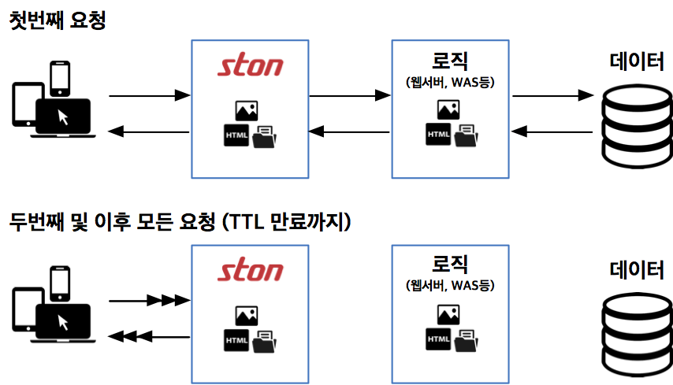

.. _intro:

1장. STON 엣지 서버 (Edge Server)
**********************************

.. toctree::
   :maxdepth: 2

서비스 설계의 원칙
===================
서비스의 성공은 가용성, 속도, 확장성에 달려있다. “확장성 웹 아키텍처와 분산 시스템 설계”를 쓴 Kate Matsudaira도 이 세 가지 원칙을 강조한다.

**가용성 (availability)**

서비스는 항상 가능해야 한다. 장애발생시 90%의 고객은 경쟁사로 이동한다.   완벽한 시스템은 없지만, 장애시 복구는 신속해야 한다. 

**속도 (speed)**

비즈니스에서 시간은 금이다. 느린 응답시간은 매출 감소다. 응답시간이 0.1초 지연되면 매출 1%가 감소한다.  Amazon.com의 고객 47%는 웹페이지가 2초 안에 열리기를 원한다.

**확장성 (scalability)**

고객이 만명이든 백만명이든 서비스는 원활해야 한다. 크기를 키우고 유지하는 노력, 스토리지 확장 용이성, 트랜잭션 처리 여력도 확장성이다. 관리의 확장성도 빠질 수 없다. 진단, 문제 이해, 업데이트와 변경이 쉬워야 한다.

모든 원칙은 최소의 비용으로 지킬수록 효율적이다. 비용은 돈 뿐만이 아니라 시간, 노력, 훈련 등도 포함한다. 

성공적인 서비스는 **성장** 한다. 더 많은 고객과 더 많은 컨텐츠를 감당해야 한다. 성장하면 할수록 원칙들은 더 지키기 어렵다. 어떻게 하면 이 원칙들을 쉽게 최소비용으로 지킬 수 있을까?

서비스의 성장
===============

테스트나 파일럿 서비스는 한두대의 서버로 시작한다. 서비스가 조금씩 성장한다. 서버 수는 야금야금 늘어난다. 컨텐츠 갱신은 한 대씩 꼼꼼하게 해야 한다. 손발이 고생할 뿐, 아직까지는 관리에 큰 무리가 없다. 

서비스가 성장하기 시작한다. 고객이 늘고, 쌓을 데이터가 점점 커진다. 서버들을 일일이 관리하는 것도 어려워진다. 데이터를 한 곳에 모을 고비용의 스토리지를 도입한다 (NAS, SAN, DAS 등). 고비용이지만 신뢰할 수 있을 것 같다. 컨텐츠 갱신이 쉬워졌다. 스토리지에 올린 컨텐츠는 서버들이 자동으로 가져 간다.

서비스가 가파르게 성장한다. 서버 대수를 늘렸더니 스토리지의 전송 부하가 커졌다. 더 빠른 스토리지는 굉장히 고비용이다. 도입이 망설여 진다. 투자할 가치가 있을까.

동기화 (synchronization) 솔루션을 검토한다. 서버에 데이터 전체를 준비시킬 수는 없다.스토리지에서 컨텐츠를 선별해야 한다. 정확하게 제어하려면 관리 기술이 필수다. 서버 몇 대의 동기화 관리는 쉽다. 그러나 서버와 파일 수가 늘어날 수록 힘들어진다. 갈수록 나빠진다. 커질수록 느려지고 어렵고 불안정하다. 

컨텐츠는 계속 변화한다. 추가하고 삭제할 파일이 많아질 수록 동기화 시간은 길어진다. 서비스 규모가 커질 수록, 동기화 관리 시스템도 필연적으로 커지고 복잡해진다. 관리 시스템의 장애는 곧 전체 장애를 일으킨다.

컨텐츠를 빠르고 유연하게 전송할 수 있는 쉬운 방법이 필요하다.


.. _intro_service_scaling:

서비스 확장성과 전송
=====================

계층화 (layering) 로 서비스를 모델링 하면 다음 그림과 같이 두 계층으로 나눌수 있다.

.. figure:: img/intro_2layers.png
   :align: center
      
중심에 데이터를 관리하는 스토리지 (storage) 계층이 있다. 그 위에는 서비스 로직이 구현된 어플리케이션 (application) 계층이 있다. 어플리케이션 계층은 소규모 고객용 컨텐츠 전송도 처리할 수 있다. 초기에는 스토리지와 어플리케이션 계층만으로 서비스를 구성할 수 있다.

.. figure:: img/intro_graph_1.png
   :align: center

서비스가 성장하면서 처리비용은 변화한다. 초기에는 로직 개발이, 성장기에는 고객증가와 함께 데이터 관리가 가장 많은 비용을 차지한다. 
서비스가 발전할 수록 가장 큰 고민은 **컨텐츠 전송** 이다. 폭발하는 대역폭을 어떻게 해결할 것인가? **컨텐츠 전송** 은 서비스 증설 (Scale-out)의 큰 과제이다.

엣지 (edge) : 전송 계층
==========================

.. figure:: img/intro_3layers.png
   :align: center
   
서비스가 성장할 수록, 전송에 대한 부담은 기하급수적으로 커진다. 쇼핑몰의 컨텐츠 개수는 많게는 수십 억 개에 이른다. 
동영상 서비스의 컨텐츠는 TB에 이른지 오래다. 서비스의 증설에는 *컨텐츠 전송의 확장성 (scalibility)* 을 반드시 고려해야 한다. 

엣지(edge)는 서비스의 가장 바깥, 최전방을 가리킨다. 엣지에서 고객은 속도와 가용성을 체험한다. 고객이 요청하는 컨텐츠는 무슨 일이 있어도 ‘반드시’ 전송해야 한다. 고객이 보는 화면에서 깨진 이미지, 심지어 접속불능은 매우 치명적이다. 엣지에서 컨텐츠 전송을 처리하면 어플리케이션과 스토리지의 전송부담은 줄어든다.

엣지의 확장이 쉽고 효율적이면 다른 고비용 계층을 증설할 필요가 없다. 스토리지와 어플리케이션의 증설은 고비용의 비효율적 선택이다. 

그렇다면 STON 엣지 서버는 어떻게 컨텐츠 전송을 쉽고 빠르게 바꿀까?

엣지 서버의 동작 방식: 캐시(cache)
=========================================

.. figure:: img/intro_cache1.png
   :align: center

전송의 규모는 고객의 수와 컨텐츠 크기에 따라 커진다. 얼마나 많은 고객이 어떤 컨텐츠를 요청하는지는 엣지에서 가장 빨리 알 수 있다. 
엣지로부터 Bottom-up의 처리흐름이 효율적이다. 따라서 엣지 서버는 고객의 요청에 따라 On-demand 로 동작하는 **캐시(cache)** 전송방식을 채택하였다. 관리 시스템도 필요없다. 구체적인 동작은 다음과 같다.

   
엣지 서버는 첫번째 컨텐츠 전송 요청을 받았을 때,
원본 계층으로부터 컨텐츠를 가져와 고객에게 전송한다. 
이 컨텐츠를 엣지 서버 자신에게도 저장한다. 
두번째 요청 및 그 이후부터는 저장했던 컨텐츠를 고객에게 즉시 전송한다. 저장된 컨텐츠는 미리 설정된 TTL (Time-To-Live) 시간만큼 유효하다.

엣지 서버는 이러한 방식으로 상당한 양의 컨텐츠 전송을 처리할 수 있다. 어플리케이션과 스토리지의 증설을 최소화하면서 빠른 대용량 전송을 처리한다. 성장하는 서비스라면 반드시 엣지를 고려해야 한다.

STON 엣지 서버는 무제약/무조건을 지향하는 소프트웨어다. 어떤 하드웨어에 설치되든 최대 성능을 발휘하도록 설계되었다.

**CPU:** Many-Core에 최적화되었다. Throughput은 코어개수에 비례한다.

**Memory:** Memory가 많을수록 빠르게 처리한다. Disk I/O를 절감한다.

**Disk:** I/O 를 균등 분산한다. 더 많은 데이터를 caching한다.

**NIC:** 4Gbps NIC Bonding 또는 10Gbps NIC의 Bandwidth를 보장한다.

STON 엣지 서버는 **강력한 라이브 모니터링/로그** 를 지원한다. 초 단위의 실시간 통계로 지금 당장 서비스 상태가 어떤지 확인할 수 있다. JSON, XML, SNMP 등의 여러 범용포맷으로 실시간 숫자를 제공한다. 

STON은 관리자를 위한 **쉬운 설정** 을 제공한다. STON의 설계이념은 관리자를 위한 엣지 서버다. Web Management 페이지를 통해 직관적인 설정방법을 제공한다. 디테일한 설정을 원할 경우, 단 두 개의 XML 설정 파일로 쉽게 할 수 있다. 

엣지 서버의 효과
======================
엣지 서버의 효과는 다음과 같다.

#. 쉽고 편리한 서비스 가속 
#. 서비스 원본을 외부로부터 보호 (Origin Shielding)
#. 서비스가 핵심적인 역할을 수행할 수 있도록 보조

엣지 서버의 효과는 다음 적용사례를 중심으로도 확인할 수 있다.

Game
----------------------------

전통적으로 게임 서비스는 엄청나게 많은 대역폭을 필요로 한다. 
"대작" 게임부터 간단한 캐주얼 게임까지 범주도 매우 다양하다. 
특히 스마트폰 게임의 폭발적 성장과 전파속도는 서비스 형태를 더욱 다양하게 만들었다.

.. figure:: img/icons_game.png
   :align: center

- **높은 대역폭 출력**
  
  단일 서버로 높은 대역폭을 얻는 전통적인 방법은 1Gbps NIC를 본딩(Bonding)하는 것이다. 
  이를 통해 4Gbps 대역폭까지 얻을 수 있다. 
  최근 10Gbps NIC도 시장에 많이 보급되는 추세이다.

  ``STON`` 4Gbps NIC Bonding과 10Gbps NIC에서도 최대 대역폭을 보장한다.
  
- **사용자 대역폭 보장**

  모든 사용자는 게임을 빨리 다운로드 받고 싶어한다. 
  광랜 사용자는 100Mbps의 속도가 얻어지지 않는다면 항의 전화를 걸 것이다. 
  모두들 빨리 게임을 시작하고 싶어한다. 
  서버는 물리적으로 대역폭이 꽉 차지 않는 이상 사용자마다의 최대 속도를 균일하게 보장해야 한다. 
  
  ``STON`` 모든 사용자에게 최대 속도로 전송하는 것을 보장한다.
  
- **대용량 파일 처리**

  설치파일이 4GB정도 하는 게임은 이제 대형게임으로도 분류되지도 않는다. 
  수십 GB는 되어야 "대작"이라는 단어를 달 수 있는 세상이다. 
  파일이 너무 크면 서버 메모리에 모두 Caching 할 수 없다. 
  최악의 상황은 파일의 크기가 너무 커서 사용자마다 다운로드 받는 위치가 제각각인 상황이다.
  
  ``STON`` Caching 파일크기 제한이 없다. 
  Memory와 Disk의 적절한 Swap을 통해 언제나 고성능을 보장한다.
    
- **Range 요청처리**

  전송 파일이 대형화되는 추세에 따라 Grid Delivery기법의 P2P솔루션도 많이 사용되고 있다. 
  이런 솔루션의 특징은 파일을 잘게 조각 내어 주고 받기 때문에 서버에 엄청나게 많은 
  HTTP Range요청을 보낸다. 
  10GB파일을 만 명의 클라이언트가 서로 다른 Range로 요청하는 상황도 가능하다. 
  어느 부분을 요청하더라도 서비스는 즉시 가능해야한다. 
  하지만 원본서버에서는 반드시 원래 파일의 크기만큼만 데이터가 전송되어야 한다.
  
  ``STON`` Range요청에 최적화된 파일 시스템이 탑재되었다. 
  또한 멀티 다운로드를 통해 빠른 응답성을 보장한다.
  원본서버로부터 1Bytes라도 불필요한 다운로드는 하지않는다.

쇼핑몰
----------------------------

쇼핑몰은 사이트 접근이 고객의 매출과 직결된다. 
이제 전통적인 PC환경 뿐만 아니라 모바일쇼핑이 당연해졌다. 
쇼핑환경이 다양해 지는 것 뿐만 아니라 무한히 늘어나는 
파일을 관리하지 못한다면 서비스는 곤경에 처한다.

.. figure:: img/icons_shopping.png
   :align: center

- **무한대의 작은 파일**
  "억! 단위를 넘어서는~", "셀 수 없이 많은~", "언제나 늘어나기만 하는~" 파일을 
  저장하기 위해서는 고가의 Storage가 필요하다. 
  하지만 경제성이 중요한 Edge서버에서는 그럴 수 없다. 
  크기가 1KB인 파일이 10억 개 존재하는 서비스도 있을 수 있다. 
  결론적으로 모든 파일을 Caching할 수 없다. 
  원본서버의 부하를 최소화하면서도 접근 빈도가 높은 파일을 항상 유지하는 방법이 필요하다.

  ``STON`` 메모리와 Disk 자원의 최대용량만큼 Caching한다. 
  모든 파일의 접근 빈도는 실시간으로 관리되며 LRU(Least Recently Used) 에 의해 
  오래된 파일 순으로 삭제된다.
  
- **많은 사용자**

  쇼핑몰은 많은 사용자를 동시에 처리할 수 있어야 한다. 
  급작스러운 이벤트에 의해 사용자 접속이 폭발적으로 증가(=Burst)하기도 한다. 
  Burst 시 서버는 스스로를 보호해야 하며 Burst 후에도 안정성을 유지해야 한다.
  
  ``STON`` CPU 확장성(Scalability. 자원의 증설에 따라 솔루션의 성능이 높아지는 것)을 보장한다. 
  탄력적인 HTTP Keep-Alive 처리와 소켓관리를 통해 Burst시에도 안정성을 보장한다.
  
- **반응성**

  쾌적한 쇼핑환경이란 페이지가 빠르게 로딩되는 것을 의미한다. 
  사용자는 기다리지 않는다. 
  3초 안에 로딩되지 않으면 다른 사이트로 떠난다. 
  일반적으로 메인 페이지는 100개 내외의 파일로 이루어지며 물리적 환경을 고려하더라도 통상 1초 대에 페이지는 완벽하게 로딩되어야 한다.
  
  ``STON`` 실시간 파일 인덱싱을 통한 즉시 응답을 보장한다. 
  부드러운 파일교체를 통해 원본 종속성 없이 반응성을 극대화할 수 있다. 
  모든 HTTP 응답(First byte 응답, 트랜잭션 완료)에 대해 로그와 통계수치를 제공하여 
  성능저하 여부를 실시간으로 검출할 수 있다.
  
- **페이지 TTL**

  대다수의 사용자의 이동 경로는 메인 페이지 -> 대형 카테고리 페이지 -> 소형 카테고리 -> 상세 페이지 순이다. 
  페이지마다 노출 빈도가 다를 뿐만 아니라 갱신 주기도 달라야 한다. 
  스마트한 페이지 Caching & 갱신 방법이 필요하다.
  
  ``STON`` URL마다 별도의 TTL을 부여할 수 있다. 
  또한 Purge, Expire, ExpireAfter, HardPurge 등 상황에 맞는 다양한 방식의 갱신 방법을 제공한다.
  
  

미디어
----------------------------

미디어 전용 프로토콜은 점차 설 자리를 잃어가고 있다. 
HTTP, MP4의 간단하지만 강력한 조합은 점차 세력을 넓혀가고 있다. 
모바일의 가변적인 연결상태를 고려 한다면 HTTP 기반의 Streaming방식이 전송 표준이 될 것이다.

.. figure:: img/icons_media.png
   :align: center

- **미디어 인식**

  더 이상 파일을 Chunk로 인식해서는 안된다. 
  미디어 파일을 정확히 인식할 수 있어야만 대역폭 절감과 함께 다양한 부가기능을 연동할 수 있다. 
  서버가 파일 해석을 위해서 파일의 모든 부분을 필요로 한다면 사용자는 영상재생을 포기할 것이다.
  
  ``STON`` MP4, MP3, M4A, FLV 포맷을 지원한다. 
  다운로드와 동시에 HTTP Pseudo Streaming을 위해 필요한 영역을 우선적으로 Caching한다.
  
- **미디어 헤더 재배치**

  헤더가 뒤에 있는 파일의 경우 HTTP Pseudo Streaming이 불가능하다. 
  이를 위해서는 전용 플레이어가 필요하지만 이는 사용자에게 짜증을 +10한다.
  
  ``STON`` MP4파일 인코딩 후 헤더가 뒤에 붙는다면 헤더를 앞으로 옮겨주는 작업을 
  추가적으로 수행해야 한다. STON은 자연스럽게 헤더를 앞으로 옮겨 서비스 한다.
  
- **대역폭 조절**

  대부분의 영상을 끝까지 보는 사용자는 드물다. 
  그러므로 재생에 무리가 없도록 필요한 만큼만 대역폭을 사용하는 것이 효율적인 전송방법이다. 
  같은 영상이더라도 360p, 480p, 720p, 1080p처럼 Bitrate를 다양하게 서비스 한다.
  
  ``STON`` Bandwidth-Throttling을 통하여 미디어 파일의 전송 대역폭을 최적화할 수 있다.

- **구간추출**

  미리보기/하이라이트/공유하기 등 파일 전체가 아닌 특정 구간만을 서비스하는 경우도 많다. 
  서비스하는 모든 파일에 대해 구간을 추출하는 것은 시간과 저장공간을 지나치게 낭비한다. 
  심지어 사용자마다 추출 구간이 다른 경우도 있다. 
  또한 Skip기능을 구간 재생으로 구현하는 플레이어도 존재한다.
  
  ``STON`` Trimming기능을 통해 구간을 추출하여 완전한 형태의 미디어 파일로 서비스한다.
  
  
뉴스 / 커뮤니티
----------------------------

아주 높은 충성도의 사용자층을 확보한 사이트는 흥미로운 점이 많다. 
같은 관심사를 가지는 사용자들이 모이기 때문에 교류가 활발하며 페이지에 
머무르는 시간도 매우 길다. 
서비스 패턴이 제각각이라 서비스하기 꽤 까다롭다.

- **304 Not Modified**
  
  사이트 충성도가 매우 높기 때문에 이미 대부분의 파일을 사용자 로컬에 저장하고 있다. 
  때문에 실제로 전송되는 파일보다 "변경확인" 비율이 압도적이다.
  
  ``STON`` 자주 접근되는 파일은 항상 메모리에 상주하도록 보장한다. 
  "변경확인" 작업은 기다림 없이 즉시 처리된다.
  
- **Bypass**

  사용자에 특화된 페이지나 새로운 글, 리플 등 페이지는 항상 Caching할 수 없는 영역을 포함한다. 
  하지만 Domain을 별도로 나누지 않고 단일 도메인을 Reverse-Proxy에 위임하는 경우가 많다.

  ``STON`` 다양한 조건을 기반으로 바이패스 대상을 정교하게 분류한다. 
  또한 Origin Affinity, Private 기능을 이용해 로그인 세션을 유지할 수 있다.
  
- **불안한 원본**

  중, 소형 기업 또는 개인이 운영하는 사이트들은 고가의 장비나 인프라, 인력을 운영하기 어렵다. 
  원본서버 장애 빈도가 상대적으로 높으며 이를 극복하기 위한 경제성은 매우 나쁘다.
  
  ``STON`` 원본서버 과부하 또는 장애를 판단하여 자동으로 배제/복구가 이루어진다. 
  원본서버 장애 시  TTL을 자동으로 연장시켜 원본서버 의존성을 최소화한다.
  
- **이미지 가공**

  같은 이미지를 사용자 환경에 따라 다양하게 보여줄 필요가 있다. 
  검색 결과에서는 Thumbnail 이미지를, 뉴스 사이트에서는 "XX 뉴스" 같은 글씨를 워터마크로 표시해야한다. 
  같은 이미지를 보여지는 형태에 따라 매번 가공하는 것은 저장공간과 시간, 인력의 낭비다.
  
  ``STON`` :ref:`dims` 기능을 사용하면 원본서버에 단 하나의 이미지 만으로 원하시는 형태를 
  URL 호출만으로 생성할 수 있다.
  
  
파일기반 서버
----------------------------

Edge는 Reverse-Proxy구조에 기반한다. 
Reverse-Proxy의 핵심 개념은 원격서버에 있는 파일을 로컬에 복제/갱신/관리하는 것이다.
이미 검증된 STON을 서비스 서버와 연동할 수 있다면 
Storage중앙 집중화 및 동기화 이슈를 제거할 수 있다. 
뿐만 아니라 개발시간 단축과 서비스 신뢰도 향상의 두마리 토끼를 모두 잡을 수 있다.

.. figure:: img/icons_file.png
   :align: center

- **File I/O 지원**

  전용 프로토콜이 필요하다면 해당 모듈에 종속적인 서버가 되어 버린다. 
  힘들게 연동했다 하더라도 성능이 떨어지면 무용지물이다. 
  모듈과 서버 사이의 중간 단계는 최소화되어야 한다.
  
  ``STON`` 표준 File I/O로 STON이 연동된다. 
  전용서버와 STON사이에는 Linux Kernel(VFS)만이 존재하여 고성능을 보장한다.
  
- **Web Server 연동**
  
  표준 Web 서버(Apache, Lighttpd, NginX)에 특화된 확장모듈이 설치된 경우 
  표준 Reverse-Proxy를 도입하기 힘들 수 있다. 
  DB/WAS와 연동되는 파일 서비스 또는 과금/결제 서비스 같은 경우 쉽게 서비스를 
  확장하기 어렵다.
  
  ``STON`` Apache의 DocumentRoot를 STON으로 지정하면 Apache는 STON을 물리적 디스크로 인식한다. 
  더 설정할 것은 없다.
  
- **Wowza 연동**

  미디어서비스에서는 Wowza가 사실상의 표준이다. 
  하지만 Wowza의 HTTP Caching기능은 사용하기 번거로울 뿐만 아니라 빈약하다. 
  또한 점차 HTTP 이외의 "전용" 프로토콜은 사라지는 추세이다.

  ``STON`` 로컬 디스크로 Mount할 수 있을 뿐만 아니라 MP4헤더 변환, Trimming등 
  모든 기능을 사용할 수 있다.

- **리소스 제약**

  Back-end에 존재하는 파일을 Front-End의 사용자에게 전달하는 서버라면 항상 
  파일 동기화가 문제된다. 
  게임서버, SNS서버 등 전용서버의 개발 이슈는 항상 존재한다. 
  이런 서버의 경우 중단 없이 장기간 운영 되야 하므로 
  메모리, 디스크 사용이 엄격하게 제한되어야 한다.

  ``STON`` 최대 메모리, 디스크 사용량을 제한할 수 있다. 
  또한 디스크로 Mount하여도 다른 모든 기능은 동일하게 동작하여 복합적인 서비스를 
  최소한의 솔루션으로 구성할 수 있다.

STON은 이러한 특성들을 적극 활용하는 다음 서비스들과 함께 성장하고 있다. 

.. figure:: img/intro_reference.png
   :align: center
