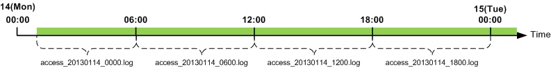
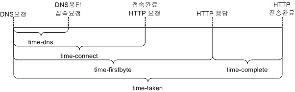
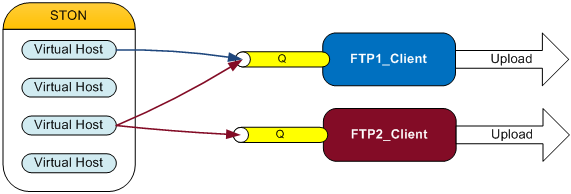

.. admin-log:

12장. 로그
******************

이 장에서는 로그를 다룬다.
서비스는 로그로 시작해서 로그로 끝난다.
로그는 금이며, 법이며, 분쟁지역의 평화유지군이다.

로그는 전역과 가상호스트로 구분된다. 
모든 로그는 기록여부를 설정할 수 있으며, 공통속성을 가진다. ::

   <XXX Type="time" Unit="1440" Retention="10" Compression="OFF">ON</XXX>

-  ``Type (기본: time)`` , ``Unit (기본: 1440분)`` 로그 롤링조건을 설정한다.

   - ``time`` 설정된 ``unit`` 시간(단위: 분)마다 로그 파일을 롤링한다.
   - ``size`` 설정된 ``unit`` 크기(단위: MB)마다 로그 파일을 롤링한다.
   - ``both`` 콤마(,)로 구분하여 시간과 크기를 동시에 설정한다.
     예를 들어 Unit="1440, 100"인 경우 시간이 24시간(1440분) 또는 100MB 인 경우 로그 파일을 롤링한다.
     
-  ``Retention (기본: 10개)`` 단위 로그파일을 최대 n개 유지한다.

-  ``Compression (기본: OFF)`` 로그가 롤링될 때 압축을 진행한다.
   예를 들어 access_20140715_0000.log파일이 롤링되면 access_20140715_0000.log.gz로 압축되어 저장된다.

``Type`` 이 "time" , ``Unit`` 이 10이면 로그는 매 10분에 롤링된다.
예를 들어 서비스를 2:18분에 시작해도 로그는 매 10분인 2:20, 2:30, 2:40에 롤링된다. 
마찬가지로 하루에 한번 매일 0시 0분에 롤링하려면 1440(60분 X 24시)으로 ``Unit`` 값으로 설정한다.
``time`` 설정에서 로그는 하루에 한번 무조건 롤링되므로 ``Unit`` 의 최대값은 1440을 넘을 수 없다.

   
최대 값인 24시간(Unit=1440)시간마다 로그가 롤링되도록 설정했다면 다음 그림과 같이 로그가 기록된다.

.. figure:: img/log_rolling2.jpg
   :align: center

.. toctree::
   :maxdepth: 2

.. admin-log-install:

Install 로그
====================================

설치/업데이트 시 모든 내용이 install.log에 기록된다.
이 로그는 별도의 설정이 없다. ::

    #DownloadURL: http://foobar.com/ston/ston.2.0.0.rhel.2.6.32.x64.tar.gz
    #DownloadTime: 13 sec
    #Target: STON 2.0.0
    #Date: 2014.03.03 16:48:35
    Prepare for STON 2.0.0 install process
        Stopping STON...
        STON stopped
    [Copying files]
        `./fuse.conf' -> `/etc/fuse.conf'
        `./libfuse.so.2' -> `/usr/local/ston/libfuse.so.2'
        `./libtbbmalloc_proxy.so' -> `/usr/local/ston/libtbbmalloc_proxy.so'
        `./start-stop-daemon' -> `/usr/sbin/start-stop-daemon'
        `./libtbbmalloc_proxy.so.2' -> `/usr/local/ston/libtbbmalloc_proxy.so.2'
        `./libtbbmalloc.so' -> `/usr/local/ston/libtbbmalloc.so'
        `./libtbbmalloc.so.2' -> `/usr/local/ston/libtbbmalloc.so.2'
        `./libtbb.so' -> `/usr/local/ston/libtbb.so'
        `./libtbb.so.2' -> `/usr/local/ston/libtbb.so.2'
        `./stond' -> `/usr/local/ston/stond'
        `./stonx' -> `/usr/local/ston/stonx'
        `./stonr' -> `/usr/local/ston/stonr'
        `./stonu' -> `/usr/local/ston/stonu'
        `./stonapi' -> `/usr/local/ston/stonapi'
        `./server.xml.default' -> `/usr/local/ston/server.xml.default'
        `./vhosts.xml.default' -> `/usr/local/ston/vhosts.xml.default'
        `./ston_format.sh' -> `/usr/local/ston/ston_format.sh'
        `./ston_diskinfo.sh' -> `/usr/local/ston/ston_diskinfo.sh'
        `./wm.sh' -> `/usr/local/ston/wm.sh'
    [Exporting config files]
        #Export so directory
        /usr/local/ston/ to ld.so.conf
        #Export sysctl to /etc/sysctl.conf
        vm.swappiness=0
        vm.min_free_kbytes=524288
        #Export sudoers for WM
        Defaults    !requiretty
        winesoft ALL=NOPASSWD: /etc/init.d/ston stop, /etc/init.d/ston start, /bin/ps -ef
    [Configuring STON daemon script]
        STON deamon activate in run-level 2345.
    [Installing sub-packages]
        curl installed.
        libjpeg installed.
        libgomp installed.
        rrdtool installed.
    [Installing WM]
        Stopping WM...
        WM stopped
        `./wm.server_default.xml' -> `/usr/local/ston/wm/tmp/conf/server_default.xml'
        `./wm.vhost_default.xml' -> `/usr/local/ston/wm/tmp/conf/vhost_default.xml'
        WM configuration found. Current WM port : 8500
        PHP module for Legacy(CentOS 5.5) installed
        `./libphp5.so.5.5' -> `/usr/local/ston/wm/modules/libphp5.so'
        WM installation almost complete. Changing WM privileges.
    Installation successfully complete

.. _admin-log-info:

Info 로그
====================================

Info로그는 전역설정(server.xml)에 설정한다. ::

   # server.xml - <Server><Cache>
   
   <InfoLog Type="size" Unit="1" Retention="5">ON</InfoLog>   

-  ``<InfoLog> (기본: ON, Type: size, Unit: 1)``   
   STON의 동작과 설정변경에 대해 기록한다.
   
   
.. _admin-log-deny:

Deny 로그
====================================

Deny로그는 전역설정(server.xml)에 설정한다. ::

   # server.xml - <Server><Cache>

   <DenyLog Type="size" Unit="1" Retention="5">ON</DenyLog>   

-  ``<DenyLog> (기본: ON, Type: size, Unit: 1)``

   :ref:`access-control-serviceaccess` 에 의해 접근차단된 IP를 기록한다. ::
   
      #Fields: date time c-ip deny
      2012.11.15 07:06:10 1.1.1.1 AP
      2012.11.15 07:06:26 2.2.2.2 GIN
      2012.11.15 07:06:30 3.3.3.3 3.3.3.1-255
      
   모든 필드는 공백으로 구분되며 각 필드의 의미는 다음과 같다.
   
   - ``date`` 날짜
   - ``time`` 시간
   - ``c-ip`` 클라이언트 IP
   - ``deny`` 차단조건
   
   
.. _admin-log-originerror:

OriginError 로그
====================================

OriginError로그는 전역설정(server.xml)에 설정한다. ::

   # server.xml - <Server><Cache>
   
   <OriginErrorLog Type="size" Unit="5" Retention="5" Warning="OFF">ON</OriginErrorLog>   

-  ``<OriginErrorLog> (기본: OFF, Type: size, Unit: 5, Warning: OFF)``

   모든 가상호스트의 원본서버에서 발생한 장애만을 기록한다. 
   장애는 접속장애와 전송장애를 의미하며 원본서버 배제/복구 결과가 기록된다. ::
   
      #Fields: date time vhostname level s-domain s-ip cs-method cs-uri time-taken sc-error sc-resinfo
      2012.11.15 07:06:10 [example.com] [ERROR] 192.168.0.13 192.168.0.13 GET /Upload/ProductImage/stock/1716439_SM.jpg 20110 Connect-Timeout -
      2012.11.15 07:06:26 [example.com] [ERROR] 192.168.0.13 192.168.0.13 GET /Upload/ProductImage/stock/1716439_SM.jpg 20110 Connect-Timeout -
      2012.11.15 07:06:30 [example.com] [ERROR] 192.168.0.13 192.168.0.13 GET /Upload/ProductImage/stock/1716439_SM.jpg 20110 Connect-Timeout -
      #2012.11.15 07:06:30 [example.com] 192.168.0.13 excluded from service
      #2012.11.15 07:06:31 [example.com] Origin server list: 192.168.0.14
      #2012.11.15 07:11:11 [example.com] 192.168.0.13 recovered back in service
      #2012.11.15 07:11:12 [example.com] Origin server list: 192.168.0.13
   
   모든 필드는 공백으로 구분되며 각 필드의 의미는 다음과 같다.
   
   - ``date`` 장애발생 날짜
   - ``time`` 장애발생 시간
   - ``vhostname`` [가상호스트]
   - ``level`` [장애레벨(Error 또는 Warning)]
   - ``s-domain`` 원본서버 도메인
   - ``s-ip`` 원본서버 IP
   - ``cs-method`` STON이 원본서버에게 보낸 HTTP Method
   - ``cs-uri`` STON이 원본서버에게 보낸 URI
   - ``time-taken`` 장애가 발생 할때 까지 소요된 시간
   - ``sc-error`` 장애의 종류
   - ``sc-resinfo`` 장애발생시 서버 응답 정보(","문자로 구분)
   
   ``Warning`` 속성이 ``ON`` 이라면 다음과 잘못된 HTTP통신이 발생한 경우에 기록한다. ::
   
      2012.11.15 07:09:03 [example.com] [WARNING] 10.10.10.10 121.189.63.219 GET /716439_SM.jpg 20110 PartialResponseOnNormalRequest Res=206,Len=2635
      2012.11.15 07:09:03 [example.com] [WARNING] 10.10.10.10 121.189.63.219 GET /716439_SM.jpg 20110 ClosedWithoutResponse -
      
   잘못된 HTTP통신의 경우는 다음과 같다.
   
   - ``ClosedWithoutResponse`` 원본서버에 의한 연결종료. HTTP 응답을 받지 못했다.
   - ``ClosedWhenDownloading`` 원본서버에 의한 연결종료. Content-Length 만큼 다운로드하지 못했다.
   - ``NotPartialResponseOnRangeRequest`` Range요청을 했으나 응답코드가 206이 아니다.
   - ``DifferentContentLengthOnRangeRequest`` 요청한 Range와 Content-Length가 다르다.
   - ``PartialResponseOnNormalRequest`` Range요청이 아닌데 응답코드가 206이다.

.. admin-log-syslog:

SysLog 전송
====================================

`syslog <http://en.wikipedia.org/wiki/Syslog>`_ 프로토콜을 사용하여 로그를 UDP로 실시간 포워딩한다. 
모든 로그에 대하여 syslog로 전송되도록 설정할 수 있다. ::

   # server.xml - <Server><Cache>
   
   <InfoLog SysLog="OFF">ON</InfoLog>
   <DenyLog SysLog="OFF">ON</DenyLog>
   <OriginErrorLog SysLog="OFF">ON</OriginErrorLog>
    
-  ``SysLog``

   - ``OFF (기본)`` syslog를 사용하지 않는다.
   
   - ``ON`` 이 태그 하위에 설정된 ``<SysLog>`` 로 로그를 전송한다.
   
다음은 ``<OriginErrorLog>`` 가 기록될 때 syslog를 설정하는 예제이다. ::

   # server.xml - <Server><Cache>

   <OriginErrorLog SysLog="ON">
      <SysLog Priority="local3.info" Dest="192.168.0.1:514" />
      <SysLog Priority="user.alert" Dest="192.168.0.2" />
      <SysLog Priority="mail.debug" Dest="log.example.com" />
   </OriginErrorLog>
    
1. ``<OriginErrorLog>`` 의 ``SysLog`` 속성을 ``ON`` 으로 설정한다.
#. ``<OriginErrorLog>`` 의 하위에 ``<SysLog>`` 태그를 생성한다. n대의 서버로 동시에 전송가능하다.
#. ``<SysLog>`` 의 ``Priority`` 속성을 설정한다. 
   이 표현은 syslog의 `Facility Levels <http://en.wikipedia.org/wiki/Syslog#Facility_levels>`_ 과 
   `Severity levels <http://en.wikipedia.org/wiki/Syslog#Severity_levels>`_ 의 조합으로 구성한다.
#. ``<SysLog>`` 의 ``Dest`` 속성을 설정한다. syslog수신서버를 의미하며 수신포트가 514인 경우 생략가능하다.

위 설정으로 기록된 sys로그 예제는 다음과 같다. 
syslog의 tag는 STON/{로그명}으로 기록된다. ::

    Mar 12 11:24:24 192.168.0.1 STON/ORIGINERROR: 2013-03-12 14:09:20 [ERROR] [example.com] - 192.168.0.14 GET /1.gifd 1996 Connect-Timeout -
    Mar 12 11:24:24 192.168.0.1 STON/ORIGINERROR: 2013-03-12 14:09:22 [ERROR] [example.com] - 192.168.0.14 GET /favicon.ico 1995 Connect-Timeout -
    Mar 12 11:24:24 192.168.0.1 STON/ORIGINERROR: 2013-03-12 14:09:24 [ERROR] [example.com] - 192.168.0.14 GET /1.gifd22 2020 Connect-Timeout -
    Mar 12 11:24:24 192.168.0.1 STON/ORIGINERROR: #2013 .03.12 14:09:24 [example.com] 192.168.0.14:102 excluded from service
    Mar 12 11:24:24 192.168.0.1 STON/ORIGINERROR: #2013 .03.12 14:09:24 [example.com] Origin server list:
    

가상호스트별 로그저장
====================================

가상호스트별로 로그는 별도로 기록된다. 
로그가 ``OFF`` 로 설정되어 있어도 로컬파일에만 써지지 않을 뿐이므로 
:ref:`api-monitoring-logtrace` 는 정상동작한다. ::

   # server.xml - <Server><VHostDefault>
   # vhosts.xml - <Vhosts><Vhost>

   <Log Dir="/cache_log">
      ... (생략) ...
   </Log>   

-  ``<Log>`` ``Dir`` 속성으로 로그가 기록될 디렉토리를 설정한다. 
   로그는 설정한 디렉토리 하위의 가상호스트 디렉토리에 생성된다.
   

.. _admin-log-dns:

DNS 로그
====================================

원본서버로 Domain으로 설정되었다면 Resolving결과를 기록한다. ::

   # server.xml - <Server><VHostDefault><Log>
   # vhosts.xml - <Vhosts><Vhost><Log>

   <Dns Type="size" Unit="10" Retention="10" SysLog="OFF" Compression="OFF">ON</Dns>   
   
::

   #Fields: date time domain ttl ip-list ip-count time-taken result
   2014-07-30 12:10:33 example.com 157 173.194.127.15,173.194.127.23,173.194.127.24,173.194.127.31 4 5007 success
   2014-07-30 12:10:38 example.com 152 173.194.127.23,173.194.127.24,173.194.127.31,173.194.127.15 4 9 success
   2014-07-30 12:11:03 example.com 127 173.194.127.31,173.194.127.15,173.194.127.23,173.194.127.24 4 15007 success
   2014-07-30 12:12:53 example.com 17 173.194.127.15,173.194.127.23,173.194.127.24,173.194.127.31 4 6 success
   2014-07-30 12:23:16 test.com 0 - 0 10008 fail
   2014-07-30 12:23:21 test.com 0 - 0 5007 fail
   2014-07-30 12:23:26 test.com 0 - 0 5011 fail
   2014-07-30 12:24:38 example.com 152 173.194.127.23,173.194.127.24,173.194.127.31,173.194.127.15 4 9 success
   2014-07-30 12:25:03 example.com 127 173.194.127.31,173.194.127.15,173.194.127.23,173.194.127.24 4 15007 success

모든 필드는 공백으로 구분되며 각 필드의 의미는 다음과 같다.

-  ``date`` 날짜
-  ``time`` 시간
-  ``domain`` 대상 Domain
-  ``ttl`` 레코드 유효시간(Time To Live)
-  ``ip-list`` IP 리스트
-  ``ip-count`` IP 개수
-  ``time-taken`` 수행시간
-  ``result`` success 또는 fail

.. _admin-log-access:

Access 로그
====================================

모든 클라이언트의 HTTP 트랜잭션을 기록한다. 
로그 기록 시점은 HTTP 트랜잭션이 완료되는 시점이며 전송완료 또는 전송중단 시점을 의미한다. ::

   # server.xml - <Server><VHostDefault><Log>
   # vhosts.xml - <Vhosts><Vhost><Log>
   
   <Access Type="time" Unit="1440" Retention="10" XFF="on" Form="ston" Local="Off">ON</Access>   
    
-  ``XFF``

   - ``ON (기본)`` 클라이언트가 보낸 XFF(X-Forwarded-For)헤더 값과 클라이언트 IP를 같이 기록한다. 없다면 ``OFF`` 와 같다.
   - ``OFF`` 클라이언트 IP를 기록한다.   
   - ``TrimCIP`` XFF헤더가 없을 경우 클라이언트 IP를, 있는 경우 (클라이언트 IP를 제외한) XFF헤더만을 기록한다.

-  ``Form``
   
   - ``ston (기본)`` W3C표준 + 확장필드
   - ``apache`` Apache 형식
   - ``iis`` IIS 형식
   - ``custom`` `admin-log-access-custom`

-  ``Local``

   - ``OFF (기본)`` 로컬통신(Loopback)은 기록하지 않는다.
   - ``ON`` 로컬통신(Loopback)도 기록한다.
  
::

    #Fields: date time s-ip cs-method cs-uri-stem cs-uri-query s-port cs-username c-ip cs(User-Agent) sc-status sc-bytes time-taken cs-referer sc-resinfo cs-range sc-cachehit cs-acceptencoding session-id sc-content-length
    2012.06.27 16:52:24 220.134.10.5 GET /web/h.gif - 80 - 61.50.7.9 Chrome/19.0.1084.56 200 98141 5 - Bypass+gzip+SSL3 - TCP_HIT gzip+deflate 7 1273735
    2012.06.27 16:52:26 220.134.10.5 GET /favicon.ico - 80 - 61.50.7.9 Chrome/19.0.1084.56 200 949 2 - - - TCP_HIT gzip+deflate 35 14875
    2012.06.27 17:00:06 220.168.0.13 GET /setup.Eexe - 80 - 61.168.0.102  Mozilla/5.0+(Windows+NT+6.1;+WOW64)+AppleWebKit/536.11+(KHTML,+like+Gecko)+Chrome/20.0.1132.57+Safari/536.11 206 20971800 7008 - - 398458880-419430399 TCP_HIT - 41 89764358

모든 필드는 공백으로 구분되며 각 필드의 의미는 다음과 같다.

-  ``date`` HTTP 트랜잭션이 완료된 날짜
-  ``time`` HTTP 트랜잭션이 완료된 시간
-  ``s-ip`` 서버 IP
-  ``cs-method`` 클라이언트가 보낸 HTTP Method
-  ``cs-uri-stem`` 클라이언트가 보낸 URL중 QueryString을 제외한 부분
-  ``cs-uri-query`` 클라이언트가 보낸 URL중 QueryString
-  ``s-port`` 서버 포트
-  ``cs-username`` 클라이언트 username
-  ``c-ip`` 클라이언트 IP`` XFF설정이 "ON"이라면 X-Forwarded-For헤더 값과 클라이언트 IP를 기록한다.
-  ``cs(User-Agent)`` 클라이언트가 보낸 HTTP User-Agent
-  ``sc-status`` 서버 응답코드.
-  ``sc-bytes`` 서버가 보낸 Bytes (헤더 + 컨텐츠)
-  ``time-taken`` HTTP트랜잭션이 완료될 때까지 소요된 전체시간(밀리세컨드)
-  ``cs-referer`` 클라이언트가 보낸 HTTP Referer
-  ``sc-resinfo`` 부가 정보. "+"문자로 구분된다. 
   인코딩된 컨텐츠를 서비스했다면 인코딩 옵션(gzip 또는 deflate)이 명시된다. 
   보안 통신이라면 SSL 프로토콜 버전(SSL3, TLS1, TLS1.1, TLS1.2)이 명시된다. 
   바이패스한 통신이라면 "Bypass"가 명시된다.
   
-  ``cs-range`` 클라이언트가 보낸 Range 헤더를 기록한다.
-  ``sc-cachehit`` 캐시 HIT결과.
-  ``cs-acceptencoding`` 클라이언트가 보낸 Accept-Encoding헤더.
-  ``session-id`` HTTP 클라이언트 세션 ID (unsigned int64)
-  ``sc-content-length`` 서버 응답 Content-Length 헤더 값

Access로그는 전송 성공/실패 여부에 상관없이 모든 HTTP 트랜잭션을 기록한다. 
HTTP 트랜잭션은 클라이언트가 HTTP요청을 보낼 때 시작된다. 
STON이 클라이언트에게 응답을 보내기 전에 HTTP연결이 종료된다면 HTTP 트랜잭션 역시 
종료된 것으로 간주한다. 
로그에는 ``sc-status`` 와 ``sc-bytes`` 가 0으로 기록된다. 
주로 STON이 원본서버로부터 응답을 받기 전에 클라이언트가 연결을 종료하는 경우 이런 
로그가 기록된다.

.. _admin-log-access-custom:

사용자정의 Access 로그포맷
====================================

Access 로그형식을 사용자정의 로그로 설정한다. ::

   # server.xml - <Server><VHostDefault><Log>
   # vhosts.xml - <Vhosts><Vhost><Log>
   
   <Access Form="custom">ON</Access>
   <AccessFormat>%a %A %b id=%{userid}C %f %h %H "%{user-agent}i" %m %P "%r" %s %t %T %X %I %O %R %e %S %K</AccessFormat>   
  
-  ``<Access>`` 의 ``Form`` 속성을 ``custom`` 으로 설정한다.

-  ``<AccessFormat>`` 사용자정의 로그 형식.

위 예제의 경우 다음과 같이 Access로그가 기록된다. (#Fields는 기록하지 않는다.) ::

    192.168.0.88 192.168.0.12 163276 id=winesoft; image.jpg example.com HTTP "STON" GET 80 "GET /ston/image.jpg?type=png HTTP/1.1" 200 2014-04-03 21:21:54 1 C 204 163276 1 2571978 TCP_MISS HTTP/1.1
    192.168.0.88 192.168.0.12 63276 id=winesoft; vod.mp4 example.com HTTP "STON" POST 80 "GET /ston/vod.mp4?start=10 HTTP/1.1" 200 2014-04-03 21:21:54 12 C 304 363276 2 2571979 TCP_REFRESH_HIT HTTP/1.1
    192.168.0.88 192.168.0.12 3634276 id=ston; news.html example.com HTTPS "STON" GET 443 "GET /news.html HTTP/1.1" 200 2014-04-03 21:21:54 30 X 156 2632576 1 2571980 TCP_MISS HTTP/1.1
    192.168.0.88 192.168.0.12 6332476 id=winesoft; style.css example.com HTTP "STON" HEAD 80 "GET /style.css HTTP/1.1" 200 2014-04-03 21:21:54 10 X 234 653276 2 2571981 TCP_REFRESH_HIT HTTP/1.1
    192.168.0.88 192.168.0.12 6276 id=ston; ui.js example.com HTTP "STON" GET 80 "GET /ui.js HTTP/1.1" 200 2014-04-03 21:21:54 1 X 233 63276 1 2571982 TCP_MISS HTTP/1.1
    192.168.0.88 192.168.0.12 626 id=winesoft; hls.m4u8 example.com HTTP "STON" GET 80 "GET /hls.m4u8 HTTP/1.1" 200 2014-04-03 21:21:54 2 X 124 6312333276 2 2571983 TCP_REFRESH_HIT HTTP/1.1
  
`Apache로그 형식 <https://httpd.apache.org/docs/2.2/ko/mod/mod_log_config.html>`_ 을 
기반으로 개발되었으며 일부 확장필드가 있다. 
각 필드의 구분자에는 제한이 없지만 Space를 사용할 경우, User-Agent처럼 Space가 포함될 
수 있는 필드는 따옴표("...")로 묶어서 설정한다.

-  ``%...a`` 클라이언트 IP ::

      192.168.0.66
      
-  ``%...A`` 서버IP 주소 :: 

      192.168.0.14
      
-  ``%...b`` HTTP헤더를 제외한 전송 바이트수 ::

      1024
      
-  ``%...{foobar}C`` 서버가 수신한 요청의 Foobar 쿠키의 내용  ::

      %{id=}c 로 입력하면 Cookie 에서 id=에 해당하는 값을 기록
      
-  ``%...D`` 요청을 처리하는데 걸린 시간(MS) ::

      3000
      
-  ``%...f`` 파일명 ::

      /mp4/iu.mp4 라면 iu.mp4를 기록
      
-  ``%...h`` HostName ::

      example.com
      
-  ``%...H`` 요청 프로토콜 ::

      http 또는 https
      
-  ``%...{foobar}i`` 서버가 수신한 요청에서 foobar: 헤더의 내용 ::

      %{User-Agent}i 로 입력 할 경우 User-Agent의 값을 기록
      
-  ``%...m`` 요청 Method ::

      GET 또는 POST 또는 HEAD
      
-  ``%...P`` Server PORT ::

      80
      
-  ``%...q`` QueryString ::

      Id=10&value=20
      
-  ``%...r`` 요청의 첫번째 줄(Request Line) ::

      GET /img.jpg HTTP/1.1
      
-  ``%...s`` 응답코드 ::

      200
      
-  ``%...t`` STON 기본 시간형식	::

      2014-01-01 15:27:02

-  ``%...{format}t`` Format에 정의된 날짜 형식 ::

      %{%Y-%m-%d %H:%M:%S}T 로 입력하면 2014-08-07 06:12:23으로 기록.

-  ``%...T`` TimeTaken(초단위) ::

      10

-  ``%...U`` ShortURI ::

      /img/img.jpg
      
-  ``%...u`` FullURI ::

      /img/img.jpg?session=1232&id=37

-  ``%...X`` 트랜잭션이 완료되었을 때의 상태
   
   - ``X`` 응답이 완료되기 전에 종료
   - ``C`` 응답이 완료 되었음
   
   ::
   
      C
    
-  ``%...I`` 요청헤더를 포함한 수신바이트 ::
    
      2048
    
-  ``%...O`` 응답헤더를 포함한 송신바이트 ::
      
      2048
      
-  ``%...R`` 응답시간(MS) ::

      2
      
-  ``%...e`` Session-ID ::

      1
      
-  ``%...S`` 캐싱 HIT 결과 ::

      TCP_HIT
      
-  ``%...K`` 요청 HTTP 버전	::

      HTTP/1.1
            
-  ``%...y`` 요청 HTTP 헤더 크기	::

      488
            
-  ``%...z`` 응답 HTTP 헤더 크기	::

      362
  
설정한 필드의 값이 존재하지 않으면 - 로 표기한다. 
형식이 잘못되었다면 STON 기본 포맷(Form="ston")으로 동작한다.
  
위 표에서 각 필드의 ...에는 (e.g. “%h %U %r %b) 아무것도 명시하지 않거나, 
기록 조건을 명시할 수 있다(조건을 만족하지 않으면 - 로 기록). 
조건은 HTTP 상태코드 목록으로 설정하거나 !로 NOT 조건을 설정할 수 있다. 

다음 예제는 400(Bad Request) 오류 또는 501(Not Implemented) 오류 일 때만 User-agent를 기록한다. ::

    "%400,501{User-agent}i" 
  
다음 예제는 정상적인 상태가 아닌 모든 요청에 대해 Referer를 로그에 남긴다. ::
  
    "%!200,304,302{Referer}i"

.. _admin-log-origin:

Origin 로그
====================================

원본서버의 모든 HTTP 트랜잭션을 기록한다. 
기록 시점은 HTTP 트랜잭션이 완료되는 시점이며 전송완료 또는 전송중단 시점을 의미한다. ::

   # server.xml - <Server><VHostDefault><Log>
   # vhosts.xml - <Vhosts><Vhost><Log>

   <Origin Type="time" Unit="1440" Retention="10" Local="Off">ON</Origin>   
    
::

    #Fields: date time cs-sid cs-tcount c-ip cs-method s-domain cs-uri s-ip sc-status cs-range sc-sock-error sc-http-error sc-content-length cs-requestsize sc-responsesize sc-bytes time-taken time-dns time-connect time-firstbyte time-complete cs-reqinfo cs-acceptencoding sc-cachecontrol s-port sc-contentencoding session-id session-type
    2012.06.27 17:40:00 357 899 192.168.0.13 GET i.example.com /t/2.gif 115.71.9.136 200 - - - 3874 197 271 3874 20 0 0 17 3 - gzip+deflate - 80 gzip 7 cache
    2012.06.27 17:40:00 357 900 192.168.0.13 GET i.example.com /ex1.gif 115.71.9.136 200 - - - 5673 223 272 5673 24 0 0 21 3 - - - 80 - 8 cache
    2012.06.27 17:40:00 357 901 192.168.0.13 GET i.example.com /exB.jpg 115.71.9.136 200 - - - 8150 189 273 8150 13 0 0 9  4 Bypass - - 80 - 7 cache
    #[ERROR:01] 2012.06.27 17:40:01 220.73.216.5 220.73.216.5 GET /web/nmb/img/main/v1/h1.gif 1824 Connect-Timeout - 11 cache
    2012.06.27 17:40:00 357 901 192.168.0.13 GET i.example.com /exB1.jpg 115.71.9.136 200 - - - 8150 189 273 8150 13 0 0 9 4 - max-age=3600 80 - 12 cache
    2012.06.27 17:40:00 357 901 192.168.0.13 GET i.example.com /exB2.jpg 115.71.9.136 200 - - - 8150 189 273 8150 13 0 0 9 4 - no-cache 80 - 35 cache
    2012.06.27 17:40:00 357 901 192.168.0.13 GET i.example.com /exB3.jpg 115.71.9.136 200 - - - 8150 189 273 8150 13 0 0 9 4 - - 80 - 35 cache

원본서버에 장애가 발생했다면 #[ERROR:xx]로 시작하는 에러 로그가 기록된다. 
모든 필드는 공백으로 구분되며 각 필드의 의미는 다음과 같다.

   
   원본 시간측정 구간

-  ``date`` HTTP 트랜잭션이 완료된 날짜
-  ``time`` HTTP 트랜잭션이 완료된 시간
-  ``cs-sid`` 세션의 고유ID. 같은 세션을 통해 처리된(재사용된) HTTP 트랜잭션은 같은 값을 가진다.
-  ``cs-tcount`` 트랜잭션 카운트. 이 HTTP 트랜잭션이 현재 세션에서 몇 번째로 처리된 트랜잭션인지 기록한다. 같은 ``cs-sid`` 값을 가지는 트랜잭션이라면 이 값은 중복될 수 없다.
-  ``c-ip`` STON의 IP
-  ``cs-method`` 원본서버에게 보낸 HTTP Method
-  ``s-domain`` 원본서버 도메인
-  ``cs-uri`` 원본서버에게 보낸 URI
-  ``s-ip`` 원본서버 IP
-  ``sc-status`` 원본서버 HTTP 응답코드
-  ``cs-range`` 원본서버에게 보낸 Range요청 값
-  ``sc-sock-error`` 소켓 에러코드(1=전송실패, 2=전송지연, 3=연결종료)
-  ``sc-http-error`` 원본서버가 4xx 또는 5xx응답을 줬을 때 응답코드를 기록
-  ``sc-content-length`` 원본서버가 보낸 Content Length
-  ``cs-requestsize (단위: Bytes)`` 원본서버로 보낸 HTTP 요청 헤더 크기
-  ``sc-responsesize (단위: Bytes)`` 원본서버가 응답한 HTTP 헤더 크기
-  ``sc-bytes (단위: Bytes)`` 수신한 컨텐츠 크기(헤더 제외)
-  ``time-taken (단위: ms)`` HTTP 트랜잭션이 완료될 때까지 소요된 전체시간. 세션 재사용이 아니라면 소켓 접속시간까지 포함한다.
-  ``time-dns (단위: ms)`` DNS쿼리에 소요된 시간
-  ``time-connect (단위: ms)`` 원본서버와 소켓 Established까지 소요된 시간
-  ``time-firstbyte (단위: ms)`` 요청을 보내고 응답이 올때까지 소요된 시간
-  ``time-complete (단위: ms)`` 첫 응답부터 완료될 때까지 소요된 시간
-  ``cs-reqinfo`` 부가 정보. "+"문자로 구분한다. 바이패스한 통신이라면 "Bypass", Private바이패스라면 "PrivateBypass"로 기록된다.
-  ``cs-acceptencoding`` 원본서버에 압축된 컨텐츠를 요청하면 "gzip+deflate"로 기록된다.
-  ``sc-cachecontrol`` 원본서버가 보낸 cache-control헤더
-  ``s-port`` 원본서버 포트
-  ``sc-contentencoding`` 원본서버가 보낸 Content-Encoding헤더
-  ``session-id`` 원본서버 요청을 발생시킨 HTTP 클라이언트 세션 ID (unsigned int64)
-  ``session-type`` 원본서버에 요청한 세션 타입

   -  ``cache`` 캐싱용도로 사용된 세션
   -  ``recovery`` :ref:`origin_exclusion_and_recovery` 에서 복구용도로 사용된 세션
   -  ``healthcheck`` :ref:`origin-health-checker` 가 사용한 세션

.. admin-log-monitoring:

Monitoring 로그
====================================

5분 평균 통계를 기록한다. ::

   # server.xml - <Server><VHostDefault><Log>
   # vhosts.xml - <Vhosts><Vhost><Log>

   <Monitoring Type="size" Unit="10" Retention="10" Form="json">ON</Monitoring>
  
-  ``Form`` 로그형식을 지정한다. ( ``json`` 또는 ``xml`` )

.. admin-log-filesystem:

FileSystem 로그
====================================

:ref:`filesystem` 을 통해 발생하는 모든 File I/O 트랜잭션을 기록한다. ::

   # server.xml - <Server><VHostDefault><Log>
   # vhosts.xml - <Vhosts><Vhost><Log>
   
   <FileSystem Type="time" Unit="1440" Retention="10">ON</FileSystem>
  
File I/O 트랜잭션이 종료될 때 기록된다. 
트랜잭션 종료 시점은 cs-method의 형태에 따라 달라진다. ::

    #Fields: date time cs-method cs-path sc-status sc-bytes response-time time-taken sc-cachehit attr session-id
    2012.06.27 16:52:24 ATTR /t 200 0 100 100 TCP_HIT FOLDER 1
    2012.06.27 16:52:24 ATTR /t/2.gif 200 0 100 100 TCP_HIT FILE 1
    2012.06.27 16:52:24 OPEN /file.txt 200 0 100 2000 TCP_HIT FILE 2
    2012.06.27 16:52:24 READ /file.txt 200 1024768 100 2000 TCP_HIT FILE 2
    
-  ``date`` File I/O 트랜잭션이 완료된 날짜
-  ``time`` File I/O 트랜잭션이 완료된 시간
-  ``cs-method`` File I/O 접근 형태. 다음 3가지 중 하나를 가진다.

   -  ``ATTR`` getattr함수 호출. 함수가 리턴될 때 로그 기록
   -  ``OPEN`` 파일은 열었지만 READ 하지 않음. 파일이 닫힐 때 로그 기록
   -  ``READ`` 파일을 열고 READ 하였음. 파일이 닫힐 때 로그 기록
   
-  ``cs-path`` 접근 경로
-  ``sc-status`` 응답코드. 정상적인 서비스(200)를 제외한 처리 실패코드는 다음과 같다.

   -  ``200`` 정상 서비스
   -  ``301`` 바이패스 필요
   -  ``302`` 서비스 거부
   -  ``303`` Redirect 필요
   -  ``400`` 잘못된 요청
   -  ``401`` 가상호스트를 찾지 못했음
   -  ``402`` 원본으로부터 초기화 실패
   -  ``500`` 객체 초기화 실패
   -  ``501`` 객체 Open실패
   -  ``502`` 저장경로 생성실패
   -  ``503`` 메모리 초기화 실패
   -  ``504`` Emergency 상태
   -  ``600`` 파일 서비스 대기 중 Timeout
   -  ``601`` 파일 데이터 서비스 대기 중 Timeout
   -  ``602`` 파일 서비스 대기 중 파일초기화 실패
   -  ``603`` 파일 데이터 서비스 대기 중 데이터 초기화 실패
   -  ``701`` 잘못된 Offset
   -  ``702`` 파일의 특정 영역을 로딩 실패
   -  ``703`` Not enough memory
   -  ``704`` 원본세션 생성 실패
   
-  ``sc-bytes`` Read된 크기
-  ``response-time`` 함수 호출 ~ 서비스객체를 연결하는데 소요된 시간
-  ``time-taken`` 함수 호출 ~ File I/O Transaction이 완료되는데 소요된 시간.
-  ``sc-cachehit`` 캐시 HIT결과.
-  ``attr`` FILE 또는 FOLDER
-  ``session-id`` File I/O 세션 ID (unsigned int64)

   .. note::
   
      ``session-id`` 는 Client(HTTP 또는 File I/O) Context가 생성될 때 할당된다. 
      일반적인 파일 처리 과정인 Open -> Read -> Close에서는 Open시점에 Client Context가 
      생성되며 Close시점에 파괴된다. 
      반면 getattr함수는 원자성(Atomic)함수이므로 매번 Client Context가 생성/파괴되어 
      항상 새로운 session-id를 할당 받는다.

  
  
.. _admin-log-ftp:

FTP 전송
====================================

로그가 롤링될 때 지정된 FTP클라이언트를 통해 로그를 업로드 한다. 

.. _admin-log-ftpclient:

FTP 클라이언트
---------------------

FTP 클라이언트를 설정한다. 
롤링된 로그를 실시간으로 FTP서버로 업로드한다.

   
   FTP클라이언트 구조와 동작

FTP 클라이언트는 위 그림과 같이 STON외부에 존재한다. 
STON은 로컬에 존재하는 로그를 FTP클라이언트 큐에 입력할 뿐 FTP의 동작에는 관여하지 않는다. 
FTP클라이언트는 자신의 설정에 따라 업로드를 진행한다.

FTP 클라이언트는 전역설정(server.xml)에 설정한다. ::

   # server.xml - <Server>

   <Ftp Name="backup1">
      <Mode>Passive</Mode>
      <Address>ftp.winesoft.co.kr:21</Address>
      <Account>
         <ID>test</ID>
         <Password>12345abc</Password>
      </Account>
      <ConnectTimeout>10</ConnectTimeout>
      <TransferTimeout>600</TransferTimeout>
      <TrafficCap>0</TrafficCap>
      <DeleteUploaded>OFF</DeleteUploaded>
      <BackupOnFail>OFF</BackupOnFail>
      <UploadPath>/log_backup/%v/%s-%e.%p.log</UploadPath>
      <Transfer Time="Rotate" />
   </Ftp>
        
   <Ftp Name="backup2">
      <Mode>Active</Mode>
      <Address>192.168.0.14:21</Address>
      <Account>
         <ID>test</ID>
         <Password>qwerty</Password>
      </Account>
      <ConnectTimeout>3</ConnectTimeout>
      <TransferTimeout>100</TransferTimeout>
      <TrafficCap>10240</TrafficCap>
      <DeleteUploaded>ON</DeleteUploaded>
      <BackupOnFail>ON</BackupOnFail>            
      <Transfer Time="Static">04:00</Transfer>
   </Ftp>   

-  ``<Ftp>`` FTP 클라이언트를 설정한다. ``Name`` 속성으로 고유의 이름을 설정한다.

   - ``Mode (기본: Passive)`` 접속모드 ( ``Passive`` 또는 ``Active`` )
   - ``Address`` FTP주소. 
   - ``Account`` FTP 계정. 만약 비밀번호(예를 들어 qwerty)를 암호화하고 싶다면 다음 API 사용한다. ::
     
        /command/encryptpassword?plain=qwerty
        
     암호화된 비밀번호는 다음과 같이 설정한다. ::
     
        <Password Type="enc">dXR9k0xNUZVVYQsK5Bi1cg==</Password>
     
   - ``ConnectTimeout`` 연결대기 시간
   - ``TransferTimeout`` 전송대기 시간
   - ``TrafficCap (단위: KB)`` 0보다 큰 값으로 설정할 경우 전송 최대 대역폭을 설정한다.
   - ``DeleteUploaded (기본: OFF)`` 전송완료 후 해당로그를 삭제한다.
   - ``BackupOnFail (기본: OFF)`` 전송실패 시 로그가 삭제되지 않도록 해당로그를 다음 경로에 백업한다. ::
     
        /usr/local/ston/stonb/backup/
     
     백업된 로그는 재전송하지 않으며 관리자가 삭제하기 전까지 삭제되지 않는다.
   
   - ``UploadPath`` 업로드 경로를 설정한다.
     별도로 설정하지 않으면 "/가상호스트/" 에 업로드 한다. 
     example.com의 로그는 /example.com/ 디렉토리에 업로드된다.
     
     - ``%{time format}s`` 로그 시작 시간
     - ``%{time format}e`` 로그 끝 시간
     - ``%p`` prefix
     - ``%v`` 가상호스트 이름
     - ``%h`` 장비 HOST 이름
     
     예를 들어 다음과 같이 설정했다면 ::
     
        # server.xml - <Server><Ftp>
        
        <UploadPath>/log_backup/%v/%s-%e.%p.log</UploadPath>
     
     업로드 경로는 다음과 같다. ::
     
        /log_backup/example.com/200140722_0000-200140722_2300.access.log
        
   - ``Transfer`` 로그 전송시간을 지정한다. ``Type`` 속성에 따라 값의 형식이 달라진다.
   
     - ``Rotate (기본)`` 롤링되면 바로 전송한다. 값을 가지지 않는다.
     - ``Static`` 하루에 한번 지정된 시간에 전송한다. 예를 들어 04:00으로 설정됐다면 새벽 4시에 전송을 시작한다.
     - ``Interval`` 일정시간 간격으로 전송한다. 예를 들어 4로 설정했다면 4시간 간격으로 로그를 전송한다.
     
     전송시간을 설정할 경우 해당 시점에 로그가 롤링되지 않도록 적절히 로그관리 정책을 구성해야 한다.
     

FTP클라이언트는 curl을 사용한다.

.. admin-log-ftplog:

FTP 로그
---------------------

FTP로그는 /usr/local/ston/sys/stonb/stonb.log에 통합하여 저장된다. ::

    #Fields: date time local-path cs-url file-size time-taken sc-status sc-error-msg
    2014-04-23 17:10:20 /ston_log/winesoft.co.kr/origin_20140423_080000.log ftp://ftp.winesoft.co.kr:21/winesoft.co.kr/origin_20140423_080000.log 381 10006 fail "curl: (7) couldn't connect to host"
    2014-04-23 17:10:20 /ston_log/winesoft.co.kr/access_20140423_1700.log ftp://192.168.0.14:21/winesoft.co.kr/access_20140423_1700.log 260 60 success "-"
    2014-04-23 17:11:00 /ston_log/winesoft.co.kr/origin_20140423_080000.log ftp://ftp.winesoft.co.kr:21/winesoft.co.kr/origin_20140423_080000.log 381 10008 fail "curl: (7) couldn't connect to host"
    2014-04-23 17:11:00 /ston_log/winesoft.co.kr/filesystem_20140423_080000.log ftp://192.168.0.14:21/winesoft.co.kr/filesystem_20140423_080000.log 179 60 success "-"

모든 필드는 공백으로 구분되며 각 필드의 의미는 다음과 같다.

-  ``date`` 날짜
-  ``time`` 시간
-  ``local-path`` 전송할 로그이 로컬경로
-  ``cs-url`` 전송할 FTP주소
-  ``file-size`` 전송 파일크기
-  ``time-taken (단위: ms)`` 전송 소요시간
-  ``sc-status`` 전송 성공/실패(success 또는 fail)
-  ``sc-error-msg`` 전송 실패 시 curl 에러 메세지

.. admin-log-ftptransfer:

로그 FTP전송
---------------------

로그가 롤링될 때 지정된 `FTP 클라이언트` 를 통해 업로드 한다. 
콤마(,)로 구분하면 여러 `FTP 클라이언트` 를 동시에 사용할 수 있다. ::

   # server.xml - <Server><VHostDefault>
   # vhosts.xml - <Vhosts><Vhost>
   
   <Log>
      <Access Ftp="backup1, backup2">ON</Access>
      <Origin Ftp="backup_org">ON</Origin>
      <Monitoring Ftp="backup1">ON</Monitoring>
      <FileSystem Ftp="backup2">ON</FileSystem>   
   </Log>
    
-  ``Ftp`` 사용할 `FTP 클라이언트`

ftp://{FTP서버 주소}/{가상호스트이름}/{롤링된 로그 이름} 으로 로그를 업로드 한다. 
예를 들어 ftp.dummy.com서버에 가상호스트 example.com의 롤링된 로그(access_20140424_0000.log)를 
업로드하는 주소는 ftp://ftp.dummy.com/example.com/access_20140424_0000.log가 된다.