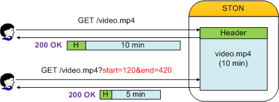
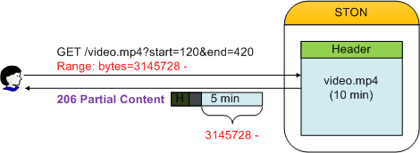
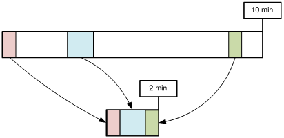
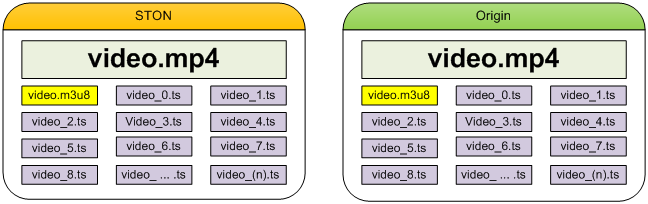
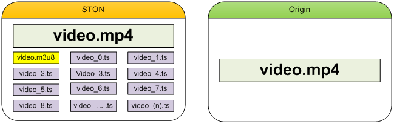
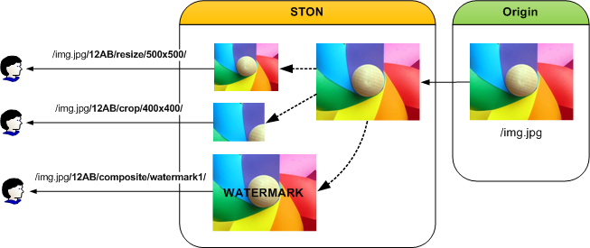

.. _media:

17장. 미디어
******************

이 장에서는 미디어를 스마트하게 서비스하는 방법에 대해 설명한다.
클라이언트 환경과 서비스 다양화와 함께 콘텐츠를 다양한 형태로 가공하는 경우가 많다.
때문에 같은 콘텐츠지만 다양한 형태로 원본서버에 존재하게 된다.
이런 방식은 처리시간과 저장공간의 낭비로 이어질 뿐만 아니라 관리가 어렵다.

.. toctree::
   :maxdepth: 2

MP4/M4A 헤더위치 변경
====================================

보통 MP4포맷의 경우 인코딩 과정 중에는 헤더를 완성할 수 없기 때문에 완료 후 파일의 맨 뒤에 붙인다.
헤더를 앞으로 옮기려면 별도의 처리가 필요하다.
헤더가 뒤에 있다면 이를 지원하지 않는 플레이어에서 Pseudo-Streaming이 불가능하다.
헤더위치 변경을 통해 Pseudo-Streaming을 간편하게 지원할 수 있다.

헤더위치 변경은 전송단계에서만 발생할 뿐 원본의 형태를 변경하지 않는다.
별도의 저장공간을 사용하지도 않는다. ::

   # server.xml - <Server><VHostDefault><Media>
   # vhosts.xml - <Vhosts><Vhost><Media>

   <UpfrontMP4Header>OFF</UpfrontMP4Header>
   <UpfrontM4AHeader>OFF</UpfrontM4AHeader>

-  ``<UpfrontMP4Header>``

   - ``OFF (기본)`` 아무 것도 하지 않는다.

   - ``ON`` 확장자가 .mp4이고 헤더가 뒤에 있다면 헤더를 앞으로 옮겨서 전송한다.

-  ``<UpfrontM4AHeader>``

   - ``OFF (기본)`` 아무 것도 하지 않는다.

   - ``ON`` 확장자가 .m4a이고 헤더가 뒤에 있다면 헤더를 앞으로 옮겨서 전송한다.

처음 요청되는 콘텐츠의 헤더를 앞으로 옮겨야 한다면 헤더를 옮기기위해 필요한 부분을 우선적으로 다운로드 받는다.
아주 영리할뿐만 아니라 빠르게 동작한다.
커튼 뒤의 복잡한 과정과는 상관없이, 클라이언트는 원래부터 헤더가 앞에 있는 온전한 파일을 서비스 받는다.

.. note::

   분석할 수 없거나 깨진 파일이라면 원본형태 그대로 서비스된다.

.. _media-trimming:

Trimming
====================================

시간 값을 기준으로 원하는 구간을 추출한다.
Trimming은 전송단계에서만 발생할 뿐 원본의 형태를 변경하지 않는다.
별도의 저장공간을 사용하지 않는다. ::

   # server.xml - <Server><VHostDefault><Media>
   # vhosts.xml - <Vhosts><Vhost><Media>

   <MP4Trimming StartParam="start" EndParam="end" AllTracks="off">OFF</MP4Trimming>
   <M4ATrimming StartParam="start" EndParam="end" AllTracks="off">OFF</M4ATrimming>
   <MP3Trimming StartParam="start" EndParam="end">OFF</MP3Trimming>

-  ``<MP4Trimming>`` ``<MP3Trimming>`` ``<M4ATrimming>``

   - ``OFF (기본)`` 아무 것도 하지 않는다.

   - ``ON`` 확장자(.mp4, .mp3, .m4a)가 일치하면 원하는 구간만큼 서비스하도록 Trimming한다.
     Trimming구간은 ``StartParam`` 속성과 ``EndParam`` 으로 설정한다.

   - ``AllTracks`` 속성

     - ``OFF (기본)`` Audio/Video 트랙만 Trimming한다. (Mod-H264 방식)

     - ``ON`` 모든 트랙을 Trimming한다. 사용 전 반드시 플레이어 호환성을 확인해야 한다.

파라미터는 클라이언트 QueryString을 통해 입력받는다.
예를 들어 10분 분량의 동영상(/video.mp4)을 특정 구간만 Trimming하고 싶다면 QueryString에 원하는 시점(단위: 초)을 명시한다. ::

   http://vod.wineosoft.co.kr/video.mp4                // 10분 : 전체 동영상
   http://vod.wineosoft.co.kr/video.mp4?end=60         // 1분 : 처음부터 60초까지
   http://vod.wineosoft.co.kr/video.mp4?start=120      // 8분 : 2분(120초)부터 끝까지
   http://vod.wineosoft.co.kr/video.mp4?start=3&end=13 // 10초 : 3초부터 13초까지

``StartParam`` 값이 ``EndParam`` 값보다 클 경우 구간이 지정되지 않은 것으로 판단한다.
이 기능은 HTTP Pseudo-Streaming으로 구현된 동영상 플레이어의 Skip기능을 위해서 개발되었다.
그러므로 Range요청을 처리하는 것처럼 파일을 Offset기반으로 자르지 않고 올바르게 재생될 수 있도록 키프레임과 시간을 인지하여 구간을 추출한다.

클라이언트에게 전달되는 파일은 다음 그림처럼 MP4헤더가 재생성된 완전한 형태의 MP4파일이다.

   완전한 형태의 파일이 제공된다.

추출된 구간은 별도의 파일로 인식되기 때문에 200 OK로 응답된다.
그러므로 다음과 같이 Range헤더가 명시된 경우 추출된 파일로부터 Range를 계산하여 **206 Particial Content** 로 응답한다.

   일반적인 Range요청처럼 처리된다.

구간추출 파라미터가 QueryString 표현을 사용하기 때문에 자칫 :ref:`caching-policy-applyquerystring` 과 헷갈릴 수 있다.
``<ApplyQueryString>`` 설정이 ``ON`` 인 경우 클라이언트가 요청한 URL의 QueryString이 모두 인식되지만 ``StartParam`` 과 ``EndParam`` 은 제거된다. ::

   GET /video.mp4?start=30&end=100
   GET /video.mp4?tag=3277&start=30&end=100&date=20130726

예를 들어 위와 같이 ``StartParam`` 이 **start** 로 ``EndParam`` 이 **end** 로 입력된 경우
이 값들은 구간을 추출하는데 쓰일 뿐 Caching-Key를 생성하거나 원본서버로 요청을 보낼 때는 제거된다.
각각 다음과 같이 인식된다. ::

   GET /video.mp4
   GET /video.mp4?tag=3277&date=20130726

또한 QueryString파라미터는 확장모듈이나 CDN솔루션에 따라 달라질 수 있다.

   JW Player에서 제공하고 있는 Module/CDN별 참고자료

이외의 nginx의 `ngx_http_mp4_module <http://nginx.org/en/docs/http/ngx_http_mp4_module.html>`_ 과,
lighttpd의 `Mod-H264-Streaming-Testing-Version2 <http://h264.code-shop.com/trac/wiki/Mod-H264-Streaming-Testing-Version2>`_ 에서도
모두 **start** 를 QueryString으로 사용하고 있다.

.. _media-multi-trimming:

Multi-Trimming
====================================

시간 값을 기준으로 복수로 지정된 구간을 하나의 영상으로 추출한다.

   /video.mp4?trimming=0-30,210-270,525-555

구간 지정방법만 다를뿐 동작방식은 `Trimming`_ 과 동일하다. ::

   # server.xml - <Server><VHostDefault><Media>
   # vhosts.xml - <Vhosts><Vhost><Media>

   <MP4Trimming MultiParam="trimming" MaxRatio="50">OFF</MP4Trimming>
   <M4ATrimming MultiParam="trimming">OFF</M4ATrimming>

-  ``<MP4Trimming>`` ``<M4ATrimming>``

   - ``MultiParam (기본: "trimming")``
     설정된 이름을 QueryString Key로 사용하여 추출 구간을 지정한다.
     하나의 구간은 "시작시간 - 종료시간" 으로 표기하며 각 구간은 콤마(,)로 연결한다.

   - ``MaxRatio (기본: 50%)``
     Multi-Trimming된 영상은 원본보다 ``MaxRatio (최대 100%)`` 비율만큼까지 커질 수 있다.
     ``MaxRatio`` 를 넘어가는 구간은 무시된다.

예를 들어 다음과 같이 호출하면 3분짜리 영상이 생성된다. ::

   http://example.com/video.mp4?trimming=10-70,560-620,1245-1305

같은 영상을 반복하거나 앞 뒤가 바뀐 영상을 만들 수도 있다. ::

   http://example.com/video.mp4?trimming=17-20,17-20,17-20,17-20
   http://example.com/video.mp4?trimming=1000-1200,500-623,1900-2000
   http://example.com/video.mp4?trimming=600-,400-600

구간 값을 지정하지 않은 경우 맨 앞 또는 맨 뒤를 의미한다.

.. note::

   `Multi-Trimming`_ 은 `Trimming`_ 보다 우선한다.
   QueryString에 `Multi-Trimming`_ 키가 명시되어 있다면 `Trimming`_ 키는 무시된다.

.. _media-hls:

MP4 HLS
====================================

MP4파일을 HLS(HTTP Live Streaming)로 서비스한다.
원본서버는 더 이상 HLS서비스를 위해 파일을 분할저장할 필요가 없다.
MP4파일 헤더의 위치에 상관없이 다운로드와 동시에 실시간으로 .m3u8/.ts파일 변환 후 서비스한다.

..  note::

    MP4HLS는 Elementary Stream(Video 또는 Audio)을 변환하는 트랜스코딩(Transcoding)이 아니다.
    그러므로 HLS에 적합한 형식으로 인코딩된 MP4파일에 한해서 원활한 단말 재생이 가능하다.
    인코딩이 적합하지 않을 경우 화면이나 깨지거나 소리가 재생되지 않을 수 있다.
    현재(2014.2.20) Apple에서 밝히고 있는 Video/Audio 인코딩 규격은 다음과 같다.

    What are the specifics of the video and audio formats supported?
    Although the protocol specification does not limit the video and audio formats, the current Apple implementation supports the following formats:

    [Video]
    H.264 Baseline Level 3.0, Baseline Level 3.1, Main Level 3.1, and High Profile Level 4.1.

    [Audio]
    HE-AAC or AAC-LC up to 48 kHz, stereo audio
    MP3 (MPEG-1 Audio Layer 3) 8 kHz to 48 kHz, stereo audio
    AC-3 (for Apple TV, in pass-through mode only)

    Note: iPad, iPhone 3G, and iPod touch (2nd generation and later) support H.264 Baseline 3.1. If your app runs on older versions of iPhone or iPod touch, however, you should use H.264 Baseline 3.0 for compatibility. If your content is intended solely for iPad, Apple TV, iPhone 4 and later, and Mac OS X computers, you should use Main Level 3.1.

기존 방식의 경우 Pseudo-Streaming과 HLS를 위해 다음과 같이 원본파일이 각각 존재해야 한다.
이런 경우 STON 역시 원본 파일을 그대로 복제하여 고객에게 서비스한다.
하지만 재생시간이 길수록 파생파일은 많아지며 관리의 어려움은 증가한다.

   수고가 많은 HLS

``<MP4HLS>`` 는 원본파일로부터 HLS서비스에 필요한 파일을 동적으로 생성한다.

   똑똑한 HLS

모든 .m3u8/.ts파일은 원본파일에서 파생되며 별도의 저장공간을 소비하지 않는다.
서비스 즉시 메모리에 임시적으로 생성되며 서비스되지 않을 때 자동으로 없어진다. ::

   # server.xml - <Server><VHostDefault><Media>
   # vhosts.xml - <Vhosts><Vhost><Media>

   <MP4HLS Status="Inactive" Keyword="mp4hls">
      <Index Ver="3" Alternates="off">index.m3u8</Index>
      <Sequence>0</Sequence>
      <Duration>10</Duration>
      <AlternatesName>playlist.m3u8</AlternatesName>
   </MP4HLS>

-  ``<MP4HLS>``

   - ``Status (기본: Inactive)`` 값이 ``Active`` 일 때만 활성화된다.

   - ``Keyword (기본: mp4hls)`` HLS 서비스 키워드

-  ``<Index> (기본: index.m3u8)`` HLS 인덱스(.m3u8) 파일명

   - ``Ver (기본 3)`` 인덱스 파일 버전.
     3인 경우 ``#EXT-X-VERSION:3`` 헤더가 명시되며 ``#EXTINF`` 의 시간 값이 소수점 3째 자리까지 표시된다.
     1인 경우 ``#EXT-X-VERSION`` 헤더가 없으며, ``#EXTINF`` 의 시간 값이 정수(반올림)로 표시된다.

   - ``Alternates (기본: OFF)`` Stream Alternates 사용여부.

     .. figure:: img/hls_alternates_off.png
        :align: center

        OFF. ``<Index>`` 에서 TS목록을 서비스한다.

     .. figure:: img/hls_alternates_on.png
        :align: center

        ON. ``<AlternatesName>`` 에서 TS목록을 서비스한다.

-  ``<Sequence> (기본: 0)`` .ts 파일의 시작 번호. 이 수를 기준으로 순차적으로 증가한다.

-  ``<Duration> (기본: 10초)`` MP4를 HLS로 분할하는 기준 시간(초).
   분할의 기준은 Video/Audio의 KeyFrame이다.
   KeyFrame은 들쭉날쭉할 수 있으므로 정확히 분할되지 않는다.
   만약 10초로 분할하려는데 KeyFrame이 9초와 12초에 있다면 가까운 값(9초)을 선택한다.

-  ``<AlternatesName> (기본: playlist.m3u8)`` Stream Alternates 파일명. ::

      http://www.example.com/video.mp4/mp4hls/playlist.m3u8

서비스 주소가 다음과 같다면 해당 주소로 Pseudo-Streaming을 진행할 수 있다. ::

    http://www.example.com/video.mp4

가상호스트는 ``<MP4HLS>`` 에 정의된 ``Keyword`` 문자열을 인식함으로써 HLS서비스를 진행한다.
다음 URL이 호출되면 /video.mp4로부터 index.m3u8파일을 생성한다. ::

   http://www.example.com/video.mp4/mp4hls/index.m3u8

``Alternates`` 속성이 ON이라면 ``<Index>`` 파일은 ``<AlternatesName>`` 파일을 서비스한다. ::

   #EXTM3U
   #EXT-X-VERSION:3
   #EXT-X-STREAM-INF:PROGRAM-ID=1,BANDWIDTH=200000,RESOLUTION=720x480
   /video.mp4/mp4hls/playlist.m3u8

``#EXT-X-STREAM-INF`` 의 Bandwidth와 Resolution은 영상을 분석하여 동적으로 제공한다.

.. note::

   Stream Alternates를 제공하긴 하지만 현재 버전에서 index.m3u8는 항상 하나의 서브 인덱스 파일(playlist.m3u8)만을 제공한다.
   캐시 입장에서는 video_1080.mp4와 video_720.mp4가 (인코딩 옵션만 다른) 같은 영상인지 알 수 없기 때문이다.

최종적으로 생성된 .ts 목록(버전 3)은 다음과 같다. ::

   #EXTM3U
   #EXT-X-TARGETDURATION:10
   #EXT-X-VERSION:3
   #EXT-X-MEDIA-SEQUENCE:0
   #EXTINF:11.637,
   /video.mp4/mp4hls/0.ts
   #EXTINF:10.092,
   /video.mp4/mp4hls/1.ts
   #EXTINF:10.112,
   /video.mp4/mp4hls/2.ts

   ... (중략)...

   #EXTINF:10.847,
   /video.mp4/mp4hls/161.ts
   #EXTINF:9.078,
   /video.mp4/mp4hls/162.ts
   #EXT-X-ENDLIST

분할에는 3가지 정책이 있다.

-  **KeyFrame 간격보다** ``<Duration>`` **설정이 큰 경우**
   KeyFrame이 3초, ``<Duration>`` 이 20초라면 20초를 넘지 않는 KeyFrame의 배수인 18초로 분할된다.

-  **KeyFrame 간격과** ``<Duration>`` **이 비슷한 경우**
   KeyFrame이 9초, ``<Duration>`` 이 10초라면 10초를 넘지 않는 KeyFrame의 배수인 9초로 분할된다.

-  **KeyFrame 간격이** ``<Duration>`` **설정보다 큰 경우**
   KeyFrame단위로 분할된다.

다음 클라이언트 요청에 대해 STON이 어떻게 동작하는지 이해해보자. ::

   GET /video.mp4/mp4hls/99.ts HTTP/1.1
   Range: bytes=0-512000
   Host: www.wineosft.com

1.	``STON`` 최초 로딩. (아무 것도 캐싱되어 있지 않음.)
#.	``Client`` HTTP Range 요청. (100번째 파일의 최초 500KB 요청)
#.	``STON`` /video.mp4 파일 캐싱객체 생성.
#.	``STON`` /video.mp4 파일 분석을 위해 필요한 부분만을 원본서버에서 다운로드
#.	``STON`` 100번째(99.ts)파일 서비스를 위해 필요한 부분만을 원본서버에서 다운로드
#.	``STON`` 100번째(99.ts)파일 생성 후 Range 서비스
#.	``STON`` 서비스가 완료되면 99.ts파일 파괴

.. note::

   ``MP4Trimming`` 기능이 ``ON`` 이라면 Trimming된 MP4를 HLS로 변환할 수 있다. (HLS영상을 Trimming할 수 없다. HLS는 MP4가 아니라 MPEG2TS 임에 주의하자.)
   영상을 Trimming한 뒤, HLS로 변환하기 때문에 다음과 같이 표현하는 것이 자연스럽다. ::

      /video.mp4?start=0&end=60/mp4hls/index.m3u8

   동작에는 문제가 없지만 QueryString을 맨 뒤에 붙이는 HTTP 규격에 어긋난다.
   이를 보완하기 위해 다음과 같은 표현해도 동작은 동일하다. ::

      /video.mp4/mp4hls/index.m3u8?start=0&end=60
      /video.mp4?start=0/mp4hls/index.m3u8?end=60

.. _media-mp3-hls:

MP3 HLS
====================================

MP3파일을 HLS(HTTP Live Streaming)로 서비스한다. ::

   # server.xml - <Server><VHostDefault><Media>
   # vhosts.xml - <Vhosts><Vhost><Media>

   <MP3HLS Status="Inactive" Keyword="mp3hls">
      <Index Ver="3" Alternates="off">index.m3u8</Index>
      <Sequence>0</Sequence>
      <Duration>10</Duration>
      <AlternatesName>playlist.m3u8</AlternatesName>
   </MP3HLS>

모든 설정과 동작방식이 `MP4 HLS`_ 와 동일하다.

.. note::

   `MP4 HLS`_ 와 `MP3 HLS`_ 가 같은 ``Keyword`` 로 설정되어 있을 경우 `MP3 HLS`_ 는 동작하지 않는다.

.. _media-dims:

DIMS
====================================

DIMS(Dynamic Image Management System)는 원본이미지를 다양한 형태로 가공하는 기능이다.
`mod_dims <https://code.google.com/p/moddims/wiki/WebserviceApi>`_ 를 기반으로 확장한 형태이다.
가공형태는 모두 7가지(optimize, crop, thumbnail, resize, reformat, quality, composite)이며 이를 조합한 복합가공이 가능하다.

   다양한 동적 이미지 가공

이미지는 동적으로 생성되며 원본 이미지 URL뒤에 약속된 키워드와 가공옵션을 붙여서 호출한다.
가공된 이미지는 캐싱되어 원본서버 이미지가 바뀌지 않는 이상 다시 가공되지 않는다.

예를 들어 원본 파일이 /img.jpg라면 다음과 같은 형식으로 이미지를 가공할 수 있다.
("12AB"는 약속된 Keyword이다.) ::

   http://image.example.com/img.jpg    // 원본 이미지
   http://image.example.com/img.jpg/12AB/optimize
   http://image.example.com/img.jpg/12AB/resize/500x500/
   http://image.example.com/img.jpg/12AB/crop/400x400/
   http://image.example.com/img.jpg/12AB/composite/watermark1/

``<Dims>`` 는 별도로 설정하지 않으면 모두 비활성화되어 있다. ::

   # server.xml - <Server><VHostDefault><Options>
   # vhosts.xml - <Vhosts><Vhost><Options>

   <Dims Status="Active" Keyword="dims" MaxSourceSize="10" OnFailure="message" />

-  ``<Dims>``

   - ``Status`` DIMS활성화 ( ``Active`` 또는 ``Inactive`` )
   - ``Keyword`` 원본과 DIMS를 구분하는 키워드
   - ``MaxSourceSize (기본: 10MB)`` 변환을 허용할 최대 원본 이미지 크기 (단위: MB)
   - ``OnFailure`` 이미지 변환실패 시 동작방식

     - ``message (기본)`` 500 Internal Error로 응답한다. 본문에는 구체적인 실패 이유를 명시한다.

       - ``The original file was not successfully downloaded.`` 원본이미지를 완전하게 다운로드 하지 못했다.
       - ``The original file size is too large.`` 원본이미지 크기가 ``MaxSourceSize`` 를 넘어 변환하지 못했다.
       - ``The original file loading failed.`` 원본 이미지 데이터를 불러오지 못했다.
       - ``Image converting failed or invalid DIMS command.`` 잘못된 명령어 또는 지원되지 않는 이미지등으로 인해 변환하지 못했다.

     - ``redirect`` 원본 이미지 주소로 302 Redirect한다.

최적화
-----------------------

최적화란 이미지 품질을 저하시키지 않으면서 이미지를 압축하는 과정이다.
JPEG, JPEG-2000, Loseless-JPEG 이미지만 지원이 가능하다.
이미 다른 도구등을 통해 최적화된 이미지는 더 이상 최적화되지 않는다. ::

   http://image.example.com/img.jpg/dims/optimize

최적화는 키워드 이외 별도의 옵션을 가지지 않는다.
그러므로 다른 변환조건과 조합할 때 맨 뒤에 명시하는 편이 바람직하다. ::

   http://image.example.com/img.jpg/dims/resize/100x100/optimize

다른 모든 DIMS기능이 시스템 자원을 많이 사용하지만 그 중에서도 최적화가 가장 무거운 작업이다.
다음은 HitRatio가 0%인 상태에서 이미지 크기별 성능 테스트 결과이다.

-  ``OS`` CentOS 6.2 (Linux version 2.6.32-220.el6.x86_64 (mockbuild@c6b18n3.bsys.dev.centos.org) (gcc version 4.4.6 20110731 (Red Hat 4.4.6-3) (GCC) ) #1 SMP Tue Dec 6 19:48:22 GMT 2011)
-  ``CPU`` `Intel(R) Xeon(R) CPU E3-1230 v3 @ 3.30GHz (8 processors) <http://www.cpubenchmark.net/cpu.php?cpu=Intel+Xeon+E3-1230+v3+%40+3.30GHz>`_
-  ``RAM`` 16GB
-  ``HDD`` SMC2108 SAS 275GB X 3EA

====== ======= ============= ======================= ================== ================
크기   처리량  응답속도(ms)  클라이언트 트래픽(Mbps) 원본 트래픽(Mbps)  트래픽 절감률(%)
====== ======= ============= ======================= ================== ================
16KB   720     19.32         46.32                   92.62              49.99
32KB   680     20.68         86.42                   165.08             47.65
64KB   285     50.16         80.67                   150.96             46.56
128KB  274     57.80         164.35                  276.52             40.56
256KB  210     80.74         99.42                   432.35             77.00
512KB  113     156.18        160.54                  436.04             63.18
1MB    20      981.07        90.62                   179.88             49.62
====== ======= ============= ======================= ================== ================

약 50%내외의 트래픽 절감률이 있으므로 매우 효과적이다.
다시 한번 말하지만 최적화는 매우 무거운 작업이다.
표를 통해 알 수 있듯이 이미지 크기가 가장 큰 변수가 된다.

때문에 충분한 고려없이 서비스에 적용했다가는 큰 낭패를 볼 수 있다.
적당한 :ref:`adv_topics_req_hit_ratio` 가 있는 상황이 바람직하나,
그렇지 않다면 서비스 규모에 맞게 물리적인 CPU자원을 충분히 확보해야 한다.

잘라내기
-----------------------

좌상단을 기준으로 원하는 영역만큼 이미지를 잘라낸다.
영역은 **widthxheight{+-}x{+-}y {@} {!} {<} {>}** 로 표현한다.
기본적으로 이미지의 가로와 세로는 최대값을 사용한다.
이미지를 확대 또는 축소하여도 가로 세로 비율은 유지된다.
정확하게 지정한 크기로 이미지를 조절할 때는 크기 뒤에 느낌표(!)를 추가한다.
**640X480!** 라는 표현은 정확하게 640x480 크기의 Thumbnail을 생성한다는 뜻이다.
만약 가로 또는 세로 크기만 지정된 경우, 생략된 값은 가로/세로 비율에 의해 자동결정 된다.

예를 들어 **/thumbnail/100/** 은 가로 크기에 맞추어 세로 크기가 결정되며
**/thumbnail/x200/** 은 세로 크기에 맞추어 가로 크기가 결정된다.
가로/세로 크기를 이미지의 크기에 맞추어 백분율(%)로 표현할 수 있다.
이미지 크기를 늘리려면, 100 보다 큰 값(예 : 125 %)을 사용한다.
이미지 크기를 줄이려면 100 미만의 비율을 사용한다.
URL Encoding규칙에 따라 %문자가 %25로 인코딩 됨을 명심해야 한다.

예를 들어 50%라는 표현은 50%25로 인코딩 된다.
다음은 width=78, height=110크기의 Thumbnail을 생성하는 예제다. ::

   http://image.example.com/img.jpg/dims/thumbnail/78x110/

Resizing
-----------------------

이미지 크기를 변경한다.
크기는 **width x height** 로 표현한다.
이미지는 변경되어도 비율은 유지된다.
다음은 원본 이미지를 width=200, height=200크기로 변경하는 예제다. ::

   http://image.example.com/img.jpg/dims/resize/200x200/

Format 변경
-----------------------

이미지 포맷을 변경한다.
지원되는 포맷은 "png", "jpg", "gif" 이다.
다음은 JPG를 PNG로 변환하는 예제다. ::

   http://image.example.com/img.jpg/dims/format/png/

품질 변경
-----------------------

이미지 품질을 조절한다.
이 기능은 전송되는 이미지 용량을 줄일 수 있어서 효과적이다.
유효 범위는 0부터 100까지다.
다음은 이미지 품질을 25%로 조절하는 예제다. ::

   http://image.example.com/img.jpg/dims/quality/25/

합성
-----------------------

두 이미지를 합성한다.
앞서 설명한 기능과는 다르게 합성조건은 미리 설정되어 있어야 한다.
주로 워터마크 효과를 내기 위해 사용된다. ::

   # server.xml - <Server><VHostDefault><Options>
   # vhosts.xml - <Vhosts><Vhost><Options>

   <Dims Status="Active" Keyword="dims" port="8500">
      <Composite Name="water1" File="/img/small.jpg" />
      <Composite Name="water2" File="/img/medium.jpg" Gravity="se" Geometry="+0+0" Dissolve="50" />
      <Composite Name="water_ratio" File="/img/wmark_s.png" Gravity="s" Geometry="+0+15%" Dissolve="100" />
   </Dims>

-  ``<Composite>``

    이미지 합성조건을 설정한다. 속성에 의해 정해지며 별도의 값을 가지지 않는다.

    -  ``Name`` 호출될 이름을 지정한다.
       '/'문자는 입력할 수 없다.
       URL의 "/composite/" 뒤에 위치합니다.

    -  ``File`` 합성할 이미지파일 경로를 지정한다.

    -  ``Gravity (기본: c)`` 합성할 위치는 좌측상단부터 9가지의 포인트(nw, n, ne, w, c, e, sw, s, se)가 존재합니다.

       .. figure:: img/conf_dims2.png
          :align: center

          Gavity 기준점

    -  ``Geometry (기본: +0+0)`` ``Gravity`` 기준으로 합성할 이미지 위치를 설정한다.
       {+-}x{+-}y. 붉은색 원은 Gravity속성에 따라 +0+0이 의미하는 기준점으로 +x+y의
       값이 커질수록 이미지 안쪽으로 배치된다.
       초록색 화살표는 +x, 보라색 화살표는 +y가 증가하는 방향이다.
       -x-y를 사용하면 대상 이미지의 바깥에 위치하게 되어 결과 이미지에서는 보여지지 않는다.
       이 속성은 다소 복잡해 보이지만 이미지 크기를 자동으로 계산하여 배치하므로
       일관된 결과물을 얻을 수 있어서 효과적이다.
       또한 +x%+y% 처럼 %옵션을 주어 비율로 배치할 수도 있다.

    -  ``Dissolve (기본: 50)`` 합성할 이미지의 투명도(0~100).

``<Composite>`` 을 설정했다면 ``Name`` 속성을 사용하여 이미지를 합성할 수 있다. ::

    http://image.example.com/img.jpg/dims/composite/water1/

원본이미지 조건판단
-----------------------

원본 이미지 조건에 따라 동적으로 가공 옵션을 다르게 적용할 수 있다.
예를 들어 1024 X 768 이하의 이미지는 품질을 50%로 떨어트리고 그 이상의
이미지는 1024 X 768로 크기변환을 하려면 다음과 같이 ``<ByOriginal>`` 을 설정한다. ::

   # server.xml - <Server><VHostDefault><Options>
   # vhosts.xml - <Vhosts><Vhost><Options>

   <Dims Status="Active" Keyword="dims" port="8500">
      <ByOriginal Name="size1">
         <Condition Width="1024" Height="768">/quality/50/</Condition>
         <Condition>/resize/1024x768/</Condition>
      </ByOriginal>
   </Dims>

-  ``<ByOriginal>``
   ``Name`` 속성으로 호출한다.
   하위에 다양한 조건의 ``<Condition>`` 을 설정한다.

-  ``<Condition>``
   조건에 만족하는 경우 설정된 변환을 수행한다.

   - ``Width`` 가로 길이가 설정 값보다 작으면 적용된다.
   - ``Height`` 세로 길이가 설정 값보다 작으면 적용된다.

   조건을 설정하지 않으면 원본 이미지 크기에 상관없이 변환된다.

``<Condition>`` 은 명시된 순서대로 적용된다.
그러므로 작은 이미지 조건을 먼저 배치해야 한다.
다음과 같이 호출한다. ::

   http://image.example.com/img.jpg/dims/byoriginal/size1/

또 다른 예로 이미지 크기에 따라 다른 ``<Composite>`` 조건을 줄 수 있다.
이런 경우 다음과 같이 사전에 정의된 ``<Composite>`` 의 ``Name`` 으로 설정한다. ::

   # server.xml - <Server><VHostDefault><Options>
   # vhosts.xml - <Vhosts><Vhost><Options>

   <Dims Status="Active" Keyword="dims" port="8500">
      <Composite Name="water1" File="/img/small.jpg" />
      <Composite Name="water2" File="/img/medium.jpg" Gravity="se" Geometry="+0+0" Dissolve="50" />
      <Composite Name="water3" File="/img/big.jpg" Gravity="se" Geometry="+10+10" Dissolve="50" />
      <ByOriginal Name="size_water">
         <Condition Width="400">/composite/water1/</Condition>
         <Condition Width="800">/composite/water2/</Condition>
         <Condition>/composite/water3/</Condition>
      </ByOriginal>
   </Dims>

다음과 같이 호출하면 원본 이미지 크기에 따라 합성이 적용된다. ::

   http://image.example.com/img.jpg/dims/byoriginal/size_water/

.. _media-dims-anigif:

Animated GIF
-----------------------

Animated GIF에 대해서도 모든 DIMS변환이 동일하게 적용된다.
처리 순서는 다음과 같다.

1. Animated GIF를 낱개의 이미지들로 분해한다.
2. 각각의 이미지를 변환한다.
3. 변환된 이미지를 Animated GIF로 결합한다.

결합된 이미지가 많을수록 처리비용이 높아 서비스 품질이 저하될 수 있다.
이런 경우 첫 번째 이미지에 대해서만 변환하도록 설정하면 처리 비용을 낮출 수 있다. ::

   # server.xml - <Server><VHostDefault><Options>
   # vhosts.xml - <Vhosts><Vhost><Options>

   <Dims FirstFrameOnly="OFF" />

-  ``FirstFrameOnly (기본: OFF)`` ON인 경우 Animated GIF의 첫 장면만 변환한다.

다음과 같이 URL을 호출할 때 ``FirstFrameOnly`` 옵션을 명시적으로 지정할 수 있다. ::

   http://image.example.com/img.jpg/dims/firstframeonly/on/resize/200x200/
   http://image.example.com/img.jpg/dims/firstframeonly/off/resize/200x200/

위와 같이 URL에 명시적으로 지정되어 있는 경우 설정보다 우선한다.

기타
-----------------------

이상의 기본기능을 결합하여 복합적인 이미지 가공을 할 수 있다.
예를 들어 Thumbnail생성(78x110), 포맷을 JPG에서 PNG로 변환, 품질 50% 이상의 옵션을 한번의 호출로 실행할 수 있다. ::

   http://image.example.com/img.jpg/dims/thumbnail/78x110/format/png/quality/50/

DIMS는 URL을 이용하여 이미지 가공이 이루어진다.
그러므로 URL에 영향을 주는 다른 옵션들 때문에 원하지 않는 결과가 얻어지지 않도록 주의해야 한다.

-  :ref:`caching-policy-applyquerystring` 이 ``OFF`` 라면 키워드 이전의 QueryString이 무시된다. ::

      http://image.example.com/img.jpg?session=5234&type=37/dims/resize/200x200/

   위와 같은 호출에 이 설정이 ``ON`` 이라면 입력된 URL 그대로 인식되지만 OFF라면 다음과 같이 인식된다. ::

      http://image.example.com/img.jpg/dims/resize/200x200/

-  :ref:`caching-policy-casesensitive` 이 ``OFF`` 라면 모든 URL을 소문자로 변환하여 처리한다.
   그러므로 DIMS 키워드에 대문자가 포함되었다면 키워드를 인식하지 못한다.
   항상 키워드는 소문자로 사용하는 것이 좋다.
