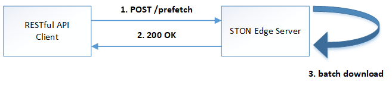
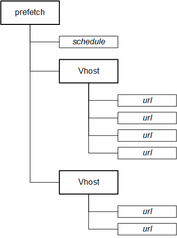
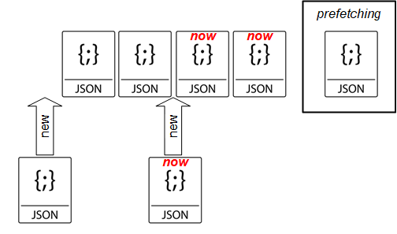

.. _prefetch:

22장. Prefetch
******************

이 장에서는 콘텐츠를 미리 캐시에 배포하는 Prefetch에 대해 설명한다.

Prefetch는 관리자가 Manager port를 통해 Job(Prefetch 파일목록)을 업로드 하는 것으로 동작한다. 
업로드 된 Job은 설정시간에 순차적으로 다운로드 된다.

API
====================================

Prefetch용 HTTP API를 지원한다.

-  Job 등록
-  Job 조회 (+ 상태필터)
-  Job 삭제

모든 API는 Job 단위로 동작한다.

Job 등록
------------------------------------

관리자는 다음 주소로 Job을 POST 메소드로 업로드 한다. ::

   http://{STON-IP}:{ManagerPort}/prefetch

업로드 파일 구조는 가상호스트 별로 URL 목록이 나열된 구조이다.

아래는 샘플 파일목록이다. ::

    {
        "prefetch" : {
            "schedule" : "now",
            "vhosts" : [
                {
                    "vhost" : "foo.com",
                    "urls" : [
                        { "url" : "/log.zip" },
                        { "url" : "/sample/data" },
                        { "url" : "/product/catalog/beauty.pdf?code=1203" }
                    ]
                },
                {
                    "vhost" : "bar.com",
                    "urls" : [
                        { "url" : "/demo.zip", "header1": "1323901283" },
                        { "url" : "/search/topN.list", "keyword": "shoe" }
                    ]
                }
            ]
        }
    }

규칙은 다음과 같다.

-  ``url`` 은 가상호스트 하위에 위치하며 반드시 "/" 로 시작해야 한다.
-  ``url`` 의 대소문자 구분은 가상호스트 설정을 따른다.
-  가상호스트가 `Accept-Encoding헤더 <https://ston.readthedocs.io/ko/latest/admin/caching_policy.html#accept-encoding>`_ 를 구분하도록 설정되었다면 다운로드는 ON/OFF 를 구분하여 2번 이루어진다.
-  접수된 파일목록은 예정된 시간에 수행되지만 ``schedule`` 속성이 ``now`` 인 경우 (현재 작업 중인 prefetch가 없다면) 즉시 시작된다.
-  (bar.com의 예와 같이) 만약 가상호스트에 별도의 커스터마이징 모듈이 연동되어 있다면 예제의 ``header1`` 나 ``keyword`` 처럼 커스텀 필드로 확장 가능하다.

Job 목록조회
------------------------------------

Prefetch 진행 상태를 API로 조회 가능하다.(최대 1,000개) ::

   http://{STON-IP}:{ManagerPort}/prefetch/list
   http://{STON-IP}:{ManagerPort}/prefetch/list?status=...

-  ``status`` Job 상태 필터링

   -  ``wait`` 대기 중
   -  ``downloading`` 다운로드 중
   -  ``success`` 성공
   -  ``fail`` 실패

응답 예제는 다음과 같다. ::

    {
        "prefetch-list":[
            {
                "id":"1579492339-6c00ab48",
                "type":"now",
                "status":"success",
                "total-url-count":4,
                "success-url-count":4,
                "registration-time":"2020-01-20T03:52:19Z",
                "execution-time":"2020-01-20T03:52:20Z",
                "completion-time":"2020-01-20T03:52:21Z"
            }, {
                "id":"1579492340-6c0b82b8",
                "type":"now",
                "status":"success",
                "total-url-count":4,
                "success-url-count":4,
                "registration-time":"2020-01-20T03:52:20Z",
                "execution-time":"2020-01-20T03:52:22Z",
                "completion-time":"2020-01-20T03:52:22Z"
            }, {
                "id":"1579492341-6c0ba138",
                "type":"now",
                "status":"success",
                "total-url-count":4,
                "success-url-count":4,
                "registration-time":"2020-01-20T03:52:21Z",
                "execution-time":"2020-01-20T03:52:23Z",
                "completion-time":"2020-01-20T03:52:23Z"
            }, {
                "id":"1579492341-6c0bae98",
                "type":"now",
                "status":"success",
                "total-url-count":4,
                "success-url-count":4,
                "registration-time":"2020-01-20T03:52:21Z",
                "execution-time":"2020-01-20T03:52:24Z",
                "completion-time":"2020-01-20T03:52:25Z"
            }, {
                "id":"1579492342-6c0dca98",
                "type":"now",
                "status":"success",
                "total-url-count":4,
                "success-url-count":4,
                "registration-time":"2020-01-20T03:52:22Z",
                "execution-time":"2020-01-20T03:52:26Z",
                "completion-time":"2020-01-20T03:52:26Z"
            }, {
                "id":"1579492404-6c0f13f8",
                "type":"now",
                "status":"fail",
                "total-url-count":4,
                "success-url-count":0,
                "registration-time":"2020-01-20T03:53:24Z",
                "reservation-time":"2020-01-20T03:53:55Z",
                "execution-time":"2020-01-20T03:53:55Z",
                "completion-time":"2020-01-20T03:53:55Z",
                "last-failure-time":"2020-01-20T03:53:55Z",
                "failure-url":"/hideface/test1234.jpg"
            }
        ]
    }

응답필드 목록은 다음과 같다.

-  ``id`` - Job ID
-  ``type`` - Job 스케쥴링 타입 ( ``now`` , ``reserved`` , ``schedule`` )
-  ``status`` - wait, downloading, success, fail
-  ``total-url-count`` - 전체 URL 개수
-  ``success-url-count`` - 다운로드 성공 URL 개수
-  ``registration-time`` - Job 등록 시간
-  ``reservation-time`` - (예약 Job인 경우) 예약된 시간
-  ``execution-time`` - Job 수행 시간
-  ``completion-time`` - Job 완료 시간
-  ``last-failure-time`` - 마지막 Job 실패 시간
-  ``failure-url`` - 실패한 URL

모든 시간표현은 ISO 8601규격으로 제공된다.

Job 상세조회
------------------------------------
특정 Job만을 조회하고 싶을 경우 등록된 ``id`` 를 통해 조회 가능하다. ::

   http://{STON-IP}:{ManagerPort}/prefetch/item?id=1579492339-6c00ab48

Job 취소
------------------------------------
아직 수행되지 않은 Job에 한하여 삭제가 가능하다. ::

   http://{STON-IP}:{ManagerPort}/prefetch/item/remove?id=1579492339-6c00ab48

   

POST 지원
====================================

prefetch는 GET 메소드를 기본으로 한다. 
POST 메소드 원본서버와 통신해야 할 경우 다음과 같이 ``method`` , ``post-body`` 필드를 확장한다. ::

    {
        "prefetch" : {
            "schedule" : "now",
            "vhosts" : [
                {
                    "vhost" : "foo.com",
                    "urls" : [
                        { 
                            "url" : "/log.zip",
                            "method" : "post",
                            "post-body" : "home=Cosby&favorite+flavor=flies"
                        },
                        {
                            "url" : "/sample/data", 
                            "method" : "post",
                            "post-body" : "--boundary\nContent-Disposition: form-data; name=\"field1\""
                        }
                    ]
                }
            ]
        }
    }

-  ``method`` POST 다운로드의 경우 항상 ``post`` 이다.
-  ``post-body`` POST 메소드로 원본서버에 보낼 Body 데이터.

스케쥴링
====================================

파일을 원하는 시점에 미리 캐싱 해두면 서비스 품질 향상과 원본 부하분산 효과를 동시에 얻을 수 있다. 

스케쥴링에는 3가지 방식이 제공된다.

1. Prefetch 시간을 고정한다. ``schedule`` 속성을 생략한다. ::

      # server.xml - <Server>

      <Cache>
        <Prefetch>
          <Time>04:00</Time>
          <Concurrent>5</Concurrent>
          <Log Type="size" Unit="5" Retention="5" SysLog="OFF" Compression="OFF">ON</Log>
        </Prefetch>
      </Cache>

   -  ``<Time> (기본: AM 4)`` 등록된 prefetch 를 수행할 시간을 설정한다. 오후 11시 10분을 설정하고 싶다면 23:10으로 설정한다.
   -  ``<Concurrent> (기본: 5)`` 동시에 다운로드를 진행할 세션 수를 설정한다.
   -  ``<Log>`` Prefetch 상세로그를 구성한다.

2. 즉시 Prefetch를 수행한다. 
   ``schedule`` 속성을 ``now`` 로 지정한다. ::

        {
            "prefetch" : {
                "schedule" : "now",
                "vhosts" : [ ... (생략) ... ]
            }
        }

3. Prefetch 시간을 예약한다.
   ``schedule`` 속성을 ``reserved`` 로 지정하고 ``reservation-time`` 을 반드시 ISO-8601 규격으로 명시한다. ::

        {
            "prefetch" : {
                "schedule" : "reserved",
                "reservation-time" : "2019-11-19T09:00:00Z",
                "vhosts" : [ ... (생략) ... ]
            }
        }

수행정책은 다음과 같다.

-  Prefetch 스케쥴러의 기본 동작은 FIFO(First Input First Out) 이다.
-  현재 진행 중인 Prefetch 목록은 간섭받지 않는다.
-  ``schedule`` 이 ``now`` 인 목록이 그렇지 않은 목록보다 항상 우선한다. ``now``목록끼리는 FIFO 로 수행된다.
-  ``schedule`` 이 ``reserved`` 인 목록의 시간이 같을 경우 FIFO 로 수행된다.
-  ``schedule`` 이 ``reserved`` 인 목록이 경쟁에서 밀려 수행시간이 지나면 다른 ``reserved`` 보다 우선 수행된다.

재시도 정책
------------------------------------

일시적인 네트워크 장애 등으로 인해 다운로드에 문제가 발생할 수 있다. 
재시도 정책을 통해 Prefetch 신뢰도를 향상시킬 수 있다. ::

    # server.xml - <Server>

    <Cache>
        <Prefetch>
            <MaxRetry>3</MaxRetry>
            <RetryInterval>60</RetryInterval>
        </Prefetch>
    </Cache>

-  ``<MaxRetry> (기본: 3회)`` 다운로드 실패시 재시도 횟수 (최소 1회)
-  ``<RetryInterval> (기본: 60초)`` 재시도 간격 (최소 1초)

로그
====================================

Prefetch 로그는 2가지로 구분된다. 

먼저 Prefetch 목록의 접수와 실행은 info.log에 기록된다. ::

    2019-11-19 16:54:17 [INFO] [PREFETCH] Register task. (Task: 1574148743_4.reserved)
    2019-11-19 16:54:18 [INFO] [PREFETCH] Start task. (Task: 1574148743_4.reserved)
    2019-11-19 16:54:20 [INFO] [PREFETCH] Complete task. (Task: 1574148743_4.reserved)
    2019-11-19 17:00:00 [INFO] [PREFETCH] Start task. (Task: 1574150029_2.scheduled)
    2019-11-19 17:00:03 [INFO] [PREFETCH] Complete task. (Task: 1574150029_2.scheduled)
    2019-11-19 17:00:04 [INFO] [PREFETCH] Start task. (Task: 1574149879_0.scheduled)

위 로그 파일에서 알 수 있듯이 업로드된 형태 그대로 prefetch 디렉토리에 기록된다.  
등록된 목록은 예약시점인 오전 2시부터 순차적으로 진행됨을 알 수 있다.

Prefetch를 수행하는 Prefetcher는 Loopback(127.0.0.1) 클라이언트이다.
따라서 Prefetcher가 STON을 원본서버로 바라보는 형태의 `Origin 로그 <https://ston.readthedocs.io/ko/latest/admin/log.html#origin>`_ 형식으로 기록된다. ::

    #date time cs-sid cs-tcount c-ip cs-method s-domain cs-uri s-ip sc-status cs-range sc-sock-error sc-http-error sc-content-length cs-requestsize sc-responsesize sc-bytes time-taken time-dns time-connect time-firstbyte time-complete cs-reqinfo cs-acceptencoding sc-cachecontrol s-port x-vhostname x-task
    2019-11-19 17:00:03 10 1 127.0.0.1 GET 127.0.0.1 /hideface/test1.mp4?v=3 127.0.0.1 200 - - - 50029902 111 324 50029902 2288 0 0 3 2285 http gzip+deflate - 80 - 0 foo.com 1574150029_2.now
    2019-11-19 17:00:03 9 1 127.0.0.1 GET 127.0.0.1 /hideface/test1.mp4?v=3 127.0.0.1 200 - - - 50029902 79 324 50029902 2354 0 0 3 2351 http - - 80 - 0 foo.com 1574150029_2.now
    2019-11-19 17:00:03 12 1 127.0.0.1 GET 127.0.0.1 /hideface/test2.mp4?v=4 127.0.0.1 200 - - - 49547420 111 324 49547420 2406 0 0 3 2403 http gzip+deflate - 80 - 0 foo.com 1574150029_2.reserved
    2019-11-19 17:00:03 11 1 127.0.0.1 GET 127.0.0.1 /hideface/test2.mp4?v=4 127.0.0.1 200 - - - 49547420 79 324 49547420 2408 0 0 3 2405 http - - 80 - 0 foo.com 1574150029_2.scheduled
    2019-11-19 17:00:04 18 1 127.0.0.1 GET 127.0.0.1 /hideface/test1.mp4?v=10 127.0.0.1 200 - - - 50029902 112 324 50029902 172 0 1 2 170 http gzip+deflate - 80 - 0 foo.com 1574149879_0.scheduled
    2019-11-19 17:00:04 20 1 127.0.0.1 GET 127.0.0.1 /hideface/test2.mp4?v=11 127.0.0.1 200 - - - 49547420 112 324 49547420 171 0 0 2 169 http gzip+deflate - 80 - 0 foo.com 1574149879_0.now
    2019-11-19 17:00:04 19 1 127.0.0.1 GET 127.0.0.1 /hideface/test2.mp4?v=11 127.0.0.1 200 - - - 49547420 80 324 49547420 173 0 1 2 171 http - - 80 - 0 foo.com 1574149879_0.scheduled
    2019-11-19 17:00:04 17 1 127.0.0.1 GET 127.0.0.1 /hideface/test1.mp4?v=10 127.0.0.1 200 - - - 50029902 80 324 50029902 173 0 0 2 171 http - - 80 - 0 foo.com 1574149879_0.scheduled.now

모든 필드는 `Origin 로그 <https://ston.readthedocs.io/ko/latest/admin/log.html#origin>`_ 형식과 유사하며 다음 확장필드를 가진다.

-  ``x-vhostname`` 가상호스트명
-  ``x-task`` prefetch 파일명

.. note::

   Prefetch 다운로드는 `Access 로그 <https://ston.readthedocs.io/ko/latest/admin/log.html#access>`_ 에 기록되지 않는다. 
   만약 기록된다면 클라이언트 접근과 구분이 어려울 뿐만 아니라 통계/수치해석등을 위한 로그 분석 시 왜곡된 결과를 초래할 수 있다. 
   `Origin 로그 <https://ston.readthedocs.io/ko/latest/admin/log.html#origin>`_ 에는 정상적으로 기록된다.
