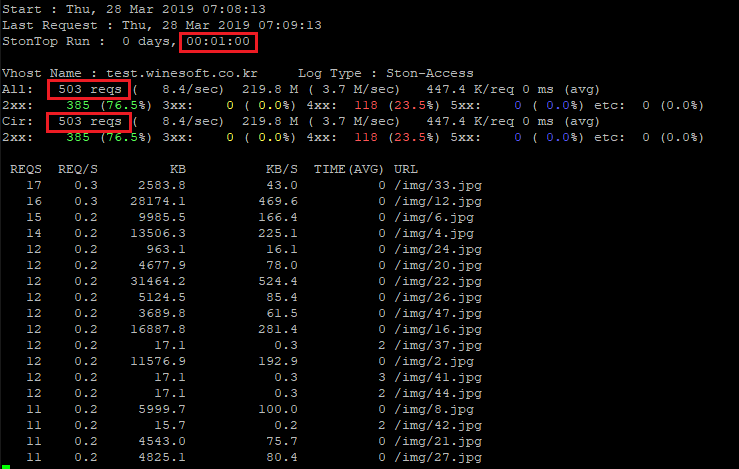

.. _stontop:

Appendix B: STON Top
*************************

STON TOP은 실시간으로 로그를 분석하여 랭킹을 제공하는 도구이다.
URL, Host, Referer, User-Agent, Client-IP 총 5가지의 랭킹을 제공한다.

.. note::

   Enterprise Edition v18.08.0 이후부터 지원된다.

.. toctree::
   :maxdepth: 2

.. _stontop_run:

실행
====================================

STON TOP은 커맨드 라인도구로 다음과 같이 옵션을 넣어 실행한다. ::

   /usr/local/ston/stontop -f /ston_log/test.winesoft.co.kr/access.log

실행화면은 다음과 같으며 4가지 영역으로 구분된다.

실행옵션
====================================

실행시점에 다양한 옵션이 제공된다.

========= =============================================================
옵션	  설명
========= =============================================================
f	      로그 경로. 멀티 설정가능
T	      수집 시간 (초)
H	      수집 요청수
q	      QueryString 구분
l	      모든 URL 소문자 변환
L	      로그 타입 지정
s	      디렉토리 통계 depth
p         Referer헤더 프로토콜 구분
d         화면 갱신시간 설정
c         XFF헤더 값 그대로 클라이언트 IP로 인식
========= =============================================================

수집 시간
---------------------

기본 수집시간은 30초이다. ``-T`` 옵션으로 변경한다. ::

   # 60초 간의 데이터를 수집 분석한다.
   /usr/local/ston/stontop -f /ston_log/test.winesoft.co.kr/access.log -T 60

수집 요청수
---------------------

N개의 요청이 집계될 때마다 랭킹을 제공한다. ``-H`` 옵션으로 변경한다. ::

   # 500 개의 요청을 수집 분석한다.
   /usr/local/ston/stontop -f /ston_log/test.winesoft.co.kr/access.log -H 500

QueryString 구분
---------------------

기본으로 QueryString은 무시된다. ``-q`` 옵션으로 구분하도록 변경한다. ::

   /usr/local/ston/stontop -f /ston_log/test.winesoft.co.kr/access.log -q

멀티 가상호스트
---------------------

아래와 같이 여러 가상호스트를 동시에 모니터링 가능하다. ::

   /usr/local/ston/stontop -f /ston_log/test.winesoft.co.kr/access.log -f /ston_log/example.winesoft.co.kr/access.log

   test.winesoft.co.kr 랭킹

   example.winesoft.co.kr 랭킹

대소문자 구분
---------------------

기본으로 URL 대소문자는 구분된다. ``-l`` 옵션으로 구분하지 않도록 변경한다. ::

   # /IMG/1.jpg 와 /img/1.jpg 를 구분하지 않도록 한다.
   /usr/local/ston/stontop -f /ston_log/test.winesoft.co.kr/access.log -l

로그 형식지정
---------------------

기본으로 STON의 access.log를 대상으로 분석한다. 이 밖에 STON의 origin.log와 Apache의 access.log를 지원한다. 
``-L`` 옵션으로 ``origin`` 또는 ``apache`` 로 설정한다. ::

   # STON의 origin.log 모니터링
   /usr/local/ston/stontop -f /ston_log/test.winesoft.co.kr/origin.log -L origin

.. figure:: img/stontop_run_opt_l_origin.png
   :align: center

   STON의 origin.log 모니터링

::

   # Apache형식의 access.log 모니터링
   /usr/local/ston/stontop -f /ston_log/test.winesoft.co.kr/access.log -L apache

.. figure:: img/stontop_run_opt_l_apache.png
   :align: center

   Apache형식의 access.log 모니터링

화면갱신 주기
---------------------

기본으로 5초마다 화면을 갱신한다. ``-d`` 옵션으로 갱신주기(초)를 변경한다. ::

   # 1초마다 화면이 갱신된다.
   /usr/local/ston/stontop -f /ston_log/test.winesoft.co.kr/access.log -d 1

XFF 헤더 인식
---------------------

HTTP 요청 헤더에 XFF(X-Forwarded-For) 헤더가 있을 경우 헤더 값의 첫번째 값만을 클라이언트 IP로 인식한다. ``-c`` 옵션을 입력하면 모든 값을 인식한다. ::

   /usr/local/ston/stontop -f /ston_log/test.winesoft.co.kr/access.log -c

Referer 프로토콜 구분
---------------------

Referer의 프로토콜을 분리하여 집계한다. ``-p`` 옵션으로 변경한다. ::

   /usr/local/ston/stontop -f /ston_log/test.winesoft.co.kr/access.log -p

디렉토리 랭킹
---------------------

입력된 depth만큼의 디렉토리 통계를 제공한다. ``-s`` 옵션으로 입력한다. ::

   #Depth가 2 단계까지만 확인 비교한다.
   /usr/local/ston/stontop -f /ston_log/test.winesoft.co.kr/access.log -s 2

명령어
====================================

실행 중 ``명령어 + Enter`` 를 입력하면 다양한 정보를 볼 수 있다.

========= =============================================================
명령어	   설명
========= =============================================================
q	      프로세스 종료
p	      일시 정지
n	      응답 코드별 통계/요청별 통계 전환
d	      랭킹항목 변경
c	      화면 갱신
v	      (멀티로그 입력 시) 로그파일 전환
o         스냅샷
s         정렬 옵션 ON/OFF
========= =============================================================

랭킹 변경 ( ``d`` )
---------------------

랭킹 항목은 URL, Host, Referer, User-agent, Client-IP 순서로 변경된다.

   랭킹 항목의 순환

.. figure:: img/stontop_url.png
   :align: center

   URL 랭킹

   Host 랭킹

   Referer 랭킹

   User-Agent 랭킹

   Client IP 랭킹

요청/전송 기준 정렬 ( ``s`` ``r`` ``b`` ``t`` )
---------------------

요청 수 내림차순으로 정렬되며 요청 수(기본), 전송량, 평균 응답시간을 제공한다.

.. figure:: img/stontop_arrange.png
   :align: center

   ``s`` 정렬 서브메뉴 표시

   ``r`` 요청 수 정렬

   ``b`` 전송량 정렬

   ``t`` 평균 응답시간 정렬

응답코드 정렬 ( ``n`` ``s`` ``2`` ``3`` ``4`` ``5`` )
---------------------

``n`` 명령어를 입력하여 응답코드 상세화면으로 변경한다.

   ``n`` 응답코드 상세

   ``s`` 정렬 서브메뉴 표시

이 화면에서 응답코드별로 정렬이 가능하다.

   ``2`` 2xx 응답기준 정렬

   ``3`` 3xx 응답기준 정렬

.. figure:: img/stontop_arrange_res_4.png
   :align: center

   ``4`` 4xx 응답기준 정렬

   ``5`` 5xx 응답기준 정렬

스냅샷 ( ``o`` )
---------------------

``o`` 명령어를 입력하여 현재화면의 정보를 스냅샷 파일로 기록한다. ::

   /usr/local/ston/20190328_004734_stontop_snapshot_test.winesoft.co.kr.csv

- /usr/local/ston 에 기록된다.
- {yyyyMMdd_HHmmss}_stontop_snapshot_{가상호스트}.csv 형식으로 기록된다.

========================== ===================
항목                       설명
========================== ===================
URL                        요청 URL
Method                     요청 Method
ByteCount                  클라이언트로 전송한 데이터양 (단위: bytes)
Response-Time              응답 시간 (단위: ms)
Response-Code	           응답 코드
Client-IP                  클라이언트 IP
Referer                    Referer 헤더 값
User-Agent                 User-Agent 헤더 값
========================== ===================

   스냅샷 예제

