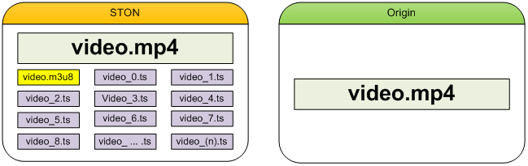

.. _media-video:

18장. 동영상
******************

.. note::

   - `[동영상 강좌] 해보자! STON Edge Server - Chapter 5. 동영상 전달 <https://youtu.be/YjOEVamhah4?list=PLqvIfHb2IlKeZ-Eym_UPsp6hbpeF-a2gE>`_

이 장에서는 비디오/오디오를 스마트하게 서비스하는 방법에 대해 설명한다.
클라이언트 사이드는 끊김없는 원활한 재생이 일관된 목적인 반면 서버사이드는 아주 복잡하다.
화질상승은 더 큰 동영상을 생성하며 더 많은 대역폭과 저장공간을 필요로 한다.
STON은 다양한 On-the-fly 기법을 이용해 기존 Back-End의 수정없이 유연한 전송기능을 제공한다. 

.. toctree::
   :maxdepth: 2

.. _media-hls:

MP4 HLS
====================================

MP4파일을 HLS(HTTP Live Streaming)로 서비스한다.
원본서버는 더 이상 HLS서비스를 위해 파일을 분할저장할 필요가 없다.
MP4파일 헤더의 위치에 상관없이 다운로드와 동시에 실시간으로 .m3u8/.ts파일 변환 후 서비스한다.

..  note::

    MP4HLS는 Elementary Stream(Video 또는 Audio)을 변환하는 트랜스코딩(Transcoding)이 아니다.
    그러므로 HLS에 적합한 형식으로 인코딩된 MP4파일에 한해서 원활한 단말 재생이 가능하다.
    인코딩이 적합하지 않을 경우 화면이 깨지거나 소리가 재생되지 않을 수 있다.
    현재(2014.2.20) Apple에서 밝히고 있는 Video/Audio 인코딩 규격은 다음과 같다.

    What are the specifics of the video and audio formats supported?
    Although the protocol specification does not limit the video and audio formats, the current Apple implementation supports the following formats:

    [Video]
    H.264 Baseline Level 3.0, Baseline Level 3.1, Main Level 3.1, and High Profile Level 4.1.

    [Audio]
    HE-AAC or AAC-LC up to 48 kHz, stereo audio
    MP3 (MPEG-1 Audio Layer 3) 8 kHz to 48 kHz, stereo audio
    AC-3 (for Apple TV, in pass-through mode only)

    Note: iPad, iPhone 3G, and iPod touch (2nd generation and later) support H.264 Baseline 3.1. If your app runs on older versions of iPhone or iPod touch, however, you should use H.264 Baseline 3.0 for compatibility. If your content is intended solely for iPad, Apple TV, iPhone 4 and later, and Mac OS X computers, you should use Main Level 3.1.

기존 방식의 경우 Pseudo-Streaming과 HLS를 위해 다음과 같이 원본파일이 각각 존재해야 한다.
이런 경우 STON 역시 원본 파일을 그대로 복제하여 고객에게 서비스한다.
하지만 재생시간이 길수록 파생파일은 많아지며 관리의 어려움은 증가한다.

.. figure:: img/conf_media_mp4hls1.png
   :align: center

   수고가 많은 HLS

``<MP4HLS>`` 는 원본파일로부터 HLS서비스에 필요한 파일을 동적으로 생성한다.

   똑똑한 HLS

모든 .m3u8/.ts파일은 원본파일에서 파생되며 별도의 저장공간을 소비하지 않는다.
서비스 즉시 메모리에 임시적으로 생성되며 서비스되지 않을 때 자동으로 없어진다. ::

   # server.xml - <Server><VHostDefault><Media>
   # vhosts.xml - <Vhosts><Vhost><Media>

   <MP4HLS Status="Inactive" Keyword="mp4hls">
      <Index Ver="3" Alternates="off">index.m3u8</Index>
      <Sequence>0</Sequence>
      <Duration>10</Duration>
      <AlternatesName>playlist.m3u8</AlternatesName>
   </MP4HLS>

-  ``<MP4HLS>``

   - ``Status (기본: Inactive)`` 값이 ``Active`` 일 때만 활성화된다.

   - ``Keyword (기본: mp4hls)`` HLS 서비스 키워드

-  ``<Index> (기본: index.m3u8)`` HLS 인덱스(.m3u8) 파일명

   - ``Ver (기본 3)`` 인덱스 파일 버전.
     3인 경우 ``#EXT-X-VERSION:3`` 헤더가 명시되며 ``#EXTINF`` 의 시간 값이 소수점 3째 자리까지 표시된다.
     1인 경우 ``#EXT-X-VERSION`` 헤더가 없으며, ``#EXTINF`` 의 시간 값이 정수(반올림)로 표시된다.

   - ``Alternates (기본: OFF)`` Stream Alternates 사용여부.

     .. figure:: img/hls_alternates_off.png
        :align: center

        OFF. ``<Index>`` 에서 TS목록을 서비스한다.

     .. figure:: img/hls_alternates_on.png
        :align: center

        ON. ``<AlternatesName>`` 에서 TS목록을 서비스한다.

-  ``<Sequence> (기본: 0)`` .ts 파일의 시작 번호. 이 수를 기준으로 순차적으로 증가한다.

-  ``<Duration> (기본: 10초)`` MP4를 HLS로 분할하는 기준 시간(초).
   분할의 기준은 Video/Audio의 KeyFrame이다.
   KeyFrame은 들쭉날쭉할 수 있으므로 정확히 분할되지 않는다.
   만약 10초로 분할하려는데 KeyFrame이 9초와 12초에 있다면 가까운 값(9초)을 선택한다.

-  ``<AlternatesName> (기본: playlist.m3u8)`` Stream Alternates 파일명. ::

      http://www.example.com/video.mp4/mp4hls/playlist.m3u8

서비스 주소가 다음과 같다면 해당 주소로 Pseudo-Streaming을 진행할 수 있다. ::

    http://www.example.com/video.mp4

가상호스트는 ``<MP4HLS>`` 에 정의된 ``Keyword`` 문자열을 인식함으로써 HLS서비스를 진행한다.
다음 URL이 호출되면 /video.mp4로부터 index.m3u8파일을 생성한다. ::

   http://www.example.com/video.mp4/mp4hls/index.m3u8

``Alternates`` 속성이 ON이라면 ``<Index>`` 파일은 ``<AlternatesName>`` 파일을 서비스한다. ::

   #EXTM3U
   #EXT-X-VERSION:3
   #EXT-X-STREAM-INF:PROGRAM-ID=1,BANDWIDTH=200000,RESOLUTION=720x480
   /video.mp4/mp4hls/playlist.m3u8

``#EXT-X-STREAM-INF`` 의 Bandwidth와 Resolution은 영상을 분석하여 동적으로 제공한다.

.. note::

   Stream Alternates를 제공하긴 하지만 현재 버전에서 index.m3u8는 항상 하나의 서브 인덱스 파일(playlist.m3u8)만을 제공한다.
   캐시 입장에서는 video_1080.mp4와 video_720.mp4가 (인코딩 옵션만 다른) 같은 영상인지 알 수 없기 때문이다.

최종적으로 생성된 .ts 목록(버전 3)은 다음과 같다. ::

   #EXTM3U
   #EXT-X-TARGETDURATION:10
   #EXT-X-VERSION:3
   #EXT-X-MEDIA-SEQUENCE:0
   #EXTINF:11.637,
   /video.mp4/mp4hls/0.ts
   #EXTINF:10.092,
   /video.mp4/mp4hls/1.ts
   #EXTINF:10.112,
   /video.mp4/mp4hls/2.ts

   ... (중략)...

   #EXTINF:10.847,
   /video.mp4/mp4hls/161.ts
   #EXTINF:9.078,
   /video.mp4/mp4hls/162.ts
   #EXT-X-ENDLIST

분할에는 3가지 정책이 있다.

-  **KeyFrame 간격보다** ``<Duration>`` **설정이 큰 경우**
   KeyFrame이 3초, ``<Duration>`` 이 20초라면 20초를 넘지 않는 KeyFrame의 배수인 18초로 분할된다.

-  **KeyFrame 간격과** ``<Duration>`` **이 비슷한 경우**
   KeyFrame이 9초, ``<Duration>`` 이 10초라면 10초를 넘지 않는 KeyFrame의 배수인 9초로 분할된다.

-  **KeyFrame 간격이** ``<Duration>`` **설정보다 큰 경우**
   KeyFrame단위로 분할된다.

다음 클라이언트 요청에 대해 STON이 어떻게 동작하는지 이해해보자. ::

   GET /video.mp4/mp4hls/99.ts HTTP/1.1
   Range: bytes=0-512000
   Host: www.winesoft.co.kr

1.	``STON`` 최초 로딩 (아무 것도 캐싱되어 있지 않음.)
#.	``Client`` HTTP Range 요청 (100번째 파일의 최초 500KB 요청)
#.	``STON`` /video.mp4 파일 캐싱객체 생성
#.	``STON`` /video.mp4 파일 분석을 위해 필요한 부분만을 원본서버에서 다운로드
#.	``STON`` 100번째(99.ts)파일 서비스를 위해 필요한 부분만을 원본서버에서 다운로드
#.	``STON`` 100번째(99.ts)파일 생성 후 Range 서비스
#.	``STON`` 서비스가 완료되면 99.ts파일 파괴

.. note::

   ``MP4Trimming`` 기능이 ``ON`` 이라면 Trimming된 MP4를 HLS로 변환할 수 있다. (HLS영상을 Trimming할 수 없다. HLS는 MP4가 아니라 MPEG2TS 임에 주의하자.)
   영상을 Trimming한 뒤, HLS로 변환하기 때문에 다음과 같이 표현하는 것이 자연스럽다. ::

      /video.mp4?start=0&end=60/mp4hls/index.m3u8

   동작에는 문제가 없지만 QueryString을 맨 뒤에 붙이는 HTTP 규격에 어긋난다.
   이를 보완하기 위해 다음과 같은 표현해도 동작은 동일하다. ::

      /video.mp4/mp4hls/index.m3u8?start=0&end=60
      /video.mp4?start=0/mp4hls/index.m3u8?end=60

.. _media-mp3-hls:

MP3 HLS
====================================

MP3파일을 HLS(HTTP Live Streaming)로 서비스한다. ::

   # server.xml - <Server><VHostDefault><Media>
   # vhosts.xml - <Vhosts><Vhost><Media>

   <MP3HLS Status="Inactive" Keyword="mp3hls" SegmentType="TS">
      <Index Ver="3" Alternates="off">index.m3u8</Index>
      <Sequence>0</Sequence>
      <Duration>10</Duration>
      <AlternatesName>playlist.m3u8</AlternatesName>
   </MP3HLS>

모든 설정과 동작방식이 `MP4 HLS`_ 와 동일하며 추가적으로 Segement형식을 선택할 수 있다.

-  ``<MP3HLS>``

   - ``SegmentType (기본: TS)`` 원본 MP3를 MPEG2-TS( ``TS`` ) 또는 ``MP3`` 로 분할한다.

.. note::

   `MP4 HLS`_ 와 `MP3 HLS`_ 가 같은 ``Keyword`` 로 설정되어 있을 경우 `MP3 HLS`_ 는 동작하지 않는다.

MP4/M4A 헤더위치 변경
====================================

보통 MP4포맷의 경우 인코딩 과정 중에는 헤더를 완성할 수 없기 때문에 완료 후 파일의 맨 뒤에 붙인다.
헤더를 앞으로 옮기려면 별도의 처리가 필요하다.
헤더가 뒤에 있다면 이를 지원하지 않는 플레이어에서 Pseudo-Streaming이 불가능하다.
헤더위치 변경을 통해 Pseudo-Streaming을 간편하게 지원할 수 있다.

헤더위치 변경은 전송단계에서만 발생할 뿐 원본의 형태를 변경하지 않는다.
별도의 저장공간을 사용하지도 않는다. ::

   # server.xml - <Server><VHostDefault><Media>
   # vhosts.xml - <Vhosts><Vhost><Media>

   <UpfrontMP4Header>OFF</UpfrontMP4Header>
   <UpfrontM4AHeader>OFF</UpfrontM4AHeader>

-  ``<UpfrontMP4Header>``

   - ``OFF (기본)`` 아무 것도 하지 않는다.

   - ``ON`` 확장자가 .mp4이고 헤더가 뒤에 있다면 헤더를 앞으로 옮겨서 전송한다.

-  ``<UpfrontM4AHeader>``

   - ``OFF (기본)`` 아무 것도 하지 않는다.

   - ``ON`` 확장자가 .m4a이고 헤더가 뒤에 있다면 헤더를 앞으로 옮겨서 전송한다.

처음 요청되는 콘텐츠의 헤더를 앞으로 옮겨야 한다면 헤더를 옮기기위해 필요한 부분을 우선적으로 다운로드 받는다.
아주 영리할뿐만 아니라 빠르게 동작한다.
커튼 뒤의 복잡한 과정과는 상관없이, 클라이언트는 원래부터 헤더가 앞에 있는 온전한 파일을 서비스 받는다.

.. note::

   분석할 수 없거나 깨진 파일이라면 원본형태 그대로 서비스된다.

.. _media-trimming:

Trimming
====================================

시간 값을 기준으로 원하는 구간을 추출한다.
Trimming은 전송단계에서만 발생할 뿐 원본의 형태를 변경하지 않는다.
별도의 저장공간을 사용하지 않는다. ::

   # server.xml - <Server><VHostDefault><Media>
   # vhosts.xml - <Vhosts><Vhost><Media>

   <MP4Trimming StartParam="start" EndParam="end" AllTracks="off">OFF</MP4Trimming>
   <M4ATrimming StartParam="start" EndParam="end" AllTracks="off">OFF</M4ATrimming>
   <MP3Trimming StartParam="start" EndParam="end">OFF</MP3Trimming>

-  ``<MP4Trimming>`` ``<MP3Trimming>`` ``<M4ATrimming>``

   - ``OFF (기본)`` 아무 것도 하지 않는다.

   - ``ON`` 확장자(.mp4, .mp3, .m4a)가 일치하면 원하는 구간만큼 서비스하도록 Trimming한다.
     Trimming구간은 ``StartParam`` 속성과 ``EndParam`` 으로 설정한다.

   - ``AllTracks`` 속성

     - ``OFF (기본)`` Audio/Video 트랙만 Trimming한다. (Mod-H264 방식)

     - ``ON`` 모든 트랙을 Trimming한다. 사용 전 반드시 플레이어 호환성을 확인해야 한다.

파라미터는 클라이언트 QueryString을 통해 입력받는다.
예를 들어 10분 분량의 동영상(/video.mp4)을 특정 구간만 Trimming하고 싶다면 QueryString에 원하는 시점(단위: 초)을 명시한다. ::

   http://vod.wineosoft.co.kr/video.mp4                // 10분 : 전체 동영상
   http://vod.wineosoft.co.kr/video.mp4?end=60         // 1분 : 처음부터 60초까지
   http://vod.wineosoft.co.kr/video.mp4?start=120      // 8분 : 2분(120초)부터 끝까지
   http://vod.wineosoft.co.kr/video.mp4?start=3&end=13 // 10초 : 3초부터 13초까지

``StartParam`` 값이 ``EndParam`` 값보다 클 경우 구간이 지정되지 않은 것으로 판단한다.
이 기능은 HTTP Pseudo-Streaming으로 구현된 동영상 플레이어의 Skip기능을 위해서 개발되었다.
그러므로 Range요청을 처리하는 것처럼 파일을 Offset기반으로 자르지 않고 올바르게 재생될 수 있도록 키프레임과 시간을 인지하여 구간을 추출한다.

클라이언트에게 전달되는 파일은 다음 그림처럼 MP4헤더가 재생성된 완전한 형태의 MP4파일이다.

.. figure:: img/conf_media_mp4trimming.png
   :align: center

   완전한 형태의 파일이 제공된다.

추출된 구간은 별도의 파일로 인식되기 때문에 200 OK로 응답된다.
그러므로 다음과 같이 Range헤더가 명시된 경우 추출된 파일로부터 Range를 계산하여 **206 Particial Content** 로 응답한다.

.. figure:: img/conf_media_mp4trimming_range.png
   :align: center

   일반적인 Range요청처럼 처리된다.

구간추출 파라미터가 QueryString 표현을 사용하기 때문에 자칫 :ref:`caching-policy-applyquerystring` 과 헷갈릴 수 있다.
``<ApplyQueryString>`` 설정이 ``ON`` 인 경우 클라이언트가 요청한 URL의 QueryString이 모두 인식되지만 ``StartParam`` 과 ``EndParam`` 은 제거된다. ::

   GET /video.mp4?start=30&end=100
   GET /video.mp4?tag=3277&start=30&end=100&date=20130726

예를 들어 위와 같이 ``StartParam`` 이 **start** 로 ``EndParam`` 이 **end** 로 입력된 경우
이 값들은 구간을 추출하는데 쓰일 뿐 Caching-Key를 생성하거나 원본서버로 요청을 보낼 때는 제거된다.
각각 다음과 같이 인식된다. ::

   GET /video.mp4
   GET /video.mp4?tag=3277&date=20130726

또한 QueryString파라미터는 확장모듈이나 CDN솔루션에 따라 달라질 수 있다.

.. figure:: img/conf_media_mp4trimming_range.png
   :align: center

   JW Player에서 제공하고 있는 Module/CDN별 참고자료

이외의 nginx의 `ngx_http_mp4_module <http://nginx.org/en/docs/http/ngx_http_mp4_module.html>`_ 과,
lighttpd의 `Mod-H264-Streaming-Testing-Version2 <http://h264.code-shop.com/trac/wiki/Mod-H264-Streaming-Testing-Version2>`_ 에서도
모두 **start** 를 QueryString으로 사용하고 있다.

.. _media-multi-trimming:

Multi-Trimming
====================================

시간 값을 기준으로 복수로 지정된 구간을 하나의 영상으로 추출한다.

.. figure:: img/conf_media_multitrimming.png
   :align: center

   /video.mp4?trimming=0-30,210-270,525-555

구간 지정방법만 다를뿐 동작방식은 `Trimming`_ 과 동일하다. ::

   # server.xml - <Server><VHostDefault><Media>
   # vhosts.xml - <Vhosts><Vhost><Media>

   <MP4Trimming MultiParam="trimming" MaxRatio="50">OFF</MP4Trimming>
   <M4ATrimming MultiParam="trimming">OFF</M4ATrimming>

-  ``<MP4Trimming>`` ``<M4ATrimming>``

   - ``MultiParam (기본: "trimming")``
     설정된 이름을 QueryString Key로 사용하여 추출 구간을 지정한다.
     하나의 구간은 "시작시간 - 종료시간" 으로 표기하며 각 구간은 콤마(,)로 연결한다.

   - ``MaxRatio (기본: 50%)``
     Multi-Trimming된 영상은 원본보다 ``MaxRatio (최대 100%)`` 비율만큼까지 커질 수 있다.
     ``MaxRatio`` 를 넘어가는 구간은 무시된다.

예를 들어 다음과 같이 호출하면 3분짜리 영상이 생성된다. ::

   http://example.com/video.mp4?trimming=10-70,560-620,1245-1305

같은 영상을 반복하거나 앞 뒤가 바뀐 영상을 만들 수도 있다. ::

   http://example.com/video.mp4?trimming=17-20,17-20,17-20,17-20
   http://example.com/video.mp4?trimming=1000-1200,500-623,1900-2000
   http://example.com/video.mp4?trimming=600-,400-600

구간 값을 지정하지 않은 경우 맨 앞 또는 맨 뒤를 의미한다.

.. note::

   `Multi-Trimming`_ 은 `Trimming`_ 보다 우선한다.
   QueryString에 `Multi-Trimming`_ 키가 명시되어 있다면 `Trimming`_ 키는 무시된다.

