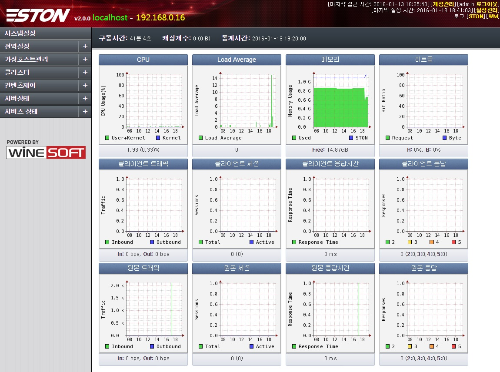
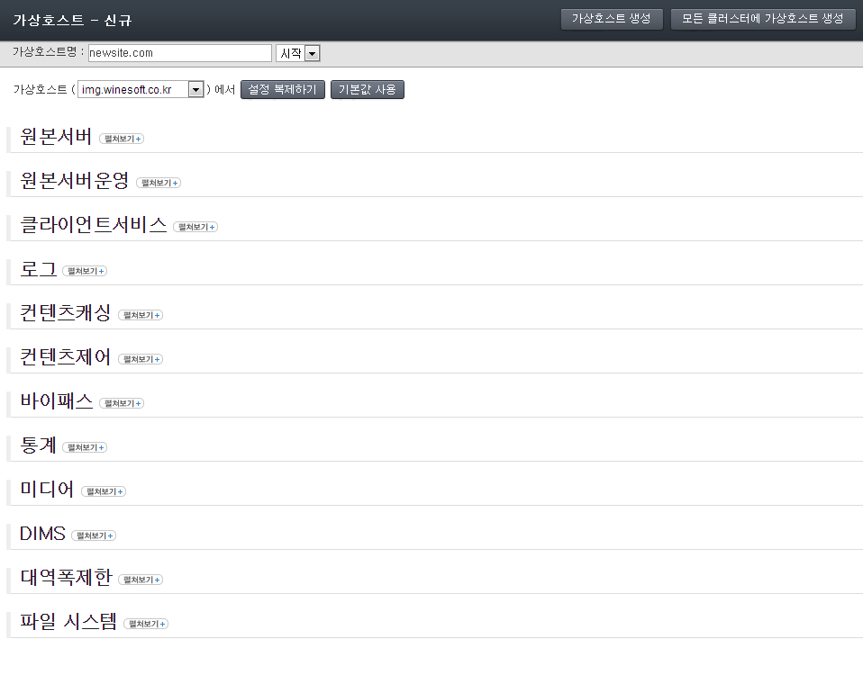
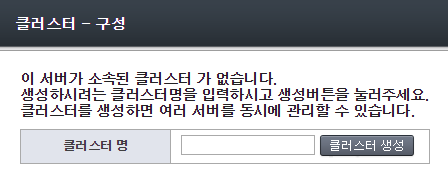
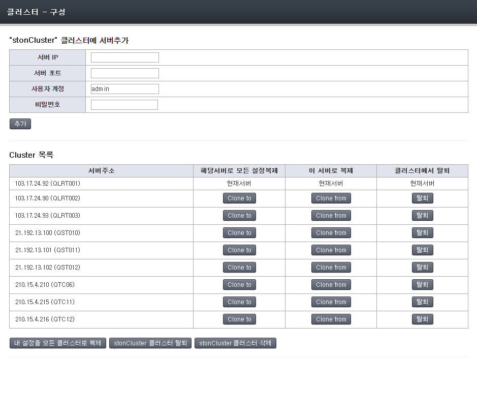
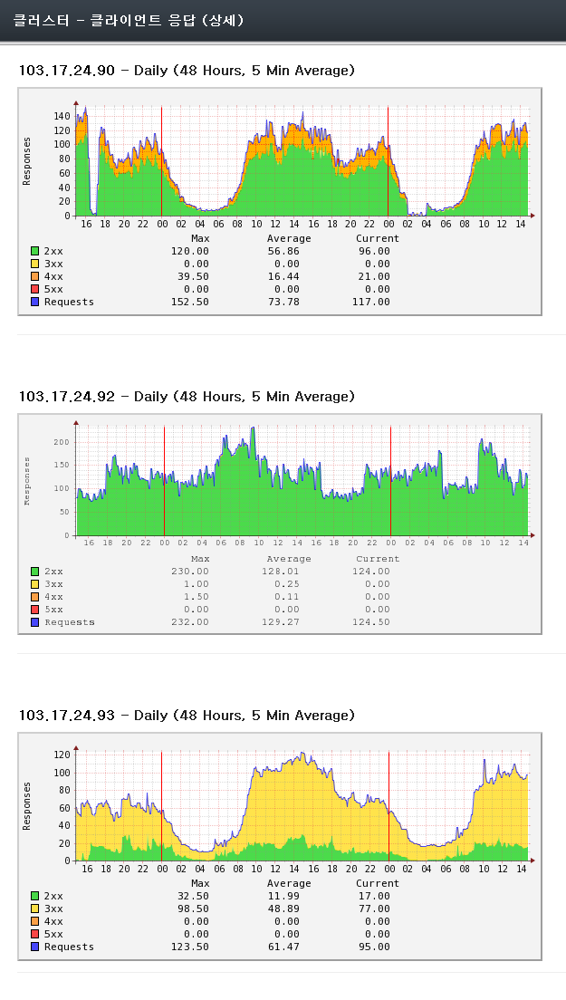

.. _wm:

13장. WM (Web Management)
******************

이 장에서는 Web Management(이하 WM)를 소개한다.
WM은 API를 기반으로 동작하는 Web 관리 툴이다.
WM을 통하여 직관적으로 서비스를 구성할 수 있을 뿐만 아니라 클러스터를 구성하여 많은 수의 STON을 통합관리 할 수 있다.

STON을 설치하면 /usr/local/ston/wm 경로에 WM이 설치된다.
WM은 Apache 2.2.24 + PHP 5.3.24으로 구현되었다.
Apache를 사용하므로 /usr/local/ston/wm/conf/httpd.conf 파일을 편집하여 원하는
구성(예를 들어 HTTPS)으로 변경이 가능하다.
WM과 STON은 밀접한 연관을 가지지 않는다.
다음 그림처럼 WM은 STON의 설정파일과 API만을 사용하여 STON의 동작을 구성한다.

.. figure:: img/wm_compose.jpg
   :align: center

   WM은 STON의 설정파일과 API를 사용한다.

우리는 이와 유사한 방식으로 WM을 능가하는 더 나은 관리기법이 존재할 것이라 생각한다.

.. toctree::
   :maxdepth: 2

접속
====================================

WM은 기본적으로 8500번 포트를 사용한다. 설치된 STON의 IP가 192.168.0.100이라면
WM접근 주소는 http://192.168.0.100:8500이 된다.
앞서 언급한 대로 httpd.conf 파일을 변경하면 고객사에 맞추어 커스터마이징이 가능하다.

.. figure:: img/wm_login.jpg
   :align: center

   WM 접속초기화면

계정
====================================

기본 계정은 [아이디: **admin** , 비밀번호: **ston** ] 이다.
로그인에 성공하면 STON의 전반적인 상태를 확인할 수 있는 대쉬보드 페이지가 나타난다.

   WM 대쉬보드

.. _wm-update:

최신버전 업데이트
====================================

최신버전이 릴리스되면 다음과 같이 "새로운 업데이트가 있습니다" 메시지가 표시된다.

.. figure:: img/wm_update_info.png
   :align: center

   새로운 업데이트가 있습니다.

메시지를 클릭하시면 최신버전으로 업데이트할 수 있는 페이지가 표시된다.
현재 서비스 상태에 따라 업데이트 안전도 여부가 표시된다.

.. figure:: img/wm_update_page_alert.png
   :align: center

   WM 업데이트하면 위험합니다.

업데이트가 완료되면 모든 서비스가 자동으로 재시작 된다.

메뉴 구성
====================================

메뉴는 Mouse-Click에 따라 확장/축소가 되는 Drop Down메뉴로 구성된다.

.. figure:: img/wm_menu.jpg
   :align: center

   WM 메뉴

1.  **전역설정**

    전역설정(server.xml)에서 가상호스트 기본설정을 제외한 모든 기능을 설정한다.

#.  **가상호스트 관리**

    가상호스트의 추가/중지/삭제를 할 수 있으며 서비스 중인 모든 가상호스트 상태를 한눈에 볼 수 있다.

#.  **클러스터**

    클러스터를 구성/관리/파괴할 수 있으며 같은 클러스터의 모든 서비스를 서버별, 서비스별로 볼 수 있다.

#.  **컨텐츠제어**

    Purge와 같이 서비스 중인 컨텐츠에 대하여 제어할 수 있다.

#.  **서버 상태**

    시스템 상태와 같은 전역자원을 모니터링 한다. 모든 Graph는 전역자원 Graph를 사용한다.

#.  **서비스 상태**

    가상호스트의 서비스 상태를 모니터링 한다. 모든 Graph는 가상호스트 Graph를 사용한다.

전역설정
====================================

전역설정(server.xml)에서 가상호스트 기본설정을 제외한 모든 기능을 설정한다.

.. figure:: img/wm_conf_global1.png
   :align: center

   WM 전역설정 - 일반

가상호스트 관리
====================================

서비스하는 모든 가상호스트에 대하여 상세히 설정하며 신규 가상호스트를 추가한다.
모든 가상호스트는 따로 명시적으로 설정을 변경하지 않는 이상 기본
가상호스트(VHostDefault)의 설정을 사용한다.
이는 객체지향의 상속(Inheritance)과 같은 개념이다.
서비스 가상호스트는 대부분의 항목을 재정의(Overriding)할 수 있다.

신규
---------------------

새롭게 서비스할 가상호스트를 생성한다.
클러스터가 설정되어 있는 경우 모든 서버에 가상호스트를 동시생성 할 수 있다.
모든 가상호스트는 기본 가상호스트(VHostDefault)를 상속받으므로 가상호스트명과
원본서버 주소만 설정하면 곧바로 서비스 투입이 가능하다.
8가지의 하위 설정이 있으며 **펼쳐보기** 버튼을 눌러 상세 설정으로 확장할 수 있다.

   WM 가상호스트 관리 - 신규

목록
---------------------

서비스 중인 모든 가상호스트 상태를 모니터링할 수 있다.
가상호스트별로 시작/중지가 가능하다.
클러스터가 설정되어 있다면 모든 서버의 가상호스트를 동시에 제어할 수 있다.
또한 기본가상호스트를 선택할 수 있다.

.. figure:: img/wm_vhost_list.png
   :align: center

   WM 가상호스트 관리 - 목록

상세설정
---------------------

기본 가상호스트(VHostDefault)와 개별 가상호스트에 대해 설정한다.
좌측상단의 콤보박스를 선택하여 가상호스트를 선택할 수 있다.
**"Default 가상호스트"** 는 모든 가상호스트가 상속받는 기본 설정이다.
그러므로 별도로 재정의하지 않은 설정의 경우 "Default 가상호스트"를 변경하면 변경된 설정이 반영된다.

.. figure:: img/wm_vhost_conf1.png
   :align: center

   WM 가상호스트 설정 - 상단메뉴

위 그림처럼 많은 하위메뉴가 제공되며 현재 선택된 하위메뉴가 붉은 색으로 표시된다.
각 메뉴 클릭시 아래 그림처럼 상세설정 페이지가 제공된다.
모든 설정은 "적용" 또는 "Cluster전체적용" 버튼을 눌러야 반영된다.

.. figure:: img/wm_vhost_conf_sub1.png
   :align: center

   WM 가상호스트 설정 - 원본서버

여기서 설정하는 거의 모든 항목은 재정의될 수 있는 설정이므로 이에 대한 명확한 이해가 필요하다.
예를 들어 기본 가상호스트의 TTL값이 60으로 설정된 경우 모든 가상호스트는 이 값을 상속받는다.
하지만 명확하게 이 값을 재정의 하는 경우 해당 가상호스트에 한하여 재정의된 값을 사용하게 된다.

.. figure:: img/wm_vhost_conf_sub_ttl.png
   :align: center

다음과 같이 3가지 경우가 존재할 수 있다.

-  **다른 값으로 재정의**

   A의 경우처럼 기본 값은 60이지만 180으로 재정의할 경우 A사용자는 180으로 서비스된다.
   기본 가상호스트 설정이 변경되어도 영향을 받지 않는다.

-  **같은 값으로 재정의**

   B의 경우처럼 기본 값과 같은 값으로 설정하여도 재정의로 판단하여 B사용자는 60으로 서비스된다.
   추후 기본 가상호스트의 TTL값이 30으로 변경되더라도 재정의가 되어 있으므로 B사용자의 설정(60)은
   영향을 받지 않는다.

-  **재정의하지 않음**

   C의 경우처럼 생략된 경우 기본 가상호스트 설정을 상속받아 C사용자는 60으로 서비스된다.
   추후 기본 가상호스트의 TTL값이 30으로 변경되면 C사용자도 30으로 서비스된다.

WM에서는 색으로 재정의를 구분한다.
기본 가상호스트의 설정을 그대로 사용하는 경우 흰색배경으로 표시된다.
재정의된 값은 살구색으로 표시되어 기본값과 구분된다.
모든 재정의 설정의 우측에는 X버튼이 제공된다.
이 버튼을 클릭하여 재정의를 해지한다.

클러스터
====================================

여러 대의 STON을 하나의 클러스터로 통합하여 일괄적으로 관리/운영할 수 있다.
모든 STON은 동등한 관계로 설정되기 때문에 클러스터에 포함된 어떤 STON으로 로그인 하여도
클러스터 전체를 관리할 수 있다.

구성
---------------------

클러스터를 생성하거나 이미 존재하는 클러스터에 다른 서버를 추가할 수 있다.
클러스터 추가에는 WM계정의 인증절차가 필요하다.
만약 같은 계정(아이디와 비밀번호)으로 WM이 구성되어 있다면 인증절차는 생략된다.

   신규 클러스터 생성

   클러스터 목록

클러스터가 구성되면 가상호스트 관리시 "Cluster전체적용" 버튼으로 일괄설정이 가능하다.
또한 클러스터에 소속된 서버끼리 간편하게 모든 설정을 복제할 수 있다.
특정 서버를 다른 클러스터에 참여시키고 싶으면 탈퇴 후 재구성해야 한다.

전용 포트분리
---------------------

최초 설치시 WM과 클러스터 포트가 같은 포트를 사용한다.
이 방식은 WM계정만으로 클러스터링 구성이 가능하다는 장점이 있지만 접근 IP를 제한하는 환경에서는 문제가 될 수 있다.

* 보안상의 이유로 WM을 일부 IP에서만 접근되도록 제한한다.
* 클러스터링을 위해서는 모든 서버들이 서로 다른 서버들의 IP를 허가해주어야 한다.
* (CDN 처럼) 서버 수가 매우 많거나 서버들의 IP가 유동적인 경우 IP목록을 작성할 수 없다.

클러스터 포트를 분리하여 이 문제를 해결할 수 있다.
서버들끼리 신원은 WM 계정이 아닌 라이선스를 통해 확인된다.
같은 라이선스를 가진 서버들끼리만 클러스터가 가능해져 보안성이 높아진다.

**1. [Apache 서버] httpd.conf 멀티 Port설정**

(기본 설치라면) /usr/local/ston/wm/conf/httpd.conf 파일을 열어 다음과 같이 포트를 추가한다.

.. figure:: img/wm_cluster_multiport.png
   :align: center

저장 후 반영을 위해 Apache서버를 재시작한다.

**2. [WM] 클러스터 구성**

정상적으로 멀티포트 구성이 되었다면 다음과 같이 "클러스터 포트 분리" 버튼이 생성된다.

.. figure:: img/wm_cluster_multiport1.png
   :align: center

버튼을 클릭한다.

**3. [WM] 클러스터 포트선택**

분리할 수 있는 포트 목록을 보여준다. 포트를 선택해 구성한다.

.. figure:: img/wm_cluster_multiport2.png
   :align: center

클러스터링에 포함되는 모든 서버는 반드시 같은 포트를 사용해야 한다.

서버 상태
---------------------

클러스터에 소속된 모든 STON서버의 상태와 서비스 현황을 확인할 수 있다.
서버 목록을 구성하는 각 항목을 클릭하면 보다 상세한 정보를 확인할 수 있다.

   서버별 상태

가상호스트 상태
---------------------

클러스터에서 서비스하는 모든 가상호스트의 MRTG를 종합하여 확인할 수 있다.
클러스터의 모든 가상호스트를 동시에 시작/중지할 수 있다.
가상호스트 목록을 구성하는 각 항목을 클릭하면 보다 상세한 정보를 확인할 수 있다.

.. figure:: img/wm_cluseter4.png
   :align: center

   가상호스트 서비스별 상태

컨텐츠 제어
====================================

서비스 중인 컨텐츠를 열람/제어하거나 클린업을 수행할 수 있다.
클러스터 구성이 되어있다면 모든 STON의 컨텐츠를 동시에 열람하거나 제어할 수 있다.

.. figure:: img/wm_ctrl2.png
   :align: center

   Caching상태 확인

.. figure:: img/wm_ctrl3.png
   :align: center

   Purge등 API호출

시스템 정보
====================================

가동 중인 서버의 시스템 정보를 조회한다.

.. figure:: img/wm_gstat1.png
   :align: center

서비스 상태
====================================

가상호스트별로 서비스 상태를 모니터링 한다.

.. figure:: img/wm_vstat3.png
   :align: center

   가상호스트 서비스상태
