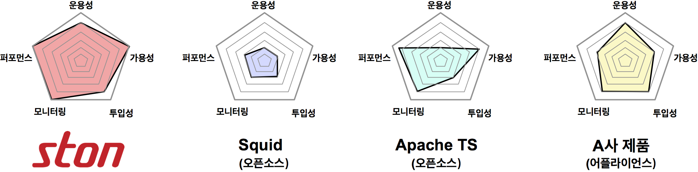

.. _intro:

소개
******************

.. toctree::
   :maxdepth: 2

1. Web Cache의 개념
============

Web Cache는 서비스 네트워크의 최전방(Edge)에서 클라이언트에게 컨텐츠를 전달하는 서버로, 다음과 같은 기본 동작구조를 가진다.

#. 클라이언트로부터 컨텐츠의 최초 요청을 받고
#. 컨텐츠를 원본서버에서 가져와 저장하여 클라이언트에게 전송한다. 
#. 컨텐츠 재요청을 받으면 2에서 가져왔던 컨텐츠를 전송한다. 

다양한 통신과 연산의 부하가 걸리는 일반 웹서버와 달리, 
Web Cache는 정적 컨텐츠 전송에 집중하여 서비스의 속도를 크게 향상시킬수 있다.
   

서비스 확장 때문에 원본 웹서버를 Scale-Out 하면 컨텐츠 갱신마다 동기화 시켜야 하는 문제가 있다. 
동일 컨텐츠를 수십수백대의 웹서버에 주입하면 리스크도 크고 관리도 어렵다. 
그러나 Web Cache를 도입하면 원본 웹서버는 그대로 유지하면서 Web Cache 추가증설만으로 손쉽게 서비스를 확장할 수 있다. 원본 웹서버의 컨텐츠만 갱신하면, Web Cache가 자동으로 컨텐츠를 가져다가 전송한다.

**효과**

- 응답속도 향상
- 사용대역폭 절감
- 원본 웹서버 보호
- 서비스 가용성/안정성 향상

2. STON Web Cache
==============

  
STON은 가능한 모든 요구사항과 상황에 대처할 수 있는 커다란 그릇을 지향하여 설계되었다. 
풍부한 네트워크 소프트웨어 개발경험을 기반으로, 프로토콜 처리부터 한줄씩 모두 in-house로 개발하였으며,
손쉬운 사용성을 지키면서 강력한 성능과 실시간 통계의 두 마리 토끼를 잡는 아키텍처 설계를 목표로 하였다. 
HTTP 처리 모듈부터 Web Management까지 STON의 모든 코드는 100% in-house에서 개발/관리되고 있다. 
STON의 개념, 동작방식, 배경, 이유를 최대한 상세하게 공개하여, 
고객과 함께 만들어 가는 제품의 가치를 모토로 하고 있다.

3. 특징
========================

   
강력한 성능
+++++++++++
STON은 퍼포먼스 최적화를 위해 C++로 개발되었으며, 64bit 아키텍처의 고가용성 (High Availability) 설계로 Many-core에 최적화되어 있다.

손쉬운 사용
+++++++++++
도입에서 운영에 이르기까지, Web Cache를 가장 많이 접하는 담당자는 보통 운영자이다. (SE, System Engineer) 
STON은 기획단계부터 서비스 운영자 의 관점에 맞추어 설계되었다. 
어려운 코딩을 할 필요도, 변경설정 적용을 위해 빌드를 다시 할 필요도 없다. 
XML 설정파일 2개를 편집하는 것만으로 모든 설정이 가능하며, 
Zero-Configuration을 추구하여 숙련도가 필요없는 제품을 목표로 하고 있다. 

실시간 통계
+++++++++++
STON은 강력한 성능과 동시에, 실시간 모니터링 및 통계를 제공한다. 
자체 API 및 SNMP를 통하여 초단위까지의 모니터링/통계/로그를 제공한다.

합리적 가격
+++++++++++
STON은 ASP와 같이 사용분에 대해서만 과금되는 소프트웨어로서, 막대한 구매비용이 필요하지 않다. 
서비스 확장규모에 따라 사용하는 만큼만 비용이 추가되는 유연한 적용방법을 가지고 있다.
  

4. 경쟁력
=========

**Cache as a Service**

기존 시장의 Web Cache는 Squid, Apache Traffic Server와 같은 오픈소스 소프트웨어나, 
이를 기반으로 하드웨어 장비에 탑재한 어플라이언스 형태가 주종을 이루고 있었다. 

- 오픈소스는 입수비용이 없고 접근이 자유로우나, 오래된 기술이라 현재의 상황에 맞지 않거나 소스에 대한 충분한 이해없이 도입할 경우 성능저하, 치명적 문제를 해결하기 어려운 단점이 있다. 

- 어플라이언스는 초기 도입비용이 크고, 유연한 관리가 어렵다. 

ASP 형태의 판매정책을 도입하여 STON은 뛰어난 성능을 일반 어플라이언스의 월단위의 운영비용보다도 저렴하게 사용할 수 있다.
또한 적극적이고 아낌없는 기술지원을 통하여 사용자의 어려움을 최소화하고 있다. 
기술지원은 고객 손쉬운 사용뿐 아니라 STON의 개선과 발전에 중요한 자산으로 인식되고 있다.

5. 아키텍처
===========

64bit 아키텍처 
+++++++++++++++
STON은 기초부터 64bit 아키텍처를 기반으로 설계되었다. CPU자원을 효율적으로 이용, 하드웨어의 한계범위 내에서 최대의 효율을 제공한다.

가상호스트 기반
+++++++++++++++

가상호스트 개념을 도입하여, 서비스 기반의 구성을 용이하게 하였다. 
단일 STON 서버에 다수의 가상호스트를 모두 각각 독립적으로 운용할 수 있다.

하드웨어/운영체제 무종속성
++++++++++++++++++++++++++

64bit x86계열의 일반 상용서버라면 원활하게 작동하며, 
윈도우즈/리눅스 버전 대부분을 지원하여 소프트웨어 제품으로서의 범용성을 극대화하였다.

6. 기능 
===========

+----------------------------+-----------------+--------------------------------------------------------+
|분류                        |      기능       |             내용                                       |
+============================+=================+========================================================+
|운영관리                    | 라이브 모니터링 | HTTP API를 이용한 실시간 통계(1초~60분 단위) 및 관제   |
|  .. figure:: img/mgmt.png  +-----------------+--------------------------------------------------------+
|      :align: center        | SNMP 지원       | 가상호스트 별, 실시간 통계 (1초 ~ 60분)                |
|                            +-----------------+--------------------------------------------------------+
|                            | 통계 / 로그     | 가상호스트 별 / 디렉토리 별 / 외부 누적                |
|                            |                 | 원본 /클라이언트 / File System /HTTPS                  |
|                            +-----------------+--------------------------------------------------------+
|                            | HTTP API        | HTTP API를 이용한 제어/조회/통계                       |
|                            +-----------------+--------------------------------------------------------+
|                            | 웹 매니저       | 브라우저를 통한 STON 관리                              |
|                            +-----------------+--------------------------------------------------------+
|                            | 설정 관리       | 설정 히스토리의 조회/다운로드/업로드/복원              |
+----------------------------+-----------------+--------------------------------------------------------+
|원본관리                    | 원본 서버 풀링  | 원본서버 연결 재사용 (접속대기시간, 데이터 대기시간,   |
| .. figure:: img/origin.png |                 | 재사용 포기, HTTP 세션 시간 등의 초단위 설정)          |
|      :align: center        +-----------------+--------------------------------------------------------+
|                            | 다중 원본 연결  | 다수의 원본 서버에 Round-Robin 분산연결                |
|                            +-----------------+--------------------------------------------------------+
|                            | 원본 헬스 체킹  | 원본  장애시 자동 배제, 주기적 반복확인 후 자동 복구   |
|                            +-----------------+--------------------------------------------------------+
|                            | 비상 상황 서비스| STON에 지나친 부하가 걸릴 경우                         |
|                            +-----------------+--------------------------------------------------------+
|                            | 원본 DNS 관리   | 원본 주소 캐싱 및 부하분산, 장애대응                   |
|                            +-----------------+--------------------------------------------------------+
|                            | 설정 관리       | 설정 히스토리의 조회/다운로드/업로드/복원              |
+----------------------------+-----------------+--------------------------------------------------------+
|컨텐츠 관리                 | Purge           | 컨텐츠 무효화 (Purge, Expire, ExpireAfter, HardPurge)  |
| .. figure:: img/cts.png    +-----------------+--------------------------------------------------------+
|     :align: center         | 사용자 정의 TTL | URL/패턴으로 특정 컨텐츠의 TTL 임의지정                |
|                            +-----------------+--------------------------------------------------------+
|                            | User-agent 통합 | 다수의 user-agent별 요청에 대해 묶음처리               |
|                            +-----------------+--------------------------------------------------------+
|                            | On-the-fly      | Gzip, Deflate 캐싱 (Vary 헤더 지원)                    |
|                            | Compression     |                                                        |
|                            +-----------------+--------------------------------------------------------+
|                            | URL Bypass      | 지정 URL을 사용자 - 원본 간 직접 연결                  |
|                            +-----------------+--------------------------------------------------------+
|                            |  ETag 통합      | 서로 다른 원본 서버의 ETag를 통합 관리                 |
+----------------------------+-----------------+--------------------------------------------------------+
|미디어                      | DIMS (Dynamic   | 원본 서버의 이미지를 캐싱하여 crop, thumbnail, resize, |
| .. figure:: img/media.png  | Img Mgmt System)| reformat, quality, composite 변환기능을 제공           |
|     :align: center         +-----------------+--------------------------------------------------------+
|     :width: 250%           | MP4HLS          | 원본 MP4 파일을 HTTP Live Streaming으로 서비스         |
|                            +-----------------+--------------------------------------------------------+
|                            | Media Trimming  | 미디어 구간재생 (MP4, MP3, M4A)                        |
|                            +-----------------+--------------------------------------------------------+
|                            | Media           | 미디어 헤더 인식을 통한 Pseudo-Streaming 재생지원      |
|                            | Pseudo-streaming|                                                        |
|                            +-----------------+--------------------------------------------------------+
|                            | Bandwidth-      | 설정 대역폭에 따라 미디어 전송속도 조절                |
|                            | throttling      |                                                        |
+----------------------------+-----------------+--------------------------------------------------------+
|기타                        | SSL/TLS         | SSL /TLS 지원                                          |
|                            +-----------------+--------------------------------------------------------+
|                            | 포트 바이패스   | 지정 포트를 사용자와 원본 서버간에 직접 연결           |
|                            +-----------------+--------------------------------------------------------+
|                            | FUSE            | STON을 Linux 가상파일시스템에 마운트하여 원본서버에서  |
|                            |                 | 로컬파일과 같이 사용                                   |
+----------------------------+-----------------+--------------------------------------------------------+

7. 퍼포먼스와 한계
==================
STON은 10Gbps
STON은 10Gbps 대역폭까지 원활하게 전송하는 Cache 소프트웨어로서 가용 하드웨어 자원을 십분 활용하도록 설계되었다. 
충분한 메모리와 디스크를 확보한다면 NIC 대역폭을 100% 활용할 수 있다.
이에 대한 상세는 Administrator's Guide의 설정부분에서 확인할 수 있다. (링크)

8. Beyond Web Cache
===================

STON은 HTTP Cache로 시작되었으나,
지금은 클라이언트의 다양한 요건에 컨텐츠를 맞추어 빠르게 제공하는 변환 기능 (DIMS, Media관련)을 비롯하여 
FUSE 파일시스템 제공까지 STON은 단순 Web Cache 의 범주를 뛰어넘기 시작했다.
컨텐츠 원본을 그대로 운용하면서 보다 손쉽고 유연한 형태로 전송하는 Utility Server Solution이
STON이 지향하는 목표이다.
