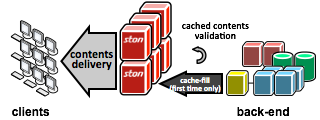

.. _intro:

소개
******************

.. toctree::
   :maxdepth: 2

1. Web Cache
============
Web Cache는 서비스 네트워크의 최전방 (Edge)에서 클라이언트에게 컨텐츠를 전달하는 서버로, 다음과 같은 기본 동작구조를 가진다.

1. 클라이언트로부터 컨텐츠의 최초 요청을 받고
2. 컨텐츠를 원본서버에서 가져와 저장하여 클라이언트에게 전송한다. 
3. 컨텐츠 재요청을 받으면 2에서 가져왔던 컨텐츠를 전송한다. 

다양한 통신과 연산을 요구받는 일반 웹서버와 달리, 
정적 컨텐츠 전송에 특화되어 서비스의 속도를 크게 향상시킬수 있다.
   

서비스 확장 때문에 원본 웹서버를 Scale-Out 하면 컨텐츠 갱신마다 동기화 시켜야 하는 문제가 있다. 
동일 컨텐츠를 수백대의 웹서버에 주입하면 리스크도 크고 관리도 어렵다. 
그러나 Web Cache를 사용하면 원본 웹서버는 그대로 유지하면서 Web Cache를 Scale-Out하는것 만으로 손쉽게 서비스를 확장할 수 있다. 원본 웹서버의 컨텐츠만 갱신하면, Web Cache가 자동으로 컨텐츠를 가져다가 전송한다.

**도입효과**
- 응답속도 향상
- 사용대역폭 절감
- 원본 웹서버 보호
- 서비스 고가용성 및 안정성 향상

2. SE의 Web Cache
========================

Web Cache를 도입하여 설치 및 적용부터 운영에 이르기까지, 가장 많이 접하는 담당자는 보통 운영자(SE, System Engineer)다. 

STON은 기획단계부터 서비스 운영자 의 관점에 맞추어 설계되었다. 어려운 코딩을 할 필요도, 변경설정 적용을 위해 빌드를 다시 할 필요도 없다. XML 설정파일 2개를 편집하는 것만으로 모든 설정이 가능하다.

3. 철학과 기능
==============

STON의 구조는 최대한 많은 요구사항을 담고 많은 상황에 대처할 수 있는 커다란 그릇을 만들고자 설계되었다. 
그래서 기존의 오픈소스제품 기반은 시작부터 배제되었으며
프로토콜 처리부터 한줄씩 모두 in-house로 제작되었다. 
STON의 개념, 동작방식, 배경, 이유를 최대한 상세하게 공개하여, 
고객과 함께 만들어 가는 제품의 가치를 목표로 하고 있다.

.. image:: img/features.png
   :align: center
   

손쉬운 사용
+++++++++++

STON은 Zero-Configuration을 추구, 숙련도가 필요없는 제품을 목표로 하고 있다. XML 설정 파일 2개만으로 모든 작동을 제어할 수 있다.

강력한 성능
+++++++++++
STON은 퍼포먼스 최적화를 위해 C++로 개발되었으며, 

실시간 통계
+++++++++++
STON은 강력한 성능과 동시에, 실시간 모니터링 및 통계를 제공한다. 자체 API 및 SNMP를 통하여 초단위의 모니터링이 가능하다.

합리적 가격
+++++++++++
STON은 ASP와 같이 사용분에 대해서만 과금되는 소프트웨어로서, 막대한 구매비용이 필요하지 않다. 

4. 아키텍처
===========

STON은 네트워크에 대한 깊은 이해를 바탕으로 설계되었다. 손쉬운 사용성을 지키면서 강력한 성능과 실시간 통계의 두 마리 토끼를 잡는 아키텍처 설계를 목표로 하였다. HTTP 처리 모듈부터 Web Management까지 STON의 모든 코드는 100% in-house에서 개발/관리되고 있다. 또한 합리적 가격정책을 제공하여 부담스러운 구매비용 없이 저렴한 유지보수비용만으로 사용할 수 있다.

고가용성
++++++++

STON은 고가용성 (High Availability) 설계로 Many-core에 최적화되어 있다.

64bit 연산을 극도로 활용하는 

가상호스트 기반
+++++++++++++++

가상호스트 개념을 도입하여, 서비스 기반의 구성을 용이하게 하였다. 단일 STON 서버에 다수의 가상호스트를 운용, 개별 설정을 적용하는 것도 가능하다.

하드웨어/운영체제 무종속성
++++++++++++++++++++++++++

64bit x86계열의 일반 상용서버라면 원활하게 작동하며,  리눅스 버전 대부분을 지원하여 소프트웨어 제품으로서의 범용성을 극대화하였다.

+----------------------------+-----------------+--------------------------------------------------------+
|분류                        |      기능       |             내용                                       |
+============================+=================+========================================================+
|운영관리                    | 라이브 모니터링 | HTTP API를 이용한 실시간 통계(1초~60분 단위) 및 관제   |
|  .. figure:: img/mgmt.png  +-----------------+--------------------------------------------------------+
|     :align: center         | SNMP 지원       | 가상호스트 별, 실시간 통계 (1초 ~ 60분)                |
|                            +-----------------+--------------------------------------------------------+
|                            | 통계 / 로그     | 가상호스트 별 / 디렉토리 별 / 외부 누적                |
|                            |                 | 원본 /클라이언트 / File System /HTTPS                  |
|                            +-----------------+--------------------------------------------------------+
|                            | HTTP API        | HTTP API를 이용한 제어/조회/통계                       |
|                            +-----------------+--------------------------------------------------------+
|                            | 웹 매니저       | 브라우저를 통한 STON 관리                              |
|                            +-----------------+--------------------------------------------------------+
|                            | 설정 관리       | 설정 히스토리의 조회/다운로드/업로드/복원              |
+----------------------------+-----------------+--------------------------------------------------------+
|원본관리                    | 원본 서버 풀링  | 원본서버 연결 재사용 (접속대기시간, 데이터 대기시간,   |
|                            |                 | 재사용 포기, HTTP 세션 시간 등의 초단위 설정)          |
| .. figure:: img/origin.png +-----------------+--------------------------------------------------------+
|     :align: center         | 다중 원본 연결  | 다수의 원본 서버에 Round-Robin 분산연결                |
|                            +-----------------+--------------------------------------------------------+
|                            | 원본 헬스 체킹  | 원본  장애시 자동 배제, 주기적 반복확인 후 자동 복구   |
|                            +-----------------+--------------------------------------------------------+
|                            | 비상 상황 서비스| STON에 지나친 부하가 걸릴 경우                         |
|                            +-----------------+--------------------------------------------------------+
|                            | 원본 DNS 관리   | 원본 주소 캐싱 및 부하분산, 장애대응                   |
|                            +-----------------+--------------------------------------------------------+
|                            | 설정 관리       | 설정 히스토리의 조회/다운로드/업로드/복원              |
+----------------------------+-----------------+--------------------------------------------------------+
|컨텐츠 관리                 | Purge           | 컨텐츠 무효화 (Purge, Expire, ExpireAfter, HardPurge)  |
| .. figure:: img/cts.png    +-----------------+--------------------------------------------------------+
|     :align: center         | 사용자 정의 TTL | URL/패턴으로 특정 컨텐츠의 TTL 임의지정                |
|                            +-----------------+--------------------------------------------------------+
|                            | User-agent 통합 | 다수의 user-agent별 요청에 대해 묶음처리               |
|                            +-----------------+--------------------------------------------------------+
|                            | On-the-fly      | Gzip, Deflate 캐싱 (Vary 헤더 지원)                    |
|                            | Compression     |                                                        |
|                            +-----------------+--------------------------------------------------------+
|                            | URL Bypass      | 지정 URL을 사용자 - 원본 간 직접 연결                  |
|                            +-----------------+--------------------------------------------------------+
|                            |  ETag 통합      | 서로 다른 원본 서버의 ETag를 통합 관리                 |
+----------------------------+-----------------+--------------------------------------------------------+
|미디어 관리                 | DIMS (Dynamic   | 원본 서버의 이미지를 캐싱하여 crop, thumbnail, resize, |
|                            | Img Mgmt System)| reformat, quality, composite 변환기능을 제공           |
| .. figure:: img/media.png  +-----------------+--------------------------------------------------------+
|     :align: center         | MP4HLS          | 원본 MP4 파일을 HTTP Live Streaming으로 서비스         |
|                            +-----------------+--------------------------------------------------------+
|                            | Media Trimming  | 미디어 구간재생 (MP4, MP3, M4A)                        |
|                            +-----------------+--------------------------------------------------------+
|                            | Media           | 미디어 헤더 인식을 통한 Pseudo-Streaming 재생지원      |
|                            | Pseudo-streaming|                                                        |
|                            +-----------------+--------------------------------------------------------+
|                            | Bandwidth-      | 설정 대역폭에 따라 미디어 전송속도 조절                |
|                            | throttling      |                                                        |
+----------------------------+-----------------+--------------------------------------------------------+
|기타                        | SSL/TLS         | SSL /TLS 지원                                          |
|                            +-----------------+--------------------------------------------------------+
|                            | 포트 바이패스   | 지정 포트를 사용자와 원본 서버간에 직접 연결           |
|                            +-----------------+--------------------------------------------------------+
|                            | FUSE            | STON을 Linux 가상파일시스템에 마운트하여 원본서버에서  |
|                            |                 | 로컬파일과 같이 사용                                   |
+----------------------------+-----------------+--------------------------------------------------------+

5. 퍼포먼스와 한계
==================

STON은 하드웨어 자원을 100% 활용하도록 설계되었다. 컨텐츠 처리전송에 있어 CPU/메모리/디스크/NIC의 자원이 주요 이용대상이 되는데, 이들중 속도에 가장 병목현상이 일어나기 쉬운 것은 디스크다. 충분한 디스크 성능이 확보된다면 STON은 10Gbps NIC의 대역폭까지 원활하게 지원한다. 

(자세한 내용은 Performance로 링크)

6. Beyond Web Cache
===================

STON은 HTTP Cache로 시작되었다. 그러나 지금은 클라이언트의 다양한 요건에 컨텐츠를 맞추어 빠르게 제공하는 변환 기능 (DIMS, MediaControl)을 비롯하여 FUSE 파일시스템 제공까지 STON은 단순 Web Cache 이상의 기능을 현재에도 제공하고 있다.
컨텐츠 원본을 그대로 보관하면서, 서비스 대상자들에게 유연한 형태로 컨텐츠를 맞춤 제공하는 것이 STON이 지향하는 목표다.
