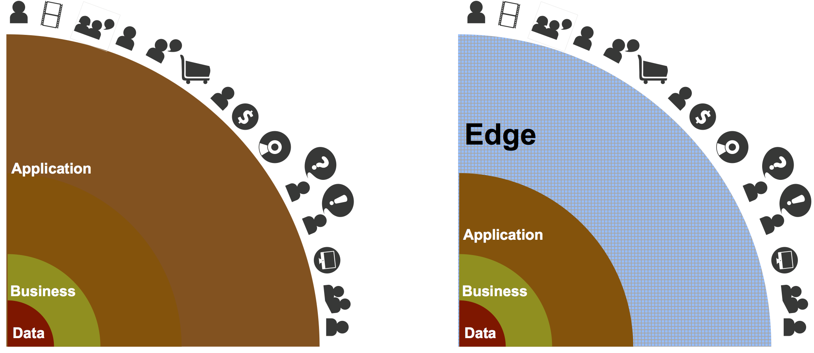
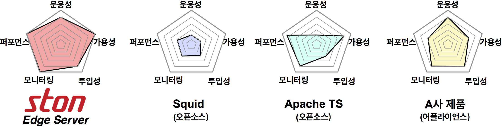

.. _intro:

소개
******************

.. toctree::
   :maxdepth: 2

1. Edge Server의 개념
============

Edge Server는 서비스망의 최전방(Edge)에서 컨텐츠를 전달하는 서버이다.

다양한 통신과 연산의 부하가 걸리는 일반 웹서버와 달리, 
컨텐츠 전송에 집중하여 서비스의 속도를 크게 향상시킬수 있다.

기본 동작구조는 일반적으로 아래와 같다.

#. 클라이언트로부터 컨텐츠의 최초 요청을 받고
#. 컨텐츠를 원본서버에서 가져와 저장하여 클라이언트에게 전송한다. 
#. 컨텐츠 재요청을 받으면 2에서 가져왔던 컨텐츠를 전송한다. 

환경과 용도에 따라 Web Cache, (Reverse) Proxy, Surrogate Server 등의 다양한 이름으로 불리기도 한다.

   

서비스 확장 때문에 원본 웹서버 자체를 Scale-Out 하면, 컨텐츠를 갱신마다 동기화 시켜야 하는 문제가 있다. 
동일 컨텐츠를 수십수백대의 웹서버에 주입하면 리스크도 크고 관리도 어렵다. 
그러나 Edge Server를 도입하면 원본 서버는 그대로 유지하면서 Edge Server의 추가증설만으로 **손쉽게 서비스를 확장** 할 수 있다. 
원본 서버의 컨텐츠만 갱신하면, Edge Server가 자동으로 컨텐츠를 가져다가 전송한다.

**효과**

- 응답속도 향상
- 사용대역폭 절감
- 원본 웹서버 보호
- 서비스 가용성/안정성 향상

|

2. STON Edge Server
==============

.. image:: img/ston_edge_server.png
  :align: center
  :width: 70%
  
|

STON은 가장 효과적인 Edge Server의 형태로서 Web Cache로 시작, 
모든 요구사항과 상황에 대처할 수 있는 커다란 그릇으로 설계되었다. 
손쉬운 사용성을 제공하면서 강력한 성능과 실시간 통계의 두 마리
토끼를 잡는 아키텍처 설계를 목표로 하였다. 

풍부한 네트워크 소프트웨어 개발경험을 기반으로, 
HTTP 처리 모듈부터 Web Management까지 STON의 모든 코드는 100% in-house에서 개발/관리되고 있다. 
STON의 개념, 동작방식, 배경, 이유를 최대한 상세하게 공개하여, 
고객과 함께 만들어 가는 제품의 가치를 모토로 하고 있다.

|

3. 특징
========================
   
강력한 성능
+++++++++++

STON은 퍼포먼스 최적화를 위해 C++로 개발되었으며, 64bit 아키텍처의 고가용성 (High Availability) 설계로 Many-core에 최적화되어 있다.

|

손쉬운 사용
+++++++++++

   
도입에서 운영에 이르기까지, Web Cache를 가장 많이 접하는 담당자는 보통 운영자이다. (SE, System Engineer) 
STON은 기획단계부터 서비스 운영자 의 관점에 맞추어 설계되었다. 
어려운 코딩을 할 필요도, 변경설정 적용을 위해 빌드를 다시 할 필요도 없다. 
XML 설정파일 2개를 편집하는 것만으로 모든 설정이 가능하며, 
Zero-Configuration을 추구하여 숙련도가 필요없는 제품을 목표로 하고 있다. 

실시간 통계
+++++++++++

   
STON은 강력한 성능과 동시에, 실시간 모니터링 및 통계를 제공한다. 
자체 API 및 SNMP를 통하여 초단위까지의 모니터링/통계/로그를 제공한다.

|
|

합리적 가격
+++++++++++

STON은 ASP와 같이 사용분에 대해서만 과금되는 소프트웨어로서, 막대한 구매비용이 필요하지 않다. 
서비스 확장규모에 따라 사용하는 만큼만 비용이 추가되는 유연한 적용방법을 가지고 있다.
  
|

4. 강점
=========

**"Cache as a Service"**

|

기존 시장의 Web Cache는 Squid, Apache Traffic Server와 같은 오픈소스 소프트웨어나, 
이를 기반으로 하드웨어 장비에 탑재한 어플라이언스 형태가 주종을 이루고 있었다. 

- 오픈소스는 입수비용이 없고 접근이 자유로우나, 오래된 기술이라 현재의 상황에 맞지 않거나 소스에 대한 충분한 이해없이 도입할 경우 성능저하, 치명적 문제를 해결하기 어려운 단점이 있다. 

- 어플라이언스는 초기 도입비용이 크고, 유연한 관리가 어렵다. 

ASP 형태의 판매정책을 도입하여 STON은 뛰어난 성능을 일반 어플라이언스의 월단위의 운영비용보다도 저렴하게 사용할 수 있다.
또한 적극적이고 아낌없는 기술지원을 통하여 사용자의 어려움을 최소화하고 있다. 
기술지원은 고객 손쉬운 사용뿐 아니라 STON의 개선과 발전에 중요한 자산으로 인식되고 있다.

|

5. 아키텍처
===========

64bit 아키텍처 
+++++++++++++++
STON은 기초부터 64bit 아키텍처를 기반으로 설계되었다. CPU자원을 효율적으로 이용, 하드웨어의 한계범위 내에서 최대의 효율을 제공한다.

가상호스트 기반
+++++++++++++++

가상호스트 개념을 도입하여, 서비스 기반의 구성을 용이하게 하였다. 
단일 STON 서버에 다수의 가상호스트를 모두 각각 독립적으로 운용할 수 있다.

하드웨어/운영체제 무종속성
++++++++++++++++++++++++++

64bit x86계열의 일반 상용서버에서 원활하게 작동하며, 
윈도우즈/리눅스 버전 대부분을 지원하여 소프트웨어 제품으로서의 범용성을 극대화하였다.

|

6. 기능 
===========

======================== ========================== ======================= ========================= ============
운영관리                          원본관리                  컨텐츠관리                미디어              기타
.. figure:: img/mgmt.png .. figure:: img/origin.png .. figure:: img/cts.png .. figure:: img/media.png
   :align: center             :align: center             :align: center       :align: center                      
======================== ========================== ======================= ========================= ============
Live 모니터링                    원본서버풀링           Purge                    DIMS                  SSL/TLS
------------------------ -------------------------- ----------------------- ------------------------- ------------
SNMP 지원                        다중원본연결           사용자정의TTL            MP4HLS                Pot Bypass
------------------------ -------------------------- ----------------------- ------------------------- ------------
통계/로그                        원본헬스체킹           User-Agent 통합          Trimming              FUSE
------------------------ -------------------------- ----------------------- ------------------------- ------------
HTTP API                         비상상황서비스         On-the-fly 압축          Pseudo
                                                                                 -Streaming
------------------------ -------------------------- ----------------------- ------------------------- ------------
웹 매니저                        원본DNS관리            URL Bypass               Bandwidth
                                                                                 -throttling
------------------------ -------------------------- ----------------------- ------------------------- ------------
설정관리                         설정관리               ETag 통합       
======================== ========================== ======================= ========================= ============

|

.. tabularcolumns:: |c|c|c|c|c|

+-------------------------+----------------------------+--------------------------+---------------------------+-----------+
| 운영관리                |          원본관리          |       컨텐츠관리         |          미디어           |   기타    |
|                         |                            |                          |                           |           |
| .. figure:: img/mgmt.png| .. figure:: img/origin.png | .. figure:: img/cts.png  | .. figure:: img/media.png |           |
|    :align: center       |    :align: center          |     :align: center       |    :align: center         |           |
+-------------------------+----------------------------+--------------------------+---------------------------+-----------+
|  Live 모니터링          | 원본서버풀링               |   Purge                  |   DIMS                    |  SSL/TLS  |
+-------------------------+----------------------------+--------------------------+---------------------------+-----------+
| SNMP 지원               | 다중원본연결               | 사용자정의TTL            | MP4HLS                    |Pot Bypass |
+-------------------------+----------------------------+--------------------------+---------------------------+-----------+
| 통계/로그               | 원본헬스체킹               |User-Agent 통합           | Trimming                  |  FUSE     |
+-------------------------+----------------------------+--------------------------+---------------------------+-----------+
| HTTP API                |비상상황서비스              |On-the-fly 압축           |Pseudo-                    |           |
|                         |                            |                          |Streaming                  |           |
+-------------------------+----------------------------+--------------------------+---------------------------+-----------+
| 웹 매니저               | 원본DNS관리                |  URL Bypass              |Bandwidth-                 |           |
|                         |                            |                          |throttling                 |           |
+-------------------------+----------------------------+--------------------------+---------------------------+-----------+
| 설정관리                |   설정관리                 |   ETag 통합              |                           |           |
+-------------------------+----------------------------+--------------------------+---------------------------+-----------+

7. Beyond Web Cache
===================

STON은 HTTP Cache로 시작하여
지금은 클라이언트의 다양한 요건에 컨텐츠를 맞추어 빠르게 제공하는 변환 기능 (DIMS, Media관련)을 비롯하여 
FUSE 파일시스템 제공까지 STON은 단순 Web Cache 의 범주를 뛰어넘기 시작했다.
컨텐츠 원본을 그대로 운용하면서  손쉽고 유연하게 서비스를 확장하는 Utility Server를 지향하고 있다.
