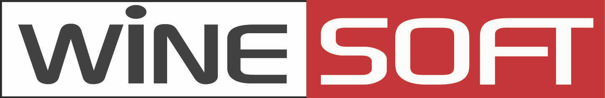

.. _wineosft:

About Us
******************

  
  
와인소프트 주식회사는 서울 논현동에 위치한 인터넷 인프라 기술회사이다. 설립 1년만에 출시한 STON Web Cache로 국내 시장을 석권하였다. STON은 대형 및 급성장 서비스에 적합한 Web Cache 솔루션으로서, 모바일과 동영상 수요로 폭발적 증가를 보이는 한국의 인터넷 트래픽 처리에 큰 역할을 하고 있다. 와인소프트는 순수 소프트웨어 기업으로 글로벌 시장에의 도약을 준비하고 있다.

Technical Profile
------------------
와인소프트는 10여년 이상의 네트워크 개발경력을 지닌 전문기술진을 중심으로 설립되었다. 국내 인터넷 도입 초창기 TCP/IP 개발, 모바일 브라우저, P2P 다운로드/스트리밍/라이브 전송 기술을 개발한 전문인력들이 포진하고 있다. 풍부한 네트워크 개발경험을 기반으로, 적극적인 요구사항 수집, Agile 방법론, 한발 앞서는 기술지원을 우선가치로 세워가고 있다.

02-6925-1221
pr_ko@winesoft.co.kr

