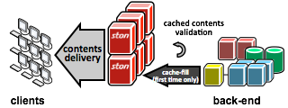

.. STON documentation master file, created by
   sphinx-quickstart on Fri Jun 13 16:37:06 2014.
   You can adapt this file completely to your liking, but it should at least
   contain the root `toctree` directive.

STON Guide
================================

Contents:

.. toctree::
   :maxdepth: 2

**STON 소개**

STON (Superfast Transport Over Network) 은 초고속 HTTP Cache 소프트웨어 솔루션입니다. 클라이언트가 요청하는 컨텐츠를 원본서버로부터 가져와 저장하여, 재요청시 컨텐츠를 빠르게 전송합니다. 일반 상용서버 하드웨어에 설치투입하여 대규모 트래픽 처리시스템을 구성할 수 있습니다.

=====  =====  =======
A      B      A and B
=====  =====  =======
False  False  False
True   False  False
False  True   False
True   True   True
=====  =====  =======
   
+------------------------+------------+----------+----------+
| Header row, column 1   | Header 2   | Header 3 | Header 4 |
| (header rows optional) |            |          |          |
+========================+============+==========+==========+
| body row 1, column 1   | column 2   | column 3 | column 4 |
+------------------------+------------+----------+----------+
| body row 2             | ...        | ...      |          |
+------------------------+------------+----------+----------+

Indices and tables
==================

* :ref:`genindex`
* :ref:`modindex`
* :ref:`search`

